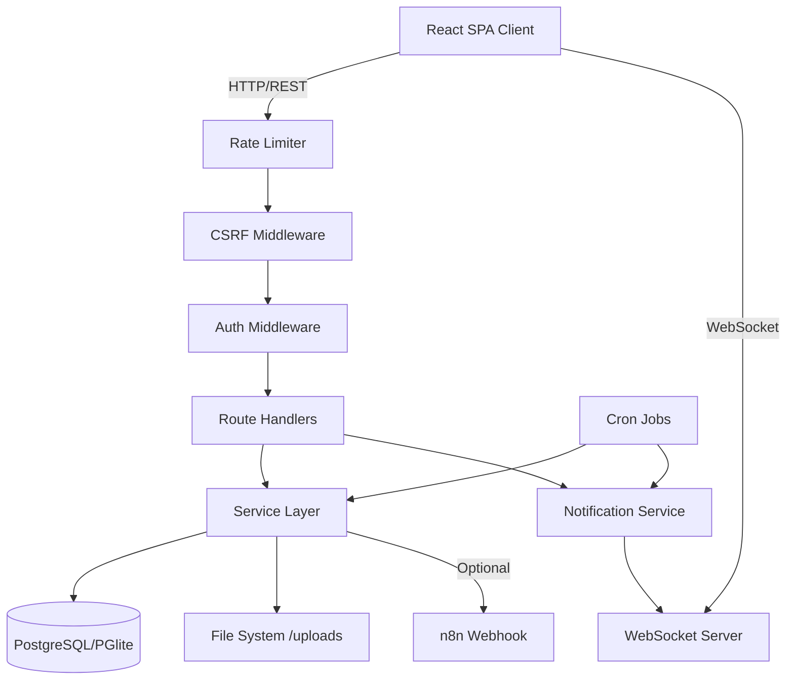
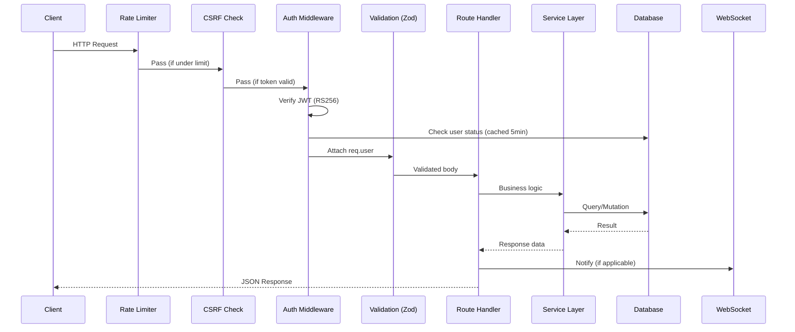

# Design Document: API Audit & Improvements (فحص وتحسين الـ API)

## Overview

يهدف هذا المستند إلى تحليل شامل لطبقة الـ API في نظام الساقي (AL-SAQI) لتحديد المشاكل التقنية، النواقص، والتحسينات المطلوبة. النظام مبني كـ Modular Monolith باستخدام Express.js 5 مع TypeScript، ويخدم تطبيق React SPA عبر RESTful API مع WebSocket للإشعارات الفورية.

التحليل يغطي: البنية المعمارية للـ API، أنماط التصميم المستخدمة، الثغرات التقنية، مشاكل الأداء، وخطة التحسين المقترحة مع تفاصيل التنفيذ.

## Architecture

### System Architecture Diagram



### Request Lifecycle



## المشاكل المكتشفة (Identified Problems)

### المشكلة 1: عدم اتساق أنماط الاستجابة (Inconsistent Response Patterns)

**الخطورة:** متوسطة  
**الوصف:** الـ API يستخدم أنماط استجابة مختلفة عبر الـ endpoints:

| الموقع | نمط الاستجابة |
|--------|---------------|
| Error Middleware | `{ success: false, error: { code, message, details, traceId } }` |
| CRUD Generator | `{ data: [...], pagination: {...} }` أو الكائن مباشرة |
| Auth Routes | `{ user: {...}, token: "..." }` |
| Action Routes | `{ success: true }` |
| Old Error Handlers | `{ error: "message" }` |

**التأثير:** صعوبة بناء client-side interceptor موحد، وتعقيد معالجة الأخطاء في الواجهة الأمامية.

### المشكلة 2: ازدواجية مسارات CRUD (Duplicate Route Registration)

**الخطورة:** عالية  
**الوصف:** الـ `crudGenerator.ts` يسجل مسارات لـ `audit-tasks` و `audit-programs` و `recommendations`، وفي نفس الوقت توجد route files مخصصة لنفس الموارد:

```typescript
// في crudGenerator.ts
generateRoutes("audit_tasks", "audit-tasks", "AuditTasks");
generateRoutes("audit_programs", "audit-programs", "AuditPrograms");
generateRoutes("recommendations", "recommendations", "Recommendations");

// في routes/index.ts - مسارات مخصصة أيضاً
app.use("/api/audit-programs", createAuditProgramRoutes(...));
app.use("/api/audit-tasks", createAuditTaskRoutes(...));
app.use("/api/recommendations", createRecommendationRoutes(...));
```

**التأثير:** تضارب محتمل في المسارات، سلوك غير متوقع حسب ترتيب التسجيل.

### المشكلة 3: تسريب معلومات في رسائل الخطأ (Information Leakage)

**الخطورة:** متوسطة  
**الوصف:** بعض رسائل الخطأ تكشف تفاصيل داخلية:

```typescript
// في BaseService.findById
throw new NotFoundError(`${tableName} item with ID ${id} not found`);

// في checkPermission
return res.status(403).json({ error: `Forbidden: Missing permission ${action} on ${module}` });
```

**التأثير:** يمكن للمهاجم استنتاج بنية النظام الداخلية (أسماء الجداول، الصلاحيات المطلوبة).

### المشكلة 4: غياب API Versioning

**الخطورة:** متوسطة  
**الوصف:** رغم وجود header `X-API-Version: 1.0`، لا يوجد versioning فعلي في المسارات (`/api/v1/...`). أي تغيير breaking سيؤثر على جميع العملاء فوراً.

**التأثير:** صعوبة إجراء تغييرات على الـ API دون كسر التوافقية.

### المشكلة 5: عدم وجود Pagination موحد

**الخطورة:** متوسطة  
**الوصف:** يوجد ملف `pagination.ts` utility لكنه غير مستخدم بشكل موحد:

| الموقع | نمط الـ Pagination |
|--------|-------------------|
| `BaseService.findAll` | `{ page, pageSize, total, totalPages }` |
| `pagination.ts` utility | `{ page, limit, total, totalPages, hasNext, hasPrev }` |
| `notifications.ts` | `page` + `pageSize` يدوي |
| `correspondence.ts` | `page` + `pageSize` يدوي |
| `dashboard.ts` | `limit` + `offset` يدوي |

**التأثير:** تعقيد الـ frontend في التعامل مع أنماط pagination مختلفة.

### المشكلة 6: غياب Input Validation في بعض الـ Endpoints

**الخطورة:** عالية  
**الوصف:** بعض الـ routes لا تستخدم Zod validation:

- `POST /api/correspondence/attachments` - لا يوجد schema validation
- `GET /api/dashboard-stats` - query params غير محققة
- `GET /api/analytics/*` - لا يوجد validation على query params
- CRUD Generator `GET` endpoints - filters من query params بدون validation

**التأثير:** إمكانية إرسال بيانات غير صالحة أو خبيثة.

### المشكلة 7: Mutex Bottleneck في PGlite Mode

**الخطورة:** عالية (في بيئة التطوير)  
**الوصف:** الـ `DBWrapper` يستخدم Mutex لتسلسل جميع عمليات قاعدة البيانات عند استخدام PGlite. هذا يعني أن كل request ينتظر انتهاء الـ request السابق من الوصول لقاعدة البيانات.

**التأثير:** أداء بطيء جداً تحت الحمل في بيئة التطوير، وصعوبة اختبار concurrent requests.

### المشكلة 8: غياب Soft Delete الموحد

**الخطورة:** متوسطة  
**الوصف:** بعض الجداول تستخدم `deleted_at` (مثل `audit_tasks`, `audit_findings`) لكن `BaseService.delete` يقوم بـ hard delete:

```typescript
static async delete(tableName: string, id: string | number) {
  await this.db.prepare(`DELETE FROM ${validatedTable} WHERE id = ?`).run(id);
}
```

**التأثير:** فقدان بيانات نهائي عند الحذف، عدم إمكانية الاسترجاع، وتناقض مع الجداول التي تدعم soft delete.

### المشكلة 9: N+1 Query Problem في Cron Jobs

**الخطورة:** متوسطة  
**الوصف:** في `cron/index.ts`، يتم جلب السجلات ثم إرسال إشعار لكل سجل بشكل منفصل مع query إضافي لجلب user ID:

```typescript
for (const rec of overdueRecs) {
  if (rec.responsible) {
    const user = await db.prepare(`SELECT id FROM users WHERE name = ? OR username = ?`)
      .get(rec.responsible, rec.responsible);
    // ...
  }
}
```

**التأثير:** عدد كبير من الاستعلامات عند وجود سجلات كثيرة.

### المشكلة 10: غياب Request ID Tracing الكامل

**الخطورة:** منخفضة  
**الوصف:** يوجد `correlationIdMiddleware` و `traceId` في error handler، لكنهما نظامان منفصلان. الـ `traceId` يُولّد فقط عند حدوث خطأ ولا يُرسل في الاستجابات الناجحة.

**التأثير:** صعوبة تتبع request معين عبر السجلات في حالة الاستجابات الناجحة.

### المشكلة 11: عدم وجود OpenAPI/Swagger Documentation كاملة

**الخطورة:** متوسطة  
**الوصف:** يوجد endpoint `/api/docs` يقرأ ملف `openapi.yaml`، لكن لا يوجد ضمان أن الملف محدث أو يغطي جميع الـ endpoints.

**التأثير:** صعوبة التكامل مع أنظمة خارجية أو فرق تطوير أخرى.

### المشكلة 12: Static File Serving بدون Access Control

**الخطورة:** عالية  
**الوصف:** الملفات المرفوعة تُقدم عبر `express.static` بدون أي authentication:

```typescript
app.use('/uploads', express.static(uploadDir));
```

**التأثير:** أي شخص يعرف مسار الملف يمكنه الوصول إليه بدون تسجيل دخول، مما يشكل خطراً على الملفات الحساسة (أدلة التدقيق، وثائق الاحتيال).

## النواقص التقنية (Technical Gaps)

### النقص 1: غياب Request/Response Logging Middleware

لا يوجد middleware يسجل تفاصيل كل request/response (method, path, status, duration) بشكل منظم. الـ logging الحالي يقتصر على الأخطاء.

### النقص 2: غياب Health Check شامل

الـ health check الحالي يفحص فقط اتصال قاعدة البيانات. لا يفحص:
- حالة WebSocket server
- مساحة القرص المتاحة لـ `/uploads`
- حالة Cron jobs
- Memory pressure

### النقص 3: غياب Graceful Degradation للخدمات الخارجية

عند فشل n8n webhook، يتم فقط تسجيل الخطأ. لا يوجد:
- Retry mechanism مع exponential backoff
- Circuit breaker pattern
- Dead letter queue للأحداث الفاشلة

### النقص 4: غياب Database Connection Pooling Monitoring

لا يوجد مراقبة لحالة connection pool في PostgreSQL:
- عدد الاتصالات النشطة
- الاتصالات المنتظرة
- أوقات الانتظار

### النقص 5: غياب API Rate Limiting Per-User

الـ rate limiting الحالي يعتمد على IP فقط (باستثناء login). في بيئة corporate مع NAT، جميع المستخدمين يشاركون نفس الـ IP.

### النقص 6: غياب Idempotency Keys

لا يوجد دعم لـ idempotency keys في عمليات POST. إذا أعاد العميل إرسال request بسبب timeout، قد يتم إنشاء سجل مكرر.

### النقص 7: غياب Bulk Operations API

لا يوجد endpoints لعمليات جماعية (bulk create, bulk update, bulk delete). كل عملية تتطلب request منفصل.

### النقص 8: غياب Field-Level Permissions

النظام يدعم module-level permissions (View, Create, Edit, Delete) لكن لا يدعم field-level permissions. مثلاً: لا يمكن منع مستخدم من رؤية حقل `risk_level` مع السماح له برؤية باقي الحقول.

## Components and Interfaces

### Component 1: Unified Response Envelope

**Purpose**: توحيد شكل جميع استجابات الـ API

**Interface**:
```typescript
interface ApiResponse<T = any> {
  success: boolean;
  data?: T;
  error?: {
    code: string;
    message: string;
    details?: any;
    traceId: string;
  };
  meta?: {
    pagination?: PaginationMeta;
    requestId: string;
    timestamp: string;
    version: string;
  };
}

interface PaginationMeta {
  page: number;
  pageSize: number;
  total: number;
  totalPages: number;
  hasNext: boolean;
  hasPrev: boolean;
}
```

**Responsibilities**:
- تغليف جميع الاستجابات بشكل موحد
- إضافة metadata لكل استجابة (requestId, timestamp)
- توحيد شكل الأخطاء عبر جميع الـ endpoints

### Component 2: Request Logger Middleware

**Purpose**: تسجيل كل request/response مع قياس الأداء

**Interface**:
```typescript
interface RequestLogEntry {
  requestId: string;
  method: string;
  path: string;
  statusCode: number;
  duration: number; // ms
  userId?: string;
  ip: string;
  userAgent: string;
  contentLength?: number;
  error?: string;
}

function requestLoggerMiddleware(options: {
  excludePaths: string[];
  slowThreshold: number; // ms
  logBody: boolean;
}): express.RequestHandler;
```

**Responsibilities**:
- تسجيل كل request مع duration
- تنبيه عند تجاوز slow threshold
- استثناء health checks والمسارات الثابتة

### Component 3: Secure File Access Controller

**Purpose**: حماية الملفات المرفوعة بـ authentication

**Interface**:
```typescript
interface FileAccessOptions {
  requireAuth: boolean;
  checkOwnership: boolean;
  allowedRoles?: string[];
  auditAccess: boolean;
}

function secureFileMiddleware(options: FileAccessOptions): express.RequestHandler;

// بدلاً من express.static
// app.use('/uploads', express.static(uploadDir));
// يصبح:
// app.use('/uploads', authenticate, secureFileMiddleware({...}), serveFile);
```

**Responsibilities**:
- التحقق من صلاحية المستخدم قبل تقديم الملف
- تسجيل عمليات الوصول للملفات الحساسة
- دعم signed URLs للمشاركة المؤقتة

### Component 4: Idempotency Service

**Purpose**: منع تكرار العمليات عند إعادة إرسال الطلبات

**Interface**:
```typescript
interface IdempotencyRecord {
  key: string;
  response: any;
  statusCode: number;
  createdAt: Date;
  expiresAt: Date;
}

class IdempotencyService {
  static async check(key: string): Promise<IdempotencyRecord | null>;
  static async store(key: string, response: any, statusCode: number, ttl: number): Promise<void>;
  static async cleanup(): Promise<void>;
}

function idempotencyMiddleware(options: {
  headerName: string; // 'X-Idempotency-Key'
  ttl: number; // seconds
  methods: string[]; // ['POST', 'PUT']
}): express.RequestHandler;
```

**Responsibilities**:
- تخزين نتائج العمليات مع مفتاح فريد
- إرجاع النتيجة المخزنة عند تكرار نفس المفتاح
- تنظيف السجلات المنتهية الصلاحية

### Component 5: Unified Soft Delete Service

**Purpose**: توحيد آلية الحذف عبر جميع الجداول

**Interface**:
```typescript
interface SoftDeleteOptions {
  tableName: string;
  id: string | number;
  deletedBy: string;
  cascade?: { table: string; foreignKey: string }[];
}

class SoftDeleteService {
  static async softDelete(options: SoftDeleteOptions): Promise<void>;
  static async restore(tableName: string, id: string | number): Promise<void>;
  static async permanentDelete(tableName: string, id: string | number): Promise<void>;
  static async getDeleted(tableName: string, page: number, pageSize: number): Promise<PaginatedResponse>;
}
```

**Responsibilities**:
- تعيين `deleted_at` بدلاً من الحذف الفعلي
- دعم استرجاع السجلات المحذوفة
- حذف نهائي فقط بصلاحيات Admin
- cascade soft delete للسجلات المرتبطة

## Data Models

### Idempotency Keys Table

```typescript
interface IdempotencyKeysTable {
  id: string; // UUID
  idempotency_key: string; // unique
  user_id: string;
  method: string;
  path: string;
  response_status: number;
  response_body: string; // JSON
  created_at: string;
  expires_at: string;
}
```

### Request Logs Table

```typescript
interface RequestLogsTable {
  id: string; // UUID
  request_id: string; // correlation ID
  user_id?: string;
  method: string;
  path: string;
  status_code: number;
  duration_ms: number;
  ip_address: string;
  user_agent: string;
  error_message?: string;
  created_at: string;
}
```

### File Access Audit Table

```typescript
interface FileAccessLogsTable {
  id: string;
  user_id: string;
  file_path: string;
  access_type: 'view' | 'download';
  ip_address: string;
  created_at: string;
}
```

## Algorithmic Pseudocode - الخوارزميات المقترحة

### Algorithm 1: Unified Response Wrapper

```typescript
// middleware/responseWrapper.ts
function createResponseWrapper(): express.RequestHandler {
  return (req: Request, res: Response, next: NextFunction) => {
    const requestId = req.headers['x-correlation-id'] as string || generateUUID();
    const startTime = Date.now();

    // Override res.json to wrap responses
    const originalJson = res.json.bind(res);
    
    res.json = (body: any) => {
      const duration = Date.now() - startTime;
      const statusCode = res.statusCode;
      
      // If already wrapped (from error handler), pass through
      if (body?.success !== undefined && body?.meta) {
        return originalJson(body);
      }

      const wrapped: ApiResponse = {
        success: statusCode < 400,
        data: statusCode < 400 ? body : undefined,
        error: statusCode >= 400 ? body?.error || body : undefined,
        meta: {
          requestId,
          timestamp: new Date().toISOString(),
          version: '1.0',
          ...(body?.pagination && { pagination: body.pagination })
        }
      };

      res.setHeader('X-Request-Id', requestId);
      res.setHeader('X-Response-Time', `${duration}ms`);
      
      return originalJson(wrapped);
    };

    next();
  };
}
```

**Preconditions:**
- Request has passed through correlation ID middleware
- Response object is a standard Express response

**Postconditions:**
- All JSON responses follow `ApiResponse<T>` structure
- `X-Request-Id` header is set on every response
- `X-Response-Time` header shows processing duration
- Error responses include traceId for debugging

### Algorithm 2: Secure File Access with Signed URLs

```typescript
// services/SecureFileService.ts
class SecureFileService {
  private static SECRET = process.env.FILE_ACCESS_SECRET || JWT_SECRET;
  private static DEFAULT_TTL = 3600; // 1 hour

  /**
   * Generate a time-limited signed URL for file access
   */
  static generateSignedUrl(filePath: string, userId: string, ttl?: number): string {
    const expires = Math.floor(Date.now() / 1000) + (ttl || this.DEFAULT_TTL);
    const payload = `${filePath}:${userId}:${expires}`;
    const signature = crypto
      .createHmac('sha256', this.SECRET)
      .update(payload)
      .digest('hex');
    
    return `/api/files/${encodeURIComponent(filePath)}?expires=${expires}&sig=${signature}`;
  }

  /**
   * Verify a signed URL is valid and not expired
   */
  static verifySignedUrl(filePath: string, userId: string, expires: number, signature: string): boolean {
    // Check expiration
    if (Math.floor(Date.now() / 1000) > expires) {
      return false;
    }

    // Verify signature
    const payload = `${filePath}:${userId}:${expires}`;
    const expectedSig = crypto
      .createHmac('sha256', this.SECRET)
      .update(payload)
      .digest('hex');

    return crypto.timingSafeEqual(
      Buffer.from(signature, 'hex'),
      Buffer.from(expectedSig, 'hex')
    );
  }
}
```

**Preconditions:**
- `FILE_ACCESS_SECRET` or `JWT_SECRET` is configured
- `filePath` is a valid path within the uploads directory
- `userId` is authenticated and authorized

**Postconditions:**
- Generated URL expires after TTL seconds
- Signature is cryptographically bound to filePath + userId + expiry
- Timing-safe comparison prevents timing attacks
- Expired URLs are rejected immediately

### Algorithm 3: Batch N+1 Query Resolution for Cron

```typescript
// cron/optimized.ts
async function notifyOverdueRecommendations(): Promise<void> {
  const todayStr = new Date().toISOString().split('T')[0];

  // Single query with JOIN instead of N+1
  const overdueWithUsers = await db.prepare(`
    SELECT r.id, r.responsible, r.finding_id, u.id as user_id
    FROM recommendations r
    LEFT JOIN users u ON (u.name = r.responsible OR u.username = r.responsible)
    WHERE r.status IN ('Open', 'In Progress') AND r.due_date < ?
  `).all(todayStr);

  if (!overdueWithUsers.length) return;

  // Batch status update
  await db.prepare(`
    UPDATE recommendations 
    SET status = 'Overdue' 
    WHERE status IN ('Open', 'In Progress') AND due_date < ?
  `).run(todayStr);

  // Batch notifications (group by user to avoid duplicate notifications)
  const userNotifications = new Map<string, number>();
  for (const rec of overdueWithUsers) {
    if (rec.user_id) {
      userNotifications.set(
        rec.user_id, 
        (userNotifications.get(rec.user_id) || 0) + 1
      );
    }
  }

  // Send one notification per user with count
  for (const [userId, count] of userNotifications) {
    await NotificationService.create(
      userId,
      'recommendation_overdue',
      JSON.stringify({ 
        key: 'notifications.recommendationsOverdue', 
        params: { count } 
      }),
      'warning',
      '/recommendations'
    );
  }
}
```

**Preconditions:**
- Database is ready and accessible
- `recommendations` table has `responsible` field matching `users.name` or `users.username`

**Postconditions:**
- All overdue recommendations are updated in a single query
- Each user receives at most one notification with total count
- No N+1 queries: single JOIN replaces loop of individual queries

**Loop Invariants:**
- `userNotifications` map contains unique user IDs with accurate counts
- All processed recommendations have `due_date < today`

### Algorithm 4: Unified Soft Delete with Cascade

```typescript
// services/SoftDeleteService.ts
class SoftDeleteService extends BaseService {
  static async softDelete(options: SoftDeleteOptions): Promise<void> {
    const { tableName, id, deletedBy, cascade } = options;
    const validatedTable = this.db.validateIdentifier(tableName);
    const now = new Date().toISOString();

    await this.db.transaction(async () => {
      // Mark main record as deleted
      const result = await this.db.prepare(`
        UPDATE ${validatedTable} 
        SET deleted_at = ?, deleted_by = ?
        WHERE id = ? AND deleted_at IS NULL
        RETURNING id
      `).get(now, deletedBy, id);

      if (!result) {
        throw new NotFoundError(`${tableName} with ID ${id} not found or already deleted`);
      }

      // Cascade soft delete to related records
      if (cascade && cascade.length > 0) {
        for (const rel of cascade) {
          const relTable = this.db.validateIdentifier(rel.table);
          const relFK = this.db.validateIdentifier(rel.foreignKey);
          await this.db.prepare(`
            UPDATE ${relTable} 
            SET deleted_at = ?, deleted_by = ?
            WHERE ${relFK} = ? AND deleted_at IS NULL
          `).run(now, deletedBy, id);
        }
      }

      // Audit log
      await this.logAudit(deletedBy, 'Soft Delete', tableName, `Soft deleted ID: ${id}`);
    })();
  }

  static async restore(tableName: string, id: string | number): Promise<void> {
    const validatedTable = this.db.validateIdentifier(tableName);
    const result = await this.db.prepare(`
      UPDATE ${validatedTable} 
      SET deleted_at = NULL, deleted_by = NULL
      WHERE id = ? AND deleted_at IS NOT NULL
      RETURNING id
    `).get(id);

    if (!result) {
      throw new NotFoundError(`${tableName} with ID ${id} not found or not deleted`);
    }
  }
}
```

**Preconditions:**
- Table has `deleted_at` and `deleted_by` columns
- `id` exists in the table
- `deletedBy` is a valid username

**Postconditions:**
- Record's `deleted_at` is set to current timestamp
- All cascaded records are also soft-deleted
- Audit trail records the deletion
- Record can be restored via `restore()`

**Loop Invariants:**
- For cascade loop: all previously processed related tables have been soft-deleted
- Transaction ensures atomicity: either all deletes succeed or none

## Key Functions with Formal Specifications

### Function: validateQueryParams()

```typescript
function validateQueryParams<T extends z.ZodSchema>(
  schema: T, 
  source: 'query' | 'params' = 'query'
): express.RequestHandler;
```

**Preconditions:**
- `schema` is a valid Zod schema
- Request object has the specified source (query or params)

**Postconditions:**
- If validation passes: parsed values replace raw query/params
- If validation fails: 400 response with validation details
- Original request is not mutated on failure

### Function: createBulkOperationHandler()

```typescript
function createBulkOperationHandler(
  tableName: string,
  operation: 'create' | 'update' | 'delete',
  maxBatchSize: number
): express.RequestHandler;
```

**Preconditions:**
- `tableName` is in ALLOWED_TABLES list
- Request body contains `items` array
- `items.length <= maxBatchSize`

**Postconditions:**
- All items processed within a single transaction
- On partial failure: entire batch is rolled back
- Response includes per-item success/failure status
- Audit trail records bulk operation

### Function: enhancedHealthCheck()

```typescript
async function enhancedHealthCheck(): Promise<HealthStatus> {
  interface HealthStatus {
    status: 'healthy' | 'degraded' | 'unhealthy';
    checks: {
      database: { status: string; latency: number };
      filesystem: { status: string; freeSpace: number };
      memory: { status: string; usage: number; limit: number };
      websocket: { status: string; connections: number };
      cron: { status: string; lastRun: string };
    };
    uptime: number;
    version: string;
  }
}
```

**Preconditions:**
- Server is running and accepting requests

**Postconditions:**
- Returns comprehensive health status
- Each subsystem check has independent timeout (2s max)
- Failed checks don't block other checks
- Overall status is 'unhealthy' if database is down, 'degraded' if any other check fails

## Example Usage

### Example 1: Unified Response in Route Handler

```typescript
// Before (inconsistent)
router.get('/items', authenticate, asyncHandler(async (req, res) => {
  const result = await BaseService.findAll('items', { page: 1, pageSize: 10 });
  res.json(result); // { data: [...], pagination: {...} }
}));

// After (unified with response wrapper middleware)
router.get('/items', authenticate, asyncHandler(async (req, res) => {
  const result = await BaseService.findAll('items', { page: 1, pageSize: 10 });
  res.json(result);
  // Client receives: { success: true, data: [...], meta: { pagination: {...}, requestId: "...", timestamp: "..." } }
}));
```

### Example 2: Secure File Access

```typescript
// Before (no auth on uploads)
app.use('/uploads', express.static(uploadDir));

// After (authenticated file access)
router.get('/files/:path(*)', authenticate, asyncHandler(async (req, res) => {
  const filePath = req.params.path;
  const userId = req.user.id;
  
  // Verify user has access to this file's parent entity
  const hasAccess = await FileAccessService.checkAccess(filePath, userId);
  if (!hasAccess) {
    throw new ForbiddenError('Access denied to this file');
  }

  // Log access
  await FileAccessService.logAccess(userId, filePath, 'view', req.ip);

  // Serve file
  const fullPath = path.join(uploadDir, filePath);
  res.sendFile(fullPath);
}));
```

### Example 3: Idempotent POST Request

```typescript
// Client sends:
// POST /api/audit-plans
// X-Idempotency-Key: "unique-client-generated-key-123"
// Body: { title: "Annual Audit 2026", ... }

// First request: creates the plan, stores result with key
// Second request (retry): returns stored result without creating duplicate
router.post('/audit-plans', 
  authenticate, 
  idempotencyMiddleware({ headerName: 'X-Idempotency-Key', ttl: 86400, methods: ['POST'] }),
  asyncHandler(async (req, res) => {
    const plan = await AuditPlanService.create('audit_plans', req.body);
    res.status(201).json(plan);
  })
);
```

### Example 4: Bulk Operations

```typescript
// POST /api/bulk/recommendations
// Body: { operation: "update", items: [{ id: "1", status: "Closed" }, { id: "2", status: "Closed" }] }

router.post('/bulk/:resource', authenticate, asyncHandler(async (req, res) => {
  const { operation, items } = req.body;
  const resource = req.params.resource;
  
  if (items.length > 100) {
    throw new ValidationError('Maximum batch size is 100 items');
  }

  const results = await BulkService.execute(resource, operation, items, req.user);
  res.json({
    processed: results.length,
    succeeded: results.filter(r => r.success).length,
    failed: results.filter(r => !r.success).length,
    details: results
  });
}));
```

## Correctness Properties

*A property is a characteristic or behavior that should hold true across all valid executions of a system—essentially, a formal statement about what the system should do. Properties serve as the bridge between human-readable specifications and machine-verifiable correctness guarantees.*

### Property 1: Response Envelope Structure Consistency

*For any* API response with any HTTP status code, the response envelope SHALL have `success` equal to `true` if and only if the status code is in [200, 399], SHALL always contain a `meta` object with a valid UUID `requestId` and a valid ISO 8601 `timestamp`, and SHALL populate `data` for success responses or `error` (with `code`, `message`, `traceId`) for error responses.

**Validates: Requirements 1.1, 1.2, 1.3, 1.4, 1.6**

### Property 2: Pagination Metadata Correctness

*For any* combination of `page`, `pageSize`, and `total` record count, the Pagination_Service SHALL compute `totalPages` as `ceil(total / pageSize)`, `hasNext` as `page < totalPages`, and `hasPrev` as `page > 1`, and SHALL cap `pageSize` at 100 for any input value exceeding 100.

**Validates: Requirements 5.2, 5.4**

### Property 3: Error Message Sanitization in Production

*For any* error response generated while in production mode, the response body SHALL NOT contain database table names, column names, stack traces, or specific permission/module identifiers that were present in the original error.

**Validates: Requirements 3.1, 3.2, 3.3, 3.4**

### Property 4: Soft Delete Round-Trip

*For any* record in any soft-delete-enabled table, performing a soft delete followed by a restore SHALL return the record to its original active state with `deleted_at` equal to null, and while soft-deleted the record SHALL NOT appear in standard query results.

**Validates: Requirements 8.1, 8.2, 8.3**

### Property 5: Soft Delete Cascade Integrity

*For any* parent record with N child records in related tables, soft-deleting the parent SHALL also soft-delete all N child records within the same transaction, and the total number of soft-deleted records SHALL equal N + 1.

**Validates: Requirements 8.4, 8.6**

### Property 6: Idempotency Guarantee

*For any* request with an idempotency key K sent by user U, the first execution SHALL store the response, and any subsequent request with the same key K from the same user U (before TTL expiry) SHALL return the identical stored response without re-executing the operation or creating duplicate records.

**Validates: Requirements 13.1, 13.2, 13.3, 13.5**

### Property 7: Idempotency Key Expiration

*For any* stored idempotency record, after the configured TTL has elapsed, the record SHALL no longer be returned and a new request with the same key SHALL execute the operation fresh.

**Validates: Requirements 13.4**

### Property 8: File Access Authorization Enforcement

*For any* file path and any user, access SHALL be denied with 401 if the user is not authenticated, and denied with 403 if the user lacks the required module permission, regardless of the specific file or user combination.

**Validates: Requirements 12.1, 12.2, 12.3**

### Property 9: Signed URL Validity and Expiration

*For any* generated Signed URL with a given TTL, the URL SHALL verify successfully before the TTL expires, and SHALL be rejected after the TTL expires. Additionally, any modification to the file path, user ID, or expiry timestamp in the URL SHALL cause signature verification to fail.

**Validates: Requirements 12.5, 12.6, 12.7**

### Property 10: Per-User Rate Limiting Fairness

*For any* two authenticated users sharing the same IP address, one user exhausting their rate limit SHALL NOT reduce the available quota of the other user, and each user's request count SHALL be tracked independently.

**Validates: Requirements 14.1, 14.4**

### Property 11: Bulk Operation Atomicity

*For any* batch of N items where at least one item fails validation or processing, the entire transaction SHALL be rolled back and zero items SHALL be persisted to the database. Conversely, for any batch where all items are valid, all N items SHALL be persisted.

**Validates: Requirements 16.1, 16.2**

### Property 12: Bulk Operation Response Consistency

*For any* bulk operation result, the `processed` count SHALL equal `success` count plus `failure` count, and the `details` array length SHALL equal the `processed` count.

**Validates: Requirements 16.3, 16.4**

### Property 13: Validation Layer Unknown Field Stripping

*For any* request body containing fields not defined in the endpoint's Zod schema, those fields SHALL be removed before the request reaches the handler, and the handler SHALL only receive schema-defined fields.

**Validates: Requirements 6.2, 6.5**

### Property 14: Request Logger Completeness

*For any* request to a non-excluded path, the Request_Logger SHALL produce a log entry containing all required fields (method, path, status code, duration, user ID, IP, user agent), and the request ID in the log entry SHALL match the response's X-Request-Id header.

**Validates: Requirements 11.1, 10.4**

### Property 15: Health Check Status Derivation

*For any* combination of subsystem check results, the overall health status SHALL be "unhealthy" if the database check fails, "degraded" if any non-database check fails while database is healthy, and "healthy" only when all checks pass.

**Validates: Requirements 15.2, 15.3, 15.4**

### Property 16: Cron Notification Batching

*For any* set of overdue recommendations involving N distinct users, the Cron_Scheduler SHALL produce exactly N notifications (one per user), each containing the correct count of that user's overdue items.

**Validates: Requirements 9.2**

### Property 17: Circuit Breaker State Transitions

*For any* sequence of consecutive external service failures reaching the threshold (5), the circuit breaker SHALL transition to open state and prevent further calls. While open, failed events SHALL be stored in the dead letter queue.

**Validates: Requirements 17.2, 17.3**

### Property 18: Route Uniqueness

*For any* registered route in the application, there SHALL be exactly one handler registered for that HTTP method + path combination, with no duplicate registrations.

**Validates: Requirements 2.1, 2.2**

## Error Handling

### Error Scenario 1: Duplicate Route Conflict

**Condition**: CRUD generator and custom routes register handlers for the same path
**Response**: Remove duplicate registrations; custom routes take precedence over generic CRUD
**Recovery**: Audit all route registrations at startup, log warnings for conflicts

### Error Scenario 2: Database Connection Loss Mid-Request

**Condition**: PostgreSQL connection drops during a transaction
**Response**: Transaction automatically rolls back; client receives 503 with retry-after header
**Recovery**: Connection pool automatically reconnects; subsequent requests succeed

### Error Scenario 3: File Upload with DB Failure

**Condition**: File saved to disk but database INSERT fails
**Response**: Orphaned file is cleaned up (already implemented in crudGenerator)
**Recovery**: Client receives error; can retry the upload

### Error Scenario 4: Idempotency Key Collision

**Condition**: Two different requests use the same idempotency key
**Response**: Second request receives the first request's response (by design)
**Recovery**: Client should generate unique keys per distinct operation

### Error Scenario 5: Signed URL Expiration

**Condition**: User attempts to access file with expired signed URL
**Response**: 401 with clear message indicating URL has expired
**Recovery**: Client requests a new signed URL from the API

## Testing Strategy

### Unit Testing Approach

- Test each middleware in isolation (response wrapper, idempotency, file access)
- Mock database layer for service tests
- Test Zod schemas with valid and invalid inputs
- Test signed URL generation and verification
- Coverage target: 80% for new code

### Property-Based Testing Approach

**Property Test Library**: fast-check (already in devDependencies)

Key properties to test:
1. Response envelope always has correct structure regardless of input
2. Soft delete + restore is identity operation (data unchanged)
3. Idempotency: same key always returns same response
4. Signed URLs: valid signatures verify, tampered signatures reject
5. Pagination: page * pageSize covers all records without gaps or overlaps
6. Rate limiting: per-user limits are independent

### Integration Testing Approach

- Test full request lifecycle (auth → validation → handler → response)
- Test CRUD operations with actual PGlite database
- Test file upload + access control flow
- Test WebSocket notification delivery
- Test cron job execution with test data

## Performance Considerations

### Current Bottlenecks

| المشكلة | التأثير | الحل المقترح |
|---------|---------|-------------|
| Mutex في PGlite | كل request ينتظر السابق | استخدام PostgreSQL في التطوير أو connection pooling |
| N+1 في Cron | O(n) queries لكل cron run | JOIN queries + batch notifications |
| Cache بدون TTL monitoring | ذاكرة متزايدة | إضافة metrics + periodic cleanup |
| 30MB payload limit | DoS potential | تقليل الحد لـ 10MB + streaming للملفات الكبيرة |
| No query result caching | تكرار queries مكلفة | إضافة Redis/in-memory cache للـ dashboard stats |

### Proposed Optimizations

1. **Database Query Optimization**: استخدام indexes على الحقول المستخدمة في WHERE و ORDER BY
2. **Response Compression**: إضافة `compression` middleware لتقليل حجم الاستجابات
3. **Lazy Loading**: تحميل الـ services عند الحاجة فقط (dynamic imports)
4. **Connection Pool Tuning**: ضبط `max`, `idleTimeoutMillis` حسب الحمل الفعلي

## Security Considerations

### Critical Fixes Required

| الأولوية | المشكلة | الحل |
|----------|---------|------|
| 🔴 عالية | Static file serving بدون auth | إضافة authenticate middleware + signed URLs |
| 🔴 عالية | Information leakage في error messages | تعميم رسائل الخطأ في production |
| 🟡 متوسطة | Rate limiting per-IP only | إضافة per-user rate limiting |
| 🟡 متوسطة | غياب input validation في بعض endpoints | إضافة Zod schemas لجميع endpoints |
| 🟢 منخفضة | CORS origin: true في development | مقبول للتطوير، محمي في production |

### Security Headers Enhancement

```typescript
// إضافات مقترحة لرؤوس الأمان
res.setHeader('Cache-Control', 'no-store, no-cache, must-revalidate');
res.setHeader('Pragma', 'no-cache');
res.setHeader('X-Download-Options', 'noopen');
res.setHeader('X-Permitted-Cross-Domain-Policies', 'none');
```

## Dependencies

### Current Dependencies (Relevant to API)

| المكتبة | الإصدار | الاستخدام |
|---------|---------|----------|
| express | 5.2.1 | HTTP framework |
| zod | 4.3.6 | Input validation |
| jsonwebtoken | 9.0.3 | JWT auth |
| express-rate-limit | 8.3.1 | Rate limiting |
| winston | 3.19.0 | Logging |
| pg | 8.20.0 | PostgreSQL client |
| @electric-sql/pglite | 0.4.1 | Embedded PostgreSQL |
| ws | 8.20.0 | WebSocket |
| magika | 1.0.0 | AI file validation |

### Proposed New Dependencies

| المكتبة | الغرض | البديل |
|---------|-------|--------|
| compression | Response compression | Built-in (none needed) |
| helmet | Security headers bundle | Manual headers (current approach) |
| pino | High-performance logging | Keep winston (sufficient) |
| ioredis | Distributed caching | In-memory (current, sufficient for single instance) |

**ملاحظة:** معظم التحسينات المقترحة لا تتطلب dependencies جديدة ويمكن تنفيذها بالمكتبات الموجودة.

## ملخص الأولويات (Priority Summary)

### المرحلة 1 - إصلاحات حرجة (Critical Fixes)

1. ✅ حماية `/uploads` بـ authentication
2. ✅ إزالة ازدواجية المسارات (CRUD generator vs custom routes)
3. ✅ إضافة input validation للـ endpoints الناقصة
4. ✅ تعميم رسائل الخطأ في production

### المرحلة 2 - تحسينات هيكلية (Structural Improvements)

5. توحيد Response Envelope
6. توحيد Pagination pattern
7. تطبيق Soft Delete الموحد
8. إضافة Request/Response logging

### المرحلة 3 - تحسينات متقدمة (Advanced Improvements)

9. Idempotency keys
10. Bulk operations API
11. Enhanced health check
12. Per-user rate limiting
13. Signed URLs for file access
14. N+1 query optimization في Cron jobs
