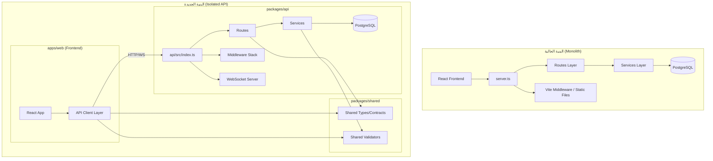
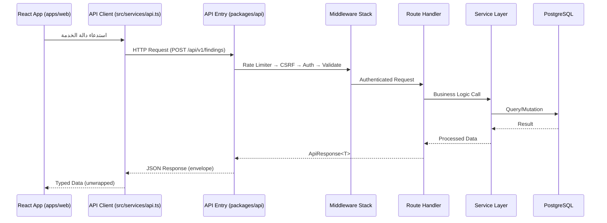

# وثيقة التصميم: عزل طبقة الـ API (API Isolation)

## Overview

يهدف هذا التصميم إلى فصل طبقة الـ API عن بقية التطبيق في مشروع ALSAQI، وذلك بإنشاء بنية واضحة تفصل بين الخادم (Backend API) والواجهة الأمامية (Frontend) بشكل كامل. حالياً، يعمل المشروع كـ Modular Monolith حيث يقدم ملف `server.ts` واحد كلاً من الـ API وملفات الواجهة الأمامية الثابتة (static assets)، مما يخلق تشابكاً بين المسؤوليات.

الهدف هو إنشاء حزمة API مستقلة (`packages/api`) تحتوي على كل منطق الخادم، مع إبقاء الواجهة الأمامية كتطبيق منفصل يتواصل عبر عقود (contracts) محددة. هذا يسمح بنشر مستقل، اختبار أسهل، وإمكانية توسيع الـ API بمعزل عن الواجهة.

## Architecture



## مخطط التسلسل (Sequence Diagram) - تدفق الطلب



## Components and Interfaces

### المكون 1: حزمة API المستقلة (`packages/api`)

**الغرض**: تغليف كامل منطق الخادم (routes, services, middleware, db) في حزمة مستقلة قابلة للنشر بشكل منفرد.

**الواجهة**:

```typescript
// packages/api/src/index.ts
export interface ApiServerConfig {
  port: number;
  corsOrigins: string[];
  jwtSecret: string;
  jwtPrivateKey: string;
  jwtPublicKey: string;
  databaseUrl: string;
  uploadDir: string;
  nodeEnv: 'development' | 'production' | 'test';
}

export interface ApiServer {
  start(): Promise<void>;
  stop(): Promise<void>;
  getApp(): Express.Application;
  getHttpServer(): http.Server;
}

export function createApiServer(config: ApiServerConfig): ApiServer;
```

**المسؤوليات**:
- استقبال ومعالجة جميع طلبات HTTP/WebSocket
- إدارة المصادقة والتفويض
- تنفيذ منطق الأعمال عبر طبقة الخدمات
- إدارة قاعدة البيانات والهجرات (migrations)
- لا يقدم أي ملفات ثابتة (static files)

### المكون 2: حزمة العقود المشتركة (`packages/shared`)

**الغرض**: تحتوي على الأنواع (Types)، مخططات التحقق (Validation Schemas)، والثوابت المشتركة بين الـ API والواجهة الأمامية.

**الواجهة**:

```typescript
// packages/shared/src/index.ts
export * from './types/api';
export * from './types/models';
export * from './types/enums';
export * from './validators/schemas';
export * from './constants';
```

**المسؤوليات**:
- تعريف جميع أنواع البيانات المشتركة (User, AuditPlan, Finding, etc.)
- تعريف مخططات التحقق بـ Zod (قابلة للاستخدام في الطرفين)
- تعريف الثوابت المشتركة (أدوار، حالات، أكواد خطأ)
- ضمان التوافق بين العقود (Contract-First Design)

### المكون 3: طبقة عميل الـ API (`apps/web/src/api/`)

**الغرض**: توفير واجهة مكتوبة الأنواع (typed) لاستدعاء الـ API من الواجهة الأمامية، مع فصل تام عن تفاصيل HTTP.

**الواجهة**:

```typescript
// apps/web/src/api/client.ts
export interface ApiClientConfig {
  baseUrl: string;
  timeout?: number;
  onUnauthorized?: () => void;
  onError?: (error: ApiError) => void;
}

export function createApiClient(config: ApiClientConfig): ApiClient;

export interface ApiClient {
  auth: AuthApi;
  auditPlans: AuditPlansApi;
  findings: FindingsApi;
  tasks: TasksApi;
  users: UsersApi;
  departments: DepartmentsApi;
  notifications: NotificationsApi;
  // ... باقي الوحدات
}
```

**المسؤوليات**:
- تغليف جميع استدعاءات HTTP في دوال مكتوبة الأنواع
- إدارة CSRF tokens وrefresh tokens تلقائياً
- تحويل الأخطاء إلى أنواع محددة
- توفير hooks جاهزة مع React Query

## Data Models

### النموذج 1: عقد الاستجابة الموحد (API Response Contract)

```typescript
// packages/shared/src/types/api.ts
import { z } from 'zod';

// مخطط الاستجابة الناجحة
export const SuccessResponseSchema = <T extends z.ZodType>(dataSchema: T) =>
  z.object({
    success: z.literal(true),
    data: dataSchema,
    meta: z.object({
      requestId: z.string().uuid(),
      timestamp: z.string().datetime(),
      version: z.string(),
      pagination: z.object({
        page: z.number().int().positive(),
        pageSize: z.number().int().positive(),
        total: z.number().int().nonnegative(),
        totalPages: z.number().int().nonnegative(),
        hasNext: z.boolean(),
        hasPrev: z.boolean(),
      }).optional(),
    }),
  });

// مخطط الاستجابة الخاطئة
export const ErrorResponseSchema = z.object({
  success: z.literal(false),
  data: z.null(),
  error: z.object({
    code: z.string(),
    message: z.string(),
    details: z.any().optional(),
    traceId: z.string(),
  }),
  meta: z.object({
    requestId: z.string().uuid(),
    timestamp: z.string().datetime(),
    version: z.string(),
  }),
});

export type ApiResponse<T> = SuccessResponse<T> | ErrorResponse;
```

### النموذج 2: عقود نقاط النهاية (Endpoint Contracts)

```typescript
// packages/shared/src/types/endpoints/audit-findings.ts
import { z } from 'zod';

export const CreateFindingSchema = z.object({
  audit_id: z.union([z.number(), z.string()]),
  condition: z.string().min(1).max(5000),
  criteria: z.string().min(1).max(5000),
  cause: z.string().min(1).max(5000),
  consequence: z.string().min(1).max(5000),
  recommendation: z.string().min(1).max(5000),
  risk_level: z.enum(['Low', 'Medium', 'High']),
  status: z.enum(['Open', 'In Progress', 'Closed']).default('Open'),
});

export const FindingResponseSchema = CreateFindingSchema.extend({
  id: z.union([z.number(), z.string()]),
  finding_number: z.string().optional(),
  plan_code: z.string().optional(),
});

export type CreateFindingInput = z.infer<typeof CreateFindingSchema>;
export type FindingResponse = z.infer<typeof FindingResponseSchema>;

// تعريف نقاط النهاية كعقد
export interface FindingsEndpoints {
  'GET /findings': {
    query: { page?: number; pageSize?: number; status?: string };
    response: FindingResponse[];
  };
  'POST /findings': {
    body: CreateFindingInput;
    response: FindingResponse;
  };
  'PUT /findings/:id': {
    params: { id: string };
    body: Partial<CreateFindingInput>;
    response: FindingResponse;
  };
  'DELETE /findings/:id': {
    params: { id: string };
    response: { deleted: boolean };
  };
}
```

**قواعد التحقق**:
- جميع الحقول النصية لها حد أدنى وأقصى للطول
- القيم المحددة (enums) محصورة في قيم معروفة
- المعرفات تقبل number أو string للتوافق مع الكود القديم

## الخوارزميات بالكود الزائف (Algorithmic Pseudocode)

### خوارزمية نقل الكود إلى البنية الجديدة

```pascal
ALGORITHM migrateToIsolatedApi(project)
INPUT: project - المشروع الحالي بتركيب monolith
OUTPUT: project - المشروع بعد إعادة الهيكلة

BEGIN
  // المرحلة 1: إنشاء هيكل الحزم
  createDirectoryStructure(project, [
    "packages/api/src/",
    "packages/api/src/routes/",
    "packages/api/src/services/",
    "packages/api/src/middleware/",
    "packages/api/src/db/",
    "packages/api/src/utils/",
    "packages/api/src/types/",
    "packages/shared/src/types/",
    "packages/shared/src/validators/",
    "packages/shared/src/constants/",
    "apps/web/src/api/"
  ])

  // المرحلة 2: استخراج الأنواع المشتركة
  sharedTypes ← extractSharedTypes(project.src.types)
  sharedValidators ← extractValidators(project.src.server.schemas)
  moveToPackage("packages/shared", sharedTypes, sharedValidators)

  // المرحلة 3: نقل منطق الخادم
  FOR each module IN project.src.server DO
    IF module IS routes THEN
      refactorRoutes(module, "packages/api/src/routes/")
    ELSE IF module IS services THEN
      moveServices(module, "packages/api/src/services/")
    ELSE IF module IS middleware THEN
      moveMiddleware(module, "packages/api/src/middleware/")
    ELSE IF module IS db THEN
      moveDatabase(module, "packages/api/src/db/")
    END IF
  END FOR

  // المرحلة 4: إنشاء طبقة عميل API
  FOR each serviceFile IN project.src.services DO
    typedClient ← generateTypedClient(serviceFile, sharedTypes)
    writeToPackage("apps/web/src/api/", typedClient)
  END FOR

  // المرحلة 5: تحديث نقطة الدخول
  createApiEntryPoint("packages/api/src/index.ts")
  removeStaticServing("packages/api")
  updateFrontendImports("apps/web")

  RETURN project
END
```

**الشروط المسبقة:**
- المشروع يستخدم TypeScript ولديه تهيئة tsconfig صالحة
- جميع الاختبارات الحالية تمر بنجاح قبل بدء الترحيل
- لا يوجد تغييرات غير محفوظة في Git

**الشروط اللاحقة:**
- الـ API يعمل بشكل مستقل على منفذ محدد
- الواجهة الأمامية تتواصل فقط عبر HTTP/WS
- لا يوجد استيراد مباشر بين packages/api و apps/web
- جميع الاختبارات تمر بنجاح بعد الترحيل

### خوارزمية عميل API مكتوب الأنواع

```pascal
ALGORITHM createTypedApiClient(endpoints, config)
INPUT: endpoints - تعريف نقاط النهاية، config - إعدادات العميل
OUTPUT: client - عميل API مكتوب الأنواع

BEGIN
  httpClient ← createAxiosInstance(config.baseUrl, config.timeout)
  
  // إعداد interceptors
  httpClient.onRequest(request => 
    attachCsrfToken(request)
    attachCorrelationId(request)
  )
  
  httpClient.onResponseError(async error =>
    IF error.status = 401 AND NOT isRefreshRequest(error) THEN
      refreshed ← await attemptTokenRefresh(httpClient)
      IF refreshed THEN
        RETURN retryOriginalRequest(error.config)
      ELSE
        config.onUnauthorized()
      END IF
    END IF
    
    translatedError ← translateApiError(error)
    config.onError(translatedError)
    THROW translatedError
  )
  
  // إنشاء واجهات مكتوبة الأنواع لكل وحدة
  client ← {}
  FOR each module IN endpoints DO
    client[module.name] ← createModuleClient(httpClient, module)
  END FOR
  
  RETURN client
END
```

**الشروط المسبقة:**
- `endpoints` يحتوي على تعريفات صالحة لجميع النقاط
- `config.baseUrl` هو URL صالح

**الشروط اللاحقة:**
- العميل يوفر دوال مكتوبة الأنواع لكل نقطة نهاية
- أخطاء الشبكة والتفويض تُعالج تلقائياً
- CSRF و correlation IDs تُرفق تلقائياً

## الدوال الرئيسية مع المواصفات الرسمية (Key Functions with Formal Specifications)

### الدالة 1: createApiServer()

```typescript
// packages/api/src/index.ts
export function createApiServer(config: ApiServerConfig): ApiServer {
  const app = express();
  const server = http.createServer(app);
  const wss = new WebSocketServer({ noServer: true });
  
  // تهيئة middleware stack
  applySecurityMiddleware(app, config);
  applyParsingMiddleware(app);
  applyAuthMiddleware(app, config);
  
  // تسجيل المسارات
  const v1Router = createV1Router(config);
  app.use('/api/v1', v1Router);
  
  // معالجة الأخطاء
  app.use(notFoundHandler);
  app.use(globalErrorHandler);
  
  return {
    async start() { /* ... */ },
    async stop() { /* ... */ },
    getApp: () => app,
    getHttpServer: () => server,
  };
}
```

**الشروط المسبقة:**
- `config` يحتوي على جميع الحقول المطلوبة بقيم صالحة
- `config.jwtPrivateKey` و `config.jwtPublicKey` هي مفاتيح RSA صالحة
- `config.databaseUrl` يشير إلى قاعدة بيانات PostgreSQL متاحة

**الشروط اللاحقة:**
- يُرجع كائن `ApiServer` جاهز للتشغيل
- لا يبدأ الاستماع على المنفذ حتى استدعاء `start()`
- `stop()` يغلق جميع الاتصالات بشكل آمن (graceful shutdown)

**ثابت الحلقة:** لا يوجد (دالة إنشاء بدون حلقات)

### الدالة 2: createModuleClient()

```typescript
// apps/web/src/api/createModuleClient.ts
function createModuleClient<T extends EndpointDefinition>(
  http: AxiosInstance,
  module: ModuleDefinition<T>
): TypedModuleClient<T> {
  const client = {} as TypedModuleClient<T>;
  
  for (const [endpoint, config] of Object.entries(module.endpoints)) {
    const [method, path] = parseEndpoint(endpoint);
    client[config.name] = async (params) => {
      const url = interpolatePath(path, params?.pathParams);
      const response = await http.request({
        method,
        url,
        data: params?.body,
        params: params?.query,
      });
      return config.responseSchema.parse(response.data);
    };
  }
  
  return client;
}
```

**الشروط المسبقة:**
- `http` هو instance من Axios مُهيأ بالـ baseUrl و interceptors
- `module.endpoints` يحتوي على تعريفات endpoint صالحة مع Zod schemas

**الشروط اللاحقة:**
- كل دالة في العميل المُرجع تُرسل HTTP request صحيح
- الاستجابات تُتحقق من صحتها عبر Zod schema قبل الإرجاع
- إذا فشل التحقق، يُرمى خطأ `ZodError`

**ثابت الحلقة:**
- كل endpoint تمت معالجته يُنتج دالة في الكائن الناتج
- لا يوجد endpoint يُعالج مرتين

### الدالة 3: extractSharedTypes()

```typescript
// أداة ترحيل - scripts/migrate-types.ts
function extractSharedTypes(
  sourceTypesPath: string,
  serverTypesPath: string
): SharedTypeBundle {
  const sourceTypes = parseTypeDefinitions(sourceTypesPath);
  const serverTypes = parseTypeDefinitions(serverTypesPath);
  
  const shared: TypeDefinition[] = [];
  const apiOnly: TypeDefinition[] = [];
  const frontendOnly: TypeDefinition[] = [];
  
  for (const type of [...sourceTypes, ...serverTypes]) {
    const usedInApi = isReferencedIn(type, 'src/server/');
    const usedInFrontend = isReferencedIn(type, 'src/components/', 'src/modules/');
    
    if (usedInApi && usedInFrontend) {
      shared.push(type);
    } else if (usedInApi) {
      apiOnly.push(type);
    } else {
      frontendOnly.push(type);
    }
  }
  
  return { shared, apiOnly, frontendOnly };
}
```

**الشروط المسبقة:**
- الملفات المصدرية موجودة وقابلة للقراءة
- الأنواع مكتوبة بصيغة TypeScript صالحة

**الشروط اللاحقة:**
- كل نوع يُصنف في مجموعة واحدة فقط (shared, apiOnly, frontendOnly)
- مجموع الأنواع الثلاث = إجمالي الأنواع الأصلية
- الأنواع المشتركة تُستخدم في كلا الطرفين

## أمثلة الاستخدام (Example Usage)

```typescript
// === مثال 1: تشغيل الـ API بشكل مستقل ===
// packages/api/src/main.ts
import { createApiServer } from './index';

const server = createApiServer({
  port: 3000,
  corsOrigins: ['http://localhost:5173'],
  jwtSecret: process.env.JWT_SECRET!,
  jwtPrivateKey: process.env.JWT_PRIVATE_KEY!,
  jwtPublicKey: process.env.JWT_PUBLIC_KEY!,
  databaseUrl: process.env.DATABASE_URL!,
  uploadDir: process.env.UPLOAD_DIR || './uploads',
  nodeEnv: (process.env.NODE_ENV as any) || 'development',
});

await server.start();
console.log('API server running on port 3000');

// === مثال 2: استخدام عميل API في الواجهة الأمامية ===
// apps/web/src/api/index.ts
import { createApiClient } from './client';

export const api = createApiClient({
  baseUrl: import.meta.env.VITE_API_URL || '/api',
  timeout: 30000,
  onUnauthorized: () => {
    window.location.href = '/login';
  },
  onError: (error) => {
    toast.error(translateError(error.message));
  },
});

// استخدام مكتوب الأنواع
const findings = await api.findings.list({ status: 'Open', page: 1 });
const newFinding = await api.findings.create({
  audit_id: 1,
  condition: 'ملاحظة جديدة',
  criteria: 'المعيار',
  cause: 'السبب',
  consequence: 'الأثر',
  recommendation: 'التوصية',
  risk_level: 'High',
  status: 'Open',
});

// === مثال 3: استخدام React Query مع عميل API ===
// apps/web/src/hooks/useFindings.ts
import { useQuery, useMutation, useQueryClient } from '@tanstack/react-query';
import { api } from '../api';

export function useFindings(filters?: { status?: string }) {
  return useQuery({
    queryKey: ['findings', filters],
    queryFn: () => api.findings.list(filters),
  });
}

export function useCreateFinding() {
  const queryClient = useQueryClient();
  return useMutation({
    mutationFn: api.findings.create,
    onSuccess: () => {
      queryClient.invalidateQueries({ queryKey: ['findings'] });
    },
  });
}

// === مثال 4: مشاركة التحقق بين الطرفين ===
// packages/shared/src/validators/findings.ts
import { z } from 'zod';

export const CreateFindingSchema = z.object({
  audit_id: z.union([z.number(), z.string()]),
  condition: z.string().min(1, 'الحالة مطلوبة').max(5000),
  criteria: z.string().min(1, 'المعيار مطلوب').max(5000),
  risk_level: z.enum(['Low', 'Medium', 'High']),
});

// يُستخدم في الخادم:
// router.post('/findings', validate(CreateFindingSchema), handler)

// ويُستخدم في الواجهة (مع react-hook-form):
// const { register } = useForm({ resolver: zodResolver(CreateFindingSchema) })
```

## Correctness Properties

### Property 1: عزل الاستيرادات (Import Isolation)

لا يوجد استيراد مباشر بين حزمة الـ API والواجهة الأمامية:

∀ file ∈ packages/api: imports(file) ∩ paths("apps/web/") = ∅
∀ file ∈ apps/web: imports(file) ∩ paths("packages/api/") = ∅

### Property 2: اكتمال العقود (Contract Completeness)

كل نقطة نهاية مسجلة في الـ API لها تعريف مطابق في الحزمة المشتركة:

∀ endpoint ∈ API_ROUTES: ∃ contract ∈ packages/shared such that contract.path = endpoint.path ∧ contract.method = endpoint.method

### Property 3: تطابق التحقق (Validation Symmetry)

نفس مخطط التحقق يُنتج نفس النتيجة سواءً نُفذ في الخادم أو العميل:

∀ schema ∈ packages/shared/validators, ∀ input: validate(schema, input) on server = validate(schema, input) on client

### Property 4: التوافق العكسي (Backward Compatibility)

جميع المسارات القديمة تُنتج نفس الاستجابة بعد الترحيل:

∀ path ∈ existing_api_paths: response(new_api, path) ≡ response(old_api, path)

### Property 5: استقلال النشر (Deployment Independence)

يمكن نشر كل حزمة بشكل مستقل دون التأثير على الأخرى:

deploy(packages/api) does NOT require rebuild(apps/web)
deploy(apps/web) does NOT require restart(packages/api)

## Error Handling

### السيناريو 1: فشل الاتصال بالـ API

**الشرط**: الواجهة الأمامية لا تستطيع الوصول إلى الـ API (شبكة / خادم معطل)
**الاستجابة**: عرض رسالة خطأ شبكة مع إمكانية إعادة المحاولة
**الاسترداد**: إعادة المحاولة التلقائية مع exponential backoff (3 محاولات)

### السيناريو 2: عدم تطابق إصدار العقد (Contract Version Mismatch)

**الشرط**: الواجهة الأمامية تستخدم إصدار أقدم من عقود الـ API
**الاستجابة**: الـ API يُرجع `X-API-Version` header، العميل يقارن مع الإصدار المتوقع
**الاسترداد**: عرض إشعار للمستخدم بضرورة تحديث الصفحة

### السيناريو 3: فشل التحقق من البيانات (Validation Error)

**الشرط**: البيانات المُرسلة لا تطابق مخطط Zod المشترك
**الاستجابة**: الـ API يُرجع 400 مع تفاصيل الحقول الخاطئة
**الاسترداد**: عرض أخطاء التحقق على مستوى كل حقل في النموذج

### السيناريو 4: فشل WebSocket أثناء الترحيل

**الشرط**: اتصال WebSocket ينقطع أثناء نقل الخادم
**الاستجابة**: محاولة إعادة الاتصال التلقائي مع fallback إلى polling
**الاسترداد**: عند استعادة الاتصال، مزامنة الإشعارات المفقودة

## Testing Strategy

### اختبارات الوحدة (Unit Testing)

- اختبار كل خدمة في `packages/api/src/services/` بشكل مستقل مع mock للـ DB
- اختبار مخططات التحقق في `packages/shared/` مع حالات صالحة وغير صالحة
- اختبار دوال عميل الـ API مع mock لـ Axios

### اختبارات الخصائص (Property-Based Testing)

**مكتبة الاختبار**: `fast-check` (موجودة بالفعل في المشروع)

```typescript
// اختبار خاصية: أي إدخال صالح حسب المخطط يُقبل من الـ API
import fc from 'fast-check';
import { CreateFindingSchema } from '@alsaqi/shared';

test('valid inputs always pass validation', () => {
  fc.assert(
    fc.property(
      fc.record({
        audit_id: fc.oneof(fc.integer({ min: 1 }), fc.uuid()),
        condition: fc.string({ minLength: 1, maxLength: 5000 }),
        criteria: fc.string({ minLength: 1, maxLength: 5000 }),
        cause: fc.string({ minLength: 1, maxLength: 5000 }),
        consequence: fc.string({ minLength: 1, maxLength: 5000 }),
        recommendation: fc.string({ minLength: 1, maxLength: 5000 }),
        risk_level: fc.constantFrom('Low', 'Medium', 'High'),
        status: fc.constantFrom('Open', 'In Progress', 'Closed'),
      }),
      (input) => {
        const result = CreateFindingSchema.safeParse(input);
        expect(result.success).toBe(true);
      }
    )
  );
});
```

### اختبارات التكامل (Integration Testing)

- اختبار دورة كاملة: عميل → API → DB → استجابة
- اختبار أن المسارات القديمة (`/api/findings`) تعمل كما كانت
- اختبار WebSocket reconnection أثناء التبديل

## اعتبارات الأداء (Performance Considerations)

- **لا تغيير في بنية قاعدة البيانات**: نفس الاستعلامات والفهارس
- **إضافة proxy في التطوير**: Vite يوجه `/api` إلى منفذ الخادم المستقل
- **في الإنتاج**: nginx يوجه الطلبات (لا تغيير في الأداء)
- **حزمة shared صغيرة**: فقط أنواع و Zod schemas (tree-shakeable)
- **تقسيم الكود (Code Splitting)**: طبقة عميل API تُحمّل حسب الحاجة مع React lazy

## اعتبارات الأمان (Security Considerations)

- **CORS**: تحديد الـ origins المسموح بها بشكل صريح (لا `*` في الإنتاج)
- **CSRF**: يبقى كما هو - token في cookie يُرفق في header
- **JWT**: المفاتيح تبقى فقط في `packages/api` - لا تُنقل للواجهة
- **Secrets**: ملفات `.env` منفصلة لكل حزمة
- **Rate Limiting**: يبقى في طبقة الـ API
- **File Validation (Magika)**: يبقى في طبقة الـ API

## هيكل المجلدات النهائي (Target Directory Structure)

```
alsaqi/
├── packages/
│   ├── api/                          # حزمة الـ API المستقلة
│   │   ├── src/
│   │   │   ├── index.ts              # نقطة الدخول + createApiServer
│   │   │   ├── main.ts               # تشغيل الخادم
│   │   │   ├── routes/               # (نقل من src/server/routes/)
│   │   │   ├── services/             # (نقل من src/server/services/)
│   │   │   ├── middleware/           # (نقل من src/server/middleware/)
│   │   │   ├── db/                   # (نقل من src/server/db/)
│   │   │   ├── utils/                # (نقل من src/server/utils/)
│   │   │   └── cron/                 # (نقل من src/server/cron/)
│   │   ├── package.json
│   │   └── tsconfig.json
│   │
│   └── shared/                       # العقود المشتركة
│       ├── src/
│       │   ├── types/
│       │   │   ├── api.ts            # ApiResponse, ApiError, PaginationMeta
│       │   │   ├── models.ts         # User, AuditPlan, Finding, etc.
│       │   │   └── enums.ts          # UserRole, Status enums
│       │   ├── validators/
│       │   │   ├── auth.ts           # Login, Register schemas
│       │   │   ├── findings.ts       # Finding CRUD schemas
│       │   │   └── index.ts
│       │   └── constants/
│       │       └── index.ts          # Error codes, module names
│       ├── package.json
│       └── tsconfig.json
│
├── apps/
│   └── web/                          # الواجهة الأمامية (React)
│       ├── src/
│       │   ├── api/                   # طبقة عميل API الجديدة
│       │   │   ├── client.ts          # createApiClient
│       │   │   ├── modules/           # عميل لكل وحدة
│       │   │   │   ├── auth.ts
│       │   │   │   ├── findings.ts
│       │   │   │   ├── tasks.ts
│       │   │   │   └── ...
│       │   │   └── hooks/             # React Query hooks
│       │   │       ├── useFindings.ts
│       │   │       ├── useTasks.ts
│       │   │       └── ...
│       │   ├── components/
│       │   ├── modules/
│       │   ├── context/
│       │   └── ...
│       ├── package.json
│       ├── vite.config.ts
│       └── tsconfig.json
│
├── package.json                       # workspace root (npm workspaces)
├── tsconfig.base.json                 # إعدادات TypeScript المشتركة
└── deploy/
    ├── docker-compose.yml             # يُحدث لبناء API و Web منفصلين
    └── nginx/nginx.conf               # يوجه /api → api container
```

## الاعتماديات (Dependencies)

| الحزمة | الاعتماديات الجديدة | ملاحظات |
|--------|---------------------|---------|
| `packages/api` | لا شيء جديد | نفس اعتماديات server.ts الحالية |
| `packages/shared` | `zod` | موجودة بالفعل في المشروع |
| `apps/web` | لا شيء جديد | `axios`, `@tanstack/react-query` موجودة |
| Root (workspace) | `npm workspaces` أو `turborepo` | لإدارة الحزم المتعددة |

**أدوات البناء**:
- `tsup` أو `esbuild` لبناء `packages/api` (بديل عن esbuild الحالي في package.json)
- `vite` يبقى لبناء `apps/web`
- `tsc --build` لفحص الأنواع عبر جميع الحزم
