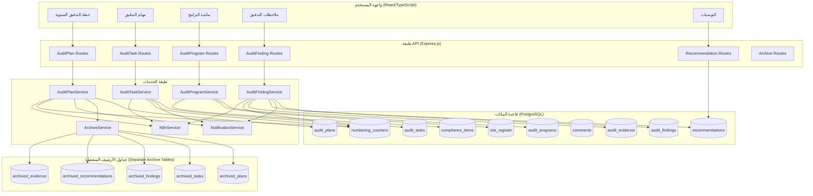
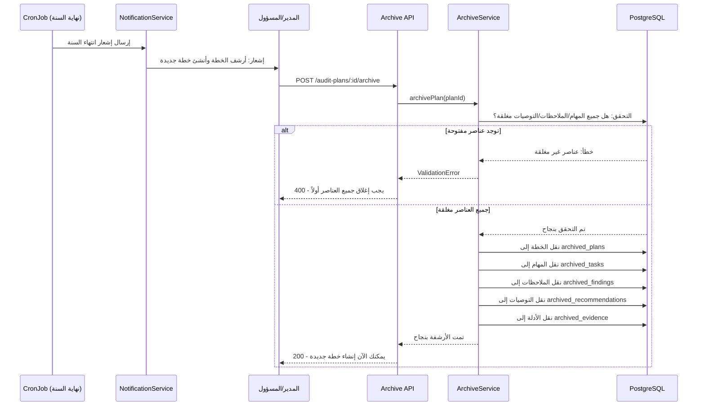
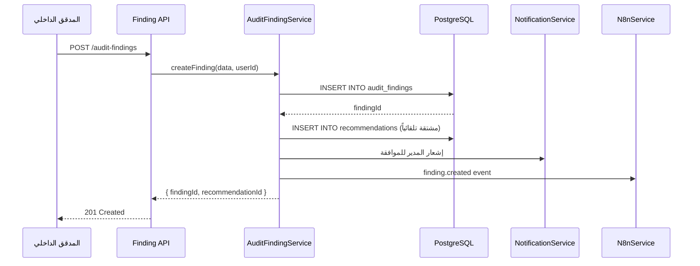
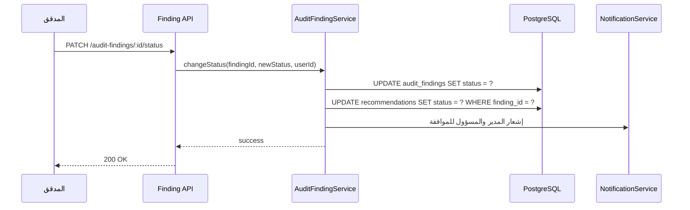

# وثيقة التصميم: إعادة هيكلة وحدات التدقيق (Audit Modules Restructure)

## Overview

يهدف هذا التصميم إلى إعادة هيكلة خمس وحدات أساسية في نظام إدارة التدقيق الداخلي (IAMS): خطة التدقيق، مهام التدقيق، مكتبة برامج التدقيق، ملاحظات التدقيق، والتوصيات. تشمل التغييرات: نظام أرشفة سنوي إلزامي للخطط عبر جداول أرشيف منفصلة، سنة مالية ثابتة (1 يناير - 31 ديسمبر)، تنظيم ربع سنوي، نظام ترقيم موحّد متفرّع يتبع سير عملية التدقيق، عنوان إلزامي للملاحظات، تنظيم تخزين الملاحظات والأدلة في فولدرات حسب الخطة، تحسين نظام الإشعارات، ربط المخاطر من سجل المخاطر، ربط المعايير من مصفوفة الامتثال، تحسين نظام التعليقات على الملاحظات، جعل التوصيات مشتقة تلقائياً من الملاحظات فقط، وتحديث مصفوفة الصلاحيات الحالية لتقييد الإنشاء/التعديل/الاعتماد حسب الأدوار، مع توفير ترجمات عربية وإنجليزية لكل الإضافات الجديدة.

النظام الحالي مبني على Express.js مع PostgreSQL وواجهة React/TypeScript. يستخدم CRUD Generator للعمليات الأساسية مع خدمات مخصصة (AuditPlanService, AuditTaskService, AuditService, AuditProgramService) للمنطق المتقدم. نظام الإشعارات (NotificationService) ونظام الأتمتة (N8nService) موجودان ويعملان.

## Architecture



## مخططات التسلسل (Sequence Diagrams)

### 1. عملية أرشفة الخطة السنوية



### 2. إنشاء ملاحظة وتوليد توصية تلقائياً



### 3. تغيير حالة الملاحظة ومزامنة التوصية



## Components and Interfaces

### 1. خطة التدقيق (AuditPlan) - الواجهات المحدّثة

```typescript
// === نموذج البيانات المحدّث ===
interface AuditPlan {
  id: string; // UUID
  plan_code: string; // الكود الجذري للترقيم الموحّد، مثل "IA-PL-25-001" (انظر قسم نظام الترقيم الموحّد)
  title: string;
  year: number; // السنة المالية الثابتة: تبدأ من 1 يناير وتنتهي في 31 ديسمبر (جديد)
  quarter: 'Q1' | 'Q2' | 'Q3' | 'Q4' | 'Annual'; // الربع (جديد)
  department: string;
  type: 'Operational' | 'Compliance' | 'Financial' | 'IT' | 'AML';
  risk_rating: 'Low' | 'Medium' | 'High' | 'Critical';
  planned_start_date: string; // افتراضياً YYYY-01-01 (بداية السنة المالية)
  planned_end_date: string;   // افتراضياً YYYY-12-31 (نهاية السنة المالية)
  actual_start_date?: string;
  actual_end_date?: string;
  status: 'Planned' | 'Fieldwork' | 'Reporting' | 'Closed' | 'Archived';
  lead_auditor: string;
  team_members?: string;
  objectives?: string;
  scope?: string;
  notes?: string;
  is_archived: boolean; // (جديد)
  archived_at?: string; // (جديد)
  archived_by?: string; // (جديد)
  created_at: string;
  updated_at: string;
}

// === جداول الأرشيف المنفصلة (Separate Archive Tables) ===
// مبدأ أساسي: بيانات الأرشيف تعيش في جداول أرشيف منفصلة تماماً عن الجداول العادية،
// وليست مجرد علامة is_archived على الجداول الأصلية.
// عند الأرشفة: يتم نقل البيانات (نسخها إلى جداول الأرشيف ثم إزالة/تعليم الأصل).
// يبقى حقل is_archived على audit_plans فقط كمؤشر بحث سريع (quick lookup)،
// بينما تُنقل بيانات التفاصيل (المهام/الملاحظات/التوصيات/الأدلة) إلى جداول الأرشيف المنفصلة.
interface ArchivedPlan {
  id: string;
  original_plan_id: string;
  plan_data: JSON; // نسخة كاملة من الخطة
  year: number;
  archived_at: string;
  archived_by: string;
}

interface ArchivedTasks {
  id: string;
  original_task_id: string;
  plan_id: string;
  task_data: JSON;
  archived_at: string;
}

interface ArchivedFindings {
  id: string;
  original_finding_id: string;
  plan_id: string;
  finding_data: JSON;
  archived_at: string;
}

interface ArchivedRecommendations {
  id: string;
  original_recommendation_id: string;
  plan_id: string;
  recommendation_data: JSON;
  archived_at: string;
}

interface ArchivedEvidence {
  id: string;
  original_evidence_id: string;
  plan_id: string;
  evidence_data: JSON;
  archived_at: string;
}
```

### 2. مهام التدقيق (AuditTask) - الواجهات المحدّثة

```typescript
interface AuditTask {
  id: string; // UUID
  task_number: string; // مشتق هرمياً من كود الخطة، مثل "IA-PL-25-001-T01" (انظر قسم نظام الترقيم الموحّد)
  title: string;
  plan_id: string;
  program_id?: string;
  audit_type: string;
  status: 'draft' | 'in_progress' | 'review' | 'approved' | 'completed';
  assigned_to: string[]; // تغيير: مصفوفة بدلاً من قيمة واحدة (جديد)
  audited_unit_id?: string;
  planned_hours?: number;
  actual_hours?: number;
  period_from?: string;
  period_to?: string;
  due_date?: string;
  approved_by?: string;
  approved_at?: string;
  created_by?: string;
  created_at?: string;
  updated_at?: string;
}

// جدول ربط المهام بالمكلفين (Many-to-Many)
interface TaskAssignment {
  id: string;
  task_id: string;
  user_id: string;
  assigned_at: string;
  assigned_by: string;
}
```

### 3. مكتبة برامج التدقيق (AuditProgram) - الواجهات المحدّثة

```typescript
interface AuditProgram {
  id: string;
  program_code: string;
  program_title: string;
  audit_area: string;
  department: string;
  audit_type: 'Operational' | 'Financial' | 'Compliance' | 'IT' | 'AML' | 'Governance';
  audit_objective: string;
  audit_scope: string;
  key_risks: string; // تغيير: يسحب من risk_register (جديد)
  // control_objectives: محذوف
  reference_standard: string; // تغيير: يسحب من compliance_items (جديد)
  status: 'Draft' | 'Submitted' | 'Approved' | 'Active' | 'Archived';
  version_number: number;
  created_by: string; // المدقق الداخلي فقط
  approved_by?: string; // المدير أو المسؤول (جديد)
  approved_at?: string; // (جديد)
  created_at: string;
  updated_at: string;
}

// ربط المخاطر من سجل المخاطر
interface ProgramRiskLink {
  id: string;
  program_id: string;
  risk_id: string; // FK → risk_register.id
  created_at: string;
}

// ربط المعايير من مصفوفة الامتثال
interface ProgramComplianceLink {
  id: string;
  program_id: string;
  compliance_item_id: string; // FK → compliance_items.id
  created_at: string;
}
```

### 4. ملاحظات التدقيق (AuditFinding) - الواجهات المحدّثة

```typescript
interface AuditFinding {
  id: string;
  audit_id: string; // FK → audit_plans.id
  plan_id: string; // نفس audit_id - للتوضيح
  finding_number: string; // مشتق هرمياً من كود الخطة، مثل "IA-PL-25-001-F01" (انظر قسم نظام الترقيم الموحّد)
  title: string; // عنوان الملاحظة - حقل إلزامي (جديد، يظهر في النموذج وقائمة/بطاقات الملاحظات)
  description: string;
  criteria: string;
  condition: string;
  // cause: محذوف
  finding_type: 'control_design_deficiency' | 'operational_design_deficiency'; // جديد
  consequence: string;
  risk_level: 'Low' | 'Medium' | 'High' | 'Critical';
  status: 'Open' | 'In Progress' | 'Closed' | 'Pending Approval';
  created_by: string; // المدقق الذي كتب الملاحظة (جديد - للتحكم بالتعديل على مستوى السجل)
  created_at: string;
  updated_at: string;
}

// ربط الأدلة بالملاحظات (موجود - يبقى كما هو مع تحديث مسار التخزين)
interface AuditEvidence {
  id: string;
  audit_id: string;
  finding_id: string; // FK → audit_findings.id
  evidence_number?: string; // مشتق هرمياً من رقم الملاحظة، مثل "IA-PL-25-001-F01-E01" (انظر قسم نظام الترقيم الموحّد)
  type: 'Document' | 'Email' | 'Screenshot' | 'System Log' | 'Contract';
  description: string;
  uploaded_by: string;
  upload_date: string;
  file_name: string;
  file_path: string; // مسار التخزين المنظّم حسب الخطة والملاحظة: /uploads/findings/{plan_id}/{finding_id}/... (جديد، انظر قسم هيكل تخزين الملاحظات)
  file_data?: string;
}
```

### 5. التوصيات (Recommendation) - الواجهات المحدّثة

```typescript
interface Recommendation {
  id: string;
  finding_id: string; // FK → audit_findings.id (إلزامي - لا إضافة يدوية)
  plan_id: string; // FK → audit_plans.id (جديد - للفلترة)
  department: string;
  responsible: string;
  responsible_person_id?: string;
  due_date: string;
  status: 'Open' | 'In Progress' | 'Implemented' | 'Overdue' | 'Closed';
  risk_level: 'Low' | 'Medium' | 'High' | 'Critical';
  rec_number?: string; // مشتق هرمياً من رقم الملاحظة، مثل "IA-PL-25-001-F01-R01" (انظر قسم نظام الترقيم الموحّد)
  action_plan?: string;
  priority?: string;
  follow_up_date?: string;
  closure_evidence_path?: string;
  closed_by?: string;
  closed_at?: string;
  created_by?: string;
  created_at: string;
  updated_at: string;
}

// خريطة مزامنة الحالات بين الملاحظة والتوصية
const FINDING_TO_RECOMMENDATION_STATUS: Record<string, string> = {
  'Open': 'Open',
  'In Progress': 'In Progress',
  'Closed': 'Implemented',
  'Pending Approval': 'In Progress',
};
```

## Data Models

```typescript
// === Migration: إضافة أعمدة جديدة ===

const MIGRATION_AUDIT_RESTRUCTURE = [
  // 1. audit_plans: إضافة year, quarter, is_archived
  `ALTER TABLE audit_plans ADD COLUMN IF NOT EXISTS year INTEGER`,
  `ALTER TABLE audit_plans ADD COLUMN IF NOT EXISTS quarter TEXT DEFAULT 'Annual'`,
  `ALTER TABLE audit_plans ADD COLUMN IF NOT EXISTS is_archived BOOLEAN DEFAULT false`,
  `ALTER TABLE audit_plans ADD COLUMN IF NOT EXISTS archived_at TIMESTAMPTZ`,
  `ALTER TABLE audit_plans ADD COLUMN IF NOT EXISTS archived_by UUID REFERENCES users(id)`,

  // 2. جدول ربط المهام بالمكلفين (task_assignments)
  `CREATE TABLE IF NOT EXISTS task_assignments (
    id UUID PRIMARY KEY DEFAULT gen_random_uuid(),
    task_id UUID NOT NULL REFERENCES audit_tasks(id) ON DELETE CASCADE,
    user_id UUID NOT NULL REFERENCES users(id),
    assigned_at TIMESTAMPTZ DEFAULT CURRENT_TIMESTAMP,
    assigned_by UUID REFERENCES users(id),
    UNIQUE(task_id, user_id)
  )`,

  // 3. جدول ربط المخاطر بالبرامج
  `CREATE TABLE IF NOT EXISTS program_risk_links (
    id UUID PRIMARY KEY DEFAULT gen_random_uuid(),
    program_id UUID NOT NULL REFERENCES audit_programs(id) ON DELETE CASCADE,
    risk_id UUID NOT NULL REFERENCES risk_register(id),
    created_at TIMESTAMPTZ DEFAULT CURRENT_TIMESTAMP,
    UNIQUE(program_id, risk_id)
  )`,

  // 4. جدول ربط المعايير بالبرامج
  `CREATE TABLE IF NOT EXISTS program_compliance_links (
    id UUID PRIMARY KEY DEFAULT gen_random_uuid(),
    program_id UUID NOT NULL REFERENCES audit_programs(id) ON DELETE CASCADE,
    compliance_item_id UUID NOT NULL REFERENCES compliance_items(id),
    created_at TIMESTAMPTZ DEFAULT CURRENT_TIMESTAMP,
    UNIQUE(program_id, compliance_item_id)
  )`,

  // 5. audit_findings: إضافة finding_type, حذف cause, تأكيد عنوان الملاحظة إلزامي
  `ALTER TABLE audit_findings ADD COLUMN IF NOT EXISTS finding_type TEXT DEFAULT 'control_design_deficiency'`,
  `ALTER TABLE audit_findings ADD COLUMN IF NOT EXISTS created_by UUID REFERENCES users(id)`,
  `ALTER TABLE audit_findings ADD COLUMN IF NOT EXISTS title TEXT`, // عنوان الملاحظة - يُملأ ثم يُجعل NOT NULL
  `UPDATE audit_findings SET title = COALESCE(title, 'ملاحظة ' || finding_number) WHERE title IS NULL`,
  `ALTER TABLE audit_findings ALTER COLUMN title SET NOT NULL`,

  // 6. recommendations: إضافة plan_id
  `ALTER TABLE recommendations ADD COLUMN IF NOT EXISTS plan_id UUID REFERENCES audit_plans(id)`,

  // 6b. الترقيم الموحّد: عمود رقم الدليل + مسار التخزين المنظّم حسب الخطة/الملاحظة
  `ALTER TABLE audit_evidence ADD COLUMN IF NOT EXISTS evidence_number TEXT`,
  `ALTER TABLE audit_evidence ADD COLUMN IF NOT EXISTS file_path TEXT`,

  // 6c. مكتبة البرامج: أعمدة الموافقة (الموافقة من المدير/المسؤول)
  `ALTER TABLE audit_programs ADD COLUMN IF NOT EXISTS approved_by UUID REFERENCES users(id)`,
  `ALTER TABLE audit_programs ADD COLUMN IF NOT EXISTS approved_at TIMESTAMPTZ`,

  // 7. جداول الأرشيف
  `CREATE TABLE IF NOT EXISTS archived_plans (
    id UUID PRIMARY KEY DEFAULT gen_random_uuid(),
    original_plan_id UUID NOT NULL,
    plan_data JSONB NOT NULL,
    year INTEGER NOT NULL,
    archived_at TIMESTAMPTZ DEFAULT CURRENT_TIMESTAMP,
    archived_by UUID REFERENCES users(id)
  )`,

  `CREATE TABLE IF NOT EXISTS archived_tasks (
    id UUID PRIMARY KEY DEFAULT gen_random_uuid(),
    original_task_id UUID NOT NULL,
    plan_id UUID NOT NULL,
    task_data JSONB NOT NULL,
    archived_at TIMESTAMPTZ DEFAULT CURRENT_TIMESTAMP
  )`,

  `CREATE TABLE IF NOT EXISTS archived_findings (
    id UUID PRIMARY KEY DEFAULT gen_random_uuid(),
    original_finding_id UUID NOT NULL,
    plan_id UUID NOT NULL,
    finding_data JSONB NOT NULL,
    archived_at TIMESTAMPTZ DEFAULT CURRENT_TIMESTAMP
  )`,

  `CREATE TABLE IF NOT EXISTS archived_recommendations (
    id UUID PRIMARY KEY DEFAULT gen_random_uuid(),
    original_recommendation_id UUID NOT NULL,
    plan_id UUID NOT NULL,
    recommendation_data JSONB NOT NULL,
    archived_at TIMESTAMPTZ DEFAULT CURRENT_TIMESTAMP
  )`,

  `CREATE TABLE IF NOT EXISTS archived_evidence (
    id UUID PRIMARY KEY DEFAULT gen_random_uuid(),
    original_evidence_id UUID NOT NULL,
    plan_id UUID NOT NULL,
    evidence_data JSONB NOT NULL,
    archived_at TIMESTAMPTZ DEFAULT CURRENT_TIMESTAMP
  )`,

  // 7b. عدّادات الترقيم الموحّد (لتوليد أرقام متفرّعة آمنة ضد التزامن)
  // المفتاح المركّب (scope_type, scope_id) يحدد نطاق العدّاد:
  //   - 'plan_year' + السنة  → تسلسل الخطط داخل السنة (001, 002, ...)
  //   - 'task'  + plan_id    → تسلسل المهام داخل الخطة (T01, T02, ...)
  //   - 'finding' + plan_id  → تسلسل الملاحظات داخل الخطة (F01, F02, ...)
  //   - 'rec'   + finding_id → تسلسل التوصيات داخل الملاحظة (R01, R02, ...)
  //   - 'evidence' + finding_id → تسلسل الأدلة داخل الملاحظة (E01, E02, ...)
  `CREATE TABLE IF NOT EXISTS numbering_counters (
    scope_type TEXT NOT NULL,
    scope_id TEXT NOT NULL,
    last_value INTEGER NOT NULL DEFAULT 0,
    PRIMARY KEY (scope_type, scope_id)
  )`,

  // 8. فهارس الأداء
  `CREATE INDEX IF NOT EXISTS idx_audit_plans_year ON audit_plans(year)`,
  `CREATE INDEX IF NOT EXISTS idx_audit_plans_quarter ON audit_plans(quarter)`,
  `CREATE INDEX IF NOT EXISTS idx_audit_plans_is_archived ON audit_plans(is_archived)`,
  `CREATE INDEX IF NOT EXISTS idx_audit_findings_plan_id ON audit_findings(audit_id)`,
  `CREATE INDEX IF NOT EXISTS idx_audit_findings_created_by ON audit_findings(created_by)`,
  `CREATE INDEX IF NOT EXISTS idx_recommendations_plan_id ON recommendations(plan_id)`,
  `CREATE INDEX IF NOT EXISTS idx_task_assignments_task_id ON task_assignments(task_id)`,
  `CREATE INDEX IF NOT EXISTS idx_task_assignments_user_id ON task_assignments(user_id)`,
  `CREATE INDEX IF NOT EXISTS idx_archived_plans_year ON archived_plans(year)`,
  `CREATE INDEX IF NOT EXISTS idx_audit_evidence_finding_id ON audit_evidence(finding_id)`,
];
```

## الخوارزميات والمواصفات الرسمية (Algorithmic Pseudocode & Formal Specs)

### خوارزمية 1: أرشفة الخطة السنوية

```typescript
// ArchiveService.archivePlan()

async function archivePlan(planId: string, userId: string): Promise<void> {
  // --- المتطلبات المسبقة (Preconditions) ---
  // 1. المستخدم يجب أن يكون Manager أو Admin
  // 2. الخطة موجودة وغير مؤرشفة
  // 3. جميع المهام المرتبطة بالخطة في حالة 'completed'
  // 4. جميع الملاحظات المرتبطة في حالة 'Closed'
  // 5. جميع التوصيات المرتبطة في حالة 'Implemented' أو 'Closed'

  return await db.transaction(async () => {
    // التحقق من وجود الخطة
    const plan = await db.prepare(
      "SELECT * FROM audit_plans WHERE id = ? AND is_archived = false"
    ).get(planId);
    if (!plan) throw new NotFoundError('الخطة غير موجودة أو مؤرشفة مسبقاً');

    // التحقق من إغلاق جميع المهام
    const openTasks = await db.prepare(
      "SELECT COUNT(*) as count FROM audit_tasks WHERE plan_id = ? AND status != 'completed'"
    ).get(planId);
    if (openTasks.count > 0) {
      throw new ValidationError('يجب إغلاق جميع المهام قبل الأرشفة');
    }

    // التحقق من إغلاق جميع الملاحظات
    const openFindings = await db.prepare(
      "SELECT COUNT(*) as count FROM audit_findings WHERE audit_id = ? AND status != 'Closed'"
    ).get(planId);
    if (openFindings.count > 0) {
      throw new ValidationError('يجب إغلاق جميع الملاحظات قبل الأرشفة');
    }

    // التحقق من إغلاق جميع التوصيات
    const openRecs = await db.prepare(
      `SELECT COUNT(*) as count FROM recommendations 
       WHERE finding_id IN (SELECT id FROM audit_findings WHERE audit_id = ?)
       AND status NOT IN ('Implemented', 'Closed')`
    ).get(planId);
    if (openRecs.count > 0) {
      throw new ValidationError('يجب إغلاق جميع التوصيات قبل الأرشفة');
    }

    // --- عملية الأرشفة ---
    // 1. أرشفة الخطة
    await db.prepare(
      "INSERT INTO archived_plans (original_plan_id, plan_data, year, archived_by) VALUES (?, ?::jsonb, ?, ?)"
    ).run(planId, JSON.stringify(plan), plan.year, userId);

    // 2. أرشفة المهام
    const tasks = await db.prepare("SELECT * FROM audit_tasks WHERE plan_id = ?").all(planId);
    for (const task of tasks) {
      await db.prepare(
        "INSERT INTO archived_tasks (original_task_id, plan_id, task_data) VALUES (?, ?, ?::jsonb)"
      ).run(task.id, planId, JSON.stringify(task));
    }

    // 3. أرشفة الملاحظات
    const findings = await db.prepare("SELECT * FROM audit_findings WHERE audit_id = ?").all(planId);
    for (const finding of findings) {
      await db.prepare(
        "INSERT INTO archived_findings (original_finding_id, plan_id, finding_data) VALUES (?, ?, ?::jsonb)"
      ).run(finding.id, planId, JSON.stringify(finding));
    }

    // 4. أرشفة التوصيات
    const recs = await db.prepare(
      `SELECT r.* FROM recommendations r
       JOIN audit_findings f ON r.finding_id = f.id
       WHERE f.audit_id = ?`
    ).all(planId);
    for (const rec of recs) {
      await db.prepare(
        "INSERT INTO archived_recommendations (original_recommendation_id, plan_id, recommendation_data) VALUES (?, ?, ?::jsonb)"
      ).run(rec.id, planId, JSON.stringify(rec));
    }

    // 5. أرشفة الأدلة
    const evidence = await db.prepare(
      "SELECT * FROM audit_evidence WHERE audit_id = ?"
    ).all(planId);
    for (const ev of evidence) {
      await db.prepare(
        "INSERT INTO archived_evidence (original_evidence_id, plan_id, evidence_data) VALUES (?, ?, ?::jsonb)"
      ).run(ev.id, planId, JSON.stringify(ev));
    }

    // 6. تحديث حالة الخطة (مؤشر بحث سريع على الجدول الأصلي)
    await db.prepare(
      "UPDATE audit_plans SET is_archived = true, archived_at = CURRENT_TIMESTAMP, archived_by = ?, status = 'Archived' WHERE id = ?"
    ).run(userId, planId);

    // 7. نقل البيانات: إزالة بيانات التفاصيل من الجداول العادية بعد نسخها للأرشيف
    //    المبدأ: الأرشفة = نقل (MOVE) وليست مجرد علامة. بيانات التفاصيل تنتقل فعلياً
    //    إلى جداول الأرشيف المنفصلة، ثم تُحذف من الجداول العادية لإبقائها نظيفة وسريعة.
    //    - يبقى صف الخطة في audit_plans مع is_archived = true كمؤشر بحث سريع (quick lookup).
    //    - تُحذف الأدلة ثم التوصيات ثم الملاحظات ثم المهام (احترام قيود المفاتيح الأجنبية).
    await db.prepare(
      "DELETE FROM audit_evidence WHERE audit_id = ?"
    ).run(planId);
    await db.prepare(
      `DELETE FROM recommendations 
       WHERE finding_id IN (SELECT id FROM audit_findings WHERE audit_id = ?)`
    ).run(planId);
    await db.prepare(
      "DELETE FROM audit_findings WHERE audit_id = ?"
    ).run(planId);
    await db.prepare(
      "DELETE FROM audit_tasks WHERE plan_id = ?"
    ).run(planId);
    // ملاحظة: صف الخطة نفسه لا يُحذف؛ يبقى للبحث السريع وعرض السجل التاريخي،
    // بينما النسخة الكاملة محفوظة أيضاً في archived_plans.

    // إرسال حدث الأتمتة
    await N8nService.sendEvent('audit_plan.archived', { planId, year: plan.year, archivedBy: userId });
  });
}
```

**المتطلبات المسبقة (Preconditions):**
- `planId` يشير إلى خطة موجودة وغير مؤرشفة
- `userId` يملك صلاحية Manager أو Admin
- جميع المهام في حالة `completed`
- جميع الملاحظات في حالة `Closed`
- جميع التوصيات في حالة `Implemented` أو `Closed`

**المتطلبات اللاحقة (Postconditions):**
- الخطة وجميع بياناتها المرتبطة منسوخة بالكامل في جداول الأرشيف المنفصلة
- بيانات التفاصيل (المهام/الملاحظات/التوصيات/الأدلة) مُزالة من الجداول العادية بعد نقلها
- صف الخطة يبقى في `audit_plans` مع `is_archived = true` و `status = Archived` كمؤشر بحث سريع
- يمكن الآن إنشاء خطة جديدة لنفس السنة أو السنة التالية

**ثوابت الحلقة (Loop Invariants):**
- لكل عنصر تتم أرشفته: البيانات الأصلية محفوظة بالكامل في JSONB قبل أي حذف
- لا يُحذف أي عنصر من الجداول العادية قبل التأكد من نسخه في جدول الأرشيف المقابل
- العملية بأكملها داخل transaction واحدة: إما تكتمل الأرشفة والنقل بالكامل أو تُلغى

---

### خوارزمية 2: التحقق من إمكانية إنشاء خطة جديدة

```typescript
async function canCreateNewPlan(year: number): Promise<{ allowed: boolean; reason?: string }> {
  // المتطلبات المسبقة: year > 0
  // السنة المالية ثابتة: تبدأ من 1 يناير (YYYY-01-01) وتنتهي في 31 ديسمبر (YYYY-12-31).
  // لكل سنة مالية خطة سنوية واحدة فقط، ولا يمكن بدء خطة سنة جديدة قبل أرشفة خطة السنة السابقة.

  const previousYear = year - 1;

  // التحقق 1: عدم وجود خطة لنفس السنة المالية مسبقاً (سنة مالية واحدة = خطة واحدة)
  const sameYear = await db.prepare(
    "SELECT id FROM audit_plans WHERE year = ?"
  ).all(year);
  if (sameYear.length > 0) {
    return {
      allowed: false,
      reason: `توجد خطة للسنة المالية ${year} بالفعل`
    };
  }

  // التحقق 2: هل توجد خطة للسنة المالية السابقة غير مؤرشفة؟
  const unarchived = await db.prepare(
    "SELECT id, title FROM audit_plans WHERE year = ? AND is_archived = false"
  ).all(previousYear);

  if (unarchived.length > 0) {
    return {
      allowed: false,
      reason: `يجب أرشفة خطة السنة المالية ${previousYear} أولاً قبل إنشاء خطة جديدة`
    };
  }

  return { allowed: true };
}

// === توليد تواريخ السنة المالية الثابتة ===
// تُستخدم عند إنشاء الخطة لضبط التواريخ الافتراضية على حدود السنة الميلادية/المالية الثابتة.
function fiscalYearBounds(year: number): { start: string; end: string } {
  // المتطلبات المسبقة: year > 0
  // المتطلبات اللاحقة: start = YYYY-01-01 و end = YYYY-12-31 دائماً
  return {
    start: `${year}-01-01`, // 1 يناير
    end: `${year}-12-31`,   // 31 ديسمبر
  };
}
```

**المتطلبات المسبقة:** `year` عدد صحيح موجب يمثل سنة مالية ثابتة (1/1 إلى 31/12)
**المتطلبات اللاحقة:** إرجاع `allowed: true` فقط إذا لم توجد خطة لنفس السنة المالية ولم تكن هناك خطط غير مؤرشفة للسنة المالية السابقة

---

### خوارزمية 3: إنشاء ملاحظة مع توليد توصية تلقائي

```typescript
async function createFinding(
  data: CreateFindingInput,
  userId: string
): Promise<{ findingId: string; recommendationId: string }> {
  // المتطلبات المسبقة:
  // - userId يملك دور Internal Auditor
  // - data.audit_id يشير إلى خطة موجودة وغير مؤرشفة
  // - data.title (عنوان الملاحظة) غير فارغ - إلزامي
  // - data.finding_type واحد من: 'control_design_deficiency' | 'operational_design_deficiency'

  return await db.transaction(async () => {
    // جلب الخطة (للكود الجذري للترقيم الموحّد والقسم)
    const plan = await db.prepare(
      "SELECT plan_code, department FROM audit_plans WHERE id = ?"
    ).get(data.audit_id);

    // توليد رقم الملاحظة الهرمي المتفرّع من كود الخطة، مثل IA-PL-25-001-F02
    const findingNumber = await NumberingService.nextFindingNumber(data.audit_id, plan.plan_code);

    // إنشاء الملاحظة
    const findingId = await db.prepare(`
      INSERT INTO audit_findings (
        audit_id, finding_number, title, description, criteria, condition,
        finding_type, consequence, risk_level, status, created_by
      ) VALUES (?, ?, ?, ?, ?, ?, ?, ?, ?, 'Open', ?)
      RETURNING id
    `).get(
      data.audit_id, findingNumber, data.title, data.description, data.criteria,
      data.condition, data.finding_type, data.consequence, data.risk_level, userId
    );

    // توليد رقم التوصية الهرمي المتفرّع من رقم الملاحظة، مثل IA-PL-25-001-F02-R01
    const recNumber = await NumberingService.nextRecommendationNumber(findingId.id, findingNumber);

    // إنشاء التوصية تلقائياً
    const recId = await db.prepare(`
      INSERT INTO recommendations (
        finding_id, plan_id, rec_number, department, responsible, due_date, status, risk_level
      ) VALUES (?, ?, ?, ?, 'TBD', '', 'Open', ?)
      RETURNING id
    `).get(findingId.id, data.audit_id, recNumber, plan.department, data.risk_level);

    // إشعار المدير والمسؤول
    const adminIds = await NotificationService.getAdminIds();
    await NotificationService.create(
      adminIds,
      'finding_added',
      JSON.stringify({ key: 'notifications.findingAdded', params: { title: data.title } }),
      'AuditFindings',
      '/findings'
    );

    // حدث الأتمتة
    await N8nService.sendEvent('finding.created', {
      findingId: findingId.id,
      title: data.title,
      auditId: data.audit_id,
      riskLevel: data.risk_level,
      findingType: data.finding_type
    });

    return { findingId: findingId.id, recommendationId: recId.id };
  });
}
```

**المتطلبات المسبقة:**
- `userId` يملك دور `Internal Auditor`
- `data.audit_id` يشير إلى خطة موجودة وغير مؤرشفة
- `data.title` (عنوان الملاحظة) غير فارغ - إلزامي
- `data.finding_type` ∈ `{'control_design_deficiency', 'operational_design_deficiency'}`

**المتطلبات اللاحقة:**
- ملاحظة جديدة مُنشأة بحالة `Open` مع `finding_number` هرمي متفرّع من كود الخطة
- توصية مرتبطة مُنشأة تلقائياً بنفس `risk_level` و `rec_number` هرمي متفرّع من رقم الملاحظة
- إشعار مُرسل للمدير والمسؤول
- حدث n8n مُرسل

---

### خوارزمية 4: مزامنة حالة الملاحظة مع التوصية

```typescript
async function changeFindingStatus(
  findingId: string,
  newStatus: string,
  userId: string,
  userRole: string
): Promise<void> {
  // المتطلبات المسبقة:
  // - الملاحظة موجودة
  // - الانتقال صالح حسب ALLOWED_FINDING_TRANSITIONS
  // - المستخدم يملك الصلاحية المطلوبة

  const finding = await db.prepare(
    "SELECT * FROM audit_findings WHERE id = ?"
  ).get(findingId);
  if (!finding) throw new NotFoundError('الملاحظة غير موجودة');

  // التحقق من صلاحية الانتقال
  const ALLOWED_FINDING_TRANSITIONS: Record<string, string[]> = {
    'Open': ['In Progress'],
    'In Progress': ['Closed', 'Pending Approval'],
    'Pending Approval': ['Closed', 'In Progress'], // المدير يوافق أو يرجع
    'Closed': [], // لا يمكن إعادة فتح ملاحظة مغلقة
  };

  if (!ALLOWED_FINDING_TRANSITIONS[finding.status]?.includes(newStatus)) {
    throw new ValidationError('انتقال حالة غير صالح');
  }

  await db.transaction(async () => {
    // تحديث حالة الملاحظة
    await db.prepare(
      "UPDATE audit_findings SET status = ?, updated_at = CURRENT_TIMESTAMP WHERE id = ?"
    ).run(newStatus, findingId);

    // مزامنة حالة التوصية تلقائياً
    const recStatus = FINDING_TO_RECOMMENDATION_STATUS[newStatus];
    if (recStatus) {
      await db.prepare(
        "UPDATE recommendations SET status = ?, updated_at = CURRENT_TIMESTAMP WHERE finding_id = ?"
      ).run(recStatus, findingId);
    }

    // إشعار المدير والمسؤول للموافقة
    const adminIds = await NotificationService.getAdminIds();
    await NotificationService.create(
      adminIds,
      'finding_status_changed',
      JSON.stringify({
        key: 'notifications.findingStatusChanged',
        params: { title: finding.title, oldStatus: finding.status, newStatus }
      }),
      'AuditFindings',
      '/findings'
    );
  });
}
```

**المتطلبات المسبقة:**
- `findingId` يشير إلى ملاحظة موجودة
- `newStatus` انتقال صالح من الحالة الحالية
- `userId` يملك الصلاحية المطلوبة للانتقال

**المتطلبات اللاحقة:**
- حالة الملاحظة محدّثة
- حالة التوصية المرتبطة محدّثة تلقائياً
- إشعار مُرسل للمدير والمسؤول

---

### خوارزمية 5: نظام التعليقات المحسّن على الملاحظات

```typescript
async function createFindingComment(
  findingId: string,
  content: string,
  userId: string
): Promise<{ commentId: string }> {
  // المتطلبات المسبقة:
  // - الملاحظة موجودة
  // - المستخدم مصادق عليه

  const finding = await db.prepare(
    "SELECT id, created_by FROM audit_findings WHERE id = ?"
  ).get(findingId);
  if (!finding) throw new NotFoundError('الملاحظة غير موجودة');

  // إنشاء التعليق
  const result = await db.prepare(`
    INSERT INTO comments (related_type, related_id, user_id, content)
    VALUES ('audit_findings', ?, ?, ?)
    RETURNING id
  `).get(findingId, userId, content);

  // منطق الإشعارات:
  // - إذا كان المعلق ليس كاتب الملاحظة → إشعار كاتب الملاحظة فقط
  // - إذا كان المعلق هو كاتب الملاحظة (رد) → إشعار المعلق السابق
  if (userId !== finding.created_by) {
    // شخص آخر يعلق → إشعار كاتب الملاحظة
    await NotificationService.create(
      finding.created_by,
      'comment_added',
      JSON.stringify({ key: 'notifications.commentOnYourFinding', params: { findingId } }),
      'AuditFindings',
      `/findings/${findingId}`
    );
  } else {
    // كاتب الملاحظة يرد → إشعار آخر معلق
    const lastCommenter = await db.prepare(`
      SELECT DISTINCT user_id FROM comments 
      WHERE related_type = 'audit_findings' AND related_id = ? AND user_id != ?
      ORDER BY created_at DESC LIMIT 1
    `).get(findingId, userId);

    if (lastCommenter) {
      await NotificationService.create(
        lastCommenter.user_id,
        'comment_added',
        JSON.stringify({ key: 'notifications.replyToYourComment', params: { findingId } }),
        'AuditFindings',
        `/findings/${findingId}`
      );
    }
  }

  return { commentId: result.id };
}
```

---

### خوارزمية 6: إنشاء برنامج تدقيق مع ربط المخاطر والمعايير

```typescript
async function createAuditProgram(
  data: CreateProgramInput,
  userId: string,
  userRole: string
): Promise<{ programId: string }> {
  // المتطلبات المسبقة:
  // - userId يملك دور Internal Auditor
  // - data.risk_ids مصفوفة من IDs موجودة في risk_register
  // - data.compliance_item_ids مصفوفة من IDs موجودة في compliance_items

  if (userRole !== UserRole.INTERNAL_AUDITOR) {
    throw new ForbiddenError('فقط المدقق الداخلي يمكنه إضافة برامج');
  }

  return await db.transaction(async () => {
    // إنشاء البرنامج بحالة Draft (يحتاج موافقة)
    const program = await db.prepare(`
      INSERT INTO audit_programs (
        program_code, program_title, audit_area, department,
        audit_type, audit_objective, audit_scope, status, version_number, created_by
      ) VALUES (?, ?, ?, ?, ?, ?, ?, 'Draft', 1, ?)
      RETURNING id
    `).get(
      data.program_code, data.program_title, data.audit_area,
      data.department, data.audit_type, data.audit_objective,
      data.audit_scope, userId
    );

    // ربط المخاطر من سجل المخاطر
    for (const riskId of data.risk_ids) {
      await db.prepare(
        "INSERT INTO program_risk_links (program_id, risk_id) VALUES (?, ?)"
      ).run(program.id, riskId);
    }

    // ربط المعايير من مصفوفة الامتثال
    for (const complianceId of data.compliance_item_ids) {
      await db.prepare(
        "INSERT INTO program_compliance_links (program_id, compliance_item_id) VALUES (?, ?)"
      ).run(program.id, complianceId);
    }

    // إشعار المدير والمسؤول للموافقة
    const adminIds = await NotificationService.getAdminIds();
    await NotificationService.create(
      adminIds,
      'record_created',
      JSON.stringify({ key: 'notifications.programPendingApproval', params: { title: data.program_title } }),
      'AuditProgramLibrary',
      '/library'
    );

    return { programId: program.id };
  });
}

// === اعتماد برنامج تدقيق (Manager + Admin فقط عبر صلاحية APPROVE الجديدة) ===
async function approveProgram(programId: string, userId: string, userRole: string): Promise<void> {
  // المتطلبات المسبقة:
  // - المستخدم يملك صلاحية APPROVE على AUDIT_PROGRAM_LIBRARY (Manager أو Admin بعد تحديث المصفوفة)
  // - البرنامج موجود وحالته 'Draft' أو 'Submitted'
  if (!hasPermission(userRole, MODULES.AUDIT_PROGRAM_LIBRARY, PERMISSIONS.APPROVE)) {
    throw new ForbiddenError('فقط المدير أو المسؤول يمكنه اعتماد البرامج');
  }
  await db.prepare(
    "UPDATE audit_programs SET status = 'Approved', approved_by = ?, approved_at = CURRENT_TIMESTAMP WHERE id = ?"
  ).run(userId, programId);
}
```

**ملاحظة الصلاحيات:** إنشاء البرنامج مقصور على `Internal Auditor`، بينما الاعتماد يتطلب صلاحية `APPROVE` الجديدة المضافة لوحدة `AUDIT_PROGRAM_LIBRARY` لكل من `Manager` و `Admin` (انظر قسم تحديثات مصفوفة الصلاحيات).

---

### خوارزمية 7: إشعارات اقتراب المواعيد (Cron Job)

```typescript
// يعمل يومياً عبر CronJob
async function checkUpcomingDeadlines(): Promise<void> {
  const today = new Date();
  const tomorrow = new Date(today);
  tomorrow.setDate(tomorrow.getDate() + 1);
  const threeDaysLater = new Date(today);
  threeDaysLater.setDate(threeDaysLater.getDate() + 3);

  // 1. إشعار المهام: يوم واحد قبل الموعد
  const tasksDueTomorrow = await db.prepare(`
    SELECT t.id, t.title, t.due_date, ta.user_id
    FROM audit_tasks t
    JOIN task_assignments ta ON t.id = ta.task_id
    WHERE t.due_date = ? AND t.status NOT IN ('completed', 'approved')
  `).all(tomorrow.toISOString().split('T')[0]);

  for (const task of tasksDueTomorrow) {
    await NotificationService.create(
      task.user_id,
      'task_due_soon',
      JSON.stringify({ key: 'notifications.taskDueTomorrow', params: { title: task.title } }),
      'AuditTasks',
      '/tasks'
    );
  }

  // 2. إشعار الخطط: 3 أيام قبل بداية/نهاية الخطة
  const plansApproaching = await db.prepare(`
    SELECT id, title, planned_start_date, planned_end_date, lead_auditor
    FROM audit_plans
    WHERE is_archived = false
    AND (planned_start_date = ? OR planned_end_date = ?)
  `).all(
    threeDaysLater.toISOString().split('T')[0],
    threeDaysLater.toISOString().split('T')[0]
  );

  for (const plan of plansApproaching) {
    const adminIds = await NotificationService.getAdminIds();
    const leadId = await NotificationService.getUserIdByName(plan.lead_auditor);
    const recipients = [...adminIds, ...(leadId ? [leadId] : [])];

    await NotificationService.create(
      recipients,
      'plan_due_soon',
      JSON.stringify({ key: 'notifications.planDateApproaching', params: { title: plan.title } }),
      'AuditPlans',
      '/plan'
    );
  }

  // 3. إشعار نهاية السنة المالية: السنة ثابتة (1/1 → 31/12)، لذا التذكير يكون
  //    قبل نهاية ديسمبر بأسبوعين تقريباً (15 ديسمبر) لأرشفة خطة السنة المنتهية.
  if (today.getMonth() === 11 && today.getDate() === 15) {
    const currentYear = today.getFullYear();
    const unarchivedPlans = await db.prepare(
      "SELECT id, title FROM audit_plans WHERE year = ? AND is_archived = false"
    ).all(currentYear);

    if (unarchivedPlans.length > 0) {
      const adminIds = await NotificationService.getAdminIds();
      await NotificationService.create(
        adminIds,
        'plan_archive_reminder',
        JSON.stringify({ key: 'notifications.yearEndArchiveReminder', params: { year: currentYear } }),
        'AuditPlans',
        '/plan'
      );
    }
  }
}
```

## الدوال الرئيسية مع المواصفات الرسمية (Key Functions with Formal Specs)

### AuditPlanService - الدوال الجديدة

```typescript
// === إنشاء خطة مع التحقق من الأرشفة ===
async function createPlan(data: CreatePlanInput, userId: string): Promise<AuditPlan>

// Preconditions:
//   - userId.role ∈ {Manager, Admin}
//   - data.year > 0
//   - canCreateNewPlan(data.year).allowed === true
// Postconditions:
//   - خطة جديدة مُنشأة بحالة 'Planned'
//   - plan_code مُولّد تلقائياً
//   - إشعار مُرسل لجميع المعنيين

// === إغلاق خطة ===
async function closePlan(planId: string, userId: string): Promise<void>

// Preconditions:
//   - userId.role ∈ {Manager, Admin}
//   - plan.status !== 'Closed' && plan.status !== 'Archived'
//   - جميع التوصيات المرتبطة في حالة 'Implemented' أو 'Closed'
// Postconditions:
//   - plan.status = 'Closed'
//   - إشعار مُرسل لجميع المعنيين

// === أرشفة خطة ===
async function archivePlan(planId: string, userId: string): Promise<void>
// (مفصّلة أعلاه في الخوارزمية 1)
```

### AuditTaskService - الدوال الجديدة

```typescript
// === تعيين عدة أشخاص لمهمة ===
async function assignUsers(
  taskId: string, userIds: string[], assignedBy: string
): Promise<void>

// Preconditions:
//   - assignedBy.role ∈ {Manager, Admin}
//   - taskId يشير إلى مهمة موجودة
//   - userIds مصفوفة غير فارغة من IDs مستخدمين موجودين
// Postconditions:
//   - سجلات task_assignments مُنشأة لكل userId
//   - إشعار مُرسل لكل مستخدم مُعيّن

// === إزالة تعيين ===
async function unassignUser(
  taskId: string, userId: string, removedBy: string
): Promise<void>

// Preconditions:
//   - removedBy.role ∈ {Manager, Admin}
//   - التعيين موجود
// Postconditions:
//   - سجل task_assignment محذوف
```

### AuditFindingService - الدوال الجديدة

```typescript
// === تعديل ملاحظة (فقط الكاتب) ===
async function updateFinding(
  findingId: string, data: UpdateFindingInput, userId: string
): Promise<void>

// Preconditions:
//   - finding.created_by === userId (فقط الكاتب يمكنه التعديل)
//   - الملاحظة موجودة وغير مؤرشفة
// Postconditions:
//   - البيانات محدّثة
//   - risk_level محدّث في التوصية المرتبطة إذا تغيّر

// === تغيير حالة ملاحظة ===
async function changeFindingStatus(
  findingId: string, newStatus: string, userId: string, userRole: string
): Promise<void>
// (مفصّلة أعلاه في الخوارزمية 4)

// === جلب ملاحظات مُنظمة حسب الخطة ===
async function getFindingsByPlan(planId: string, params: PaginationParams): Promise<PaginatedResult<AuditFinding>>

// Preconditions:
//   - planId يشير إلى خطة موجودة
// Postconditions:
//   - إرجاع ملاحظات الخطة المحددة فقط (ليس جميع الملاحظات)
```

### RecommendationService - الدوال الجديدة

```typescript
// === جلب التوصيات مع فلترة متقدمة ===
async function getRecommendations(filters: RecommendationFilters): Promise<PaginatedResult<Recommendation>>

interface RecommendationFilters {
  department?: string;
  plan_id?: string;
  status?: string;
  page?: number;
  pageSize?: number;
}

// Preconditions:
//   - filters صالحة (قيم موجودة في DB)
// Postconditions:
//   - إرجاع توصيات مفلترة مع pagination
//   - لا يتم إرجاع توصيات الخطط المؤرشفة

// ملاحظة: لا توجد دالة createRecommendation مستقلة
// التوصيات تُنشأ فقط عبر createFinding تلقائياً
```

## أمثلة الاستخدام (Example Usage)

```typescript
// === مثال 1: إنشاء خطة سنوية جديدة ===
const canCreate = await AuditPlanService.canCreateNewPlan(2026);
if (!canCreate.allowed) {
  // عرض رسالة: "يجب أرشفة خطة 2025 أولاً"
  throw new ValidationError(canCreate.reason);
}

const newPlan = await AuditPlanService.create('audit_plans', {
  title: 'خطة التدقيق السنوية 2026',
  year: 2026,
  quarter: 'Annual',
  department: 'التدقيق الداخلي',
  type: 'Operational',
  risk_rating: 'Medium',
  planned_start_date: '2026-01-01',
  planned_end_date: '2026-12-31',
  lead_auditor: 'أحمد محمد'
});

// === مثال 2: تعيين عدة مدققين لمهمة ===
await AuditTaskService.assignUsers(
  taskId,
  ['user-id-1', 'user-id-2', 'user-id-3'],
  currentUserId
);

// === مثال 3: إنشاء برنامج مع ربط مخاطر ومعايير ===
const program = await AuditProgramService.createProgram({
  program_code: 'PRG-26-001', // مكتبة البرامج كيان مستقل عن هرمية الخطة، له ترقيمه الخاص
  program_title: 'برنامج تدقيق العمليات المالية',
  audit_area: 'المالية',
  department: 'المالية',
  audit_type: 'Financial',
  audit_objective: 'التحقق من الضوابط المالية',
  audit_scope: 'جميع العمليات المالية للربع الأول',
  risk_ids: ['risk-uuid-1', 'risk-uuid-2'], // من سجل المخاطر
  compliance_item_ids: ['comp-uuid-1'], // من مصفوفة الامتثال
}, currentUserId, 'Internal Auditor');

// === مثال 4: فلترة التوصيات ===
const recs = await RecommendationService.getRecommendations({
  department: 'المالية',
  plan_id: 'plan-uuid',
  status: 'Open',
  page: 1,
  pageSize: 20
});

// === مثال 5: أرشفة خطة سنوية ===
try {
  await ArchiveService.archivePlan(planId, adminUserId);
  // نجاح: يمكن الآن إنشاء خطة جديدة
} catch (error) {
  if (error instanceof ValidationError) {
    // عرض: "يجب إغلاق جميع المهام/الملاحظات/التوصيات أولاً"
  }
}
```

## نظام الترقيم الموحّد المتفرّع (Unified Hierarchical Numbering Scheme)

### المبدأ

بدلاً من ترقيم مستقل لكل قسم (plan_code, task_number, finding_number, rec_number كانت منفصلة)، يعتمد النظام الآن مخطط ترقيم **موحّد ومتفرّع** يتبع سير عملية التدقيق: يبدأ من كود الخطة الجذري وتتفرّع منه أرقام المهام والملاحظات، ثم تتفرّع التوصيات والأدلة من رقم الملاحظة. كل عنصر فرعي يشتق رقمه من رقم العنصر الأب.

### بنية الكود

```
الخطة (Plan):                IA-PL-25-001
  └─ المهمة (Task):           IA-PL-25-001-T01, -T02, ...
  └─ الملاحظة (Finding):      IA-PL-25-001-F01, -F02, ...
        └─ التوصية (Rec):     IA-PL-25-001-F01-R01, -R02, ...
        └─ الدليل (Evidence): IA-PL-25-001-F01-E01, -E02, ...
```

- `IA` = Internal Audit (ثابت)، `PL` = Plan، `25` = آخر رقمين من السنة المالية، `001` = تسلسل الخطة داخل السنة.
- `T` = Task، `F` = Finding، `R` = Recommendation، `E` = Evidence.
- المهام والملاحظات تتفرّع مباشرة من كود الخطة (أبناء الخطة).
- التوصيات والأدلة تتفرّع من رقم الملاحظة (أحفاد الخطة) لأنها مرتبطة بالملاحظة وليس بالخطة مباشرةً.

> **نطاق المخطط:** يغطي الترقيم الموحّد المتفرّع التسلسل المرتبط بالخطة (الخطة ← المهمة/الملاحظة ← التوصية/الدليل). أما **مكتبة برامج التدقيق** فهي كيان مرجعي مستقل (قابل لإعادة الاستخدام عبر عدة خطط) وليست ابناً لخطة معيّنة، لذا تحتفظ بترقيمها الخاص `program_code` خارج هذه الهرمية.

### خوارزمية التوليد (NumberingService)

```typescript
// NumberingService: توليد أرقام هرمية آمنة ضد التزامن عبر جدول numbering_counters
// يتم استدعاء كل دالة داخل نفس transaction الخاص بإنشاء العنصر.

const PADDING = { plan: 3, child: 2 }; // 001 للخطط، 01 للأبناء

// زيادة العدّاد ذرّياً وإرجاع القيمة الجديدة (UPSERT + RETURNING)
async function nextCounter(scopeType: string, scopeId: string): Promise<number> {
  const row = await db.prepare(`
    INSERT INTO numbering_counters (scope_type, scope_id, last_value)
    VALUES (?, ?, 1)
    ON CONFLICT (scope_type, scope_id)
    DO UPDATE SET last_value = numbering_counters.last_value + 1
    RETURNING last_value
  `).get(scopeType, scopeId);
  return row.last_value;
}

// كود الخطة الجذري: IA-PL-{YY}-{NNN}
async function nextPlanCode(year: number): Promise<string> {
  const seq = await nextCounter('plan_year', String(year));
  const yy = String(year).slice(-2);
  return `IA-PL-${yy}-${String(seq).padStart(PADDING.plan, '0')}`;
}

// رقم المهمة: {planCode}-T{NN} (يتفرّع من الخطة)
async function nextTaskNumber(planId: string, planCode: string): Promise<string> {
  const seq = await nextCounter('task', planId);
  return `${planCode}-T${String(seq).padStart(PADDING.child, '0')}`;
}

// رقم الملاحظة: {planCode}-F{NN} (يتفرّع من الخطة)
async function nextFindingNumber(planId: string, planCode: string): Promise<string> {
  const seq = await nextCounter('finding', planId);
  return `${planCode}-F${String(seq).padStart(PADDING.child, '0')}`;
}

// رقم التوصية: {findingNumber}-R{NN} (يتفرّع من الملاحظة)
async function nextRecommendationNumber(findingId: string, findingNumber: string): Promise<string> {
  const seq = await nextCounter('rec', findingId);
  return `${findingNumber}-R${String(seq).padStart(PADDING.child, '0')}`;
}

// رقم الدليل: {findingNumber}-E{NN} (يتفرّع من الملاحظة)
async function nextEvidenceNumber(findingId: string, findingNumber: string): Promise<string> {
  const seq = await nextCounter('evidence', findingId);
  return `${findingNumber}-E${String(seq).padStart(PADDING.child, '0')}`;
}
```

**المتطلبات المسبقة:**
- عند توليد رقم فرعي يجب أن يكون رقم الأب (planCode أو findingNumber) موجوداً وصالحاً.
- كل عملية توليد تجري داخل transaction إنشاء العنصر لضمان عدم وجود فجوات أو تكرار.

**المتطلبات اللاحقة:**
- كل رقم فريد ضمن نطاقه ويحمل بادئة رقم الأب كاملةً.
- يمكن استنتاج التسلسل الهرمي الكامل من الرقم وحده (مثلاً `IA-PL-25-001-F02-R01` يدل على التوصية الأولى للملاحظة الثانية في الخطة 001 لسنة 2025).

> **استبدال النهج القديم:** يُلغى الترقيم المستقل لكل قسم. تُستبدل أي مولّدات أرقام منفصلة (plan_code, task_number, finding_number, rec_number) باستدعاءات `NumberingService` أعلاه بحيث تتفرّع جميعها من كود الخطة الجذري.

---

## هيكل تخزين الملاحظات والأدلة (Findings Storage Structure)

### المبدأ

لكل خطة "فولدر ملاحظات" منطقي يُنظّم تخزين الملاحظات والأدلة المرتبطة بها. تُخزَّن ملفات الأدلة ضمن مسار مُنمذَج (namespaced) حسب الخطة ثم الملاحظة، بحيث تكون كل ملاحظة حاوية منطقية لأدلتها، وكل خطة حاوية لملاحظاتها.

### استراتيجية المسار

```
/uploads/
  └─ findings/
       └─ {plan_id}/                         ← فولدر الخطة (حاوية ملاحظات الخطة)
            └─ {finding_id}/                  ← فولدر الملاحظة (حاوية أدلة الملاحظة)
                 ├─ {evidence_number}_{file_name}   ← مثل IA-PL-25-001-F01-E01_contract.pdf
                 └─ ...
```

- المسار الأساسي يبقى `/uploads/` (متوافق مع `saveFile` الحالية).
- يُضاف تفرّع `findings/{plan_id}/{finding_id}/` لتجميع الأدلة منطقياً.
- اسم الملف المُخزَّن يُسبَق برقم الدليل الموحّد لضمان التفرّد وسهولة التتبّع.
- يُحفظ المسار الكامل في `audit_evidence.file_path`.

### خوارزمية بناء المسار وحفظ الدليل

```typescript
// EvidenceStorageService.buildEvidencePath()
function buildEvidencePath(planId: string, findingId: string, evidenceNumber: string, fileName: string): string {
  // المتطلبات المسبقة: planId و findingId و evidenceNumber غير فارغة، fileName آمن (منقّى)
  const safeName = sanitizeFileName(fileName); // منع path traversal (إزالة ../ والمحارف الخطرة)
  return `/uploads/findings/${planId}/${findingId}/${evidenceNumber}_${safeName}`;
}

// عند رفع دليل لملاحظة
async function attachEvidence(findingId: string, file: UploadedFile, data: EvidenceInput, userId: string) {
  const finding = await db.prepare(
    "SELECT id, audit_id, finding_number FROM audit_findings WHERE id = ?"
  ).get(findingId);
  if (!finding) throw new NotFoundError('الملاحظة غير موجودة');

  const evidenceNumber = await NumberingService.nextEvidenceNumber(findingId, finding.finding_number);
  const filePath = buildEvidencePath(finding.audit_id, findingId, evidenceNumber, file.name);

  await saveFile(file, filePath); // تستخدم أداة saveFile الحالية مع المسار المنمذج

  await db.prepare(`
    INSERT INTO audit_evidence (
      audit_id, finding_id, evidence_number, type, description,
      uploaded_by, upload_date, file_name, file_path
    ) VALUES (?, ?, ?, ?, ?, ?, CURRENT_TIMESTAMP, ?, ?)
  `).run(
    finding.audit_id, findingId, evidenceNumber, data.type,
    data.description, userId, file.name, filePath
  );
}
```

**المتطلبات المسبقة:** الملاحظة موجودة؛ اسم الملف منقّى لمنع الوصول خارج المجلد (path traversal).
**المتطلبات اللاحقة:** الملف محفوظ تحت `/uploads/findings/{plan_id}/{finding_id}/`؛ مسار التخزين مسجّل في `file_path`.

> **عند الأرشفة:** تُنقل بيانات الأدلة (بما فيها `file_path`) إلى `archived_evidence`. مجلد الخطة `/uploads/findings/{plan_id}/` يمكن نقله إلى مساحة الأرشيف أو إبقاؤه للأرشيف حسب سياسة الاحتفاظ، مع بقاء المسار مسجّلاً في بيانات الأرشيف.

---

## تحديثات مصفوفة الصلاحيات (Permission Matrix Updates)

### المبدأ

هذه التغييرات **تُحدّث** مصفوفة الصلاحيات الحالية `DEFAULT_PERMISSIONS` في `src/permissions.ts` ولا تستبدلها. الأدوار موجودة في `src/constants.ts` (`UserRole`), والوحدات والصلاحيات في `src/permissions.ts` (`MODULES`, `PERMISSIONS`). التغييرات محصورة في الوحدات المتأثرة فقط (`AUDIT_PLANS`, `AUDIT_TASKS`, `AUDIT_PROGRAM_LIBRARY`, `AUDIT_FINDINGS`, `RECOMMENDATIONS`) ولا تمسّ بقية الوحدات حتى لا تتعطّل وظائف أخرى.

> **ملاحظة بشأن `PERMISSION_MODULE_MAP`:** الخريطة في `constants.ts` تربط أسماء الوحدات الأمامية بوحدات صلاحيات قاعدة البيانات (مثل `'AuditPlans' → 'Audit'`). تبقى هذه الخريطة كما هي؛ التغييرات هنا على مستوى مصفوفة `DEFAULT_PERMISSIONS` لكل دور/وحدة.

### الإضافة المطلوبة على ثوابت الصلاحيات

- إضافة صلاحية `APPROVE` إلى وحدة `AUDIT_PROGRAM_LIBRARY` (التي لا تملك حالياً صلاحية موافقة) لكل من Manager و Admin.

### جدول التغييرات (BEFORE / AFTER)

| الدور | الوحدة | قبل (الحالي) | بعد (المطلوب) | ملاحظة |
|------|--------|--------------|----------------|--------|
| Internal Auditor | `AUDIT_PLANS` | View, **Create, Edit** | View | إزالة Create/Edit (الإنشاء/التعديل للمدير والمسؤول فقط) |
| Internal Auditor | `AUDIT_TASKS` | View, **Create, Edit** | View | إزالة Create/Edit (المهام للمدير والمسؤول فقط) |
| Internal Auditor | `AUDIT_PROGRAM_LIBRARY` | View, Create, Edit | View, Create, Edit | يبقى الإنشاء للمدقق الداخلي (لا تغيير) |
| Internal Auditor | `AUDIT_FINDINGS` | View, Create, Edit | View, Create, Edit | يبقى كما هو؛ التعديل مقيّد بالكاتب على مستوى الخدمة |
| Internal Auditor | `RECOMMENDATIONS` | View, **Create**, Edit | View, Edit | إزالة Create (التوصيات مشتقة تلقائياً) |
| Manager | `AUDIT_PLANS` | View, Approve | View, **Create, Edit**, Approve | إضافة Create/Edit للمدير |
| Manager | `AUDIT_TASKS` | View, Approve | View, **Create, Edit, Delete**, Approve | إضافة Create/Edit/Delete للمدير |
| Manager | `AUDIT_PROGRAM_LIBRARY` | View | View, **Approve** | إضافة صلاحية الموافقة على البرامج |
| Manager | `AUDIT_FINDINGS` | View, Approve | View, Approve | يبقى كما هو (الموافقة على تغيير الحالة) |
| Manager | `RECOMMENDATIONS` | View, Approve | View, Approve | لا Create (لم تكن موجودة) — لا تغيير |
| Admin | `AUDIT_PROGRAM_LIBRARY` | View, Create, Edit, Delete | View, Create, Edit, Delete, **Approve** | إضافة صلاحية الموافقة |
| Admin | `RECOMMENDATIONS` | View, **Create**, Edit, Delete, Approve | View, Edit, Delete, Approve | إزالة Create (مشتقة تلقائياً) |
| Admin | `AUDIT_PLANS` / `AUDIT_TASKS` / `AUDIT_FINDINGS` | كامل | كامل | لا تغيير |
| Compliance Officer / Risk Officer / Viewer | الوحدات الخمس | View فقط (كما هو) | View فقط | لا تغيير |

> **ملاحظات الأدوار الأخرى:** Compliance Officer و Risk Officer و Viewer يملكون `View` فقط على هذه الوحدات الخمس حالياً، ولا تتغيّر صلاحياتهم. لم يكن لدى أي دور غير Admin صلاحية `Create` على `RECOMMENDATIONS` عدا Internal Auditor و Admin، لذا الإزالة محصورة بهما.

### مقتطف التحديث المقترح على DEFAULT_PERMISSIONS

```typescript
// تحديثات موضعية (patch) على DEFAULT_PERMISSIONS — لا تستبدل المصفوفة بالكامل

// 1) Admin: إضافة APPROVE لمكتبة البرامج، وإزالة CREATE من التوصيات
DEFAULT_PERMISSIONS[ROLES.ADMIN][MODULES.AUDIT_PROGRAM_LIBRARY] =
  [PERMISSIONS.VIEW, PERMISSIONS.CREATE, PERMISSIONS.EDIT, PERMISSIONS.DELETE, PERMISSIONS.APPROVE];
DEFAULT_PERMISSIONS[ROLES.ADMIN][MODULES.RECOMMENDATIONS] =
  [PERMISSIONS.VIEW, PERMISSIONS.EDIT, PERMISSIONS.DELETE, PERMISSIONS.APPROVE]; // إزالة CREATE

// 2) Manager: إضافة Create/Edit للخطط، Create/Edit/Delete للمهام، Approve لمكتبة البرامج
DEFAULT_PERMISSIONS[ROLES.MANAGER][MODULES.AUDIT_PLANS] =
  [PERMISSIONS.VIEW, PERMISSIONS.CREATE, PERMISSIONS.EDIT, PERMISSIONS.APPROVE];
DEFAULT_PERMISSIONS[ROLES.MANAGER][MODULES.AUDIT_TASKS] =
  [PERMISSIONS.VIEW, PERMISSIONS.CREATE, PERMISSIONS.EDIT, PERMISSIONS.DELETE, PERMISSIONS.APPROVE];
DEFAULT_PERMISSIONS[ROLES.MANAGER][MODULES.AUDIT_PROGRAM_LIBRARY] =
  [PERMISSIONS.VIEW, PERMISSIONS.APPROVE];

// 3) Internal Auditor: إزالة Create/Edit من الخطط والمهام، وإزالة Create من التوصيات
DEFAULT_PERMISSIONS[ROLES.INTERNAL_AUDITOR][MODULES.AUDIT_PLANS] =
  [PERMISSIONS.VIEW]; // إزالة CREATE, EDIT
DEFAULT_PERMISSIONS[ROLES.INTERNAL_AUDITOR][MODULES.AUDIT_TASKS] =
  [PERMISSIONS.VIEW]; // إزالة CREATE, EDIT
DEFAULT_PERMISSIONS[ROLES.INTERNAL_AUDITOR][MODULES.RECOMMENDATIONS] =
  [PERMISSIONS.VIEW, PERMISSIONS.EDIT]; // إزالة CREATE
// AUDIT_PROGRAM_LIBRARY و AUDIT_FINDINGS للمدقق الداخلي تبقى كما هي
```

### قيود على مستوى السجل (Record-Level Ownership) خارج المصفوفة

بعض القواعد لا يمكن التعبير عنها بمصفوفة الصلاحيات (التي تعمل على مستوى الدور/الوحدة) وتُفرَض في طبقة الخدمة:

- **تعديل الملاحظة:** حتى مع امتلاك المدقق الداخلي صلاحية `Edit` على `AUDIT_FINDINGS`، يتحقق `AuditFindingService.updateFinding` من أن `finding.created_by === userId` (الكاتب فقط يعدّل ملاحظته).
- **موافقة تغيير حالة الملاحظة:** الانتقال إلى `Closed` من `Pending Approval` يتطلب صلاحية `Approve` (Manager + Admin).
- **منع إنشاء التوصيات يدوياً:** المسار `POST /recommendations` محظور على الجميع؛ التوصيات تُنشأ فقط عبر `createFinding`، إضافةً إلى إزالة صلاحية `Create` من المصفوفة.
- **موافقة البرامج:** إنشاء البرنامج للمدقق الداخلي فقط، بينما الانتقال إلى `Approved` يتطلب صلاحية `Approve` الجديدة على `AUDIT_PROGRAM_LIBRARY` (Manager + Admin).

> **عدم كسر الوحدات الأخرى:** بما أن التعديلات محصورة في خمس وحدات تدقيق محددة ولأدوار محددة، تبقى صلاحيات الوحدات الأخرى (Risk, Compliance, Correspondence, User Management, ...) دون تغيير، ولا يتأثر سلوك `hasPermission` لبقية النظام.

---

## مفاتيح الترجمة الجديدة (Translation Keys - react-i18next)

جميع الحقول والحالات ورسائل الإشعارات والتسميات الجديدة يجب أن تملك مفاتيح ترجمة في العربية والإنجليزية معاً. تُضاف المفاتيح التالية إلى ملفات الترجمة (`ar` و `en`):

### حقول الملاحظات وأنواعها

| المفتاح | العربية (ar) | الإنجليزية (en) |
|---------|--------------|------------------|
| `findings.title` | عنوان الملاحظة | Finding Title |
| `findings.type.control_design_deficiency` | قصور في تصميم الرقابة | Control Design Deficiency |
| `findings.type.operational_design_deficiency` | قصور في التصميم التشغيلي | Operational Design Deficiency |
| `findings.findingNumber` | رقم الملاحظة | Finding Number |

### تسميات الأرباع والسنة المالية

| المفتاح | العربية (ar) | الإنجليزية (en) |
|---------|--------------|------------------|
| `plans.quarter.Q1` | الربع الأول | Q1 |
| `plans.quarter.Q2` | الربع الثاني | Q2 |
| `plans.quarter.Q3` | الربع الثالث | Q3 |
| `plans.quarter.Q4` | الربع الرابع | Q4 |
| `plans.quarter.Annual` | سنوي | Annual |
| `plans.fiscalYear` | السنة المالية (1 يناير - 31 ديسمبر) | Fiscal Year (Jan 1 - Dec 31) |
| `plans.year` | السنة | Year |

### إجراءات ورسائل الأرشفة

| المفتاح | العربية (ar) | الإنجليزية (en) |
|---------|--------------|------------------|
| `archive.action` | أرشفة | Archive |
| `archive.viewArchived` | عرض الأرشيف | View Archive |
| `archive.success` | تمت الأرشفة بنجاح | Archived successfully |
| `archive.confirmTitle` | تأكيد الأرشفة | Confirm Archive |
| `archive.openItemsError` | يجب إغلاق جميع المهام والملاحظات والتوصيات قبل الأرشفة | All tasks, findings, and recommendations must be closed before archiving |
| `archive.cannotCreateUntilArchived` | يجب أرشفة خطة السنة السابقة أولاً قبل إنشاء خطة جديدة | You must archive the previous year's plan before creating a new one |

### الحالات الجديدة

| المفتاح | العربية (ar) | الإنجليزية (en) |
|---------|--------------|------------------|
| `status.pendingApproval` | بانتظار الموافقة | Pending Approval |
| `status.archived` | مؤرشف | Archived |
| `status.planned` | مخطط | Planned |
| `status.fieldwork` | عمل ميداني | Fieldwork |
| `status.reporting` | إعداد التقرير | Reporting |
| `status.closed` | مغلق | Closed |

### رسائل الإشعارات

| المفتاح | العربية (ar) | الإنجليزية (en) |
|---------|--------------|------------------|
| `notifications.yearEndArchiveReminder` | اقتربت نهاية السنة المالية {{year}}: يرجى أرشفة الخطة وإنشاء خطة جديدة | Fiscal year {{year}} is ending: please archive the plan and create a new one |
| `notifications.planDateApproaching` | يقترب موعد الخطة: {{title}} | Plan date approaching: {{title}} |
| `notifications.taskDueTomorrow` | المهمة {{title}} مستحقة غداً | Task {{title}} is due tomorrow |
| `notifications.commentOnYourFinding` | تعليق جديد على ملاحظتك | New comment on your finding |
| `notifications.replyToYourComment` | رد جديد على تعليقك | New reply to your comment |
| `notifications.programPendingApproval` | برنامج تدقيق بانتظار الموافقة: {{title}} | Audit program pending approval: {{title}} |
| `notifications.findingAdded` | تمت إضافة ملاحظة جديدة: {{title}} | New finding added: {{title}} |
| `notifications.findingStatusChanged` | تغيّرت حالة الملاحظة {{title}} من {{oldStatus}} إلى {{newStatus}} | Finding {{title}} status changed from {{oldStatus}} to {{newStatus}} |

### تسميات الفلاتر والإجراءات

| المفتاح | العربية (ar) | الإنجليزية (en) |
|---------|--------------|------------------|
| `filters.byPlan` | حسب الخطة | By Plan |
| `filters.byDepartment` | حسب القسم | By Department |
| `filters.byStatus` | حسب الحالة | By Status |
| `filters.byYear` | حسب السنة | By Year |
| `filters.byQuarter` | حسب الربع | By Quarter |
| `tasks.assignUsers` | تعيين مكلفين | Assign Users |
| `tasks.assignedTo` | المكلّفون | Assigned To |
| `programs.approve` | اعتماد البرنامج | Approve Program |
| `programs.linkRisks` | ربط المخاطر | Link Risks |
| `programs.linkStandards` | ربط المعايير | Link Standards |
| `evidence.number` | رقم الدليل | Evidence Number |

> **ملاحظة التنفيذ:** تُضاف هذه المفاتيح إلى مصادر الترجمة لكل من `ar` و `en` المستخدمة في `react-i18next`، ويجب التأكد من تطابق البنية (namespaces) مع التنظيم الحالي لملفات الترجمة في المشروع.

---

## Correctness Properties

### Property 1: Archived plans are immutable

الخطط المؤرشفة لا يمكن تعديلها أو إضافة مهام/ملاحظات لها.

When: `plan.is_archived === true`
Then: أي محاولة تعديل أو إضافة عناصر مرتبطة تُرفض بخطأ `ForbiddenError`

### Property 2: New plan requires previous year archived

لا يمكن إنشاء خطة لسنة Y إذا وُجدت خطة لسنة Y-1 غير مؤرشفة.

When: `createPlan(year: Y)`
Then: `allPlans(year: Y-1).every(p => p.is_archived === true)`

### Property 3: Finding-Recommendation status sync

عند تغيير حالة الملاحظة، حالة التوصية المرتبطة تتغير تلقائياً.

When: `changeFindingStatus(findingId, newStatus)`
Then: `recommendation.status === FINDING_TO_RECOMMENDATION_STATUS[newStatus]`

### Property 4: Recommendations are derived only

التوصيات لا يمكن إنشاؤها يدوياً - فقط عبر إنشاء ملاحظة.

When: أي توصية في النظام
Then: `recommendation.finding_id !== null && recommendation.finding_id !== undefined`

### Property 5: Finding edit ownership

فقط كاتب الملاحظة يمكنه تعديلها.

When: `updateFinding(findingId, data, userId)`
Then: `finding.created_by === userId` (وإلا `ForbiddenError`)

### Property 6: Plan closure requires all recommendations closed

لا يمكن إغلاق خطة حتى إغلاق جميع التوصيات المرتبطة.

When: `closePlan(planId)`
Then: `allRecommendations(planId).every(r => r.status ∈ {'Implemented', 'Closed'})`

### Property 7: Program creation restricted to auditors

فقط المدقق الداخلي يمكنه إنشاء برامج تدقيق.

When: `createProgram(userId)`
Then: `user(userId).role === 'Internal Auditor'`

### Property 8: Program risks from registry

مخاطر البرنامج تُسحب حصرياً من سجل المخاطر.

When: أي برنامج مع مخاطر مرتبطة
Then: `program.risk_ids.every(id => existsIn(risk_register, id))`

### Property 9: Multiple task assignments

يمكن تعيين عدة أشخاص لمهمة واحدة.

When: `assignUsers(taskId, userIds)`
Then: `task_assignments.filter(a => a.task_id === taskId).length >= 1`

### Property 10: Comment notification targeting

إشعارات التعليقات على الملاحظات تذهب فقط لكاتب الملاحظة أو المعلق السابق.

When: `createFindingComment(findingId, content, userId)`
Then: `notification.recipient === finding.created_by || notification.recipient === lastCommenter(findingId)`

### Property 11: Hierarchical numbering derivation

كل رقم فرعي يحمل بادئة رقم العنصر الأب كاملةً (الترقيم متفرّع وليس مستقلاً).

When: توليد رقم لمهمة/ملاحظة/توصية/دليل
Then: `taskNumber.startsWith(planCode) ∧ findingNumber.startsWith(planCode) ∧ recNumber.startsWith(findingNumber) ∧ evidenceNumber.startsWith(findingNumber)`

### Property 12: Finding title is required

كل ملاحظة يجب أن تملك عنواناً غير فارغ.

When: أي ملاحظة في النظام
Then: `finding.title !== null ∧ finding.title.trim().length > 0`

### Property 13: Fixed fiscal year bounds

تواريخ الخطة الافتراضية تتبع حدود السنة المالية الثابتة.

When: `createPlan({ year: Y })` بدون تواريخ صريحة
Then: `planned_start_date === "${Y}-01-01" ∧ planned_end_date === "${Y}-12-31"`

### Property 14: Evidence stored under plan/finding namespace

كل ملف دليل يُخزَّن تحت مسار مُنمذَج حسب الخطة والملاحظة.

When: `attachEvidence(findingId, file, ...)`
Then: `evidence.file_path.startsWith("/uploads/findings/${plan_id}/${finding_id}/")`

### Property 15: Archive separation (data moved to archive tables)

عند الأرشفة تُنقل بيانات التفاصيل إلى جداول الأرشيف المنفصلة وتُزال من الجداول العادية.

When: `archivePlan(planId)`
Then: `archived_tasks/findings/recommendations/evidence` تحتوي البيانات ∧ الجداول العادية لا تحتوي صفوفاً لهذه الخطة (عدا صف الخطة مع `is_archived = true`)

### Property 16: Permission matrix updates do not affect other modules

تحديثات المصفوفة محصورة في وحدات التدقيق الخمس فقط.

When: تطبيق تحديثات `DEFAULT_PERMISSIONS`
Then: صلاحيات أي وحدة خارج `{AUDIT_PLANS, AUDIT_TASKS, AUDIT_PROGRAM_LIBRARY, AUDIT_FINDINGS, RECOMMENDATIONS}` تبقى دون تغيير

### Property 17: Recommendations cannot be created manually by any role

لا يملك أي دور صلاحية `Create` على وحدة التوصيات بعد التحديث.

When: أي دور `role` في `DEFAULT_PERMISSIONS`
Then: `!DEFAULT_PERMISSIONS[role][RECOMMENDATIONS].includes('Create')`

## Error Handling

### سيناريو 1: محاولة أرشفة خطة بها عناصر مفتوحة

**الشرط:** مهام أو ملاحظات أو توصيات غير مغلقة
**الاستجابة:** `ValidationError` مع قائمة العناصر المفتوحة
**التعافي:** يجب على المستخدم إغلاق جميع العناصر أولاً

### سيناريو 2: محاولة إنشاء خطة بدون أرشفة السنة السابقة

**الشرط:** وجود خطة للسنة السابقة غير مؤرشفة
**الاستجابة:** `ValidationError` مع رسالة توضيحية
**التعافي:** أرشفة خطة السنة السابقة أولاً

### سيناريو 3: محاولة تعديل ملاحظة من غير كاتبها

**الشرط:** `userId !== finding.created_by`
**الاستجابة:** `ForbiddenError` - "فقط كاتب الملاحظة يمكنه تعديلها"
**التعافي:** لا يوجد - قيد أمني

### سيناريو 4: محاولة إضافة توصية يدوياً

**الشرط:** طلب POST مباشر إلى `/recommendations`
**الاستجابة:** `ForbiddenError` - "التوصيات تُنشأ تلقائياً من الملاحظات فقط"
**التعافي:** إنشاء ملاحظة جديدة بدلاً من ذلك

### سيناريو 5: محاولة إنشاء برنامج من غير مدقق داخلي

**الشرط:** `userRole !== 'Internal Auditor'`
**الاستجابة:** `ForbiddenError` - "فقط المدقق الداخلي يمكنه إضافة برامج"
**التعافي:** لا يوجد - قيد صلاحيات

### سيناريو 6: فشل إرسال الإشعار

**الشرط:** خطأ في NotificationService أو WebSocket
**الاستجابة:** تسجيل الخطأ في system_error_log، العملية الأصلية تنجح
**التعافي:** إعادة المحاولة عبر n8n أو cron job

## Testing Strategy

### اختبارات الوحدة (Unit Tests)

- `ArchiveService.archivePlan()`: التحقق من جميع شروط الأرشفة
- `AuditPlanService.canCreateNewPlan()`: التحقق من منطق السنة السابقة
- `AuditFindingService.changeFindingStatus()`: مزامنة الحالات
- `AuditFindingService.updateFinding()`: التحقق من ملكية التعديل
- `AuditProgramService.createProgram()`: التحقق من الصلاحيات والربط
- `RecommendationService.getRecommendations()`: الفلترة المتقدمة
- `CommentService.createFindingComment()`: منطق الإشعارات

### اختبارات الخصائص (Property-Based Tests)

**مكتبة الاختبار:** fast-check

```typescript
// Property: أرشفة خطة لا تفقد أي بيانات
fc.assert(fc.property(
  planWithAllDataArb,
  async (plan) => {
    await archivePlan(plan.id, adminId);
    const archived = await getArchivedPlan(plan.id);
    expect(JSON.parse(archived.plan_data)).toEqual(plan);
  }
));

// Property: مزامنة الحالات دائماً متسقة
fc.assert(fc.property(
  findingStatusTransitionArb,
  async ({ findingId, newStatus }) => {
    await changeFindingStatus(findingId, newStatus, userId, role);
    const rec = await getRecommendationByFinding(findingId);
    expect(rec.status).toBe(FINDING_TO_RECOMMENDATION_STATUS[newStatus]);
  }
));

// Property: التوصيات دائماً مرتبطة بملاحظة
fc.assert(fc.property(
  recommendationArb,
  (rec) => {
    expect(rec.finding_id).not.toBeNull();
    expect(rec.finding_id).not.toBeUndefined();
  }
));
```

### اختبارات التكامل (Integration Tests)

- سيناريو كامل: إنشاء خطة → مهام → ملاحظات → توصيات → إغلاق → أرشفة
- سيناريو الصلاحيات: محاولة عمليات من أدوار مختلفة
- سيناريو الإشعارات: التحقق من وصول الإشعارات للأشخاص الصحيحين

## اعتبارات الأداء (Performance Considerations)

1. **جداول الأرشيف المنفصلة (JSONB):** بيانات الأرشيف تعيش في جداول منفصلة تماماً عن الجداول العادية (نقل فعلي للبيانات)، مما يبقي الجداول التشغيلية صغيرة وسريعة، مع حفظ النسخة الكاملة في JSONB للاستعلام عند الحاجة
2. **فهارس مركّبة:** إضافة فهارس على `(year, is_archived)` و `(plan_id, status)` لتسريع الاستعلامات الشائعة
3. **Batch Archive:** أرشفة جميع العناصر في transaction واحدة لضمان الاتساق
4. **Pagination:** جميع قوائم الملاحظات والتوصيات تستخدم pagination
5. **Cron Job Efficiency:** استعلام واحد لجلب جميع المواعيد القريبة بدلاً من استعلام لكل مهمة

## اعتبارات الأمان (Security Considerations)

1. **التحكم بالوصول (RBAC):**
   - خطط التدقيق: Manager + Admin فقط للإنشاء والتعديل (تُزال Create/Edit من Internal Auditor)
   - مهام التدقيق: Manager + Admin فقط للإنشاء والحذف والتعديل (تُزال Create/Edit من Internal Auditor)
   - برامج التدقيق: Internal Auditor للإنشاء، Manager + Admin للموافقة (صلاحية APPROVE جديدة)
   - ملاحظات التدقيق: فقط الكاتب يمكنه التعديل (قيد على مستوى السجل في طبقة الخدمة)
   - التوصيات: لا إنشاء يدوي لأي دور - مشتقة تلقائياً فقط (تُزال Create من المصفوفة)
   - جميع التغييرات تُطبّق كتحديثات موضعية على `DEFAULT_PERMISSIONS` محصورة في وحدات التدقيق الخمس (انظر قسم تحديثات مصفوفة الصلاحيات)، دون المساس ببقية الوحدات.

2. **Audit Trail:** جميع عمليات الأرشفة وتغيير الحالات تُسجّل في audit_trail
3. **Data Integrity:** Foreign keys مع ON DELETE CASCADE حيث مناسب
4. **Input Validation:** Zod schemas لجميع المدخلات
5. **SQL Injection Prevention:** Prepared statements مع parameterized queries (موجود)

## واجهات API الجديدة (New API Endpoints)

```typescript
// === خطة التدقيق ===
POST   /api/v1/audit-plans/:id/archive     // أرشفة خطة
GET    /api/v1/audit-plans/can-create       // التحقق من إمكانية إنشاء خطة جديدة
GET    /api/v1/archived-plans              // عرض الخطط المؤرشفة
GET    /api/v1/archived-plans/:year        // عرض أرشيف سنة محددة

// === مهام التدقيق ===
POST   /api/v1/audit-tasks/:id/assign      // تعيين عدة أشخاص
DELETE /api/v1/audit-tasks/:id/assign/:userId // إزالة تعيين

// === مكتبة البرامج ===
POST   /api/v1/audit-programs/:id/approve   // اعتماد برنامج (Manager + Admin عبر صلاحية APPROVE الجديدة)
GET    /api/v1/risk-register/lookup        // بحث في سجل المخاطر (للربط)
GET    /api/v1/compliance-items/lookup     // بحث في مصفوفة الامتثال (للربط)

// === ملاحظات التدقيق ===
PATCH  /api/v1/audit-findings/:id/status   // تغيير حالة مع مزامنة التوصية
GET    /api/v1/audit-findings/by-plan/:planId // ملاحظات خطة محددة (فولدر ملاحظات الخطة)

// === الأدلة (مخزّنة حسب الخطة/الملاحظة) ===
POST   /api/v1/audit-findings/:findingId/evidence // رفع دليل (يُخزَّن تحت /uploads/findings/{plan_id}/{finding_id}/)
GET    /api/v1/audit-findings/:findingId/evidence // أدلة ملاحظة محددة

// === التوصيات ===
GET    /api/v1/recommendations?department=X&plan_id=Y&status=Z // فلترة متقدمة
// ملاحظة: POST /recommendations محظور - التوصيات تُنشأ تلقائياً فقط

// === التعليقات ===
POST   /api/v1/comments                    // (موجود - تحسين الإشعارات)
GET    /api/v1/comments/audit_findings/:id  // (موجود)
```

## الاعتماديات (Dependencies)

- **موجودة:** Express.js, PostgreSQL, Zod, NotificationService, N8nService, WebSocket, CronJob
- **جديدة:** لا توجد اعتماديات خارجية جديدة - جميع التغييرات تستخدم البنية الحالية
- **تغييرات في الوحدات الموجودة:**
  - `AuditPlanService` → إضافة `archivePlan`, `canCreateNewPlan`, `fiscalYearBounds`
  - `AuditTaskService` → إضافة `assignUsers`, `unassignUser`
  - `AuditService` → إعادة تسمية إلى `AuditFindingService` + إضافة `changeFindingStatus`
  - `AuditProgramService` → إضافة `createProgram` و `approveProgram` مع ربط المخاطر/المعايير
  - `CommentService` → تحسين منطق الإشعارات
  - `CronJob` → إضافة `checkUpcomingDeadlines`
  - `src/permissions.ts` → تحديثات موضعية على `DEFAULT_PERMISSIONS` + إضافة `APPROVE` لوحدة `AUDIT_PROGRAM_LIBRARY` (انظر قسم تحديثات مصفوفة الصلاحيات)
  - ملفات الترجمة (`ar`/`en`) → إضافة مفاتيح الترجمة الجديدة (انظر قسم مفاتيح الترجمة)
  - أداة `saveFile` → استخدامها مع مسارات منمذجة `/uploads/findings/{plan_id}/{finding_id}/`
  - إنشاء `ArchiveService` جديد
  - إنشاء `RecommendationService` جديد (بدلاً من CRUD فقط)
  - إنشاء `NumberingService` جديد (الترقيم الموحّد المتفرّع)
  - إنشاء `EvidenceStorageService` جديد (بناء مسارات تخزين الأدلة المنمذجة)
