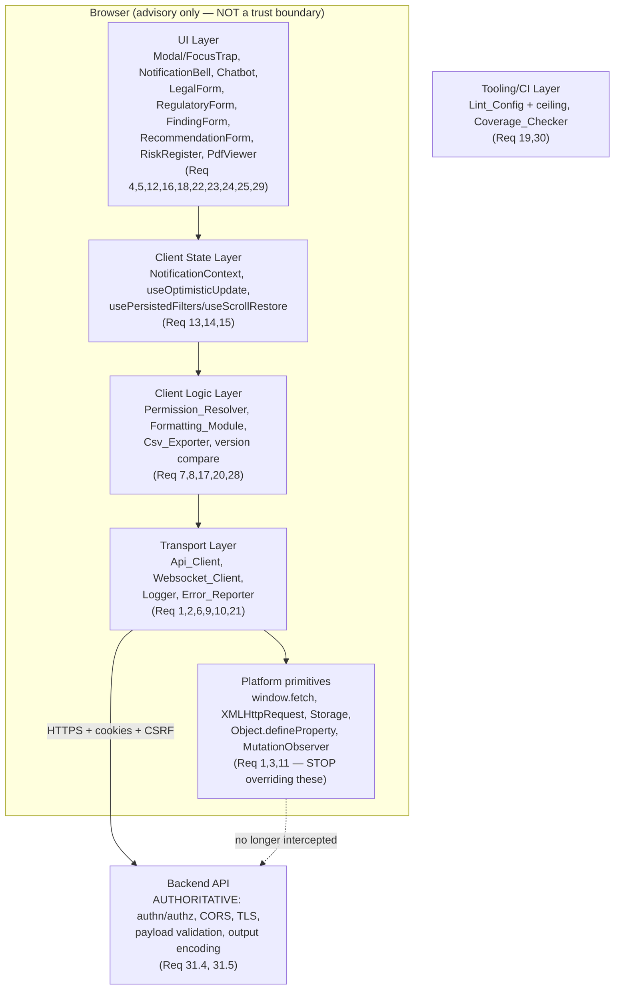

# Design Document

## Overview

This design describes how the prioritized code-review findings in the `alsaqi` web monorepo (`apps/web`, React + TypeScript + Vite, with `packages/shared`) are remediated. The work is organized into the same four groups as the requirements: Critical (Req 1–5), Important (Req 6–19), Minor (Req 20–30), and a cross-cutting behavior-preservation constraint (Req 31).

The remediation is fundamentally a **refactor under invariants**, not a green-field feature. Each change must hold three lines simultaneously:

1. **Restore correct browser behavior** by removing client-side machinery that intercepts, blocks, or freezes global platform primitives (`window.fetch`, `XMLHttpRequest`, `Storage.prototype`, `Object.defineProperty`, document-wide `MutationObserver`s). These guards break legitimate cross-origin calls, streaming, third-party libraries, and sessions, while providing no real security because the client is not a trust boundary.
2. **Preserve the authoritative backend boundary.** A guiding principle across all requirements: the Backend remains the single authoritative enforcer of authentication, authorization, origin, transport integrity, and payload validation. Client-side checks are advisory only. No remediation may weaken backend access control, and where a client-side check is removed, the Backend remains the enforcer of the corresponding control (Req 31.4, 31.5).
3. **Harden the genuinely client-owned logic** — CSRF token parsing, the permission fallback set, per-instance token-refresh state, log redaction, optimistic-update rollback, notification state merges, CSV formula neutralization, version comparison, and formatting — where correctness *is* the client's responsibility.

A key architectural observation from reading the codebase: several modules (`permissions/fallback.ts`, `utils/csvExport.ts`, `hooks/useOptimisticUpdate.ts`, `utils/logger.ts`, `utils/errorReporter.ts`) already embody the target patterns and serve as **reference implementations** for the modules still to be remediated. The design leans on these existing patterns for consistency rather than inventing new ones.

### Research notes informing the design

- **Security model.** The four "security" utilities (`SecureNetwork`, `SecureStorage`, `ObjectGuard`, `DOMGuard`) implement client-side controls that are trivially bypassable (an attacker controlling the page controls the JS) and actively harmful: they throw on cross-origin requests, buffer streaming bodies for "integrity" checks, block payloads containing substrings like `<script`, override `Storage.prototype`, freeze `Object.defineProperty`, and run a document-wide `MutationObserver`. The correct posture is **defense at the Backend** (CORS, TLS, server-side validation, output encoding, CSP) with the client doing none of this. This matches OWASP guidance that client-side input filtering is not a security control.
- **CSRF cookie parsing.** Both `api/client.ts` and `utils/errorReporter.ts` extract the token with `row.split('=')[1]`, which truncates at the first `=` — discarding base64 `=` padding. The fix is to split on the *first* `=` only and keep the remainder, then `decodeURIComponent` it. This is the canonical cookie-parse bug.
- **Token-refresh state.** In `api/client.ts`, `isRefreshing` and `refreshSubscribers` are **module-level** variables shared across every `createApiClient` instance. With multiple clients (or tests) this cross-contaminates refresh coordination. The fix moves this state into the factory closure (per instance).
- **React state races.** `NotificationContext` and `useOptimisticUpdate` must use functional updaters (`setState(prev => …)`) so concurrently-arriving WebSocket notifications and overlapping optimistic updates are not clobbered by stale closures. `useOptimisticUpdate` already does this correctly and is the reference pattern.
- **Testing stack.** The project uses **Vitest** (`vitest --run`), **fast-check** for property-based tests (files named `*.property.test.ts`), `axios-mock-adapter` for HTTP, and `vitest-axe` for accessibility assertions. New property tests follow the existing `fc.assert(fc.asyncProperty(...))` convention with ≥100 runs.

## Architecture

The web app is a single-page React application. The remediation touches five horizontal layers. The diagram shows where each requirement group acts and underscores that the Backend is the trust boundary in every case.



### Cross-cutting design principles

- **Remove, don't reroute.** For Req 1, 2, 3, 11, the primary action is deletion of global overrides. Any genuinely useful behavior that is retained is scoped to a specific instance/target rather than applied globally (Req 11.3).
- **Instance scope over module/global scope.** `SecureStorage` exposes instance methods only (Req 3.2); `Api_Client` holds refresh state per instance (Req 9.1). This is the same closure-encapsulation pattern applied in two places.
- **Single source of truth.** Default permissions derive from the `Module_Registry` (Req 8); date/number formatting derives from one `Formatting_Module` (Req 17). Divergent copies are deleted.
- **Independent shippability of Critical group.** Req 1–5 each touch disjoint modules (`SecureNetwork`, `SecureStorage`, two form components, `Modal`/`FocusTrap`) and share no required ordering, satisfying Req 31.6.

## Components and Interfaces

This section describes the target shape of each touched component. Existing public signatures are preserved wherever callers depend on them (Req 31.1–31.3).

### Critical group (Req 1–5)

**Secure_Network_Module (`utils/SecureNetwork.ts`) — Req 1, 2.**
- Stop overriding `window.fetch` (remove the `Object.defineProperty(window, 'fetch', …)` block) and stop overriding `XMLHttpRequest.prototype.open/send`.
- Remove origin allow-listing that throws `"Unauthorized request origin"`, remove request-body substring blocking (`<script`, `onerror=`, `javascript:`), remove response buffering/integrity checks that call `response.clone().text()` (which breaks streaming).
- `initSecureNetwork`/`initInterceptors` become no-ops (or the module is reduced to an empty shim) so existing import sites compile without behavioral interference. Request signing, if retained at all, must not gate or buffer requests.
- Net effect: cross-origin dev→prod requests succeed (Req 1.3), streaming bodies pass through unbuffered (Req 1.4), arbitrary free-text payloads transmit unchanged (Req 2.2). The Backend enforces origin/transport via CORS/TLS and validates payloads (Req 1.5, 2.3).

**Secure_Storage_Module (`utils/SecureStorage.ts`) — Req 3.**
- Remove `initProtection()` entirely so `Storage.prototype.getItem/setItem/removeItem` are never overridden (Req 3.1). Secure behavior is exposed only through the instance `get`/`set`/`clearSession` methods (Req 3.2).
- On HMAC/decrypt failure, `get` returns a failure to the caller (e.g. `null`) and does **not** call `clearSession()` (Req 3.3). `onTamperDetected` no longer triggers session clearing.
- Derive the encryption/HMAC key from a stable base (e.g. `VITE_STORAGE_SECRET` and origin) that **excludes** `navigator.userAgent` (Req 3.4), so a browser update preserves the session (Req 3.5).

**LegalForm / RegulatoryForm (`components/.../LegalForm.tsx`, `RegulatoryForm.tsx`) — Req 4.**
- Adopt the submission-error pattern already used by `AuditTaskForm`: a local `isSubmitting` state guards the submit control, a `try/catch/finally` wraps the save call, failures surface `Submit_Error_Feedback` (toast) and clear `isSubmitting` in `finally` so the user can retry (Req 4.1, 4.2, 4.5). While submitting, the submit control is disabled and re-submission is prevented (Req 4.3, 4.4).

**Modal / FocusTrap (`components/Modal.tsx`, FocusTrap) — Req 5.**
- Capture the trigger element (`document.activeElement`) when the trap mounts. Restore focus to it **inside the effect cleanup** (so restoration runs before the trapped subtree unmounts) (Req 5.1, 5.2).
- If the original trigger is no longer in the document at cleanup time, move focus to a defined fallback (e.g. `document.body` or a designated app root) without throwing (Req 5.3).

### Important group (Req 6–19)

**Api_Client (`api/client.ts`) — Req 6, 9, 20.**
- `getCsrfToken()` parses the cookie by locating the first `=` and preserving the remainder (`row.slice(row.indexOf('=') + 1)`), then applies `decodeURIComponent` (Req 6.1, 6.3, 6.4).
- Token-refresh state (`isRefreshing`, `refreshSubscribers`) moves **inside `createApiClient`** as closure-local variables, so each instance is isolated (Req 9.1, 9.4). The retried-after-refresh marker (`__isRetryAfterRefresh`) continues to prevent re-entering the refresh branch (Req 9.2, 9.3).
- `isMajorMinorMatch` guards against `NaN`: if any parsed operand is `NaN`, treat as a non-mismatch (return `true`) so the reload overlay is not forced on malformed input (Req 20.1, 20.2). Equal valid major/minor reports a match (Req 20.3).

**Error_Reporter (`utils/errorReporter.ts`) — Req 6.** `getCsrfToken()` uses the same first-`=` preserving parse (Req 6.2). (Note: redaction in this module overlaps with Logger, Req 10.)

**Permission_Resolver (`permissions/fallback.ts`, `permissions/modules.ts`, `permissions.ts`) — Req 7, 8.**
- Fallback is the intersection of `READ_ONLY_PERMISSION_SET` (or static role defaults) with the role's static defaults, never widening beyond static defaults (Req 7.1, 7.2). `computeFallback`/`intersect` in `fallback.ts` already implement subset semantics and are the reference. A low-privilege role is denied `UserManagement`/`SystemLogs` during a cache outage (Req 7.3); the Backend remains authoritative (Req 7.4).
- Default permissions are **derived** from the `Module_Registry` `defaults` rather than duplicated in `permissions.ts`, so the two cannot diverge (Req 8.1, 8.4). The resolver never grants an action a module's registry entry does not list (Req 8.2). `Analytics` and `Policies` are present in the registry (Req 8.3 — both already registered in `modules.ts`).

**Logger (`utils/logger.ts`, `utils/SecurityLogger.ts`) — Req 10.**
- Before forwarding to the Backend, apply an **allowlist/redaction** to caller-supplied `context`: only allowlisted keys pass; non-allowlisted keys are excluded or redacted (Req 10.1, 10.4).
- When forwarding the current location, strip the query string (use `location.pathname` only), so query-string tokens in `window.location.href` are never transmitted (Req 10.2, 10.3).

**Object_Guard_Module / DOM_Guard_Module (`utils/ObjectGuard.ts`, `utils/DOMGuard.ts`) — Req 11.**
- `ObjectGuard` stops permanently overriding and freezing `Object.defineProperty` process-wide (Req 11.1); third-party libraries that call `Object.defineProperty` initialize without error (Req 11.4).
- `DOMGuard` stops running a document-wide `MutationObserver` for keylogger detection via handler `toString()` inspection (Req 11.2).
- Any retained guard is narrowly scoped to a defined target, not global (Req 11.3). In practice both modules reduce to no-op shims or are removed from the init path.

**App lazy routes (`App.tsx`) + ModuleErrorBoundary — Req 12.** Every lazy-loaded route is wrapped in a `ModuleErrorBoundary` so a render error in Dashboard, AuditTasks, Recommendations, RiskRegister, OrgStructure, Notifications, Settings, AuditEvidence, AuditCharter, or AuditProgramLibrary is contained to that route while the shell and other routes keep working (Req 12.1–12.3).

**Notification_Context (`context/NotificationContext.tsx`) — Req 13.** `markAsRead` and `deleteNotification` compute next state via functional updaters (`setNotifications(prev => …)`) reading the latest state, so a WebSocket notification arriving during an awaited operation is retained (Req 13.1–13.3).

**Optimistic_Update_Hook (`hooks/useOptimisticUpdate.ts`) — Req 14.** Already implements live-state functional revert via `revertItem(currentList)` and never restores a stale full snapshot — this is the reference pattern (Req 14.1–14.3). Design verifies callers pass per-item inverters rather than snapshots.

**Persisted_Filters_Hook `useScrollRestore` (`hooks/usePersistedFilters.ts`) — Req 15.** Replace the document-wide `MutationObserver({subtree:true})` with observation of a defined target element (or a `ResizeObserver` tied to it) (Req 15.1, 15.2). Effect cleanup removes all observers/listeners (Req 15.3) and re-renders do not accumulate duplicate scroll listeners (Req 15.4).

**FindingForm / RecommendationForm — Req 16.** Define the validation schema **inside** the component using `t(...)` for messages (Req 16.1, 16.2), surface `Submit_Error_Feedback` on failure (Req 16.3), and follow the `AuditTaskForm` submission-error pattern (Req 16.4).

**Formatting_Module — Req 17.** Introduce one canonical formatting module replacing `format.ts`, `formatService.ts`, and the formatting parts of `i18n.ts`, using a single canonical Arabic locale for all date/number formatting (Req 17.1–17.4). Divergent implementations are removed.

**NotificationBell / Chatbot — Req 18.** Notification rows become elements with a button role, keyboard focusability, and keyboard activation; Escape closes an open list/popover (Req 18.1, 18.2). Icon-only Chatbot buttons get accessible labels (Req 18.3). All are exposed to assistive tech with role/label (Req 18.4).

**Lint_Config (`eslint.config.js`, `.lint-ceiling.json`) — Req 19.** `npm run lint` enforces a max warning count; exceeding the ceiling exits non-zero (Req 19.1, 19.2). The ceiling is reduced below 497 and lowered to the new count after warnings are reduced (Req 19.3, 19.4).

### Minor group (Req 20–30)

- **Websocket_Client (`api/ws/websocket-client.ts`) — Req 21.** A null `getToken()` during connect schedules a reconnect/fallback instead of staying disconnected (Req 21.1); connection re-establishes once the transient failure resolves (Req 21.2); docs describe the cookie/ws-token model, not a `localStorage` example (Req 21.3).
- **Dashboard KPI route — Req 22.** The KPI card that pointed at unregistered `/regulatory` links to a registered route; no card falls through to `/dashboard` due to an undefined target (Req 22.1–22.3).
- **List virtualization — Req 23.** RiskRegister, Recommendations, ComplianceMatrix virtualize large collections (Req 23.1); the cumulative animation stagger delay is capped so it does not scale unbounded with list length (Req 23.2, 23.3).
- **Bulk import — Req 24.** RiskRegister Excel import and AuditPlanForm procedure import use a batch endpoint or `Promise.allSettled`, show progress, present a succeeded/failed summary, and continue past individual failures (Req 24.1–24.4).
- **Pdf_Viewer (`components/PdfViewer.tsx`) — Req 25.** Store the created object URL in a ref; revoke the previous URL on `url` prop change or unmount-before-load; revoke defensively (Req 25.1–25.3).
- **RolePermissions — Req 26.** Use `Module_Registry` identifiers (not legacy `fallbackModules`); render the preview-mode label from a translation key; listed identifiers match the registry (Req 26.1–26.3).
- **Analytics i18n — Req 27.** Add `modules.Analytics` to `en.json` and `ar.json`; the label renders from the active language resource (Req 27.1–27.3).
- **Csv_Exporter (`utils/csvExport.ts`) — Req 28.** Add leading tab (`\t`) and carriage return (`\r`) to `FORMULA_TRIGGERS`; neutralize values starting with a trigger; keep quoting fields (Req 28.1–28.3). The current `neutralizeCell` already prefixes `'` and doubles quotes; only the trigger set expands.
- **Strong typing — Req 29.** Replace `any` in NotificationBell, AuditTaskForm, RiskRegister import-mapping, and Chatbot with explicit types; typecheck passes without new errors (Req 29.1–29.5).
- **Coverage_Checker (`scripts/check-coverage-thresholds.mjs`) — Req 30.** Add `csvExport.ts`, the PDF export file, and the DOCX export file to `PER_FILE_TARGETS` at the 90% tier; falling below fails the check (Req 30.1–30.3).

### Cross-cutting (Req 31)

All changes keep typecheck, lint (within ceiling), and the Vitest suites (including existing property tests) passing; do not weaken backend access control; keep the Backend authoritative wherever a client check is relaxed; and keep Req 1–5 independently shippable.

## Data Models

Most remediation operates on existing structures. The data models that the correctness properties depend on are:

**Cookie string → CSRF token (Req 6).**
```
Cookie row:    "csrf-token=<value>"  where <value> may contain '=' padding and URL-encoding
Parse rule:    token = decodeURIComponent(row.slice(row.indexOf('=') + 1))
Invariant:     parse("csrf-token=" + raw) preserves every character of raw after the first '='
```

**Permission set (existing `permissions/types.ts`).**
```
UserPermissionSet {
  userId, role, roleId, isCustomRole
  permissions: Record<ModuleName, PermissionAction[]>   // action ∈ {View,Create,Edit,Delete,Approve}
  overrides: []
}
Fallback invariant: computeFallback(confirmed, staticDefaults) ⊆ staticDefaults  (subset, never widens)
```

**Module registry entry (existing `permissions/modules.ts`).**
```
ModuleDefinition { name, label{en,ar}, actions: PermissionAction[], defaults: Record<UserRole, PermissionAction[]>, navigation?, fileScope? }
Derivation invariant: DEFAULT_PERMISSIONS[role][module] ⊆ registry[module].actions  (no action outside registry)
```

**Version comparison (Req 20).**
```
isMajorMinorMatch(client, server):
  parse "major.minor.*" → numbers
  if any NaN → return true (treat as non-mismatch)
  else → (cMajor===sMajor && cMinor===sMinor)
```

**CSV field (Req 28).**
```
FORMULA_TRIGGERS = ['=', '+', '-', '@', '\t', '\r']
neutralizeCell(v): if v[0] ∈ FORMULA_TRIGGERS → "'" + v ; then v.replace(/"/g,'""')
toCsvField(v): '"' + neutralizeCell(String(v ?? '')) + '"'
Round-trip invariant: parseCsv(buildCsv(headers, rows)) recovers headers/rows (modulo neutralizing prefix)
```

**Structured log entry (Req 10).**
```
Forwarded entry: { level, message, timestamp, module, correlationId, context: <allowlisted-only>, routePath: <pathname without query> }
Redaction invariant: forwarded context contains only allowlisted keys; location has no query string
```

**Notification state (Req 13).**
```
Notification[] updated via setNotifications(prev => f(prev))
Merge invariant: a notification appended during an awaited markAsRead/deleteNotification survives in the next state
```

## Correctness Properties

*A property is a characteristic or behavior that should hold true across all valid executions of a system — essentially, a formal statement about what the system should do. Properties serve as the bridge between human-readable specifications and machine-verifiable correctness guarantees.*

These universal guarantees cover this feature's **client-owned pure logic** — cookie parsing, permission set algebra, version comparison, CSV neutralization, log redaction, and concurrency-safe state merges. They do **not** cover the UI composition, accessibility, routing, lazy-boundary, virtualization, tooling, and "stop overriding a global" requirements; those are validated by example, edge-case, smoke, and integration tests in the Testing Strategy. The list below was derived from the prework analysis and consolidated to remove redundancy.

Each one is implemented by a single property-based test running at least 100 iterations with fast-check, tagged `Feature: code-review-remediation, Property {n}: {text}`.

### Property 1: Outgoing payloads are transmitted unchanged and never pattern-blocked

*For any* request body string — including strings containing previously-blocked substrings such as `<script`, `onerror=`, or `javascript:` — the transport layer transmits the body byte-for-byte identical to the input and never rejects the request for payload-pattern reasons.

**Validates: Requirements 2.1, 2.2**

### Property 2: CSRF token parse preserves the full value and round-trips encoding

*For any* token value (including base64 `=` padding and URL-encoded characters), parsing the cookie row `"csrf-token=" + encoded(value)` yields exactly the original value (all characters after the first `=` preserved, then `decodeURIComponent` applied), and the value attached to the outgoing request header equals the original token. The same contract holds for both `Api_Client` and `Error_Reporter`.

**Validates: Requirements 6.1, 6.2, 6.3, 6.4**

### Property 3: Secure storage key derivation is independent of the user agent

*For any* two `navigator.userAgent` values, the storage encryption/HMAC key base derived by `Secure_Storage_Module` is identical; consequently, a value written under one user agent is read back unchanged after the user agent changes.

**Validates: Requirements 3.4, 3.5**

### Property 4: Decryption/HMAC failure is reported without clearing the session

*For any* stored ciphertext that fails HMAC verification or decryption, `Secure_Storage_Module.get` reports failure to the caller (returns `null`) and never invokes `clearSession()`.

**Validates: Requirements 3.3**

### Property 5: Fallback permissions never widen beyond static role defaults

*For any* confirmed permission set and static role defaults, the computed fallback set equals the element-wise intersection of the two and is therefore a subset of the static defaults — it grants no `(module, action)` pair that the static defaults do not contain (so low-privilege roles are denied admin modules like `UserManagement`/`SystemLogs` during a cache outage).

**Validates: Requirements 7.1, 7.2, 7.3**

### Property 6: Default permissions are consistent with the module registry

*For any* role and module, the derived default permission set equals the registry's declared defaults for that role and contains only actions that the module's registry entry lists as valid (granted actions ⊆ registry actions). There is a single derived source, so no second list can diverge.

**Validates: Requirements 8.1, 8.2, 8.4**

### Property 7: Token-refresh state is isolated per client instance

*For any* set of two or more `Api_Client` instances, driving a 401-triggered token refresh on one instance does not change the refresh-in-progress flag, queued subscribers, or version-mismatch state of any other instance.

**Validates: Requirements 9.1, 9.4**

### Property 8: Single-refresh safety with no infinite loop

*For any* sequence of requests where the first response is 401 and `/auth/refresh` succeeds, the original request is retried exactly once, exactly one refresh occurs per 401 wave, and the post-refresh retry marker prevents re-entering the refresh branch even if the retried request also returns 401.

**Validates: Requirements 9.2, 9.3**

### Property 9: Forwarded log context contains only allowlisted keys

*For any* caller-supplied context object, the context forwarded to the Backend contains only keys present in the allowlist; every non-allowlisted key is excluded or redacted.

**Validates: Requirements 10.1, 10.4**

### Property 10: Forwarded location never includes the query string

*For any* `window.location.href` value (including ones carrying query-string tokens), the location forwarded by the Logger excludes the query string entirely, so no query-string token is transmitted.

**Validates: Requirements 10.2, 10.3**

### Property 11: Concurrently-arriving notifications are retained

*For any* notification list and any notification that arrives during an awaited `markAsRead` or `deleteNotification` operation, the arriving notification is present in the resulting state (because the update is computed with a functional updater reading the latest previous state).

**Validates: Requirements 13.1, 13.2, 13.3**

### Property 12: Optimistic rollback preserves concurrent updates

*For any* two optimistic updates where a second update is applied before the first update's rollback runs, rolling back the failed first update preserves the second update's change — the revert is applied against the live state via a functional setter and never restores a pre-concurrency snapshot.

**Validates: Requirements 14.1, 14.2, 14.3**

### Property 13: Version comparison tolerates malformed input and matches equal major.minor

*For any* pair of version strings: if either parses to `NaN` in its major or minor component, `isMajorMinorMatch` returns `true` (treated as a non-mismatch, so no reload is forced); and *for any* two valid versions whose major and minor components are equal (regardless of patch), it returns `true`.

**Validates: Requirements 20.1, 20.2, 20.3**

### Property 14: Animation stagger delay is bounded

*For any* list length and any item index, the computed cumulative animation stagger delay does not exceed the configured cap — it never scales unbounded with list length.

**Validates: Requirements 23.2, 23.3**

### Property 15: Bulk import partitions outcomes and processes every record

*For any* sequence of per-record success/failure outcomes, the bulk import (using `Promise.allSettled` or a batch endpoint) attempts every record despite individual failures, and the resulting summary's succeeded/failed partition exactly matches the actual outcomes.

**Validates: Requirements 24.3, 24.4**

### Property 16: PDF viewer never leaks object URLs

*For any* sequence of `url`-prop changes and unmount events, the number of `URL.revokeObjectURL` calls equals the number of `URL.createObjectURL` calls — every created object URL is eventually revoked, including when the component unmounts before a load completes.

**Validates: Requirements 25.2, 25.3**

### Property 17: CSV cells beginning with a formula trigger are neutralized

*For any* cell value whose first character is a formula-trigger character — `=`, `+`, `-`, `@`, tab (`\t`), or carriage return (`\r`) — `neutralizeCell` prefixes a single quote so spreadsheet software cannot interpret it as a formula.

**Validates: Requirements 28.1, 28.2**

### Property 18: CSV serialization round-trips

*For any* header row and matrix of field values, parsing the document produced by `buildCsv` recovers the original headers and rows (modulo the single-quote neutralizing prefix), and every field is quoted.

**Validates: Requirements 28.3**

### Property 19: Date and number formatting uses one canonical locale

*For any* date or number, the value produced by the `Formatting_Module` equals the output of the canonical Arabic locale's `Intl` formatter, so formatting is consistent everywhere it is applied.

**Validates: Requirements 17.2, 17.4**

## Error Handling

The remediation generally *removes* error-raising machinery and replaces silent failures with surfaced, recoverable feedback. Specific handling:

- **Transport (Req 1, 2).** The transport layer no longer throws `"Unauthorized request origin"`, `"Request payload blocked"`, `"XHR Content blocked"`, or `"Response integrity check failed"`. Genuine network/HTTP errors continue to flow through the existing `Api_Client` retry + `onError` path. Origin/transport/payload enforcement is the Backend's responsibility (CORS, TLS, validation) (Req 1.5, 2.3).
- **Secure storage (Req 3).** Decryption/HMAC failures return `null` to the caller (caller decides how to proceed) instead of clearing the session. No `Storage.prototype` override means no swallowed or hijacked storage errors.
- **Form submissions (Req 4, 16).** Failures are caught in `try/catch`, surfaced via `Submit_Error_Feedback` (toast), and `isSubmitting` is reset in `finally` so the user can retry without a duplicate-submit window. This mirrors `AuditTaskForm`.
- **Focus restoration (Req 5).** If the trigger element is gone at cleanup, focus moves to a defined fallback inside a guard so no error is thrown.
- **Lazy routes (Req 12).** `ModuleErrorBoundary` catches render errors per route, shows a contained fallback, reports via `Error_Reporter`, and keeps the shell/other routes alive.
- **Logger/Error_Reporter (Req 10).** Redaction/allowlisting happens before transmission; forwarding remains fire-and-forget and never throws to the caller. Query strings are stripped so tokens are never leaked even on the error path.
- **WebSocket (Req 21).** A null token during connect schedules a reconnect/fallback rather than entering a permanent disconnected state; connectivity resumes when the token becomes available.
- **Version comparison (Req 20).** Malformed version strings (NaN) are treated as a non-mismatch so users are never interrupted by spurious reload overlays.
- **Bulk import (Req 24).** `Promise.allSettled` ensures one record's failure does not abort the batch; the summary reports the failed records for retry.
- **Object-URL lifecycle (Req 25).** Revocation runs in cleanup/`finally` so URLs are released even when a load is interrupted.

## Testing Strategy

The project uses **Vitest** (`npm test` → `vitest --run`), **fast-check** for property-based tests (`*.property.test.ts`), `axios-mock-adapter` for HTTP simulation, and `vitest-axe` for accessibility assertions. The strategy is dual: property tests for universal client-logic guarantees, and example/edge/integration/smoke tests for everything else.

### Property-based tests

- Implement each of the 19 correctness properties above with a single fast-check property test, configured for **≥100 runs** (`fc.assert(fc.property/asyncProperty(...), { numRuns: 100 })`).
- Tag each test with a comment: `Feature: code-review-remediation, Property {n}: {property text}`.
- Reuse existing generators/patterns where present (e.g. the existing `client.single-refresh.property.test.ts` for Property 8, `permissions/fallback` tests for Property 5, `csvExport` round-trip for Property 18).
- Do not hand-roll PBT infrastructure; use fast-check arbitraries (`fc.string`, `fc.record`, `fc.array`, `fc.integer`, `fc.constantFrom`, etc.).

### Example-based unit tests

Cover the specific, non-universal behaviors and edge cases:
- Form submit feedback and `isSubmitting` disable/clear (Req 4.1–4.5, 16.3); double-submit prevention edge case (Req 4.4).
- Modal/FocusTrap focus restoration and missing-trigger fallback (Req 5.1–5.3).
- Cross-origin request success and streaming pass-through (Req 1.3, 1.4).
- Third-party `Object.defineProperty` initializes without error (Req 11.4); retained guards scoped to a target (Req 11.3).
- KPI route target is registered (Req 22); Analytics i18n keys present and rendered (Req 27); RolePermissions identifiers/labels (Req 26).
- WebSocket reconnect on null token and recovery (Req 21.1, 21.2).
- `useScrollRestore` target observation, cleanup, no duplicate listeners (Req 15.2–15.4).
- Bulk-import progress and mechanism (Req 24.1, 24.2); virtualization bounds DOM rows (Req 23.1); PDF URL stored in ref (Req 25.1).

### Accessibility tests (vitest-axe)

- NotificationBell rows (role/focus/keyboard/Escape) and Chatbot labeled icon buttons (Req 18.1–18.4), asserting no axe violations.

### Integration tests

- ModuleErrorBoundary containment: render a route component that throws and assert the shell and a sibling route remain operational (Req 12.1–12.3).
- Lint ratchet: run `scripts/lint-ratchet.mjs`/`check-bundle-budget` style scripts with warning counts above and below the ceiling and assert exit codes (Req 19.1, 19.2).
- Coverage checker: feed coverage data below the 90% per-file tier for an export file and assert a non-zero exit (Req 30.1–30.3).

### Smoke tests (single execution)

- Global primitives are NOT overridden after init: native `window.fetch`, native `XMLHttpRequest.prototype` methods, native `Storage.prototype` methods, writable/configurable `Object.defineProperty`, and no document-wide `MutationObserver.observe` call (Req 1.1, 1.2, 3.1, 11.1, 11.2, 15.1).
- Lint ceiling value `< 497` and equal to the current warning count (Req 19.3, 19.4).
- WebSocket docs reference the cookie/ws-token model (Req 21.3); formatting old modules removed/re-export canonical (Req 17.3).

### Cross-cutting verification (Req 31)

Run as CI gates after every change:
- `tsc --noEmit` typecheck passes, with no `any` remaining in the Req 29 modules (Req 29.5, 31.1).
- `npm run lint` passes within the configured ceiling (Req 31.2).
- `vitest --run` passes, including all existing property tests (Req 31.3).
- Manual/architectural review confirms no client check is the sole enforcement of an access control and the Backend remains authoritative (Req 31.4, 31.5), and that Req 1–5 changes touch disjoint modules so they remain independently shippable (Req 31.6).
