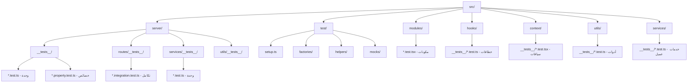
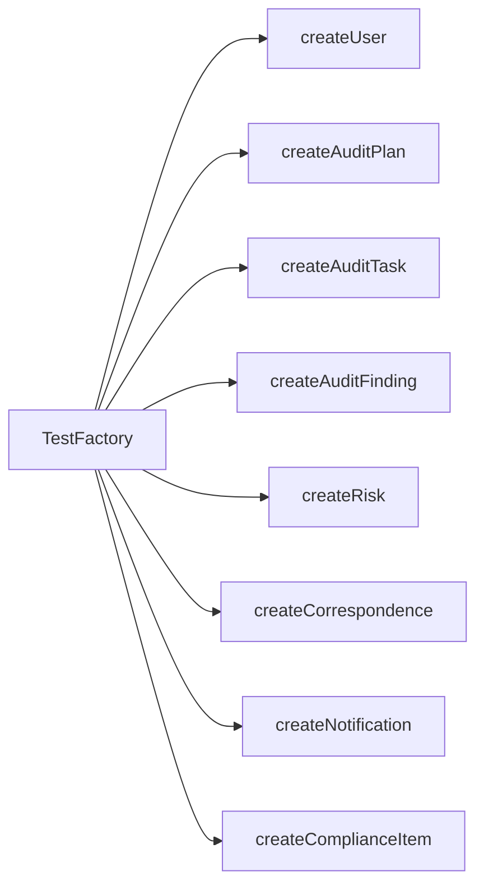
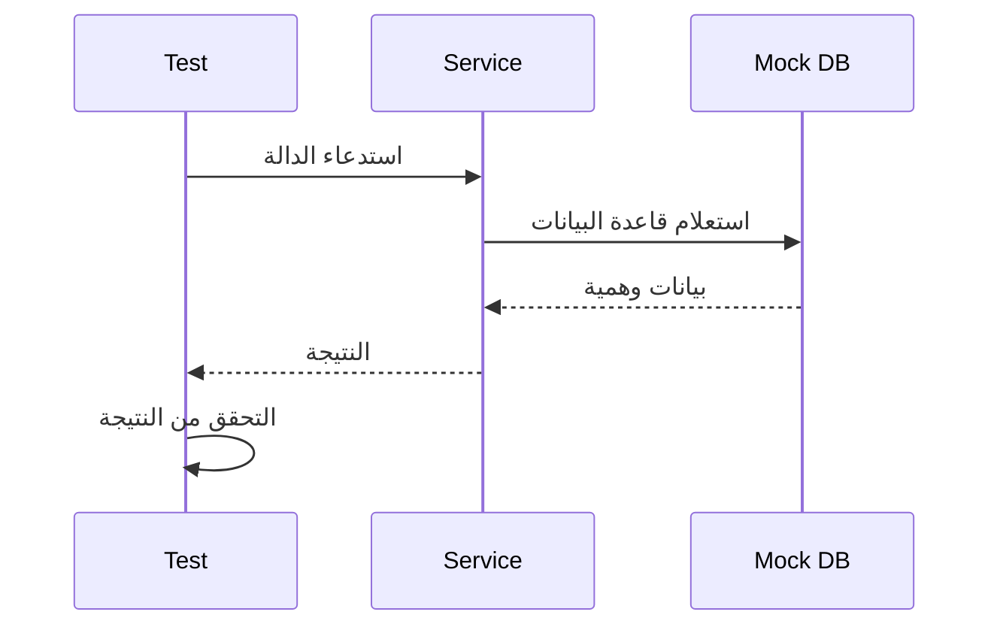
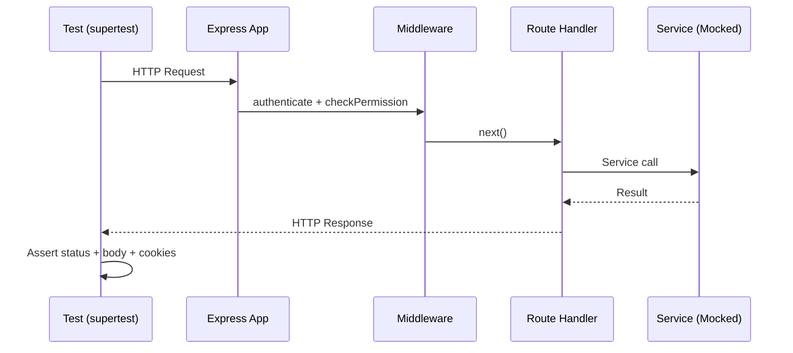
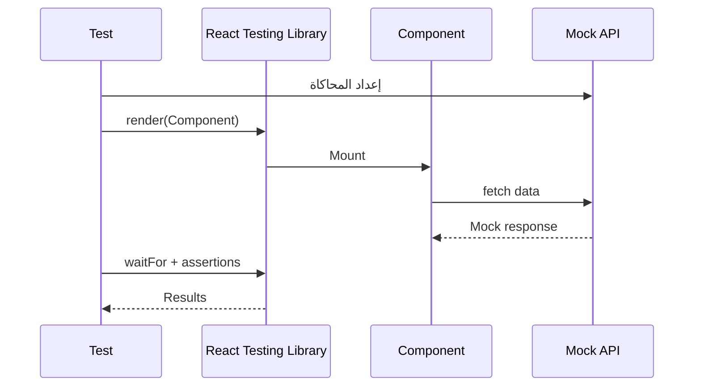

# Design Document: Comprehensive Testing

## Overview

تصف هذه الوثيقة التصميم التقني لمجموعة اختبارات شاملة لنظام إدارة التدقيق الداخلي AL-SAQI. يغطي التصميم بنية الاختبارات، البنية التحتية المشتركة، استراتيجيات اختبار الخادم والعميل، وإدارة بيانات الاختبار. يستخدم المشروع Vitest كإطار اختبار مع React Testing Library للمكونات، fast-check لاختبارات الخصائص، و supertest لاختبارات التكامل.

الهدف هو الانتقال من التغطية الحالية المحدودة (15 اختبار) إلى تغطية شاملة تشمل جميع الخدمات (32 خدمة)، المسارات (28 مسار)، المكونات (20+ وحدة)، والأدوات المساعدة.

## Architecture



### اصطلاحات التسمية

| النوع | النمط | المثال |
|-------|-------|--------|
| اختبار وحدة خادم | `src/server/__tests__/{service}.test.ts` | `auth.test.ts` |
| اختبار خصائص خادم | `src/server/__tests__/{feature}.property.test.ts` | `csrf.property.test.ts` |
| اختبار تكامل | `src/server/routes/__tests__/{route}.integration.test.ts` | `auth.integration.test.ts` |
| اختبار مكون | `src/modules/{Module}.test.tsx` | `AuditPlan.test.tsx` |
| اختبار خطاف | `src/hooks/__tests__/{hook}.test.ts` | `usePermissions.test.ts` |
| اختبار سياق | `src/context/__tests__/{context}.test.tsx` | `AuthContext.test.tsx` |
| اختبار أداة عميل | `src/utils/__tests__/{util}.test.ts` | `CryptoUtils.test.ts` |
| اختبار خدمة عميل | `src/services/__tests__/{service}.test.ts` | `api.test.ts` |

### بيئات التشغيل

```typescript
// اختبارات الخادم - بيئة Node
// @vitest-environment node

// اختبارات العميل - بيئة jsdom
// @vitest-environment jsdom
```

## Components and Interfaces

### مصنع بيانات الاختبار (Test Factories)



```typescript
// src/test/factories/index.ts
import { v4 as uuid } from 'uuid';

export interface UserFactory {
  id: string;
  username: string;
  email: string;
  password: string;
  role: 'Admin' | 'Auditor' | 'Manager' | 'Viewer' | 'Compliance' | 'Staff';
  name: string;
  status: 'Active' | 'Suspended' | 'Archived';
  failed_attempts: number;
  locked_until: string | null;
  session_version: number;
  requires_password_change: boolean;
  password_last_changed: string;
}

export function createUser(overrides?: Partial<UserFactory>): UserFactory {
  return {
    id: uuid(),
    username: `user_${Date.now()}`,
    email: `user_${Date.now()}@test.com`,
    password: '$2a$10$hashedpassword',
    role: 'Auditor',
    name: 'Test User',
    status: 'Active',
    failed_attempts: 0,
    locked_until: null,
    session_version: 1,
    requires_password_change: false,
    password_last_changed: new Date().toISOString(),
    ...overrides,
  };
}

export function createAuditPlan(overrides?: Partial<any>) {
  return {
    id: uuid(),
    plan_code: `IA-PL-${new Date().getFullYear().toString().slice(-2)}-001`,
    title: 'خطة تدقيق اختبارية',
    department: 'Internal Audit',
    type: 'Financial',
    risk_rating: 'High',
    status: 'Draft',
    lead_auditor: uuid(),
    planned_start_date: new Date().toISOString(),
    planned_end_date: new Date(Date.now() + 30 * 86400000).toISOString(),
    ...overrides,
  };
}

export function createAuditTask(overrides?: Partial<any>) {
  return {
    id: uuid(),
    task_number: `IA-TSK-${new Date().getFullYear().toString().slice(-2)}-001`,
    title: 'مهمة تدقيق اختبارية',
    plan_id: uuid(),
    status: 'draft',
    assigned_to: uuid(),
    audit_type: 'Financial',
    ...overrides,
  };
}

export function createNotification(overrides?: Partial<any>) {
  return {
    id: uuid(),
    type: 'record_created',
    message: JSON.stringify({ key: 'notifications.newRecord', params: { module: 'audit_plans' } }),
    module: 'AuditPlans',
    link: '/audit-plans',
    created_at: new Date().toISOString(),
    ...overrides,
  };
}
```

### أدوات مساعدة مشتركة

```typescript
// src/test/helpers/server.ts
import express from 'express';
import cookieParser from 'cookie-parser';
import { vi } from 'vitest';

export function createTestApp(options?: { authenticate?: boolean; role?: string }) {
  const app = express();
  app.use(express.json());
  app.use(cookieParser());

  // وسيط مصادقة وهمي
  const authenticate = (req: any, res: any, next: any) => {
    if (options?.authenticate === false) {
      return res.status(401).json({ error: 'Unauthorized' });
    }
    const authHeader = req.headers.authorization;
    if (!authHeader?.startsWith('Bearer ')) {
      return res.status(401).json({ error: 'Unauthorized' });
    }
    req.user = {
      id: 'test-user-id',
      role: options?.role || 'Admin',
      username: 'testuser',
      name: 'Test User',
      email: 'test@example.com',
    };
    next();
  };

  const checkPermission = (module: string, action: string) => (req: any, res: any, next: any) => {
    if (req.user?.role === 'Admin') return next();
    // يمكن تخصيص منطق الصلاحيات هنا
    next();
  };

  return { app, authenticate, checkPermission };
}

// src/test/helpers/db.ts
export function createMockDb() {
  const mockGet = vi.fn();
  const mockAll = vi.fn();
  const mockRun = vi.fn().mockResolvedValue({ lastInsertRowid: 1, changes: 1 });

  return {
    prepare: vi.fn().mockReturnValue({ get: mockGet, all: mockAll, run: mockRun }),
    transaction: vi.fn((fn: Function) => async (...args: any[]) => fn(...args)),
    validateIdentifier: vi.fn((name: string) => {
      if (!/^[a-zA-Z_][a-zA-Z0-9_]*$/.test(name)) {
        throw new Error(`Invalid identifier: ${name}`);
      }
      return `"${name}"`;
    }),
    mockGet,
    mockAll,
    mockRun,
  };
}

// src/test/helpers/render.tsx
import React from 'react';
import { render, RenderOptions } from '@testing-library/react';
import { AppProvider } from '../../context/AppContext';

export function renderWithProviders(
  ui: React.ReactElement,
  options?: RenderOptions & { user?: any; preferences?: any }
) {
  function Wrapper({ children }: { children: React.ReactNode }) {
    return <AppProvider>{children}</AppProvider>;
  }
  return render(ui, { wrapper: Wrapper, ...options });
}
```

### مولدات fast-check المخصصة

```typescript
// src/test/helpers/arbitraries.ts
import fc from 'fast-check';

// مولد مستخدم عشوائي
export const userArb = fc.record({
  id: fc.uuid(),
  username: fc.stringMatching(/^[a-z][a-z0-9_]{3,20}$/),
  email: fc.emailAddress(),
  role: fc.constantFrom('Admin', 'Auditor', 'Manager', 'Viewer', 'Compliance', 'Staff'),
  name: fc.string({ minLength: 2, maxLength: 50 }),
  status: fc.constantFrom('Active', 'Suspended', 'Archived'),
  failed_attempts: fc.integer({ min: 0, max: 10 }),
  session_version: fc.integer({ min: 1, max: 100 }),
});

// مولد أسماء جداول صالحة
export const validTableNameArb = fc.constantFrom(
  'audit_plans', 'audit_tasks', 'audit_programs', 'audit_findings',
  'risk_register', 'recommendations', 'compliance_items', 'fraud_log'
);

// مولد أسماء أعمدة صالحة
export const validColumnNameArb = fc.stringMatching(/^[a-z][a-z0-9_]{1,30}$/);

// مولد أسماء أعمدة خبيثة (SQL injection)
export const maliciousColumnNameArb = fc.oneof(
  fc.constant("id; DROP TABLE users--"),
  fc.constant("name' OR '1'='1"),
  fc.constant("col\"; DELETE FROM audit_trail;--"),
  fc.stringMatching(/^[a-z]+[;'"\\]/)
);

// مولد حالات مهام التدقيق
export const auditTaskStatusArb = fc.constantFrom(
  'draft', 'in_progress', 'review', 'approved', 'completed', 'cancelled'
);

// مولد حالات الامتثال
export const complianceStatusArb = fc.constantFrom(
  'Compliant', 'Non-Compliant', 'Partially Compliant', 'Under Review', 'Not Applicable'
);
```

## Data Models

### اختبارات الوحدة



**النمط المتبع:**
1. محاكاة قاعدة البيانات باستخدام `vi.mock('../db/index')`
2. محاكاة التبعيات الخارجية (bcrypt, jsonwebtoken, crypto)
3. اختبار كل دالة بشكل معزول
4. التحقق من الاستدعاءات والنتائج

### اختبارات التكامل



**النمط المتبع:**
1. إنشاء تطبيق Express مصغر مع الوسيط
2. محاكاة الخدمات (Services) فقط
3. اختبار تدفق HTTP الكامل (request → middleware → handler → response)
4. التحقق من رموز الحالة، الجسم، ملفات تعريف الارتباط

### اختبارات الخصائص (Property-Based)

**النمط المتبع:**
1. تعريف مولدات (Arbitraries) مخصصة للمدخلات
2. تحديد الخاصية المراد إثباتها
3. تشغيل 100+ تكرار مع مدخلات عشوائية
4. استخدام `fc.pre()` لتصفية المدخلات غير المناسبة

## استراتيجية اختبار العميل (Frontend)

### اختبارات المكونات



**النمط المتبع:**
1. محاكاة `src/services/api.ts` باستخدام `vi.mock`
2. عرض المكون باستخدام `render()` أو `renderWithProviders()`
3. انتظار تحميل البيانات باستخدام `waitFor()`
4. التحقق من العناصر المعروضة والتفاعلات

### اختبارات الخطافات

```typescript
// نمط اختبار الخطافات باستخدام renderHook
import { renderHook, act } from '@testing-library/react';

it('should debounce value', async () => {
  const { result } = renderHook(() => useDebounce('test', 300));
  // التحقق من التأخير
});
```

### اختبارات السياقات

```typescript
// نمط اختبار السياقات مع عدادات العرض
function TestConsumer({ renderCount }: { renderCount: React.MutableRefObject<number> }) {
  const value = useContext(MyContext);
  renderCount.current += 1;
  return <div>{value}</div>;
}
```

## Testing Strategy

### ما يتم محاكاته

| الطبقة | ما يُحاكى | السبب |
|--------|-----------|-------|
| اختبارات الخدمات | `db` (قاعدة البيانات) | عزل منطق الأعمال |
| اختبارات التكامل | Services (الخدمات) | اختبار HTTP + Middleware |
| اختبارات المكونات | `api.ts` (Axios) | عزل واجهة المستخدم |
| اختبارات الخطافات | `api.ts` + `localStorage` | عزل المنطق |
| اختبارات السياقات | `api.ts` + `WebSocket` | عزل إدارة الحالة |

### ما لا يتم محاكاته

- منطق الأعمال داخل الخدمات (يُختبر مباشرة)
- Zod schemas (يُختبر التحقق الفعلي)
- Express middleware chain (يُختبر التسلسل الفعلي)
- React hooks logic (يُختبر المنطق الفعلي)

## Correctness Properties

*الخاصية هي سلوك أو خاصية يجب أن تكون صحيحة عبر جميع التنفيذات الصالحة للنظام - بيان رسمي حول ما يجب أن يفعله النظام.*

### Property 1: سلسلة هاش التدقيق غير قابلة للتلاعب

*لأي* تسلسل من سجلات التدقيق، إذا تم تعديل أي حقل في سجل وسيط، فإن إعادة حساب الهاش لجميع السجلات اللاحقة ستكشف عن كسر في السلسلة.

**Validates: Requirements 24.1, 24.2, 24.3, 24.4**

### Property 2: validateIdentifier يرفض جميع محاولات SQL Injection

*لأي* سلسلة نصية تحتوي على أحرف خاصة أو كلمات SQL محجوزة، يجب أن ترفضها دالة `validateIdentifier` أو تهربها بشكل آمن، بينما تقبل جميع الأسماء الصالحة المطابقة لنمط `^[a-zA-Z_][a-zA-Z0-9_]*$`.

**Validates: Requirements 5.6, 13.4, 20.3**

### Property 3: توليد الأكواد ينتج أكواداً فريدة ومتسلسلة

*لأي* جدول يدعم توليد الأكواد، عند استدعاء `generateCode` عدة مرات متتالية، يجب أن تكون جميع الأكواد المولدة فريدة ومتسلسلة وتتبع نمط `{DeptCode}-{DocType}-{YY}-{NNN}`.

**Validates: Requirements 12.1, 12.2**

### Property 4: CSRF يرفض جميع الطلبات المتغيرة بدون رمز صالح

*لأي* طلب HTTP من نوع POST/PUT/PATCH/DELETE لنقطة نهاية غير معفاة، يجب رفضه بحالة 403 إذا كان رمز CSRF مفقوداً أو غير متطابق بين الرأس وملف تعريف الارتباط.

**Validates: Requirements 3.8**

### Property 5: التشفير/فك التشفير round-trip

*لأي* بيانات نصية، عند تشفيرها بواسطة `CryptoUtils.encrypt` ثم فك تشفيرها بواسطة `CryptoUtils.decrypt`، يجب استعادة البيانات الأصلية بالكامل.

**Validates: Requirements 18.1**

### Property 6: SecureStorage round-trip

*لأي* مفتاح وقيمة، عند تخزينها بواسطة `SecureStorage.setItem` ثم استرجاعها بواسطة `SecureStorage.getItem`، يجب استعادة القيمة الأصلية.

**Validates: Requirements 18.3**

### Property 7: مخططات Zod ترفض المدخلات غير الصالحة وتقبل الصالحة

*لأي* بيانات عشوائية لا تطابق مخطط Zod المحدد، يجب أن يرفضها المخطط مع أخطاء تحقق محددة. و*لأي* بيانات صالحة وفق المخطط، يجب قبولها بدون أخطاء.

**Validates: Requirements 13.1, 13.2, 13.3**

### Property 8: صلاحيات Admin تشمل جميع الوحدات

*لأي* وحدة وإجراء في النظام، يجب أن يكون لدور Admin صلاحية الوصول. و*لأي* دور غير Admin، يجب أن تكون صلاحياته مجموعة فرعية من صلاحيات Admin.

**Validates: Requirements 19.2, 19.3**

### Property 9: BaseService.sanitizeBody يحول السلاسل الفارغة لحقول UUID إلى null

*لأي* كائن يحتوي على حقول تنتهي بـ `_id` مع قيم سلاسل فارغة، يجب أن تحولها `sanitizeBody` إلى `null`، بينما تبقي الحقول الأخرى دون تغيير.

**Validates: Requirements 5.5**

### Property 10: DOMGuard يزيل جميع العناصر الخطرة

*لأي* محتوى HTML يحتوي على عناصر `<script>` أو `<iframe>` أو معالجات أحداث (onclick, onerror)، يجب أن يزيلها `DOMGuard` مع الحفاظ على المحتوى النصي الآمن.

**Validates: Requirements 18.2**

### Property 11: انتقالات حالة مهام التدقيق تتبع التسلسل المسموح

*لأي* مهمة تدقيق في حالة معينة، يجب أن تُقبل فقط الانتقالات المسموحة (draft→in_progress→review→approved→completed) وتُرفض أي انتقالات أخرى.

**Validates: Requirements 9.4**

## Error Handling

### أنماط الأخطاء المتوقعة

```typescript
// نمط اختبار الأخطاء المتوقعة
await expect(
  AuthService.login('invalid', 'wrong', secret, key)
).rejects.toThrow('Invalid credentials');

// نمط اختبار رموز حالة HTTP
const res = await request(app).post('/api/auth/login').send({});
expect(res.status).toBe(400);
expect(res.body.error).toBeDefined();
```

## اعتبارات الأداء

- تحديد `numRuns: 100` لاختبارات الخصائص (توازن بين التغطية والسرعة)
- استخدام `vi.clearAllMocks()` في `beforeEach` لمنع تسرب الحالة
- استخدام `unmount()` بعد كل اختبار مكون لتنظيف DOM
- تجنب `setTimeout` الحقيقي واستخدام `vi.useFakeTimers()` عند الحاجة

## التبعيات

| المكتبة | الإصدار | الاستخدام |
|---------|---------|-----------|
| vitest | ^4.1.6 | إطار الاختبار الرئيسي |
| @testing-library/react | ^16.3.2 | اختبار مكونات React |
| @testing-library/jest-dom | ^6.9.1 | matchers إضافية |
| fast-check | ^4.8.0 | اختبارات الخصائص |
| supertest | ^7.2.2 | اختبارات HTTP |
| jsdom | ^29.1.1 | بيئة DOM للاختبارات |
