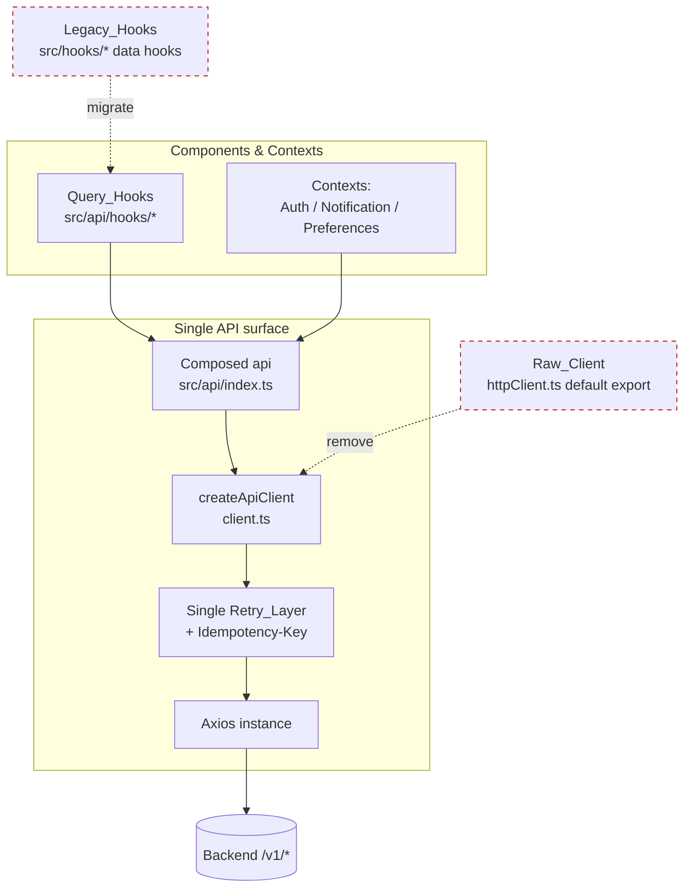
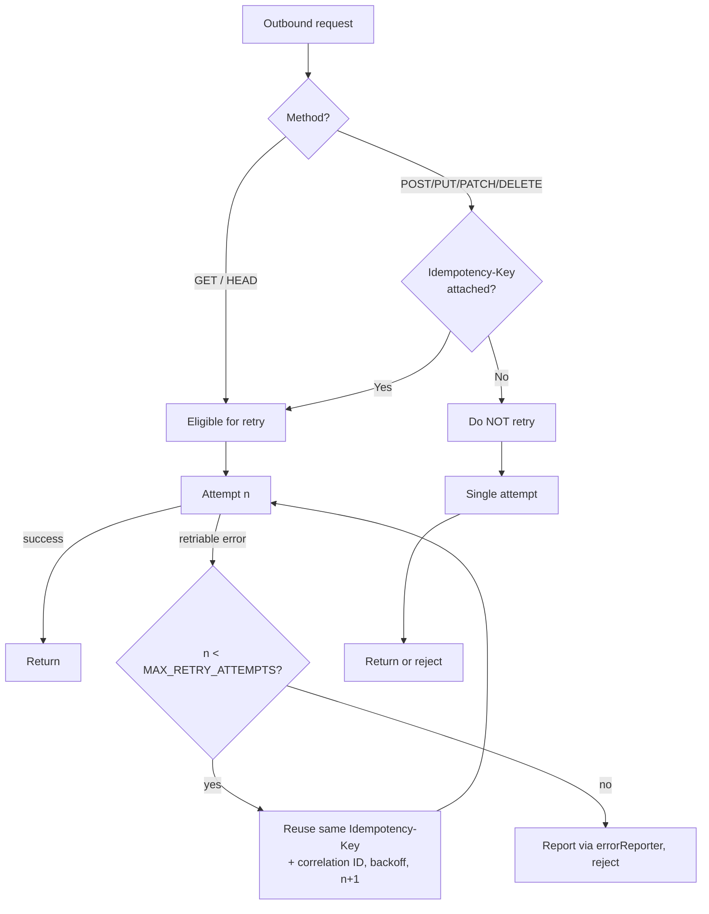
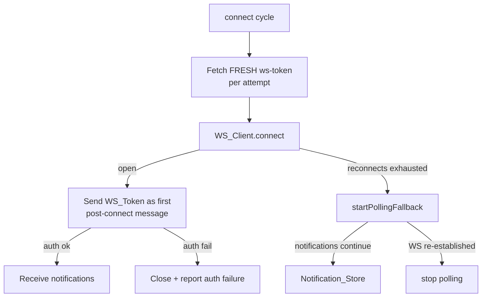

# Design Document

## Overview

This design remediates 28 requirements drawn from a frontend code audit of `apps/web`. The
root cause behind most critical defects is **duplicated infrastructure**: two HTTP clients
(`client.ts` typed, `httpClient.ts` raw), a typed React Query hook layer (`src/api/hooks/*`)
alongside a legacy direct-API hook layer (`src/hooks/*`), and authentication logic spread
across the consolidated `Auth_Module` and ad-hoc fetches. The most damaging bugs live in the
seams between these layers, where retry behavior, error handling, and state updates diverge.

The remediation is organized around the audit's five "fix-together" groups plus standalone and
note-level issues. The work breaks into three categories:

1. **Consolidation** (Group 1, Req 1–4): collapse the two HTTP clients into a single client
   with exactly one retry layer and idempotency-safe mutation retries; route all data access
   through Query_Hooks; unify authentication through the `Auth_Module`.
2. **Correctness of stateful logic** (Groups 2–5, standalone): fix the notification unread
   counter, permission fallback, logout cleanup, session-check retry lifecycle, permission-gated
   routing, list-page race conditions, optimistic rollback, and mutation feedback.
3. **Security and hygiene hardening** (Group 4 CSV, notes): neutralize CSV injection, keep the
   WS token out of URLs, authenticate error reporting, preserve unrelated preferences, throttle
   the idle timer, and revoke blob URLs.

Several requirements express **universal invariants** (idempotency stability, retry bounds,
CSV round-trip and formula neutralization, unread-count accuracy, no-privilege-escalation,
last-issued-wins, no-leak). These are well suited to property-based testing, which the project
already uses via `fast-check` + `vitest`. This design specifies those properties precisely so
they can be implemented as property tests.

### Key research findings

- **Two retry layers stack today.** `client.ts` `requestWithRetry` wraps every typed call in a
  3-attempt loop, and `httpClient.ts` installs a *second* response interceptor that also retries
  up to `MAX_RETRY_ATTEMPTS`. Any caller going through the raw `api` instance (most contexts —
  `NotificationContext`, `AuthContext`, `PreferencesContext`, `usePermissions`, `useIdleTimeout`)
  is subject to multiplicative retries (RUNTIME-002). The typed `client` methods and the raw
  interceptor both call the same request, so a single failure can fan out.
- **Mutations are retried without idempotency keys.** `isRetriableError` does not distinguish
  method; network failures on POST/PUT/PATCH/DELETE are retried, which can duplicate records
  (RUNTIME-001). No `Idempotency-Key` header is attached anywhere.
- **WS token is in the URL.** `websocket-client.ts` builds `${wsUrl}?token=${token}` and
  `NotificationContext.connect()` resolves the token once and caches it in `wsTokenRef`, reused
  across reconnect attempts (SECURITY-001, RUNTIME-004).
- **Permission fallback widens access.** `usePermissions.getStaticFallback` returns the *full*
  static `DEFAULT_PERMISSIONS` for the role on API failure, which can grant more than the server
  last confirmed (SECURITY-002). Each component calling `usePermissions()` also triggers an
  independent fetch (STATE-001).
- **Unread counter drift.** `NotificationContext.markAsRead` always decrements regardless of the
  notification's prior `is_read` value; `deleteNotification` mutates `unreadCount` *inside* the
  `setNotifications` updater, which double-runs under React StrictMode (STATE-002).
- **CSV export is injection-prone.** `IncomingRegister.exportCSV` wraps cells in quotes but does
  not double embedded quotes or neutralize leading `= + - @`. `OutgoingRegister` and
  `CorrespondenceArchive` each have their own copy. Blob URLs are never revoked.
- **`useListPage` does not exist yet.** The shared list hook referenced by Group 4 is a new
  artifact this design introduces; register pages currently manage filters/pagination ad hoc.

## Architecture

### Target HTTP architecture



The end state has **one** HTTP client created by `createApiClient`, exposing typed methods and a
single underlying Axios instance. The retry logic lives in exactly one place
(`requestWithRetry`), and the raw `httpClient.ts` interceptor is deleted. Contexts and remaining
direct callers import the composed `api` (or the raw instance temporarily) but never get a second
retry layer.

### Retry and idempotency flow (Req 1, 2)



A mutation request opts into retry by carrying an `Idempotency-Key`. The key is generated once
when the request is first built and stored on the request config; every retry reuses both the
`Idempotency-Key` and the `x-correlation-id`. GET remains retriable without a key. The retry
counter lives on the request config so the bound (`MAX_RETRY_ATTEMPTS`) is never exceeded, and
there is no second interceptor to multiply attempts.

### Real-time notification architecture (Group 2)



The token moves out of the URL into the first post-connect message (or relies on the cookie
session). `getToken` is changed to fetch a fresh token per connection attempt rather than reading
a cached `wsTokenRef`.

### Permissions architecture (Group 3)

A single `Permissions_Provider` (React context backed by one React Query entry keyed
`['permissions', userId]`) becomes the only source of permission state. All consumers
(`hasPermission`, route guards, `usePermissions` callers) read from it. On API failure the
provider computes a **narrowing** fallback (intersection with confirmed permissions, or read-only
when none exist) instead of the static role matrix.

### Provider/layer ownership

| Concern | Owner (target) | Notes |
|---|---|---|
| HTTP transport + retry + idempotency | `client.ts` (`createApiClient`) | single retry layer |
| Data fetching/caching | Query_Hooks `src/api/hooks/*` | legacy `src/hooks/*` data hooks removed |
| Auth requests | `Auth_Module` `src/api/modules/auth.ts` | `/v1/auth/login`, code-based errors |
| Session lifecycle | `AuthContext` | ref-stored retry timer, unmount-safe |
| Permission state | `Permissions_Provider` | one fetch, narrowing fallback |
| Notifications | `NotificationContext` + `WS_Client` | counter purity, polling fallback |
| Preferences | `PreferencesContext` | preserve `notifications_enabled` |
| List pages | new `useListPage` hook | race protection, page reset, pagination |
| CSV export | shared `csvExport` util | escaping + neutralization + blob revoke |
| Error reporting | `errorReporter` | credentialed + CSRF + diagnostics |

## Components and Interfaces

### 1. HTTP_Client — retry and idempotency (Req 1, 2)

Extend the request config contract and the retry helper in `client.ts`:

```ts
// New: stable identifiers stored on the request config so retries reuse them.
interface CorrelatedRequestConfig extends InternalAxiosRequestConfig {
  __correlationId?: string;   // x-correlation-id, stable across attempts
  __idempotencyKey?: string;  // Idempotency-Key, stable across attempts (mutations)
  __retryCount?: number;      // bounded by MAX_RETRY_ATTEMPTS
}

const MUTATION_METHODS = new Set(['post', 'put', 'patch', 'delete']);

/** A mutation is retriable only if it carries an idempotency key. */
function isRetryEligible(config: CorrelatedRequestConfig): boolean {
  const method = (config.method ?? 'get').toLowerCase();
  if (!MUTATION_METHODS.has(method)) return true;          // GET etc. always eligible
  return typeof config.__idempotencyKey === 'string';      // mutation needs a key
}
```

- The request interceptor generates `__correlationId` once (if absent) and sets the
  `x-correlation-id` header from it on every attempt. For mutation methods, the typed `post/put/
  patch/delete` methods generate an `Idempotency-Key` once, store it on the config, and set the
  `Idempotency-Key` header from the stored value on every attempt.
- `requestWithRetry` consults `isRetryEligible(config)` in addition to `isRetriableError(error)`.
  A mutation without a key is attempted exactly once.
- The **second** retry interceptor in `httpClient.ts` is removed. `httpClient.ts` keeps only the
  base-URL resolution and the structured `onError` reporting; the retry interceptor block is
  deleted so only `requestWithRetry` retries.

The public typed methods gain an optional flag to request idempotent retry:

```ts
post<T>(url: string, schema: z.ZodType<T>, data?: unknown,
        config?: AxiosRequestConfig & { idempotent?: boolean }): Promise<T>;
```

When `idempotent` is true (or by default for mutations the caller wants retried), the client
attaches a fresh `Idempotency-Key` reused across attempts.

### 2. HTTP infrastructure consolidation (Req 3)

- Inventory consumers of `src/hooks/*` data hooks (`useAuditPlans`, `useAuditFindings`,
  `useCorrespondence`, `useDepartments`, `useRisks`, `useUserManagement`, `useLookups`,
  `useDashboardStats`) and the raw `httpClient` default export. The repo already ships
  `scripts/duplicate-type-inventory.mjs` and an `import-standardization.guard.test.ts`; a similar
  guard test will assert no remaining imports of removed modules.
- Migrate each consumer to the equivalent Query_Hook in `src/api/hooks/*`. Where a Query_Hook is
  missing, add it (thin wrapper over the composed `api` module).
- Remove a Legacy_Hook only when it has zero consumers; remove `Raw_Client` (the
  `httpClient.ts` default export) only when no consumer references it. Until then both coexist
  but share the single retry layer.
- Enforce **one hook per operation name**: a guard test asserts there are not two exported hooks
  with the same name and divergent implementations.

### 3. Auth_Module unification (Req 4)

`Auth_Module` already targets `/v1/auth/login`. Changes:

- Remove any raw `fetch('/api/auth/login')` paths (search-and-replace; `Login.tsx` and any legacy
  hook must call `api.auth.login`).
- Add a stable error-code mapping that does **not** branch on server message text:

```ts
type AuthErrorCode = 'invalid_credentials' | 'account_locked' | 'rate_limited'
                   | 'server_error' | 'network_error' | 'unknown';

interface AuthError { code: AuthErrorCode; }

/** Maps an HTTP error to a stable code using status + server `error.code`, never message text. */
function mapAuthError(error: unknown): AuthError;
```

The UI maps `AuthErrorCode` → localized message via the i18n catalog, so wording changes never
break handling.

### 4. WS_Client secure auth + token freshness + fallback (Req 5, 6, 7)

`websocket-client.ts`:

```ts
interface WebSocketClientConfig {
  wsUrl: string;
  // CHANGED: async, called per connection attempt to obtain a FRESH token.
  getToken: () => Promise<string | null>;
  httpBaseUrl: string;
  onNotification?: (n: Notification, seq: number) => void;
  onStateChange?: (s: ConnectionState) => void;
  onReconnectionFailed?: () => void;
  onAuthFailure?: () => void; // NEW (Req 5.3)
}
```

- `attemptConnection` no longer appends `?token=`; it opens `new WebSocket(this.config.wsUrl)`
  and, on `open`, sends `{ type: 'auth', token }` as the first message (or relies on the cookie
  session if the server supports it). A server `auth_error` message (or close with an auth code)
  triggers `onAuthFailure`, closes the socket, and reports the failure.
- `getToken` is awaited per `attemptConnection`, so each reconnect fetches a fresh token. The
  `wsTokenRef` cache in `NotificationContext` is removed; `getToken` calls
  `api.notifications.wsToken()` (or `api.get('/auth/ws-token')`) each time.
- Polling fallback (`startPollingFallback`) is invoked when reconnect attempts are exhausted (it
  already runs in `degraded` state); ensure the exhaustion path (`failed`) also starts polling so
  the Notification_Store keeps receiving updates, and that a successful re-open stops polling.

### 5. Notification_Store counter purity (Req 8)

`NotificationContext`:

```ts
function unreadDelta(prev: Notification[], next: Notification[]): number; // pure helper

// markAsRead: decrement only when the target was actually unread.
const markAsRead = async (id) => {
  await api.notifications.markRead(id);
  setNotifications(prev => {
    const target = prev.find(n => n.id === id);
    const wasUnread = target ? !target.is_read : false;
    if (wasUnread) setUnreadCount(c => Math.max(0, c - 1)); // delta computed OUTSIDE updater path
    return prev.map(n => n.id === id ? { ...n, is_read: true, status: 'Read' } : n);
  });
};
```

- The unread delta for delete is computed **before** calling the state updater (not inside the
  `setNotifications` callback), so React StrictMode double-invocation is harmless.
- An invariant maintained: `unreadCount === notifications.filter(n => !n.is_read).length`. A
  `recomputeUnread(list)` helper derives the count from the list to keep them in sync, and is the
  authoritative reconciliation after any batch operation.

### 6. Session/permissions lifecycle (Req 9–13)

**Permissions_Provider (Req 9, 11):**

```ts
// Narrowing fallback — never widens beyond confirmed.
function computeFallback(
  confirmed: UserPermissionSet | null,
  staticDefaults: UserPermissionSet
): UserPermissionSet {
  if (!confirmed) return READ_ONLY_PERMISSION_SET;             // Req 9.2
  return intersect(staticDefaults, confirmed);                 // Req 9.1, 9.3, 9.4
}
```

- One provider fetches permissions via React Query `['permissions', userId]`. Consumers read the
  shared result; no per-component fetch (Req 11). `usePermissions()` becomes a thin selector over
  the provider.
- `intersect(a, b)` keeps only `(module, action)` pairs present in **both** confirmed and the
  static defaults, guaranteeing the result is a subset of confirmed.
- Client checks are advisory; backend remains authoritative (Req 9.5) — documented, no client
  change needed beyond not relying on client state for security.

**Logout cleanup (Req 10):**

```ts
function clearAppStorage(): void {
  queryClient.clear();                                  // Req 10.1
  removeByPrefix(localStorage, ['user_permissions_', 'draft_', APP_PREFIXES]); // 10.2, 10.4, 10.5
  removeByPrefix(sessionStorage, ['filters_', APP_PREFIXES]);                  // 10.3, 10.5
}
```

`APP_PREFIXES` enumerates every application prefix (`user_permissions_`, `filters_`, `draft_`,
`scroll_`, `audit_`, `alsaqi_`, `i18nextLng`, etc.). Logout iterates all keys and removes any
matching an application prefix, leaving none behind.

**Session-check retry lifecycle (Req 12):** `AuthContext` stores the 503 retry timer in a ref and
clears it on unmount; an `isMountedRef` guard prevents state updates after unmount.

```ts
const retryTimerRef = useRef<ReturnType<typeof setTimeout> | null>(null);
const isMountedRef = useRef(true);
useEffect(() => () => { isMountedRef.current = false;
  if (retryTimerRef.current) clearTimeout(retryTimerRef.current); }, []);
```

**Permission-gated routing during load (Req 13):** introduce a `RequirePermission` wrapper used by
gated routes:

```tsx
const RequirePermission: React.FC<{module: string; children: ReactNode}> = ({module, children}) => {
  const { isLoading, canView } = usePermissions();
  if (isLoading) return <LoadingFallback />;          // Req 13.1, 13.3 — do not redirect
  return canView(module) ? <>{children}</> : <Navigate to="/dashboard" replace />; // 13.2
};
```

Gated `<Route>` elements in `App.tsx` are wrapped with `RequirePermission` instead of evaluating
`canView` directly while permissions may still be loading.

### 7. List pages and `useListPage` (Req 15–17)

New shared hook `src/hooks/useListPage.ts`:

```ts
interface ListPageState<T> {
  items: T[];
  page: number;
  pageSize: number;
  total: number;       // from Response_Envelope meta (Req 21)
  totalPages: number;  // from Response_Envelope meta
  isLoading: boolean;
  setFilter(name: string, value: unknown): void; // resets page to 1 (Req 16)
  setPage(n: number): void;
}

function useListPage<T>(opts: {
  queryKey: unknown[];
  fetcher: (params: { page: number; pageSize: number; filters: Record<string, unknown> })
    => Promise<{ data: T[]; meta: PaginationMeta }>;
  pageSize?: number;
}): ListPageState<T>;
```

- **Last-issued-wins (Req 15):** each fetch is tagged with a monotonically increasing request id
  held in a ref; when a response resolves, it is applied only if its id equals the latest issued
  id, otherwise discarded. (React Query's built-in cancellation/`AbortController` is used where
  possible; the request-id guard is the authoritative correctness mechanism for overlapping
  responses.)
- **Page reset on filter change (Req 16):** `setFilter` sets `page = 1` and issues a request for
  the first page of filtered results.
- **Empty/last-page pagination (Req 17):** a pure `paginationView(total, page, pageSize)` derives
  the indicator (`"0 of 0"` when empty) and `canNext`/`canLast` (disabled when empty or on the
  last page).

### 8. Shared CSV export (Req 14, 28)

New util `src/utils/csvExport.ts`, used by `IncomingRegister`, `OutgoingRegister`,
`CorrespondenceArchive` (and adoptable by other exporters):

```ts
/** Neutralize formula-trigger leading chars and escape quotes. */
function neutralizeCell(value: string): string {
  const FORMULA_TRIGGERS = ['=', '+', '-', '@'];
  let v = value;
  if (v.length > 0 && FORMULA_TRIGGERS.includes(v[0])) v = `'${v}`; // Req 14.2, 14.5
  return v.replace(/"/g, '""');                                     // Req 14.1
}
function toCsvField(value: unknown): string { return `"${neutralizeCell(String(value ?? ''))}"`; }
function buildCsv(headers: string[], rows: unknown[][]): string;    // identical rules everywhere (14.3)
function downloadCsv(filename: string, csv: string): void {         // revokes blob URL (Req 28)
  const blob = new Blob(['\ufeff' + csv], { type: 'text/csv;charset=utf-8;' });
  const url = URL.createObjectURL(blob);
  try { /* anchor click */ } finally { URL.revokeObjectURL(url); }  // Req 28.1, 28.2
}
```

A parser helper `parseCsv` (test-only) supports the round-trip property (Req 14.4): parsing the
exported CSV and stripping any single-quote neutralizing prefix yields the original cell text.

### 9. Mutation feedback policy (Req 18)

A `Mutation_Feedback_Policy` centralizes success/failure surfacing using the existing
`react-hot-toast` and form error state:

```ts
function withMutationFeedback<TArgs extends any[], R>(
  fn: (...a: TArgs) => Promise<R>,
  opts: { successMessage?: string; onError?: (e: unknown) => void; keepFormOpen?: boolean }
): (...a: TArgs) => Promise<R>;
```

- On success: toast a success indication (Req 18.4). On failure: toast/inline error, keep the form
  open (Req 18.2), never swallow the error (Req 18.3). Query_Hook `onError`/`onSuccess` callbacks
  route through this policy so no mutation error is silently caught.

### 10. Preferences preservation (Req 19)

`PreferencesContext` tracks `notificationsEnabled` in a ref and sends the current stored value on
every `/preferences` PUT instead of the hardcoded `notifications_enabled: true`:

```ts
const notificationsEnabledRef = useRef<boolean>(loadStoredNotificationsEnabled());
const buildPreferencePayload = (patch: Partial<Prefs>): Prefs => ({
  language: languageRef.current, theme: themeRef.current,
  dashboard_layout: dashboardLayoutRef.current,
  notifications_enabled: notificationsEnabledRef.current, // preserved (Req 19.1–19.3)
  ...patch,
});
```

### 11. Server-driven pagination (Req 21) and server-side findings filter (Req 24)

- `useAuditPlans` (Query_Hook) reads `total`/`totalPages` from `Response_Envelope` meta
  (`unwrapEnvelope` already separates data; the hook must also surface `meta`), never from
  `data.length`. Page/pageSize params are sent to the server.
- Findings hook (`useFindings`) forwards filter criteria as query params; the client no longer
  downloads the full set and filters locally.

### 12. Optimistic rollback (Req 22)

`useOptimisticUpdate` changes its rollback contract from "restore full snapshot" to
"invert only the affected item, else refetch":

```ts
interface OptimisticOptions<T> {
  action: () => Promise<unknown>;
  applyOptimistic: (items: T[]) => T[];
  /** Revert only the affected item. Return null to signal "cannot invert precisely". */
  revertItem: (items: T[]) => T[] | null;     // Req 22.1
  refetch?: () => Promise<void> | void;        // Req 22.2 fallback
}
```

On failure, `revertItem` is applied to the *current* list (preserving other concurrent updates);
if it returns null, `refetch` is invoked. The full pre-action snapshot is never restored
(Req 22.3).

### 13. Routing/unauthorized handling (Req 23)

- Keep `/login` reachable (already routed); ensure unauthorized redirects use the SPA router
  (`navigate('/login')`) rather than `window.location.href`. The `onUnauthorized` callback in
  `httpClient.ts`/`index.ts` is refactored to dispatch an in-app navigation event consumed by a
  top-level listener that calls `navigate`, avoiding a full document reload.

### 14. Version-mismatch overlay (Req 25)

`showVersionMismatchNotification` in `client.ts` adds a "later" button that dismisses the overlay
and, before any reload, persists a `draft_*` snapshot of unsaved form data (hooking into the
existing `useFormAutosave`).

### 15. User schema rejects password (Req 26)

The `UserSchema` in `auth.ts` removes the optional `password` field and, to actively reject, uses
`.strict()` (or a refinement) so a user object containing `password` fails validation.

### 16. Throttled idle timer (Req 27)

`useIdleTimeout` wraps `handleActivity` in a throttle (reuse `useDebouncedCallback`/a leading-edge
throttle) so continuous `mousemove` re-arms the timer at most once per throttle interval, and
re-arms again after the interval elapses.

## Data Models

```ts
// Stable request identifiers (client.ts)
interface CorrelatedRequestConfig extends InternalAxiosRequestConfig {
  __correlationId?: string;
  __idempotencyKey?: string;
  __retryCount?: number;
}

// Permissions
interface UserPermissionSet {
  userId: string; role: string; roleId: string;
  isCustomRole: boolean;
  permissions: Record<string /*module*/, PermissionAction[]>;
  overrides: unknown[];
}
const READ_ONLY_PERMISSION_SET: UserPermissionSet; // only 'View' actions, no writes

// Pagination envelope
interface PaginationMeta { total: number; totalPages: number; page: number; pageSize: number; }
interface ListResponse<T> { data: T[]; meta: PaginationMeta; }

// Notifications
interface Notification { id: string | number; is_read: boolean; status: 'Read' | 'Unread'; /* … */ }

// Auth error
type AuthErrorCode = 'invalid_credentials' | 'account_locked' | 'rate_limited'
                   | 'server_error' | 'network_error' | 'unknown';

// Storage prefixes cleared on logout
const APP_PREFIXES = ['user_permissions_', 'filters_', 'draft_', 'scroll_', 'audit_', 'alsaqi_'] as const;
```

Key invariants carried by these models:

- `0 <= __retryCount <= MAX_RETRY_ATTEMPTS` for every request config.
- For mutations, presence of `__idempotencyKey` ⇔ request is retry-eligible.
- `unreadCount === notifications.filter(n => !n.is_read).length` at all times.
- fallback permission set ⊆ confirmed permission set.
- after logout, no key in `localStorage`/`sessionStorage` starts with any `APP_PREFIXES` entry.

## Correctness Properties

*A property is a characteristic or behavior that should hold true across all valid executions of
a system — essentially, a formal statement about what the system should do. Properties serve as
the bridge between human-readable specifications and machine-verifiable correctness guarantees.*

The following properties were derived from the acceptance criteria prework and consolidated to
remove redundancy. Each is universally quantified and intended for implementation with
`fast-check` (minimum 100 iterations). Structural/architectural criteria (Req 3, 4.1–4.3, 9.5,
11) and purely UI/lifecycle behaviors (Req 5.2–5.3, 6, 12, 13, 18, 20, 23, 25, 27.2) are verified
by guard tests, example-based unit tests, and integration tests as described in the Testing
Strategy rather than property tests.

### Property 1: Stable identifiers across retries

*For any* mutation request that is retried, the `Idempotency-Key` and the `x-correlation-id` sent
on the first attempt SHALL equal those sent on every subsequent attempt.

**Validates: Requirements 1.3, 1.4, 1.5**

### Property 2: Mutations without an idempotency key are not retried

*For any* request whose method is POST, PUT, PATCH, or DELETE and that carries no
`Idempotency-Key`, the client SHALL issue exactly one network attempt regardless of how many
retriable errors occur.

**Validates: Requirements 1.2**

### Property 3: Retriable GET requests retry up to the bound

*For any* GET request that fails with a retriable error on every attempt, the client SHALL issue
more than one attempt and stop at the configured maximum.

**Validates: Requirements 1.1**

### Property 4: Bounded total attempts (no multiplicative stacking)

*For any* request and *any* interleaving of failures, the total number of network attempts SHALL
be less than or equal to `MAX_RETRY_ATTEMPTS`.

**Validates: Requirements 2.1, 2.2, 2.3**

### Property 5: Auth error mapping is total and message-independent

*For any* authentication error input, `mapAuthError` SHALL return a defined `AuthErrorCode`; and
*for any* two errors with equal HTTP status and equal server error code but differing message
text, the mapped codes SHALL be equal.

**Validates: Requirements 4.4, 4.5**

### Property 6: WebSocket token never appears in the connection URL

*For any* WS_Token value, the URL passed to the `WebSocket` constructor SHALL NOT contain the
token string or a `token` query parameter.

**Validates: Requirements 5.1**

### Property 7: Fresh token fetched per connection attempt

*For any* sequence of N connection attempts, the client SHALL invoke `getToken` exactly N times
and SHALL NOT reuse a token across separate attempts.

**Validates: Requirements 7.1, 7.2**

### Property 8: Unread-count accuracy

*For any* sequence of mark-as-read and delete operations applied to any notification list, the
resulting `unreadCount` SHALL equal the number of notifications whose `is_read` value is `false`.

**Validates: Requirements 8.1, 8.2, 8.5**

### Property 9: Updater purity under double invocation

*For any* notification operation (mark-as-read or delete), applying the state updater twice SHALL
produce the same final state (list and unread counter) as applying it once.

**Validates: Requirements 8.3, 8.4**

### Property 10: No privilege escalation in fallback

*For any* role and *any* Confirmed_Permissions set (including the empty/absent case), the
effective fallback permission set SHALL be a subset of Confirmed_Permissions; and when no
Confirmed_Permissions exist, the fallback SHALL contain no write actions (read-only).

**Validates: Requirements 9.1, 9.2, 9.3, 9.4**

### Property 11: Logout clears all application-prefixed storage

*For any* initial contents of `localStorage` and `sessionStorage`, after logout no remaining key
in either store SHALL begin with any application prefix (`user_permissions_`, `filters_`,
`draft_`, or any other `APP_PREFIXES` entry).

**Validates: Requirements 10.2, 10.3, 10.4, 10.5**

### Property 12: CSV export round-trip

*For any* cell value, parsing the exported CSV and removing any single-quote neutralizing prefix
SHALL yield the original cell text.

**Validates: Requirements 14.1, 14.3, 14.4**

### Property 13: CSV formula neutralization

*For any* cell value whose first character is `=`, `+`, `-`, or `@`, the exported cell SHALL begin
with a single-quote character.

**Validates: Requirements 14.2, 14.5**

### Property 14: Last-issued request wins

*For any* set of overlapping list requests and *any* order in which their responses resolve, the
displayed list SHALL reflect the result of the most recently issued request.

**Validates: Requirements 15.1, 15.2, 15.3, 15.4**

### Property 15: Page reset on filter change

*For any* current page and *any* filter change, the List_Page_Hook SHALL set the current page to
one and request the first page of the filtered results.

**Validates: Requirements 16.1, 16.2**

### Property 16: Correct pagination view for empty and last pages

*For any* total count, page, and page size, the pagination view SHALL show `"0 of 0"` and disable
the Next and Last controls when the result set is empty, and SHALL disable the Next and Last
controls when the current page is the last page.

**Validates: Requirements 17.1, 17.2, 17.3**

### Property 17: Preferences preserve notifications_enabled

*For any* stored `notifications_enabled` value and *any* change to theme, language, or layout, the
preference-update payload SHALL carry the stored `notifications_enabled` value rather than a
hardcoded one.

**Validates: Requirements 19.1, 19.2, 19.3**

### Property 18: Server-driven pagination metadata

*For any* Response_Envelope pagination meta `{total, totalPages}` and *any* length of the current
page's data array, the Query_Hook SHALL surface `total` and `totalPages` equal to the meta values,
independent of the array length.

**Validates: Requirements 21.1, 21.2, 21.3**

### Property 19: Lost-update-safe optimistic rollback

*For any* list containing a concurrent update to an item other than the one being changed, when an
optimistic update fails the rollback SHALL preserve that other item's most recent value (reverting
only the affected item or refetching), never restoring a stale full snapshot.

**Validates: Requirements 22.1, 22.2, 22.3**

### Property 20: Server-side findings filtering

*For any* filter criteria, the findings request SHALL include those criteria as request
parameters and SHALL NOT rely on downloading the full set and filtering on the client.

**Validates: Requirements 24.1, 24.2**

### Property 21: User schema rejects password fields

*For any* otherwise-valid user object that additionally contains a `password` field, the
`Auth_Module` user schema SHALL reject the object as invalid.

**Validates: Requirements 26.1, 26.2**

### Property 22: Idle timer throttling

*For any* number of `mousemove` events occurring within a single throttle interval, the
idle-timeout timer SHALL be re-armed at most once.

**Validates: Requirements 27.1**

### Property 23: No leaked export blob URLs

*For any* number and content of completed export operations, the number of `URL.revokeObjectURL`
calls SHALL equal the number of `URL.createObjectURL` calls (no un-revoked export blob URL
remains).

**Validates: Requirements 28.1, 28.2**

## Error Handling

### HTTP layer

- **Retriable errors** (network failure, 5xx): retried by the single `requestWithRetry` loop with
  exponential backoff (1s, 2s, 4s), bounded by `MAX_RETRY_ATTEMPTS`. Mutations are retried only
  when an `Idempotency-Key` is present.
- **401**: handled once by the existing token-refresh flow; a single refresh-and-retry, then
  reject. Refresh requests themselves are never refresh-retried.
- **Non-401 4xx**: rejected immediately, surfaced to the caller (and the Mutation_Feedback_Policy
  for mutations).
- **Exhausted retries**: routed through `errorReporter.report()` with structured
  module/severity/type so failures remain visible in production where `console` is stripped.
- **Version mismatch**: `showVersionMismatchNotification` shows a non-destructive overlay with a
  "later" option that persists a `draft_*` snapshot before any reload (Req 25).

### WebSocket layer

- **Connection failure / close**: exponential backoff reconnect with jitter up to
  `MAX_RECONNECT_ATTEMPTS`; on exhaustion, enter `failed` and start the Polling_Fallback so the
  Notification_Store keeps receiving updates (Req 6.1).
- **Auth failure after connect**: close the socket and invoke `onAuthFailure`, which reports the
  failure and surfaces a connection indicator (Req 5.3).
- **Token fetch failure**: treated as a failed connection attempt; reconnect/poll logic applies.
- **Malformed messages**: ignored (defensive parse), never crash the stream.

### Permissions

- **API failure (network/5xx/timeout)**: narrowing fallback (intersection with confirmed, or
  read-only) — never the full static matrix (Req 9).
- **401/403**: trigger logout/re-authentication; no fallback grant.
- Client permission state is advisory; the backend remains the authoritative authorization gate
  (Req 9.5).

### Mutations and forms

- The Mutation_Feedback_Policy guarantees every mutation outcome is surfaced: success toast on
  success; visible failure (toast/inline) on error with the form kept open; no empty catch may
  swallow a mutation error (Req 18). A lint rule / guard test flags `catch {}` blocks that neither
  rethrow nor report.

### Storage and lifecycle

- `localStorage`/`sessionStorage` access is wrapped in try/catch (private browsing / quota), but
  logout cleanup iterates and removes all application-prefixed keys (Req 10).
- `AuthContext` clears the session-check retry timer on unmount and guards against post-unmount
  state updates (Req 12).

## Testing Strategy

The project uses **`vitest`** with **`fast-check`** for property-based tests and
**`@testing-library/react`** for component/integration tests; Playwright e2e specs exist under
`apps/web/e2e`. This feature uses a dual approach.

### Property-based tests (minimum 100 iterations each)

Each property in the Correctness Properties section is implemented by exactly one property-based
test using `fast-check`, configured with `{ numRuns: 100 }` (or more). Each test is tagged with a
comment referencing the design property in the format:

`// Feature: frontend-audit-remediation, Property {number}: {property_text}`

Suggested locations:

| Property | Test file |
|---|---|
| 1–4 (retry/idempotency) | `src/api/__tests__/retry-idempotency.property.test.ts` |
| 5 (auth error mapping) | `src/api/modules/__tests__/auth-error-map.property.test.ts` |
| 6–7 (WS token/url/freshness) | `src/api/ws/__tests__/ws-auth.property.test.ts` |
| 8–9 (unread counter/purity) | `src/context/__tests__/notification-unread.property.test.ts` |
| 10 (no escalation) | `src/permissions/__tests__/fallback.property.test.ts` |
| 11 (logout cleanup) | `src/context/__tests__/logout-cleanup.property.test.ts` |
| 12–13 (CSV) | `src/utils/__tests__/csvExport.property.test.ts` |
| 14–16 (list page) | `src/hooks/__tests__/useListPage.property.test.ts` |
| 17 (preferences) | `src/context/__tests__/preferences.property.test.ts` |
| 18 (pagination meta) | `src/api/hooks/__tests__/auditPlans-pagination.property.test.ts` |
| 19 (optimistic rollback) | `src/hooks/__tests__/useOptimisticUpdate.property.test.ts` |
| 20 (server-side filter) | `src/api/hooks/__tests__/findings-filter.property.test.ts` |
| 21 (password rejection) | `src/api/modules/__tests__/user-schema.property.test.ts` |
| 22 (idle throttle) | `src/hooks/__tests__/useIdleTimeout.property.test.ts` |
| 23 (blob revoke) | `src/utils/__tests__/csvExport-blob.property.test.ts` |

To keep property tests cost-effective, network and timer effects are mocked: Axios adapters are
stubbed to count attempts and capture headers; `URL.createObjectURL`/`revokeObjectURL` are spied
(already mocked in `src/test/setup.ts`); timers use `vi.useFakeTimers()`.

### Example-based unit tests

For the criteria classified as examples/edge cases:

- WS auth message and auth-failure path (Req 5.2, 5.3), polling start/continue/stop transitions
  (Req 6.1–6.3).
- Permissions read-only fallback when no confirmed set (Req 9.2 — also covered by Property 10's
  generator), single-fetch for multiple consumers (Req 11).
- Session-check retry timer stored/cleared and no post-unmount update using fake timers (Req 12).
- Permission-gated routing renders loading vs redirect (Req 13).
- Mutation feedback: success toast, failure keeps form open, no silent catch (Req 18); error
  reporter credentialed + CSRF + diagnostic on failure (Req 20).
- Login route reachable and SPA-internal unauthorized redirect (Req 23); version-mismatch overlay
  "later" + draft persistence (Req 25); idle re-arm after interval (Req 27.2).

### Guard / structural tests (consolidation)

- A guard test (extending the existing `import-standardization.guard.test.ts`) asserts: no imports
  of removed Legacy_Hooks or the Raw_Client once migration completes; no two exported hooks share
  a name with divergent implementations (Req 3); no `fetch('/api/auth/login')` remains and all
  login goes through `api.auth.login` (Req 4.1–4.3).
- The existing `duplicate-type-inventory` tooling is reused to track migration progress.

### Integration / e2e

- Extend `apps/web/e2e/correspondence.spec.ts` to verify CSV export downloads and that exported
  files open without formula execution (smoke).
- Extend `apps/web/e2e/login.spec.ts` for the unified auth flow and stable error messaging.
- A notification e2e exercising WS connect → degrade to polling → recover.

### Unit-testing balance

Property tests carry the load of input-space coverage (retries, CSV, counters, permissions,
pagination, concurrency). Example-based tests cover specific UI states, lifecycle, and side-effect
wiring. Guard tests enforce the structural consolidation that has no meaningful input variation.
This keeps the example suite small while the properties guarantee general correctness.
