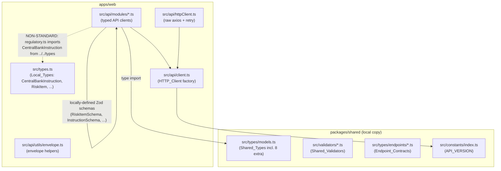
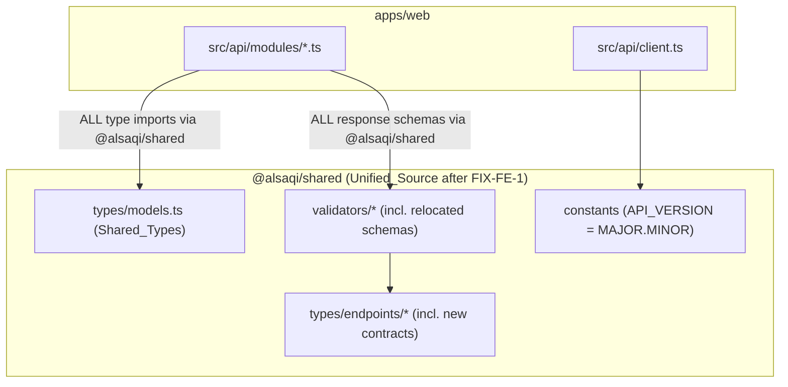
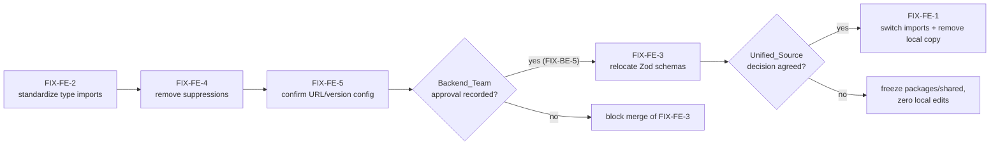

# Design Document

## Overview

This design covers a set of frontend consistency and architectural fixes (FIX-FE-1 through FIX-FE-5) for the `alsaqi` repository, scoped to `apps/web` and `packages/shared`. The fixes fall into two categories:

1. **Local cleanup (low risk, no backend coordination):** standardize the type-import source across API modules (FIX-FE-2) and remove TypeScript error suppressions (FIX-FE-4), plus confirm the API base-URL/version configuration (FIX-FE-5).
2. **Architectural changes (require backend coordination):** unify the shared package behind a single agreed source (FIX-FE-1) and relocate local Zod schemas into the shared package (FIX-FE-3).

The repository is already an **npm workspaces monorepo** (`workspaces: ["packages/*", "apps/*"]`), and `apps/web` already declares `@alsaqi/shared` as a workspace dependency. The drift described in the requirements is *cross-repository* drift: the backend repository keeps its own hand-maintained copy of `packages/shared`. The frontend copy is the newer superset (8 extra correct types). Therefore the design treats `packages/shared` as a coordination boundary: it is frozen against local edits until a `Unified_Source` decision is jointly agreed, except where a fix explicitly relocates code *into* it under backend approval (FIX-FE-3).

The implementation order mirrors the requirements: (1) FIX-FE-2 and FIX-FE-4 as local cleanup, (2) FIX-FE-5 as config confirmation, then (3) FIX-FE-3 and FIX-FE-1 as backend-coordinated architectural changes.

### Goals

- One consistent import source (`@alsaqi/shared`) for every shared data-model type used in `apps/web/src/api/modules`.
- Zero `@ts-expect-error` suppressions in the `apps/web/src/api` layer, with `exactOptionalPropertyTypes` still enabled and the build green.
- A single definition of each relocated Zod schema, living in `packages/shared/src/validators`, consumed by the frontend.
- Confirmed, environment-correct base-URL and API-version configuration.
- No regression in response-validation behavior or in the existing test suite.

### Non-Goals

- Choosing the `Unified_Source` mechanism (npm package vs. git submodule vs. monorepo workspace). That is a joint decision with the `Backend_Team`; this design provides the switch-over and teardown procedure but does not pre-select the mechanism.
- Editing files under `packages/shared` while no `Unified_Source` decision is agreed (FIX-FE-1 criterion 2), except for the schema relocation in FIX-FE-3 which is explicitly backend-approved.
- Changing runtime API behavior (retry, refresh, CSRF, correlation IDs) beyond what FIX-FE-5 requires.

## Architecture

### Current state (relevant slices)



The inconsistencies the fixes target:

- **Non-standard import source (FIX-FE-2):** `regulatory.ts` imports `CentralBankInstruction` from `../../types` (the local copy in `apps/web/src/types.ts`) instead of from `@alsaqi/shared`. `apps/web/src/types.ts` redefines several `Shared_Types` (`CentralBankInstruction`, `RiskItem`, `User`, `AuditPlan`, etc.) that already exist in `packages/shared/src/types/models.ts`.
- **Local Zod schemas (FIX-FE-3):** `RiskItemSchema`, `InstructionSchema`, `DashboardStatsSchema`, and the five user-management schemas (`RoleSchema`, `PermissionSchema`, `SessionSchema`, `SettingsSchema`, `JobTitleSchema`) are defined inside the API modules, so they can silently drift from the server contract.
- **Type suppressions (FIX-FE-4):** several schemas are annotated `: z.ZodType<T>` and carry `@ts-expect-error` comments to bypass the `exactOptionalPropertyTypes` conflict that arises because `z.string().optional()` infers `T | undefined` rather than an optional key.

### Target state



### Sequencing and gating



The two architectural fixes are guarded by explicit gates:

- FIX-FE-3 must not merge unless `Backend_Team` approval is recorded on the change (criterion 3.7).
- FIX-FE-1 must make zero local edits under `packages/shared` until a `Unified_Source` decision is agreed (criterion 1.2), and must only remove the duplicated local copy once every `@alsaqi/shared` import resolves from the `Unified_Source`, the type-equality check passes, and the TypeScript build is clean (criterion 1.5).

## Components and Interfaces

### 1. Type-import standardization (FIX-FE-2)

**Affected files:** `apps/web/src/api/modules/regulatory.ts` (and any other module importing a `Shared_Type` via a relative path), `apps/web/src/types.ts`, plus all referencing files.

- Replace `import type { CentralBankInstruction } from '../../types';` in `regulatory.ts` with `import type { CentralBankInstruction } from '@alsaqi/shared';`.
- Produce a **duplicate-type inventory** (criterion 2.4): a list where each entry is `{ typeName, filePath }` for every `Local_Type` defined under `apps/web/src/api/modules/` or `apps/web/src/types` that also exists in `@alsaqi/shared`. Based on the current code, the candidate duplicates in `apps/web/src/types.ts` are: `User`, `AuditPlan`, `AuditTask`, `AuditProgram`, `AuditProcedure`, `AuditFinding`, `AuditEvidence`, `Recommendation`, `RiskItem`, `CentralBankInstruction`, `Notification`, `AuditTrail`, `AuditReport`.
- For each duplicate that is removed, update every reference to import the corresponding `Shared_Type` from `@alsaqi/shared` (criterion 2.5). Removal is incremental and safe: a `Local_Type` is only deleted once all its references resolve against the shared type and the build is clean (criteria 2.6, 2.7).

> **Note on divergent local types:** some local types intentionally differ from the shared copy (e.g. local `AuditFinding` adds `title?`; local `Recommendation` adds `plan_id`/`rec_number`; local `AuditPlan.type` is a string-literal union rather than the enum-derived `` `${AuditType}` ``). These are *not* clean duplicates. The design rule (criterion 2.3) is to remove duplicates of types that already exist in shared; where a local type carries extra fields the server actually returns, the correct resolution is to reconcile the field into the shared type **as part of FIX-FE-1/FIX-FE-3 (backend-coordinated)**, not to silently drop it. Until then those types stay local and are flagged in the inventory with a "divergent — needs reconciliation" annotation so they are not mistakenly deleted.

**Verification interface:** an ESLint guard (or a small repo check script under `scripts/`) that asserts no file under `apps/web/src/api/modules/` contains a relative-path import (`./` or `../`) of a name that is exported by `@alsaqi/shared`, and that those names are not locally re-declared there.

### 2. Suppression removal (FIX-FE-4)

**Affected files:** `apps/web/src/api/modules/dashboard.ts`, `risk-register.ts`, `user-management.ts` (the three modules currently carrying `@ts-expect-error`).

Root cause: each suppressed schema is annotated `const XSchema: z.ZodType<T> = z.object({...})`. Because `z.ZodType<T>` is invariant and `z.string().optional()` infers a value type of `string | undefined`, the inferred output type is not assignable to a `T` whose key is declared optional (`field?: string`) under `exactOptionalPropertyTypes`.

Resolution pattern (criterion 4.2 — *no manual `z.ZodType<T>` annotation*):

- **Drop the explicit `: z.ZodType<T>` annotation.** Let Zod infer the schema type. `.optional()` in Zod v4 makes the inferred output key optional (`{ field?: string }`), which is exactly what `exactOptionalPropertyTypes` wants.
- **Re-establish the type link with a compile-time assertion instead of a runtime annotation.** Add a type-level check that the inferred type is assignable to the `Shared_Type`, e.g.:

  ```ts
  type _AssertRiskItem = z.infer<typeof RiskItemSchema> satisfies RiskItem extends infer _ ? unknown : never;
  // Preferred concrete form used in this design:
  const _riskItemContract: RiskItem = {} as z.infer<typeof RiskItemSchema>; // compile-time only, never executed
  ```

  This keeps the schema and the `Shared_Type` in lockstep without `z.ZodType<T>` and without any suppression. Where the relocated schema lives in `@alsaqi/shared` (FIX-FE-3), the canonical form is to derive and export the type via `z.infer` so the model type and schema cannot diverge.
- **Forbidden fallbacks (criterion 4.5):** no reintroduction of `@ts-expect-error`, `@ts-ignore`, or `as any` / `as unknown` casts to mask a genuine mismatch. A real mismatch must be fixed by correcting the schema or the type.
- **Runtime behavior must be preserved (criterion 4.6):** removing the annotation/suppression changes only compile-time typing; the `z.object({...})` shape, field list, `.optional()` markers, and unions stay byte-for-byte equivalent so the schema accepts/rejects exactly the same responses.

**Verification interface:** `tsc --noEmit` with `exactOptionalPropertyTypes` enabled reports zero errors (criterion 4.4), and a grep/ESLint guard asserts zero `@ts-expect-error` (and no new `@ts-ignore`/`as any`) anywhere under `apps/web/src/api` (criterion 4.3).

### 3. Zod schema relocation (FIX-FE-3)

**Source modules → shared destination:**

| Schema(s) | Current location | New location |
| --- | --- | --- |
| `RiskItemSchema` | `api/modules/risk-register.ts` | `packages/shared/src/validators/risk-register.ts` |
| `InstructionSchema` | `api/modules/regulatory.ts` | `packages/shared/src/validators/regulatory.ts` |
| `DashboardStatsSchema` (+ `AuditProgressByTypeSchema`, `RiskLevelBreakdownSchema`) | `api/modules/dashboard.ts` | `packages/shared/src/validators/dashboard.ts` |
| `RoleSchema`, `PermissionSchema`, `SessionSchema`, `SettingsSchema`, `JobTitleSchema` | `api/modules/user-management.ts` | `packages/shared/src/validators/user-management.ts` |

Process per schema:

1. Move the schema definition into the appropriate file under `packages/shared/src/validators/`, **field definitions and validation rules identical to the original** (criteria 3.1–3.4), applying the FIX-FE-4 pattern (no `z.ZodType<T>` annotation; derive the type via `z.infer` and export it).
2. Export the schema (and its `z.infer` type) from `packages/shared/src/validators/index.ts`.
3. Add **exactly one** `Endpoint_Contract` per relocated schema under `packages/shared/src/types/endpoints/` that references the relocated `Shared_Validator` (criterion 3.5) — following the existing pattern in `endpoints/findings.ts` (which imports `CreateFindingInput`/`UpdateFindingInput` from the validators). New/extended contract files: `dashboard.ts`, `regulatory.ts`, `user-management.ts`, and the existing `risk-register.ts` extended to reference the validator. Register each in `endpoints/index.ts`.
4. In the API module, **remove the local schema definition** and import the `Shared_Validator` from `@alsaqi/shared` (criteria 3.1–3.4, 3.6). The module keeps its factory/transport code unchanged; only the schema source changes.
5. Ensure **exactly one definition** of each relocated schema exists repository-wide, in `packages/shared/src/validators/` (criterion 3.8).

**Gating:** this change writes into `packages/shared`, so it is allowed only when `Backend_Team` approval is recorded on the change (criterion 3.7); otherwise the merge is blocked. The frontend consumes the new `Endpoint_Contracts` from the single `Shared_Validator` source once the backend adds the corresponding contracts (FIX-BE-5 / criterion 3.10).

### 4. Shared-package unification (FIX-FE-1)

This is procedural and primarily enforced by checks rather than new runtime code.

- **Preserve the 8 `Extra_Shared_Types`** (`DashboardStats`, `AuditProgressByType`, `RiskLevelBreakdown`, `Role`, `Permission`, `UserSession`, `JobTitle`, `UserManagementSettings`) with complete field sets unchanged, verified by a **type-level equality check against a recorded baseline** (criterion 1.1). The baseline is a checked-in snapshot (a `.d.ts` or a `satisfies`-based fixture) of these 8 types; a test fails if any field is deleted, renamed, narrowed, or has its optionality/type changed.
- **Freeze `packages/shared`** while no `Unified_Source` is agreed: a CI guard runs a version-control diff over `packages/shared` and fails the build if any line changed (criterion 1.2). (FIX-FE-3's writes into `packages/shared` are explicitly exempt and occur only under recorded backend approval.)
- **Switch-over** when a `Unified_Source` is agreed: repoint every `@alsaqi/shared` import to resolve from the `Unified_Source` so zero imports resolve from the duplicated local copy (criterion 1.3). If any import is left unresolved or fails to build, removal of the local copy is blocked, local files are retained unchanged, and the build surfaces the unresolved imports (criterion 1.4).
- **Teardown:** remove the duplicated local copy only when all `@alsaqi/shared` imports resolve from the `Unified_Source`, the type-equality check passes, and `tsc` reports zero errors and zero imports from the local copy (criterion 1.5).
- **Regression protection (criterion 1.6):** a review-gate check rejects and blocks (with a recorded rejection) any change that would delete, rename, narrow, change optionality of, or change the field type of any of the 8 `Extra_Shared_Types`.

### 5. Base-URL and version configuration (FIX-FE-5)

The relevant logic already lives in `apps/web/src/api/client.ts` and `httpClient.ts`. This fix is mostly confirmation plus two small corrections.

- **Base URL resolution (criteria 5.1, 5.2):** `httpClient.ts` already uses `env?.['VITE_API_URL'] || '/api'`, satisfying 5.2 (fallback to `/api` when unset/empty). Criterion 5.1 requires the development `VITE_API_URL` to equal `http://localhost:3000/api`; the current `apps/web/.env` sets `VITE_API_URL=/api`. **Discrepancy to resolve:** update the development env value to `http://localhost:3000/api` (and document it in `.env.example`), or confirm with the team that same-origin `/api` via a dev proxy is the intended dev configuration. The design's default is to set `http://localhost:3000/api` for development to match the criterion.
- **API version constant (criterion 5.3):** `API_VERSION` is currently `'1.0.0'` (full semver). The criterion requires the constant to be a `MAJOR.MINOR` string excluding the patch component (i.e. `'1.0'`). Because `API_VERSION` lives in `packages/shared/src/constants`, changing it is a `packages/shared` edit and is therefore **gated by the FIX-FE-1 freeze / `Unified_Source` coordination**. This is flagged as a coordination item; the comparison logic itself (below) already tolerates either format.
- **Version comparison (criteria 5.4, 5.6, 5.7):** `client.ts`'s `isMajorMinorMatch` splits both versions on `.` and compares only major and minor — already correct and patch-insensitive. `checkVersionMismatch` only runs when the `x-api-version` header is present (5.7: no header → no comparison, no notification), and triggers `showVersionMismatchNotification` (a non-dismissible overlay with no dismiss control, only a reload button) on mismatch (5.6).
- **Envelope unwrapping (criteria 5.5, 5.8):** the response interceptor replaces `response.data` with the inner `data` only when the body is an object with `success === true` and a `data` field; otherwise it returns the payload unchanged. Already correct; covered by tests.

**Verification interface:** confirm `.env`/`.env.example` values per environment; keep `isMajorMinorMatch`, `checkVersionMismatch`, and the unwrap branch under property tests (see Testing Strategy).

## Data Models

No new runtime data models are introduced. The fixes consolidate where existing models live and how they are validated.

### Shared types (single source of truth, `@alsaqi/shared`)

The 8 `Extra_Shared_Types` that must be preserved exactly (FIX-FE-1 criterion 1.1):

```ts
interface AuditProgressByType { type: string; planned: number; completed: number; }
interface RiskLevelBreakdown  { level: string; count: number; }
interface DashboardStats { /* audits, findings, recommendations, risks, correspondence, compliance, activity */ }
interface Role            { id: string | number; name: string; description?: string; }
interface Permission      { id: string | number; module: string; action: string; }
interface UserSession     { id: string | number; user_id: string | number; ip_address?: string; user_agent?: string; created_at?: string; expires_at?: string; }
interface JobTitle        { id: string | number; name: string; name_ar?: string; name_en?: string; }
interface UserManagementSettings { /* numeric 0/1 policy flags, all optional */ }
```

### Relocated validators (FIX-FE-3)

Each relocated schema becomes the canonical definition and its type is derived from it:

```ts
// packages/shared/src/validators/risk-register.ts
export const RiskItemSchema = z.object({ /* identical fields */ });
export type RiskItem = z.infer<typeof RiskItemSchema>; // replaces/aligns with models.ts RiskItem
```

The inferred type must remain assignable to the existing `Shared_Type` in `models.ts`; where they would diverge, reconciliation is a backend-coordinated step, not a silent change.

### Response envelope (unchanged contract)

```ts
type ResponseEnvelope<T> = { success: boolean; data?: T; meta?: unknown; pagination?: { total: number; totalPages: number } };
```

The `HTTP_Client` unwraps `{ success: true, data }` to `data`; `envelope.ts` helpers (`toList`, `toData`, `toPagination`) let consumers read either the raw envelope or the unwrapped payload.

### Duplicate-type inventory (FIX-FE-2 deliverable)

A list of `{ typeName, filePath, status }` records, where `status ∈ { duplicate-removable, divergent-needs-reconciliation }`, covering every `Local_Type` under `apps/web/src/api/modules/` or `apps/web/src/types` that also exists in `@alsaqi/shared`.

## Correctness Properties

*A property is a characteristic or behavior that should hold true across all valid executions of a system — essentially, a formal statement about what the system should do. Properties serve as the bridge between human-readable specifications and machine-verifiable correctness guarantees.*

Most acceptance criteria in this feature are structural, build-time, or process gates (file-import shape, suppression absence, version-control diffs, review approval). Those are verified by static/lint checks, type-level assertions, single `tsc` runs, and CI gates — not by property-based tests (see Testing Strategy). The criteria that *do* express universally-quantified, input-varying behavior live in two pure areas: the relocated/de-suppressed Zod schemas (behavioral equivalence) and the `HTTP_Client` interceptor logic (envelope unwrapping and version comparison). The following four properties capture them.

### Property 1: Schema relocation and de-suppression preserve validation behavior

*For any* generated input value and *for any* schema that was relocated to `packages/shared/src/validators/` or had a `@ts-expect-error`/`z.ZodType<T>` annotation removed (`RiskItemSchema`, `InstructionSchema`, `DashboardStatsSchema`, `RoleSchema`, `PermissionSchema`, `SessionSchema`, `SettingsSchema`, `JobTitleSchema`), the new schema's `safeParse(input).success` equals the original baseline schema's `safeParse(input).success`, and when both succeed the parsed outputs are deeply equal.

**Validates: Requirements 3.1, 3.2, 3.3, 3.4, 4.6**

### Property 2: Response envelope unwrapping is data-projection on success envelopes and identity otherwise

*For any* value `x`, unwrapping a body of the form `{ success: true, data: x }` (optionally with other fields) yields exactly `x`; and *for any* payload that is not an object with `success === true` and a `data` field (including arrays, `null`, primitives, `{ success: false, ... }`, and objects lacking `data`), unwrapping returns the payload unchanged.

**Validates: Requirements 5.5, 5.8**

### Property 3: API base-URL resolution

*For any* `VITE_API_URL` value that is `undefined`, empty, the resolved `HTTP_Client` base URL is `/api`; and *for any* non-empty `VITE_API_URL` value, the resolved base URL equals that value.

**Validates: Requirements 5.2**

### Property 4: Patch-insensitive version match drives the mismatch notification

*For any* pair of version strings whose major and minor components are equal (regardless of any patch component or its absence), the version check reports a match and shows no notification; and *for any* response carrying an `x-api-version` header whose major or minor component differs from the `API_Version_Constant`, the check reports a mismatch and the non-dismissible version-mismatch notification is shown; and *for any* response with no `x-api-version` header, no comparison is performed and no notification is shown.

**Validates: Requirements 5.4, 5.6, 5.7**

## Error Handling

The fixes are largely refactoring, so error handling centers on *not regressing* existing behavior and on *failing safe* during the architectural transitions.

- **Build-time failures (FIX-FE-2, FIX-FE-4):** if removing a `Local_Type` or a suppression surfaces a real type error, the build fails with file + line (criteria 2.7, 4.4). The rule is to preserve the prior source state — do not delete a `Local_Type` whose references are still unresolved, and never mask the error with `@ts-expect-error`, `@ts-ignore`, or `as any`/`as unknown` (criteria 2.7, 4.5). Genuine mismatches are resolved by correcting the schema or type.
- **Unresolved imports during switch-over (FIX-FE-1, criterion 1.4):** if repointing imports to the `Unified_Source` leaves any `@alsaqi/shared` import unresolved or failing to build, removal of the duplicated local copy is blocked, the local files are retained unchanged, and the build surfaces the unresolved imports. Teardown proceeds only when the full precondition checklist passes (criterion 1.5).
- **Governance gates:** FIX-FE-3 merges are blocked without recorded `Backend_Team` approval (criterion 3.7); any change degrading one of the 8 `Extra_Shared_Types` is rejected and recorded (criterion 1.6); `packages/shared` edits are blocked while no `Unified_Source` is agreed (criterion 1.2).
- **Runtime error paths (unchanged):** the `HTTP_Client` retry/refresh/error-reporting behavior in `client.ts` and `httpClient.ts` is preserved. Schema validation continues to throw on malformed responses exactly as before (Property 1 guarantees parity). The version-mismatch overlay remains non-dismissible and offers only a reload action (criterion 5.6); it is shown at most once (idempotent guard).
- **Envelope edge cases:** the unwrap branch and the `envelope.ts` helpers degrade gracefully on `null`/`undefined`/missing-field payloads, returning empty lists or pass-through values rather than throwing (Property 2).

## Testing Strategy

### Property-based tests

Property-based testing applies to the pure logic identified above. The repo already uses **`fast-check`** (declared in the root `devDependencies`) alongside **Vitest**, and there is precedent (`apps/web/src/api/__tests__/client.property.test.ts`, `packages/shared/src/validators/__tests__/validation-schemas.property.test.ts`). Reuse that stack.

- Use `fast-check` arbitraries with Vitest.
- Each property test runs a **minimum of 100 iterations** (`fc.assert(fc.property(...), { numRuns: 100 })` or higher).
- Tag each test with a comment referencing the design property, using the format:
  **Feature: frontend-consistency-fixes, Property {number}: {property_text}**
- Implement each of the four correctness properties with a **single** property-based test:
  - **Property 1** — Keep a checked-in *baseline* copy of each original schema (pre-relocation / pre-de-suppression). For each relocated/de-suppressed schema, generate structured inputs (valid shapes plus malformed variants via `fc.anything()` and field-mutation arbitraries) and assert `safeParse` success parity and deep-equal parsed output. Quantify over the set of schemas so one test covers 3.1–3.4 and 4.6.
  - **Property 2** — Generate arbitrary `x` (`fc.anything()`), assert `unwrap({success:true,data:x})` deep-equals `x`, and assert `unwrap(p)` is identity for arbitrary non-envelope `p` (arrays, primitives, `null`, `{success:false}`, objects without `data`). Extract the unwrap branch into a small pure helper (mirroring `toData`) so it is directly testable without an HTTP round-trip.
  - **Property 3** — Extract base-URL resolution into a pure `resolveBaseUrl(value?: string)` helper; generate `undefined`/empty/whitespace and arbitrary non-empty strings and assert the `/api`-fallback vs. pass-through rule.
  - **Property 4** — Generate version triples (shared major.minor with differing patch → match; perturbed major or minor → mismatch) and assert `isMajorMinorMatch`; drive the notification side effect through a jsdom harness, asserting it shows iff a header is present and major/minor differ, and is shown at most once.

### Unit and example tests

- **Static / structural assertions (lint or small `scripts/` checks):**
  - No relative-path import of an `@alsaqi/shared`-exported name and no local re-definition under `apps/web/src/api/modules` (2.1, 2.2, 3.6).
  - No duplicate `Local_Type` under `apps/web/src/types` for a name that exists in shared (2.3); inventory completeness (2.4); no dangling references after removal (2.5).
  - Exactly one definition of each relocated schema, located in `packages/shared/src/validators` (3.8); exactly one `Endpoint_Contract` per relocated schema (3.5).
  - Zero `@ts-expect-error` in the three named files and across `apps/web/src/api` (4.1, 4.3); no manual `: z.ZodType<` annotation on the affected schemas and no `@ts-ignore`/`as any`/`as unknown` masking (4.2, 4.5).
- **Example tests:**
  - Version-mismatch overlay renders with no dismiss control and only a reload button (DOM structure for 5.6).
  - Envelope helper edge cases (already covered by `envelope.test.ts`).

### Type-level / smoke checks

- Type-equality of the 8 `Extra_Shared_Types` against a recorded baseline (1.1, 1.6) — a `tsd`-style or `satisfies`-based fixture wired into CI.
- `tsc --noEmit` with `exactOptionalPropertyTypes` enabled reports zero errors after FIX-FE-2 and FIX-FE-4 (2.6, 4.4).
- `API_VERSION` matches `^\d+\.\d+$` and equals the server major.minor (5.3); dev `VITE_API_URL` equals `http://localhost:3000/api` (5.1).

### Integration / CI gates

- `git diff` guard over `packages/shared` fails on any change while no `Unified_Source` is agreed (1.2).
- Post-switch resolution check: zero imports resolve from the duplicated local copy; unresolved-import simulation blocks teardown (1.3, 1.4, 1.5).
- Merge gate requiring recorded `Backend_Team` approval for FIX-FE-3 (3.7); consumption of backend-added `Endpoint_Contracts` from the single shared source when present (3.10).
- Existing response-validation suite (`apps/web/src/api/**`, `packages/shared/src/validators/__tests__`) continues to pass (3.9).

### Commands

Run from the repository root (do not start watch mode):

- Type-check: `npm run typecheck -w @alsaqi/web`
- Lint: `npm run lint -w @alsaqi/web`
- Unit + property tests (single run): `npm run test -w @alsaqi/web` (uses `vitest --run`)
- Shared package tests: `npm run test -w @alsaqi/shared`
- Build: `npm run build -w @alsaqi/web`
