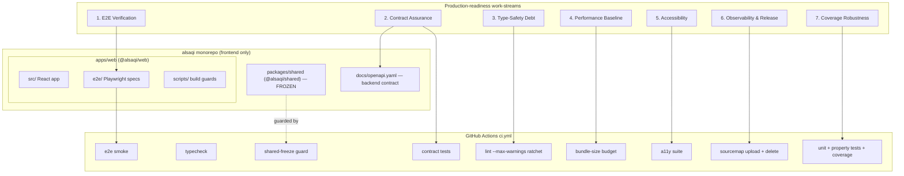
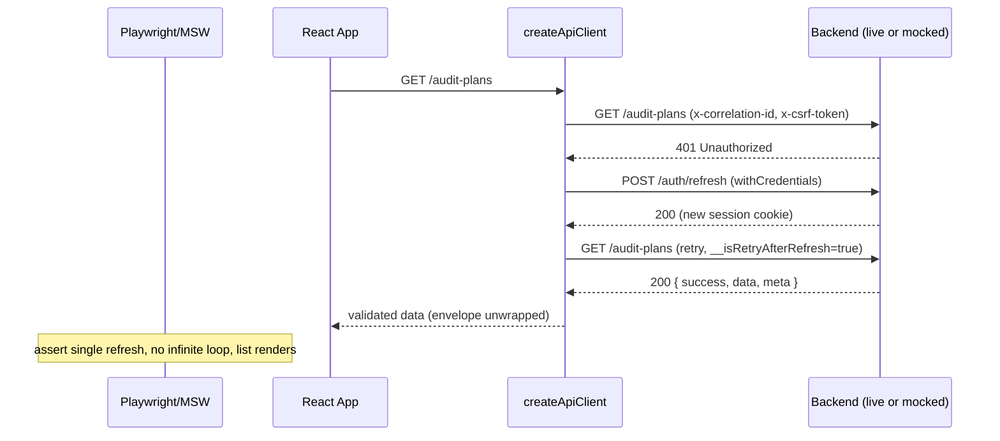
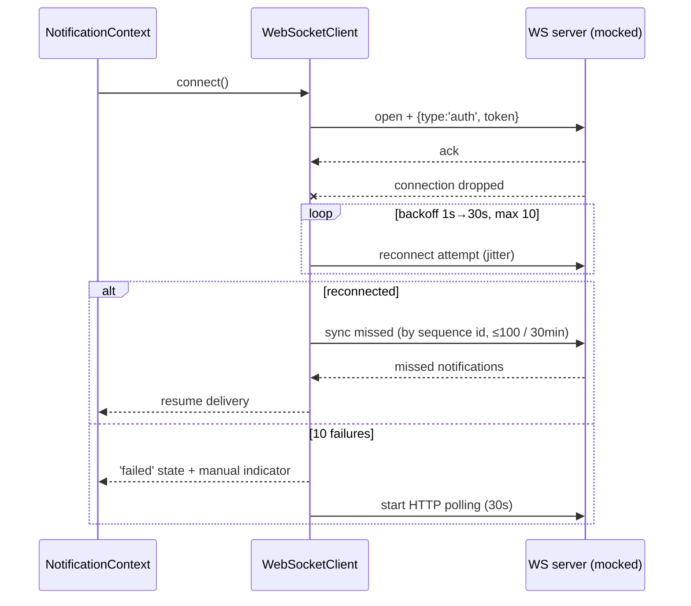

# Design Document: Frontend Production Readiness 10

## Overview

This feature raises the AL-SAQI **frontend** repository (React 19 + Vite 7 + TypeScript 5.9, the `apps/web` workspace) from an assessed 8/10 production readiness toward 10/10. It targets seven independent work-streams: end-to-end verification, backend contract assurance from the frontend side, type-safety debt reduction, performance baselining, accessibility, observability & release hardening, and coverage robustness.

The design treats each work-stream as a discrete component with concrete, machine-verifiable acceptance gates wired into the existing GitHub Actions pipeline (`.github/workflows/ci.yml`) and the `apps/web` build chain (`check-security-types` → `vite build` → `check-dist-sourcemaps` → `check-bundle-secrets`). Nothing here loosens an existing gate; every change either adds a new gate or tightens an existing threshold via a one-way ratchet.

**Scope boundary (explicit):** A true 10/10 of the *overall system* depends on the separate backend service (REST + WebSocket, dev port 3000), which lives in a different repository and is **out of scope**. This spec delivers everything achievable inside the frontend repo plus *frontend-side* integration and contract assurance — that is, verifying the frontend behaves correctly against a live or faithfully mocked backend, and that the frontend's assumptions about the backend contract (Zod schemas, the `{ success, data, meta }` envelope, CSRF, session/refresh, WebSocket auth) match `docs/openapi.yaml`. Backend implementation, backend test coverage, and backend deployment remain the backend repo's responsibility. The `packages/shared` workspace is **frozen** (guarded by `check-shared-freeze.mjs`); no work-stream may modify it.

---

## Architecture



The seven streams are independent and can be parallelized. They share a single integration surface: the CI pipeline. Each stream contributes one or more gates; readiness is measured by the union of green gates plus the published baseline documents (`PERFORMANCE.md`, contract report, a11y report).

### Stream interaction with the existing API client

The existing `createApiClient` factory (`apps/web/src/api/client.ts`) already implements the behaviors that streams 1, 2, and 6 must *verify* (not re-implement): CSRF auto-attachment from the `csrf-token` cookie, per-request `x-correlation-id` (UUID v4, stable across retries), single 401→`/auth/refresh`→retry flow, exponential backoff (1s/2s/4s) for network + 5xx, `X-API-Version` mismatch overlay, and Zod validation with envelope unwrapping via `unwrapEnvelope`. The WebSocket client (`apps/web/src/api/ws/websocket-client.ts`) already implements backoff reconnection with jitter and HTTP polling fallback. The design's job is to **prove these hold end-to-end and against the contract**, then lock them with gates.

---

## Sequence Diagrams

### 401 token-refresh critical path (E2E + contract verification)



### WebSocket reconnect critical path



---

## Components and Interfaces

### Component 1: E2E Verification Harness

**Purpose:** Run and expand Playwright specs (`apps/web/e2e/{login,audit-plan,correspondence,finding}.spec.ts`) against a deterministic backend, covering critical paths: 401 refresh, WebSocket reconnect, file upload/download, and RTL/LTR language switch.

**Current state:** `playwright.config.ts` exists (`testDir: ./apps/web/e2e`, chromium, baseURL `:5173`, `webServer` block commented out). Specs are excluded from vitest and run via `npm run test:e2e`.

**Interface (test fixtures):**
```typescript
// apps/web/e2e/fixtures/backend.ts
export interface BackendFixture {
  /** Mode: 'live' targets the real backend on :3000; 'mock' uses route interception. */
  mode: 'live' | 'mock';
  /** Force the next matching request to a status (e.g. 401) to drive refresh paths. */
  forceStatus(urlPattern: string | RegExp, status: number, times?: number): Promise<void>;
  /** Push a WebSocket frame or simulate a drop for reconnect scenarios. */
  socket: { drop(): Promise<void>; send(frame: unknown): Promise<void> };
  /** Seed deterministic data so list/detail assertions are stable. */
  seed(dataset: SeedDataset): Promise<void>;
}

export type CriticalPath =
  | 'auth.refresh-401'
  | 'ws.reconnect'
  | 'files.upload-download'
  | 'i18n.rtl-ltr-switch';
```

**Responsibilities:**
- Provide a `webServer` config that builds and serves the app (production preview) before tests, so e2e runs against built output.
- Provide a `mock` mode (Playwright route interception) for CI determinism and a `live` mode (against `:3000`) for local full-stack verification.
- Expand each existing spec to assert the four critical paths.

### Component 2: Backend Contract Assurance

**Purpose:** Validate that the frontend's Zod schemas and request/response assumptions match `docs/openapi.yaml`, and pin them with contract tests (MSW-based handlers exercising the real `createApiClient`).

**Interface:**
```typescript
// apps/web/src/test/contract/contract.ts
export interface ContractCheck {
  /** Resolve a schema component from docs/openapi.yaml by $ref name. */
  openapiSchema(componentName: string): JsonSchema;
  /** Assert a frontend Zod schema accepts every OpenAPI example and rejects out-of-contract shapes. */
  assertZodMatchesOpenapi<T>(zod: z.ZodType<T>, componentName: string): void;
  /** Assert the response envelope wrapper { success, data, meta } is honored. */
  assertEnvelope(sampleResponse: unknown): void;
}

export interface ContractScenario {
  name: 'csrf' | 'session.refresh' | 'ws.auth' | 'envelope';
  handler: import('msw').HttpHandler; // MSW handler invoked through createApiClient
}
```

**Responsibilities:**
- Parse `docs/openapi.yaml`, extract reusable schema components (User, AuditPlan, Finding, Recommendation, RiskItem, Correspondence) and the envelope shape.
- For each frontend Zod schema, assert it accepts OpenAPI-derived examples and rejects shapes that violate the contract.
- Run MSW-backed contract scenarios for CSRF header presence, session/refresh round-trip, WebSocket auth message, and the `{ success, data, meta }` envelope.

### Component 3: Type-Safety Debt Reduction

**Purpose:** Eliminate explicit `any` (prioritizing `src/api`, `src/api/hooks`, and security-critical modules), remove unused imports/vars, fix `react-hooks/exhaustive-deps` warnings, and add a CI `--max-warnings` ratchet so the ~522 current warnings can only decrease.

**Interface (the ratchet, as a CI step + script):**
```typescript
// scripts/lint-ratchet.mjs (conceptual surface)
export interface LintRatchet {
  /** The current committed ceiling; CI fails if live warning count exceeds it. */
  readonly ceiling: number;
  /** Run eslint, count warnings, compare to ceiling. */
  check(): Promise<{ count: number; ceiling: number; pass: boolean }>;
  /** Lower the ceiling to the current count (one-way; never raises). */
  ratchetDown(count: number): void;
}
```

**Responsibilities:**
- Replace `any` with precise types or `unknown` + narrowing, starting with `src/api/**` and security-critical modules (client, auth, websocket-client, sentry, logger).
- Remove unused imports/vars and resolve `exhaustive-deps` warnings (add deps or justify with documented disable).
- Enforce `eslint src/ --max-warnings <ceiling>` in CI, with the ceiling monotonically decreasing toward 0.

### Component 4: Performance Baseline

**Purpose:** Establish load-test scripts (k6 or Artillery) for common workflows, a `PERFORMANCE.md` baseline, bundle-size budgets enforced in CI, and Core Web Vitals targets.

**Current state:** `manualChunks` is already configured in `vite.config.ts` (vendor-react, vendor-query, vendor-ui, vendor-charts, vendor-pdf, vendor-excel, vendor-editor, vendor-i18n, vendor-forms). `ANALYZE=true` produces `dist/bundle-stats.html` via `rollup-plugin-visualizer`.

**Interface:**
```typescript
// scripts/check-bundle-budget.mjs (conceptual surface)
export interface BundleBudget {
  /** Per-chunk gzip ceilings in KB, keyed by chunk name. */
  readonly budgets: Record<string, number>;
  /** Read dist/ output, compute gzip sizes, compare to budgets. */
  check(distDir: string): Promise<BudgetResult>;
}
export interface BudgetResult { violations: Array<{ chunk: string; sizeKb: number; budgetKb: number }>; pass: boolean; }

export interface WebVitalsTarget { lcpMs: 2500; inpMs: 200; cls: 0.1; }
```

**Responsibilities:**
- Add k6/Artillery scripts modeling login → audit-plan list → finding workflows (pointed at a configurable backend base URL).
- Generate `PERFORMANCE.md` capturing the current bundle composition, per-chunk gzip baseline, and Core Web Vitals targets (LCP ≤ 2.5s, INP ≤ 200ms, CLS ≤ 0.1).
- Add a CI step that fails when any chunk exceeds its committed gzip budget.

### Component 5: Accessibility

**Purpose:** Resolve `jsx-a11y` violations, expand `vitest-axe` coverage to key screens, and add RTL screen-reader checks.

**Interface:**
```typescript
// apps/web/src/test/a11y/axe.ts
export interface A11yAudit {
  /** Render a screen and run axe; returns violations. */
  audit(screen: React.ReactElement, opts?: { dir: 'rtl' | 'ltr' }): Promise<AxeResults>;
  /** Screens that must pass with zero violations. */
  readonly coveredScreens: ReadonlyArray<'login' | 'dashboard' | 'audit-plan' | 'finding' | 'correspondence'>;
}
```

**Responsibilities:**
- Fix `jsx-a11y` violations: keyboard handlers on interactive elements, accessible labels/text, `autofocus` misuse.
- Add `vitest-axe` assertions for the key screens in both `dir="ltr"` and `dir="rtl"`.
- Assert document `dir`/`lang` flip correctly on language switch and that focus order remains logical in RTL.

### Component 6: Observability & Release Hardening

**Purpose:** Confirm Sentry production init + source-map upload/delete in CI, end-to-end `correlationId` propagation, and verified error reporting.

**Current state:** `apps/web/src/utils/sentry.ts` guards `Sentry.init` to production-with-DSN (verified by `observabilityWiring.test.ts`). `vite.config.ts` enables `sourcemap: 'hidden'` + `sentryVitePlugin` with `filesToDeleteAfterUpload: ['./dist/**/*.map']` only when `SENTRY_AUTH_TOKEN`/`ORG`/`PROJECT` are present. `logger.ts` carries a session `correlationId`; `client.ts` sets `x-correlation-id` per request.

**Interface:**
```typescript
// apps/web/src/utils/observability.ts (verification surface)
export interface ObservabilityContract {
  /** Sentry initializes iff PROD && DSN present. */
  shouldInitSentry(env: { PROD: boolean; dsn?: string }): boolean;
  /** Same correlation id flows: request header → log entry → Sentry tag. */
  correlationIdPropagates(requestId: string): boolean;
  /** dist/ ships zero .map files after a production build. */
  noSourceMapsInDist(distDir: string): Promise<boolean>;
}
```

**Responsibilities:**
- Verify (in CI) that a production build with Sentry credentials uploads then deletes maps, and `check-dist-sourcemaps.mjs` confirms `dist/` ships none.
- Add a test proving the request `x-correlation-id` is attached as a Sentry tag / log field so a frontend error is traceable to its originating request.

### Component 7: Coverage Robustness

**Purpose:** Raise coverage thresholds for critical paths above the global 70% floor.

**Interface (vitest config surface):**
```typescript
// apps/web/vitest.config — coverage.thresholds (conceptual)
export interface CoverageThresholds {
  global: { lines: 70; functions: 70; branches: 70; statements: 70 };
  perFile: {
    'src/api/client.ts': { lines: 90 };
    'src/api/ws/websocket-client.ts': { lines: 90 };
    'src/utils/sentry.ts': { lines: 90 };
    'src/utils/logger.ts': { lines: 85 };
  };
}
```

**Responsibilities:**
- Keep the 70% global floor; add per-path thresholds for security/observability-critical modules.
- CI already runs `vitest --coverage`; the tightened thresholds make it fail when a critical path regresses.

---

## Data Models

### Model 1: ReadinessGate

```typescript
/** A single machine-verifiable gate contributed by a work-stream. */
interface ReadinessGate {
  id: string;                       // e.g. 'lint.max-warnings'
  stream: 1 | 2 | 3 | 4 | 5 | 6 | 7;
  ciStep: string;                   // matching step name in ci.yml
  status: 'pending' | 'green' | 'red';
  ratchet?: { metric: string; current: number; target: number };
}
```
**Validation rules:**
- `ciStep` must correspond to an actual step name in `.github/workflows/ci.yml`.
- A `ratchet.current` value may never increase across commits (one-way).

### Model 2: ContractFixture

```typescript
/** Binds a frontend Zod schema to its OpenAPI component for contract testing. */
interface ContractFixture {
  zodSchemaPath: string;            // e.g. 'src/api/modules/findings.ts#FindingSchema'
  openapiComponent: string;         // e.g. 'Finding'
  envelopeWrapped: boolean;         // true for list/detail endpoints
  scenarios: Array<'csrf' | 'session.refresh' | 'ws.auth' | 'envelope'>;
}
```
**Validation rules:**
- `openapiComponent` must resolve in `docs/openapi.yaml` `components.schemas`.
- Every endpoint-backed Zod schema in `src/api/modules` should have exactly one fixture.

### Model 3: BundleBudgetEntry

```typescript
interface BundleBudgetEntry {
  chunk: string;       // e.g. 'vendor-charts' (must match a manualChunks group)
  maxGzipKb: number;   // committed ceiling
  measuredGzipKb?: number;
}
```
**Validation rules:**
- `chunk` must match a group produced by `manualChunks` in `vite.config.ts`.
- CI fails if `measuredGzipKb > maxGzipKb`.

---

## Algorithmic Pseudocode

### Lint warning ratchet

```typescript
function checkLintRatchet(): Result {
  const ceiling = readCommittedCeiling();          // e.g. from .lint-ceiling.json
  const { warningCount } = runEslint('src/', { format: 'json' });

  // INVARIANT: warningCount must never exceed the committed ceiling.
  if (warningCount > ceiling) {
    return fail(`Lint warnings increased: ${warningCount} > ${ceiling}`);
  }

  // One-way ratchet: if the developer reduced warnings, lower the ceiling so it
  // can never climb back. This makes regressions impossible without an explicit
  // (reviewable) edit to the committed ceiling file.
  if (warningCount < ceiling) {
    return passWithSuggestion(`Lower ceiling to ${warningCount}`);
  }
  return pass();
}
```
**Preconditions:** `eslint src/` runs clean (no errors, only warnings); a committed `ceiling` exists (seeded at ~522).
**Postconditions:** CI is green iff `warningCount <= ceiling`; the ceiling is monotonically non-increasing across commits.
**Loop invariants:** N/A (no loops; single comparison).

### Zod-vs-OpenAPI contract assertion

```typescript
function assertZodMatchesOpenapi<T>(zod: z.ZodType<T>, component: string): void {
  const schema = openapiSchema(component);          // from docs/openapi.yaml
  const validExamples = deriveExamples(schema);     // examples + generated valid shapes
  const invalidShapes = deriveCounterexamples(schema); // missing required, wrong types

  // Every contract-valid example MUST parse.
  for (const ex of validExamples) {
    ASSERT zod.safeParse(ex).success === true;
  }
  // Every contract-violating shape MUST be rejected, so the frontend never
  // silently accepts data the backend contract forbids.
  for (const bad of invalidShapes) {
    ASSERT zod.safeParse(bad).success === false;
  }
}
```
**Preconditions:** `docs/openapi.yaml` parses; `component` exists under `components.schemas`.
**Postconditions:** Passes iff the Zod schema's accepted set is consistent with the OpenAPI contract for that component.
**Loop invariants:** After processing the first `k` examples, all `k` parsed as expected (valid accepted, invalid rejected).

### Bundle-size budget check

```typescript
function checkBundleBudget(distDir: string, budgets: BundleBudgetEntry[]): BudgetResult {
  const violations: BundleBudgetEntry[] = [];
  for (const entry of budgets) {
    const file = findChunkFile(distDir, entry.chunk);  // resolve hashed filename
    const sizeKb = gzipSizeKb(file);
    // INVARIANT after iteration i: violations holds exactly the over-budget
    // chunks among the first i entries.
    if (sizeKb > entry.maxGzipKb) {
      violations.push({ ...entry, measuredGzipKb: sizeKb });
    }
  }
  return { violations, pass: violations.length === 0 };
}
```
**Preconditions:** A production `vite build` has produced `distDir`; every budgeted `chunk` matches a `manualChunks` group.
**Postconditions:** `pass === true` iff no chunk exceeds its gzip ceiling; `violations` lists all offenders.
**Loop invariants:** `violations` ⊆ over-budget subset of processed chunks at every step.

---

## Key Functions with Formal Specifications

### `forceStatus(urlPattern, status, times)` — E2E backend fixture

```typescript
function forceStatus(urlPattern: string | RegExp, status: number, times?: number): Promise<void>
```
**Preconditions:** Playwright `page`/`context` is initialized; fixture `mode === 'mock'`.
**Postconditions:** The next `times` (default 1) requests matching `urlPattern` resolve with `status`; subsequent requests pass through. Used to drive the 401-refresh path deterministically.
**Loop invariants:** N/A.

### `assertEnvelope(sampleResponse)` — contract check

```typescript
function assertEnvelope(sampleResponse: unknown): void
```
**Preconditions:** `sampleResponse` is the raw (pre-unwrap) backend body.
**Postconditions:** Throws unless `sampleResponse` matches `{ success: boolean, data: unknown, meta?: object }`; on `success: true`, `data` is present; this mirrors `unwrapEnvelope`/`readEnvelopeMeta` in `src/api/utils/envelope`.
**Loop invariants:** N/A.

### `correlationIdPropagates(requestId)` — observability check

```typescript
function correlationIdPropagates(requestId: string): boolean
```
**Preconditions:** A request was made through `createApiClient` carrying `x-correlation-id = requestId`.
**Postconditions:** Returns `true` iff the same `requestId` appears in the structured log entry for that request AND is attached as a Sentry tag/context when an error is reported. No side effects.
**Loop invariants:** N/A.

---

## Example Usage

```typescript
// Stream 1 — E2E critical path: 401 refresh (apps/web/e2e/login.spec.ts)
test('recovers from a 401 via a single refresh', async ({ page, backend }) => {
  await backend.seed(minimalAuditPlans);
  await backend.forceStatus(/\/audit-plans$/, 401, 1); // first call 401, then pass
  await page.goto('/audit-plans');
  await expect(page.getByRole('row')).toHaveCount(minimalAuditPlans.length);
  // assert exactly one POST /auth/refresh occurred (no loop)
});

// Stream 2 — contract test through the real client (MSW)
it('Finding schema matches OpenAPI and honors the envelope', () => {
  assertZodMatchesOpenapi(FindingSchema, 'Finding');
  assertEnvelope({ success: true, data: validFinding, meta: { requestId: 'x' } });
});

// Stream 5 — a11y in RTL
it('login screen has no axe violations in RTL', async () => {
  const results = await audit(<LoginPage />, { dir: 'rtl' });
  expect(results.violations).toEqual([]);
});
```

---

## Correctness Properties

These are universally-quantified statements the test suite (Vitest + fast-check, Playwright, vitest-axe) must establish. They become the property/example tests in the tasks phase.

### Property 1: Single-refresh safety
*For any* sequence of requests where the first response is 401 and `/auth/refresh` succeeds, the original request is retried *exactly once* and no infinite refresh loop occurs (`__isRetryAfterRefresh` guard).

**Validates: Requirements 1.1**

### Property 2: Envelope fidelity
*For any* successful backend response, `unwrapEnvelope` returns `data` and `readEnvelopeMeta` returns `meta`, and the value validated by the caller's Zod schema equals `data`.

**Validates: Requirements 2.1**

### Property 3: Contract consistency
*For any* OpenAPI component with a frontend Zod schema, every contract-valid example is accepted and every contract-violating shape is rejected.

**Validates: Requirements 2.2**

### Property 4: Correlation propagation
*For any* request issued through `createApiClient`, the `x-correlation-id` it carries appears in the corresponding log entry and (on error) in the Sentry report.

**Validates: Requirements 6.1**

### Property 5: Reconnect convergence
*For any* WebSocket drop, the client either reconnects within ≤10 backoff attempts (1s→30s with jitter) or enters `failed` state and starts 30s HTTP polling — never silently stops delivering notifications.

**Validates: Requirements 1.2**

### Property 6: Direction correctness
*For any* language switch, `document.dir` and `document.lang` reflect the selected language (`rtl`/`ar` or `ltr`/`en`) and key screens have zero axe violations in that direction.

**Validates: Requirements 5.1**

### Property 7: Lint monotonicity
*For any* commit, the ESLint warning count is ≤ the committed ceiling, and the ceiling never increases.

**Validates: Requirements 3.1**

### Property 8: Bundle budget
*For any* production build, no `manualChunks` group exceeds its committed gzip ceiling.

**Validates: Requirements 4.1**

### Property 9: No source maps shipped
*For any* production build, `dist/` contains zero `.map` files (whether or not Sentry upload ran).

**Validates: Requirements 6.2**

### Property 10: Critical-path coverage
*For any* run, per-file coverage for security/observability-critical modules stays above their tightened thresholds (≥90% for `client.ts`, `websocket-client.ts`, `sentry.ts`).

**Validates: Requirements 7.1**

---

## Error Handling

### Scenario 1: E2E `live` backend unavailable
**Condition:** `mode: 'live'` selected but `:3000` is down.
**Response:** Fixture fails fast with a clear message; CI uses `mode: 'mock'` so the pipeline is never flaky due to a missing backend.
**Recovery:** Local developers switch to `mock` or start the backend repo separately.

### Scenario 2: OpenAPI component missing for a Zod schema
**Condition:** A `src/api/modules` schema has no matching `components.schemas` entry.
**Response:** Contract test fails listing the orphaned schema; this surfaces drift between frontend assumptions and the published contract.
**Recovery:** Either the schema is reconciled with the contract, or the gap is documented as a known backend-side item (out of frontend scope) with a tracked exemption.

### Scenario 3: Lint warning count rises
**Condition:** A commit introduces new warnings above the ceiling.
**Response:** `lint --max-warnings` step fails the build.
**Recovery:** Fix the warning or (rarely, with review) document why and adjust — but the ceiling file edit is explicit and reviewable.

### Scenario 4: Bundle chunk exceeds budget
**Condition:** A dependency bump or new import pushes a chunk over its gzip ceiling.
**Response:** `check-bundle-budget` step fails.
**Recovery:** Code-split, lazy-load, or justify and raise the budget in a reviewed commit.

### Scenario 5: Sentry upload misconfigured in CI
**Condition:** Production build runs without `SENTRY_AUTH_TOKEN`/`ORG`/`PROJECT`.
**Response:** The Sentry plugin is skipped (build still succeeds, no maps emitted); `check-dist-sourcemaps.mjs` still confirms `dist/` ships none.
**Recovery:** Configure CI secrets to enable upload; behavior degrades safely without them.

---

## Testing Strategy

### Unit Testing Approach
Extend existing Vitest suites (1040 passing today) for each new utility: lint-ratchet, bundle-budget, contract helpers, observability propagation. Each new script gets a focused unit test with edge cases (empty dist, missing component, exactly-at-ceiling).

### Property-Based Testing Approach
**Library:** fast-check (already in use). Properties 1–3, 5, 7, 8 above map to property tests:
- Single-refresh safety: generate random request sequences with injected 401s; assert exactly one refresh and bounded retries.
- Contract consistency: generate valid/invalid shapes from OpenAPI components; assert Zod accept/reject.
- Reconnect convergence: generate random drop timings; assert convergence to reconnected-or-polling.
- Lint/bundle monotonicity: generate counts/sizes around the ceiling; assert pass/fail boundary.

### Integration / Contract Testing Approach
MSW-based handlers exercised through the real `createApiClient` for the four scenarios (CSRF, session/refresh, WS auth, envelope). These run inside Vitest (jsdom) so they gate in CI alongside unit tests.

### End-to-End Testing Approach
Playwright specs in `apps/web/e2e`, run via `npm run test:e2e` in a dedicated CI step (smoke subset on every PR, full suite nightly), against `mode: 'mock'` for determinism with a `live` option for local full-stack runs.

### Accessibility Testing Approach
vitest-axe assertions on key screens in both `dir` values, plus RTL focus-order checks. Zero-violation gate per covered screen.

---

## Performance Considerations

- Reuse the existing `manualChunks` strategy; do not introduce a vendor catch-all (preserves lazy-loading/tree-shaking).
- Budget the eagerly-loaded chunks (`vendor-react`, `vendor-ui`, `vendor-query`) most tightly since they affect initial load and LCP/INP.
- k6/Artillery scripts run out-of-CI-critical-path (scheduled), writing results into `PERFORMANCE.md`; they are not a PR-blocking gate (backend-dependent) but are tracked for regressions.
- Core Web Vitals targets: LCP ≤ 2.5s, INP ≤ 200ms, CLS ≤ 0.1, measured against the production preview build.

## Security Considerations

- The `csrf-token` cookie → `x-csrf-token` header flow and the cookie-session `withCredentials` model are *verified*, not modified; contract tests assert their presence.
- WebSocket auth must continue to send `{ type: 'auth', token }` post-connect (never the JWT in the URL); contract test asserts this.
- Source maps must never ship to `dist/` (gated by `check-dist-sourcemaps.mjs`); Sentry receives them via upload-then-delete.
- The bundle secret scan (`check-bundle-secrets.mjs`) and security-types check (`check-security-types.mjs`) remain build gates; no work-stream may bypass them.
- `packages/shared` stays frozen; the freeze guard remains the first CI gate.

## Dependencies

**Already present (verified in `package.json`):** `@playwright/test`, `vitest`, `@vitest/coverage-v8`, `fast-check`, `vitest-axe`, `@testing-library/react`, `eslint-plugin-jsx-a11y`, `rollup-plugin-visualizer`, `@sentry/react`, `@sentry/vite-plugin`, `axios-mock-adapter`.

**New (dev-only, to be added):**
- `msw` — contract/integration handlers exercised through `createApiClient`.
- `k6` (binary, invoked via CI) **or** `artillery` (npm) — load scripts. Choose one in the tasks phase; k6 preferred for lower overhead, Artillery if an all-npm toolchain is desired.
- An OpenAPI parser (e.g. `@apidevtools/swagger-parser` or `yaml` + a JSON-schema validator) for the Zod-vs-OpenAPI contract checks.

**External / out of scope:** the backend service (REST + WebSocket on `:3000`) and its `docs/openapi.yaml` source-of-truth — consumed read-only by the frontend; not modified here.
