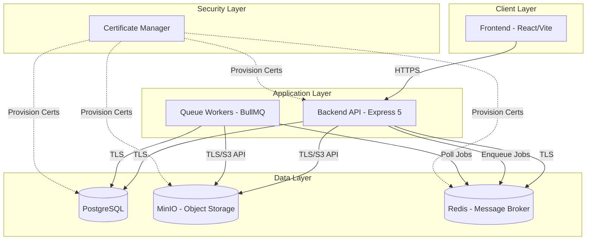
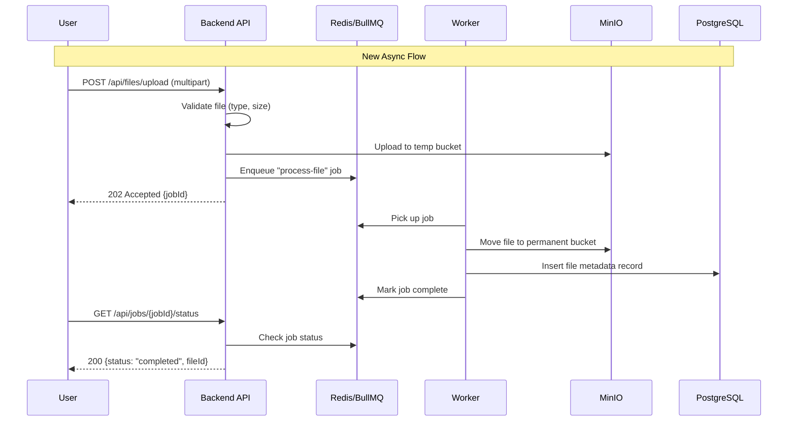
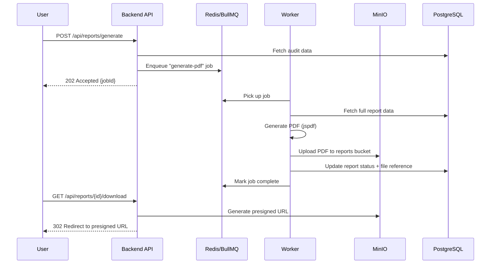

# Design Document: Infrastructure Storage & Queue

## Overview

This design covers three foundational infrastructure improvements for the ALSAQI audit management system: (1) replacing direct filesystem/database file storage with MinIO S3-compatible object storage, (2) introducing Redis + BullMQ for background task processing of heavy operations like file uploads and PDF generation, and (3) adding a TLS/SSL certificate layer for encrypted inter-service communication.

The current system uses `express-fileupload` with filesystem storage and processes all operations synchronously in the request path. This leads to timeout risks for large files, inability to scale horizontally, and unencrypted internal traffic. The new architecture decouples file persistence from the request lifecycle, offloads heavy processing to queue workers, and secures all inter-service connections with TLS certificates.

These changes are additive — the API surface for consumers (frontend) remains largely unchanged. The backend transparently routes file operations through MinIO and offloads processing to BullMQ workers, returning presigned URLs or job status via existing REST endpoints.

## Architecture

### System Overview



### File Upload Flow (Before vs After)



### PDF Report Generation Flow



## Components and Interfaces

### Component 1: StorageService (MinIO Abstraction)

**Purpose**: Provides a unified interface for all object storage operations, abstracting the S3/MinIO protocol behind a domain-oriented API.

**Interface**:
```typescript
interface StorageService {
  upload(params: UploadParams): Promise<StorageResult>
  download(key: string, bucket?: BucketName): Promise<ReadableStream>
  getPresignedUrl(key: string, bucket?: BucketName, expiresIn?: number): Promise<string>
  delete(key: string, bucket?: BucketName): Promise<void>
  copy(source: string, destination: string, sourceBucket?: BucketName, destBucket?: BucketName): Promise<StorageResult>
  exists(key: string, bucket?: BucketName): Promise<boolean>
  listObjects(prefix: string, bucket?: BucketName): Promise<StorageObject[]>
}

interface UploadParams {
  key: string
  body: Buffer | ReadableStream
  contentType: string
  bucket?: BucketName
  metadata?: Record<string, string>
}

interface StorageResult {
  key: string
  bucket: BucketName
  etag: string
  size: number
  url: string
}

interface StorageObject {
  key: string
  size: number
  lastModified: Date
  etag: string
}

type BucketName = 'evidence' | 'reports' | 'temp' | 'backups'
```

**Responsibilities**:
- Abstract MinIO S3 client operations
- Handle bucket routing based on file purpose
- Generate presigned URLs for secure direct downloads
- Manage object lifecycle (temp → permanent promotion)
- Provide streaming upload/download for large files

### Component 2: QueueService (BullMQ Abstraction)

**Purpose**: Manages job queues for background processing. Encapsulates Redis connection, queue creation, and job lifecycle management.

**Interface**:
```typescript
interface QueueService {
  enqueue<T extends JobType>(type: T, data: JobDataMap[T], options?: JobOptions): Promise<JobReference>
  getJobStatus(jobId: string): Promise<JobStatus>
  cancelJob(jobId: string): Promise<boolean>
  getQueueHealth(): Promise<QueueHealth>
}

interface JobReference {
  jobId: string
  queue: string
  estimatedWaitMs: number
}

interface JobStatus {
  id: string
  state: 'waiting' | 'active' | 'completed' | 'failed' | 'delayed'
  progress: number
  result?: unknown
  failedReason?: string
  createdAt: Date
  processedAt?: Date
  completedAt?: Date
  attemptsMade: number
}

interface JobOptions {
  priority?: number
  delay?: number
  attempts?: number
  backoff?: { type: 'exponential' | 'fixed'; delay: number }
  removeOnComplete?: boolean | number
  removeOnFail?: boolean | number
}

interface QueueHealth {
  connected: boolean
  waiting: number
  active: number
  completed: number
  failed: number
  delayed: number
  workers: number
}

type JobType = 'process-file' | 'generate-pdf' | 'send-notification' | 'cleanup-temp'

interface JobDataMap {
  'process-file': { tempKey: string; targetBucket: BucketName; metadata: FileMetadata }
  'generate-pdf': { reportId: string; auditId: string; template: string }
  'send-notification': { userId: string; type: string; payload: Record<string, unknown> }
  'cleanup-temp': { olderThanMs: number }
}
```

**Responsibilities**:
- Create and manage named queues per job type
- Serialize/deserialize job payloads with type safety
- Provide job status polling for clients
- Handle connection failures with automatic reconnection
- Expose queue health metrics for monitoring

### Component 3: WorkerManager

**Purpose**: Orchestrates BullMQ workers, registering processor functions for each job type and managing worker lifecycle (graceful shutdown, concurrency).

**Interface**:
```typescript
interface WorkerManager {
  registerProcessor<T extends JobType>(type: T, processor: JobProcessor<T>): void
  start(): Promise<void>
  shutdown(timeoutMs?: number): Promise<void>
  getActiveWorkers(): WorkerInfo[]
}

type JobProcessor<T extends JobType> = (
  job: Job<JobDataMap[T]>,
  context: WorkerContext
) => Promise<void>

interface WorkerContext {
  storage: StorageService
  db: DatabaseClient
  logger: Logger
  reportProgress: (percent: number) => Promise<void>
}

interface WorkerInfo {
  queue: string
  concurrency: number
  running: number
  paused: boolean
}
```

**Responsibilities**:
- Register typed processor functions per queue
- Manage worker concurrency and scaling
- Handle graceful shutdown (drain active jobs)
- Inject shared dependencies (storage, db, logger) into processors
- Report progress back to the job for client polling

### Component 4: CertificateManager

**Purpose**: Centralizes TLS certificate loading and rotation for all inter-service connections.

**Interface**:
```typescript
interface CertificateManager {
  getPostgresSSLConfig(): PostgresSSLConfig
  getMinioSSLConfig(): MinioSSLConfig
  getRedisSSLConfig(): RedisSSLConfig
  reloadCertificates(): Promise<void>
}

interface PostgresSSLConfig {
  rejectUnauthorized: boolean
  ca?: Buffer
  cert?: Buffer
  key?: Buffer
}

interface MinioSSLConfig {
  secure: boolean
  ca?: Buffer
  cert?: Buffer
  key?: Buffer
}

interface RedisSSLConfig {
  tls: {
    rejectUnauthorized: boolean
    ca?: Buffer
    cert?: Buffer
    key?: Buffer
  }
}
```

**Responsibilities**:
- Load PEM certificates from configured paths or environment
- Provide service-specific SSL/TLS configuration objects
- Support certificate rotation without restart (file watchers)
- Validate certificate chain on load
- Fall back to system CA store when custom certs are not provided

## Data Models

### Model 1: FileRecord

```typescript
interface FileRecord {
  id: string                    // UUID v4
  originalName: string          // User-provided filename
  storageKey: string            // MinIO object key (path within bucket)
  bucket: BucketName            // Target bucket
  contentType: string           // MIME type
  size: number                  // Bytes
  checksum: string              // SHA-256 hash
  encryptionKeyId?: string      // Reference to encryption key (if encrypted)
  uploadedBy: string            // User ID
  associatedEntity?: string     // e.g., "audit:abc123" or "finding:xyz789"
  associatedEntityType?: string // 'audit' | 'finding' | 'recommendation' | 'report'
  status: FileStatus
  createdAt: Date
  updatedAt: Date
}

type FileStatus = 'uploading' | 'processing' | 'ready' | 'failed' | 'deleted'
```

**Validation Rules**:
- `originalName` max 255 characters, sanitized (no path traversal characters)
- `contentType` must match allowed MIME types per bucket
- `size` must be positive and below per-bucket max (evidence: 50MB, reports: 100MB)
- `checksum` must be valid SHA-256 hex string (64 chars)
- `storageKey` follows pattern: `{entityType}/{entityId}/{timestamp}-{uuid}.{ext}`

### Model 2: JobRecord (PostgreSQL tracking)

```typescript
interface JobRecord {
  id: string                    // Maps to BullMQ job ID
  type: JobType
  status: JobRecordStatus
  data: Record<string, unknown> // Serialized job payload
  result?: Record<string, unknown>
  error?: string
  progress: number              // 0-100
  attempts: number
  maxAttempts: number
  createdBy: string             // User ID who initiated
  createdAt: Date
  startedAt?: Date
  completedAt?: Date
}

type JobRecordStatus = 'queued' | 'processing' | 'completed' | 'failed' | 'cancelled'
```

**Validation Rules**:
- `type` must be one of the registered JobType values
- `progress` between 0 and 100 inclusive
- `attempts` must not exceed `maxAttempts`
- `completedAt` must be after `startedAt` when both present

### Model 3: ServiceCertificate

```typescript
interface ServiceCertificate {
  service: 'postgresql' | 'minio' | 'redis' | 'api'
  environment: 'development' | 'staging' | 'production'
  caPath?: string
  certPath?: string
  keyPath?: string
  expiresAt?: Date
  fingerprint?: string          // SHA-256 of the cert
}
```

**Validation Rules**:
- All paths must be absolute and readable by the process
- `expiresAt` must be in the future at load time (warn if < 30 days)
- `fingerprint` must match computed fingerprint of loaded cert

## Algorithmic Pseudocode

### File Upload Processing Algorithm

```typescript
/**
 * ALGORITHM: processFileUpload
 * Handles the complete lifecycle of a file upload from reception to storage.
 */
async function processFileUpload(
  file: UploadedFile,
  userId: string,
  entityRef?: EntityReference
): Promise<JobReference> {
  // Step 1: Validate input constraints
  assert(file.size > 0, 'File must not be empty')
  assert(file.size <= MAX_FILE_SIZE, `File exceeds ${MAX_FILE_SIZE} bytes limit`)
  assert(ALLOWED_MIME_TYPES.includes(file.mimetype), 'File type not allowed')

  // Step 2: Compute integrity hash
  const checksum = computeSHA256(file.data)

  // Step 3: Generate unique storage key
  const storageKey = generateStorageKey(entityRef, file.name)
  // Pattern: {entityType}/{entityId}/{timestamp}-{uuid}.{ext}

  // Step 4: Upload to temporary bucket
  const tempResult = await storage.upload({
    key: `pending/${storageKey}`,
    body: file.data,
    contentType: file.mimetype,
    bucket: 'temp',
    metadata: { checksum, uploadedBy: userId }
  })

  // Step 5: Create file record in DB with 'uploading' status
  const fileRecord = await db.files.create({
    id: generateUUID(),
    originalName: sanitizeFilename(file.name),
    storageKey,
    bucket: determineBucket(entityRef),
    contentType: file.mimetype,
    size: file.size,
    checksum,
    uploadedBy: userId,
    associatedEntity: entityRef?.id,
    associatedEntityType: entityRef?.type,
    status: 'uploading',
    createdAt: new Date(),
    updatedAt: new Date()
  })

  // Step 6: Enqueue background processing job
  const jobRef = await queue.enqueue('process-file', {
    tempKey: `pending/${storageKey}`,
    targetBucket: determineBucket(entityRef),
    metadata: {
      fileId: fileRecord.id,
      storageKey,
      checksum,
      contentType: file.mimetype
    }
  }, {
    attempts: 3,
    backoff: { type: 'exponential', delay: 2000 }
  })

  return jobRef
}
```

**Preconditions:**
- `file` is a valid multipart upload payload
- `userId` is an authenticated user ID
- Storage service and queue are connected and healthy

**Postconditions:**
- File exists in `temp` bucket at `pending/{storageKey}`
- FileRecord exists in DB with status `uploading`
- A `process-file` job is enqueued
- Returns a job reference for status polling

### File Processing Worker Algorithm

```typescript
/**
 * ALGORITHM: processFileWorker
 * Worker processor that moves files from temp to permanent storage.
 */
const processFileWorker: JobProcessor<'process-file'> = async (job, context) => {
  const { tempKey, targetBucket, metadata } = job.data
  const { storage, db, logger, reportProgress } = context

  // Step 1: Verify file exists in temp
  const exists = await storage.exists(tempKey, 'temp')
  assert(exists, `Temp file not found: ${tempKey}`)
  await reportProgress(10)

  // Step 2: Copy to permanent location
  const permanentKey = metadata.storageKey
  await storage.copy(tempKey, permanentKey, 'temp', targetBucket)
  await reportProgress(50)

  // Step 3: Verify integrity after copy
  const copied = await storage.download(permanentKey, targetBucket)
  const copiedChecksum = computeSHA256(await streamToBuffer(copied))
  assert(
    copiedChecksum === metadata.checksum,
    'Checksum mismatch after copy — file corrupted in transit'
  )
  await reportProgress(70)

  // Step 4: Delete temp file
  await storage.delete(tempKey, 'temp')
  await reportProgress(80)

  // Step 5: Update DB record to 'ready'
  await db.files.update(metadata.fileId, {
    status: 'ready',
    updatedAt: new Date()
  })
  await reportProgress(100)

  logger.info('File processed successfully', {
    fileId: metadata.fileId,
    bucket: targetBucket,
    key: permanentKey
  })
}
```

**Preconditions:**
- File exists at `tempKey` in the `temp` bucket
- Database record with `metadata.fileId` exists with status `uploading`
- Target bucket exists and is writable

**Postconditions:**
- File exists at `permanentKey` in `targetBucket`
- File checksum matches original upload checksum
- Temp file is deleted
- DB record status updated to `ready`

**Loop Invariants:** N/A (sequential pipeline)

### PDF Report Generation Worker Algorithm

```typescript
/**
 * ALGORITHM: generatePdfWorker
 * Worker processor that generates PDF reports from audit data.
 */
const generatePdfWorker: JobProcessor<'generate-pdf'> = async (job, context) => {
  const { reportId, auditId, template } = job.data
  const { storage, db, logger, reportProgress } = context

  // Step 1: Fetch full audit data for the report
  const auditData = await db.audits.findByIdWithRelations(auditId)
  assert(auditData !== null, `Audit ${auditId} not found`)
  await reportProgress(10)

  // Step 2: Load template and compile with data
  const compiledTemplate = loadTemplate(template)
  const reportContent = compiledTemplate(auditData)
  await reportProgress(30)

  // Step 3: Render PDF
  const pdfBuffer = await renderPdf(reportContent, {
    orientation: 'portrait',
    format: 'A4',
    rtl: auditData.language === 'ar' // Arabic RTL support
  })
  await reportProgress(70)

  // Step 4: Upload PDF to reports bucket
  const storageKey = `audits/${auditId}/reports/${reportId}.pdf`
  const result = await storage.upload({
    key: storageKey,
    body: pdfBuffer,
    contentType: 'application/pdf',
    bucket: 'reports',
    metadata: { reportId, auditId, generatedAt: new Date().toISOString() }
  })
  await reportProgress(90)

  // Step 5: Update report record in DB
  await db.reports.update(reportId, {
    status: 'ready',
    storageKey,
    fileSize: pdfBuffer.length,
    generatedAt: new Date()
  })
  await reportProgress(100)

  logger.info('PDF report generated', { reportId, auditId, size: pdfBuffer.length })
}
```

**Preconditions:**
- `auditId` references an existing audit with complete data
- `template` is a registered report template name
- Reports bucket exists in MinIO

**Postconditions:**
- PDF file exists in `reports` bucket at `audits/{auditId}/reports/{reportId}.pdf`
- DB report record updated with status `ready`, storage key, and file size
- PDF is valid and contains all audit data

## Key Functions with Formal Specifications

### Function 1: `StorageService.upload()`

```typescript
async upload(params: UploadParams): Promise<StorageResult>
```

**Preconditions:**
- `params.key` is non-empty, contains no `..` path traversal
- `params.body` is a non-empty Buffer or readable stream
- `params.contentType` is a valid MIME type string
- `params.bucket` refers to an existing MinIO bucket
- MinIO connection is established and healthy

**Postconditions:**
- Object exists at `{bucket}/{key}` in MinIO
- Returned `etag` matches the server-computed ETag
- Returned `size` matches the actual uploaded bytes
- If upload fails, no partial object remains (atomic operation)

### Function 2: `QueueService.enqueue()`

```typescript
async enqueue<T extends JobType>(
  type: T,
  data: JobDataMap[T],
  options?: JobOptions
): Promise<JobReference>
```

**Preconditions:**
- `type` is a registered job type with a corresponding processor
- `data` conforms to the schema defined in `JobDataMap[T]`
- Redis connection is established and healthy
- Queue for `type` has been initialized

**Postconditions:**
- Job exists in the corresponding BullMQ queue with state `waiting`
- `jobRef.jobId` uniquely identifies this job across all queues
- `jobRef.estimatedWaitMs` reflects current queue depth × avg processing time
- Job data is serializable and can be deserialized by the worker

### Function 3: `CertificateManager.getPostgresSSLConfig()`

```typescript
getPostgresSSLConfig(): PostgresSSLConfig
```

**Preconditions:**
- Certificate paths (if configured) point to readable PEM files
- Environment variables for cert configuration are loaded

**Postconditions:**
- Returns a valid `PostgresSSLConfig` object usable by `pg` client
- If custom certs configured: `ca`, `cert`, and `key` buffers are loaded
- If no custom certs: returns `{ rejectUnauthorized: true }` for system CA
- Cert chain is validated (CA → cert relationship verified)

### Function 4: `generateStorageKey()`

```typescript
function generateStorageKey(entityRef: EntityReference | undefined, filename: string): string
```

**Preconditions:**
- `filename` is a non-empty string
- If `entityRef` provided, `entityRef.type` and `entityRef.id` are valid

**Postconditions:**
- Returns string matching pattern: `{type}/{id}/{timestamp}-{uuid}.{ext}`
- Extension extracted from original filename (lowercase)
- Timestamp is ISO date prefix for lexicographic sorting
- UUID portion ensures global uniqueness
- No special characters that would break S3 key naming rules

**Loop Invariants:** N/A (pure function)

## Example Usage

```typescript
// === Example 1: Upload a file via the API route ===
import { Router } from 'express'
import { storageService } from '../services/storage'
import { queueService } from '../services/queue'

const router = Router()

router.post('/api/files/upload', authenticate, async (req, res) => {
  const file = req.files?.document
  if (!file || Array.isArray(file)) {
    return res.status(400).json({ error: 'Single file required' })
  }

  const jobRef = await processFileUpload(file, req.user.id, {
    type: req.body.entityType,
    id: req.body.entityId
  })

  res.status(202).json({
    message: 'File accepted for processing',
    jobId: jobRef.jobId,
    estimatedWaitMs: jobRef.estimatedWaitMs
  })
})

// === Example 2: Check job status ===
router.get('/api/jobs/:jobId/status', authenticate, async (req, res) => {
  const status = await queueService.getJobStatus(req.params.jobId)
  if (!status) {
    return res.status(404).json({ error: 'Job not found' })
  }
  res.json(status)
})

// === Example 3: Download a file via presigned URL ===
router.get('/api/files/:fileId/download', authenticate, async (req, res) => {
  const file = await db.files.findById(req.params.fileId)
  if (!file || file.status !== 'ready') {
    return res.status(404).json({ error: 'File not available' })
  }

  const url = await storageService.getPresignedUrl(file.storageKey, file.bucket, 3600)
  res.redirect(302, url)
})

// === Example 4: Initialize workers on startup ===
import { WorkerManager } from '../workers/manager'
import { processFileWorker } from '../workers/process-file'
import { generatePdfWorker } from '../workers/generate-pdf'

const workerManager = new WorkerManager()
workerManager.registerProcessor('process-file', processFileWorker)
workerManager.registerProcessor('generate-pdf', generatePdfWorker)
await workerManager.start()

// === Example 5: Graceful shutdown ===
process.on('SIGTERM', async () => {
  await workerManager.shutdown(30_000) // 30s drain timeout
  await storageService.close()
  await queueService.close()
  process.exit(0)
})
```

## Correctness Properties

*A property is a characteristic or behavior that should hold true across all valid executions of a system — essentially, a formal statement about what the system should do. Properties serve as the bridge between human-readable specifications and machine-verifiable correctness guarantees.*

### Property 1: Upload Integrity Round-Trip

*For any* file content uploaded through the system, the SHA-256 checksum computed at upload time SHALL equal the SHA-256 checksum of the file stored in the permanent bucket after processing. The checksum computation is deterministic: the same byte content always produces the same hash.

**Validates: Requirements 1.4, 2.3**

### Property 2: File Validation Correctness

*For any* file upload attempt, the StorageService SHALL reject the file if and only if at least one of the following holds: (a) the content-detected MIME type is not in the allowed list for the target bucket, (b) the file size exceeds the per-bucket maximum, or (c) the filename exceeds 255 characters. Valid files that satisfy all constraints SHALL be accepted.

**Validates: Requirements 1.1, 1.2, 11.1, 11.2**

### Property 3: Storage Key Generation Correctness

*For any* valid entity reference and filename, the generated storage key SHALL: (a) match the pattern `{entityType}/{entityId}/{timestamp}-{uuid}.{ext}`, (b) contain a lowercase file extension, (c) include a UUID that makes the key globally unique across calls with identical inputs, and (d) contain no path traversal sequences (`..`, `/./`, `//`) or path separator characters from the original filename.

**Validates: Requirements 6.1, 6.2, 6.3, 6.4**

### Property 4: Presigned URL Scoping

*For any* file download request, a Presigned_URL SHALL be generated only when the corresponding FileRecord has status `ready`. The generated URL SHALL be scoped to the exact object key and contain the configured expiry duration parameter.

**Validates: Requirements 3.1, 3.4**

### Property 5: Certificate Expiry Detection

*For any* loaded TLS certificate, the CertificateManager SHALL produce a warning when the certificate expires within 30 days but more than 7 days, and SHALL produce a critical alert when the certificate expires within 7 days or fewer. Certificates with more than 30 days remaining SHALL produce no expiry notification.

**Validates: Requirements 7.4, 7.5**

### Property 6: Job Progress Invariant

*For any* job being processed, all progress updates reported by the WorkerManager SHALL be integers in the range [0, 100] inclusive, and progress SHALL be monotonically non-decreasing within a single job execution.

**Validates: Requirements 5.3**

### Property 7: Idempotent Job Processing

*For any* process-file job executed multiple times with the same job data, the WorkerManager SHALL produce exactly one file in the target bucket with the correct content. Repeated processing SHALL not create duplicate storage objects or duplicate FileRecords.

**Validates: Requirements 9.5**

### Property 8: Temp Cleanup Age Filter

*For any* set of objects in the temp bucket, the cleanup-temp worker SHALL delete all and only those objects with a creation timestamp older than 24 hours. Objects younger than 24 hours SHALL remain untouched.

**Validates: Requirements 10.2**

## Error Handling

### Error Scenario 1: MinIO Connection Failure

**Condition**: MinIO server is unreachable or returns connection timeout
**Response**: 
- Upload endpoints return 503 Service Unavailable
- Workers pause processing and enter retry loop (exponential backoff)
- Health check endpoint reports storage as degraded
**Recovery**: 
- Automatic reconnection with exponential backoff (1s, 2s, 4s, max 30s)
- Circuit breaker opens after 5 consecutive failures, half-opens after 60s
- Enqueued jobs remain in Redis and process when MinIO recovers

### Error Scenario 2: File Processing Failure (Worker)

**Condition**: Worker fails during file copy, checksum verification, or DB update
**Response**:
- Job is retried up to 3 times with exponential backoff
- File record status set to `failed` after max retries
- Temp file is retained for debugging (not auto-cleaned)
- Error details logged with correlation ID
**Recovery**:
- Admin can re-trigger failed jobs via management endpoint
- Temp file can be manually promoted or deleted

### Error Scenario 3: Redis Connection Lost

**Condition**: Redis server becomes unreachable
**Response**:
- Queue operations throw immediately (fail-fast)
- API returns 503 for endpoints that require queue (uploads, report generation)
- File downloads via presigned URLs continue working (no Redis dependency)
- Workers enter reconnection loop
**Recovery**:
- BullMQ's built-in reconnection handles transient failures
- Persistent failure triggers alert via health monitoring
- Jobs in-flight when Redis died are re-queued on reconnection (BullMQ stalled job recovery)

### Error Scenario 4: Certificate Expiry

**Condition**: TLS certificate approaches or reaches expiry
**Response**:
- Warning logged 30 days before expiry
- Critical alert 7 days before expiry
- After expiry: connections may fail depending on `rejectUnauthorized` setting
**Recovery**:
- Certificate rotation via `CertificateManager.reloadCertificates()`
- File watcher detects cert file changes and reloads automatically
- Zero-downtime rotation: new connections use new cert, existing connections drain

### Error Scenario 5: Large File Upload Timeout

**Condition**: File upload to MinIO exceeds configured timeout
**Response**:
- Multipart upload aborted
- Incomplete parts cleaned up in MinIO
- Job marked as failed with timeout reason
- Client receives 408 or job failure status
**Recovery**:
- Client retries the upload (idempotent via file checksum)
- Smaller chunk size configured for slow networks
- Streaming upload prevents full memory buffering

## Testing Strategy

### Unit Testing Approach

- Mock MinIO client (`@aws-sdk/client-s3` mock) for StorageService tests
- Mock BullMQ Queue/Worker for QueueService tests
- Test certificate loading with fixture PEM files
- Test filename sanitization, key generation, MIME validation as pure functions
- Use `vitest` with existing project test infrastructure

### Property-Based Testing Approach

**Property Test Library**: `fast-check` (already in project devDependencies)

Key properties to test with fast-check:
- `generateStorageKey` always produces valid S3 keys (no invalid chars, correct structure)
- File checksum computation is deterministic: same input → same hash
- Job serialization roundtrip: `deserialize(serialize(jobData)) === jobData`
- Presigned URL generation produces valid URL format with correct expiry parameter
- Bucket routing logic: every valid entity type maps to exactly one bucket

### Integration Testing Approach

- Use `testcontainers` for MinIO and Redis in CI
- Test complete upload→process→download flow end-to-end
- Verify TLS connections with self-signed test certificates
- Test worker failure/retry behavior with simulated MinIO errors
- Verify graceful shutdown drains active jobs correctly

## Performance Considerations

- **Streaming uploads**: Files are streamed to MinIO, never fully buffered in API memory. Max memory per upload bounded by Express's multipart buffer (configurable, default 10MB).
- **Worker concurrency**: Each worker processes up to 3 jobs concurrently (configurable). Scale workers horizontally by running multiple instances.
- **Presigned URL caching**: Generated presigned URLs cached in-memory for repeated requests within the expiry window.
- **Queue priorities**: PDF generation (heavy) runs at lower priority than file processing (user-blocking). Notifications run at highest priority (fastest perceived response).
- **Connection pooling**: Single MinIO client instance with HTTP keep-alive. Single Redis connection per queue (BullMQ manages internally). PostgreSQL pool shared with existing `pg` setup.
- **Temp cleanup**: Scheduled BullMQ repeatable job runs hourly to purge stale temp files, preventing bucket bloat.

## Security Considerations

- **Presigned URLs**: Time-limited (default 1 hour), scoped to specific object key. Cannot be used to access other objects or buckets.
- **Bucket isolation**: Separate buckets for evidence, reports, temp, backups. IAM policies restrict each service to its required buckets only.
- **File validation**: MIME type verified via `magika` (already in dependencies) before storage. Filename sanitized to prevent path traversal.
- **Encryption at rest**: MinIO configured with server-side encryption (SSE-S3). Existing `FILE_ENCRYPTION_KEY` integrated for application-level encryption if configured.
- **TLS in transit**: All inter-service connections use TLS in production. Development can optionally skip TLS for local Docker setup.
- **Redis authentication**: Redis requires password authentication. Connection string stored in environment variable, never in code.
- **Job data sanitization**: Sensitive data (user credentials, tokens) never stored in job payloads. Only IDs and references.
- **Audit trail**: All file operations (upload, download, delete) logged to existing audit trail service with user ID and timestamp.

## Dependencies

### New Runtime Dependencies

| Package | Purpose | Version |
|---------|---------|---------|
| `@aws-sdk/client-s3` | MinIO S3-compatible client | ^3.x |
| `@aws-sdk/s3-request-presigner` | Generate presigned URLs | ^3.x |
| `bullmq` | Job queue built on Redis | ^5.x |
| `ioredis` | Redis client (BullMQ dependency) | ^5.x |

### New Dev Dependencies

| Package | Purpose | Version |
|---------|---------|---------|
| `testcontainers` | Docker containers for integration tests | ^10.x |

### Infrastructure Requirements

| Service | Version | Purpose |
|---------|---------|---------|
| MinIO | RELEASE.2024-01+ | Object storage (S3-compatible) |
| Redis | 7.x+ | Message broker for BullMQ |

### Docker Compose Services (Development)

```yaml
services:
  minio:
    image: minio/minio:latest
    ports:
      - "9000:9000"    # S3 API
      - "9001:9001"    # Console
    environment:
      MINIO_ROOT_USER: minioadmin
      MINIO_ROOT_PASSWORD: minioadmin
    command: server /data --console-address ":9001"
    volumes:
      - minio_data:/data

  redis:
    image: redis:7-alpine
    ports:
      - "6379:6379"
    command: redis-server --requirepass ${REDIS_PASSWORD:-redispass}
    volumes:
      - redis_data:/data

volumes:
  minio_data:
  redis_data:
```

### Environment Variables (New)

```bash
# MinIO Configuration
MINIO_ENDPOINT=localhost
MINIO_PORT=9000
MINIO_ACCESS_KEY=minioadmin
MINIO_SECRET_KEY=minioadmin
MINIO_USE_SSL=false          # true in production

# Redis Configuration
REDIS_HOST=localhost
REDIS_PORT=6379
REDIS_PASSWORD=redispass
REDIS_USE_TLS=false          # true in production

# TLS Certificates (Production)
TLS_CA_PATH=/certs/ca.pem
TLS_CERT_PATH=/certs/server.pem
TLS_KEY_PATH=/certs/server-key.pem

# Queue Configuration
QUEUE_WORKER_CONCURRENCY=3
QUEUE_JOB_ATTEMPTS=3
QUEUE_TEMP_CLEANUP_INTERVAL_MS=3600000  # 1 hour
```
