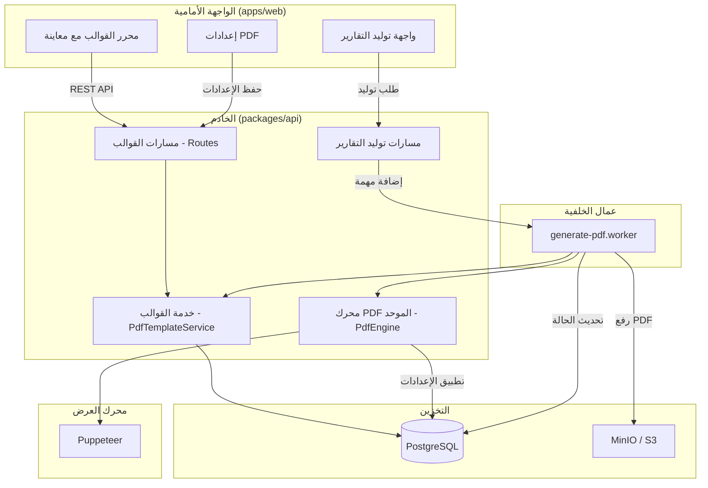
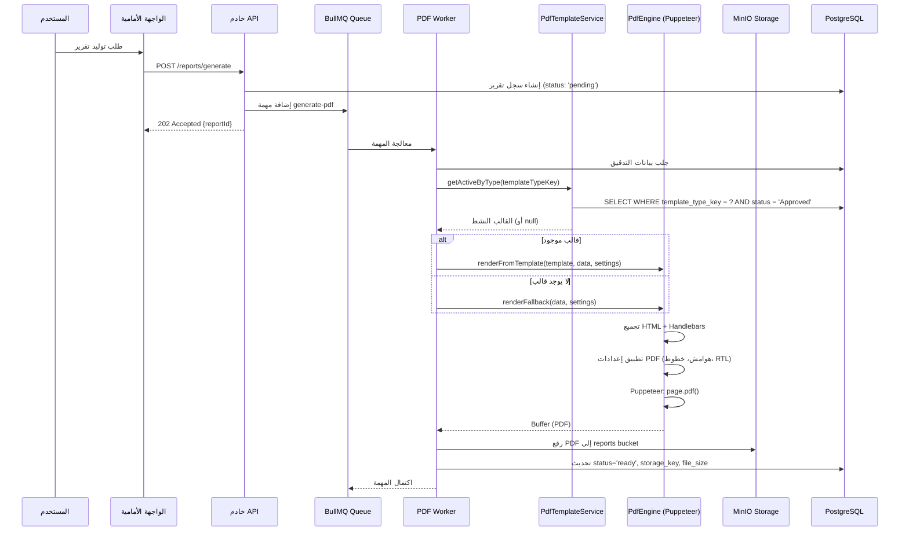

# وثيقة التصميم: إعادة هيكلة نظام قوالب PDF

## Overview

يعاني نظام قوالب PDF الحالي في تطبيق الساقي من عدة مشاكل هيكلية: تكرار الكود بين `src/server/` و `packages/api/`، عدم اتصال Worker الخلفي بالقوالب المخزنة، عدم تطابق مفاتيح أنواع القوالب (عربي مقابل إنجليزي)، استخدام `html2canvas` غير الموثوق، وثلاث تنفيذات منفصلة لتوليد PDF لا تتشارك المنطق.

يهدف هذا التصميم إلى توحيد نظام PDF في بنية نظيفة ومركزية: خدمة واحدة للقوالب في `packages/api/`، محرك توليد PDF موحد يعمل على الخادم (Puppeteer)، مفاتيح ثابتة لأنواع القوالب، ومحرر قوالب مع معاينة حية.

## Architecture

### المخطط العام



### مخطط التسلسل: توليد تقرير PDF



## Components and Interfaces

### المكون 1: PdfTemplateService (موحّد)

**الغرض**: خدمة CRUD موحدة للقوالب - تحل محل النسختين المكررتين

**الموقع**: `packages/api/src/services/PdfTemplateService.ts` (النسخة الوحيدة)

```typescript
interface PdfTemplate {
  id: string;
  template_name: string;
  template_type_key: TemplateTypeKey;  // مفتاح ثابت
  template_type_label?: string;        // التسمية المعروضة (من i18n)
  content: string;                     // HTML + Handlebars
  status: 'Draft' | 'Approved' | 'Archived';
  is_default: boolean;
  version: number;
  created_by: string;
  updated_by: string;
  created_at: string;
  updated_at: string;
}

type TemplateTypeKey =
  | 'audit_report'
  | 'quarterly_report'
  | 'annual_report'
  | 'audit_plan'
  | 'audit_missions'
  | 'recommendations'
  | 'outgoing_letter'
  | 'general';

interface IPdfTemplateService {
  getAll(): Promise<PdfTemplate[]>;
  getById(id: string): Promise<PdfTemplate>;
  getActiveByType(typeKey: TemplateTypeKey): Promise<PdfTemplate | null>;
  create(data: CreateTemplateDto, username: string): Promise<PdfTemplate>;
  update(id: string, data: UpdateTemplateDto, username: string): Promise<PdfTemplate>;
  delete(id: string, username: string): Promise<void>;
}
```

**المسؤوليات**:
- إدارة CRUD للقوالب مع إصدارات (versioning)
- البحث بالمفتاح الثابت (`template_type_key`) بدلاً من النص المترجم
- تسجيل المراجعة (audit trail) لكل عملية
- ضمان وجود قالب افتراضي واحد فقط لكل نوع

---

### المكون 2: PdfEngine (محرك PDF الموحد)

**الغرض**: محرك واحد لتوليد PDF يستبدل التنفيذات الثلاث المنفصلة

**الموقع**: `packages/api/src/services/PdfEngine.ts`

```typescript
interface PdfSettings {
  arabic_font_name: string;
  arabic_font_size: number;
  heading_font_size: number;
  subheading_font_size: number;
  table_font_size: number;
  rtl_enabled: boolean;
  margin_top: number;
  margin_right: number;
  margin_bottom: number;
  margin_left: number;
  header_template: string | null;
  footer_template: string | null;
  logo_position: 'left' | 'center' | 'right' | 'none';
  show_page_number: boolean;
}

interface RenderOptions {
  template?: PdfTemplate;
  data: Record<string, unknown>;
  settings: PdfSettings;
  language: 'ar' | 'en';
  fileName?: string;
}

interface PdfResult {
  buffer: Buffer;
  pageCount: number;  // مؤقتاً = 0 حتى إضافة pdf-parse لاحقاً
  fileSize: number;
}

interface IPdfEngine {
  renderFromTemplate(options: RenderOptions): Promise<PdfResult>;
  renderFallback(options: RenderOptions): Promise<PdfResult>;
  compilePreviewHtml(htmlContent: string, data: Record<string, unknown>, settings: PdfSettings, language: 'ar' | 'en'): { compiledHtml: string; errors: string[] };
  dispose(): Promise<void>;
}
```

**المسؤوليات**:
- تجميع قوالب Handlebars مع البيانات
- تطبيق إعدادات PDF (هوامش، خطوط، RTL، رأس/تذييل)
- توليد PDF عبر Puppeteer (نص متجه، ترقيم صفحات حقيقي)
- توفير وضع المعاينة السريعة (compile Handlebars → HTML string — بدون Puppeteer)
- إدارة browser pool لإعادة الاستخدام

> **استراتيجية المعاينة ذات المستويين:**
> - **المستوى 1 — معاينة سريعة (client-side):** Handlebars compile + inject في `<iframe sandbox>` مباشرة في المتصفح. الخادم يعيد `{ compiledHtml: string }` فقط عبر `POST /pdf-templates/preview-html`. لا Puppeteer.
> - **المستوى 2 — معاينة دقيقة (server-side):** زر "معاينة PDF" يطلب من الخادم توليد PDF حقيقي عبر Puppeteer ويعيد رابط تحميل عبر `POST /pdf-templates/preview-pdf`.

---

### المكون 3: TemplateTypeRegistry (سجل أنواع القوالب)

**الغرض**: حل مشكلة عدم تطابق المفاتيح بين الواجهة والخادم

**الموقع**: `packages/api/src/constants/templateTypes.ts` (مشترك)

```typescript
interface TemplateTypeDefinition {
  key: TemplateTypeKey;
  i18nLabel: string;  // مفتاح الترجمة في i18n
  defaultTemplate?: string;  // HTML افتراضي
}

const TEMPLATE_TYPES: TemplateTypeDefinition[] = [
  { key: 'audit_report', i18nLabel: 'pdfTemplates.auditReport' },
  { key: 'quarterly_report', i18nLabel: 'pdfTemplates.quarterlyReport' },
  { key: 'annual_report', i18nLabel: 'pdfTemplates.annualReport' },
  { key: 'audit_plan', i18nLabel: 'pdfTemplates.auditPlan' },
  { key: 'audit_missions', i18nLabel: 'pdfTemplates.auditMissions' },
  { key: 'recommendations', i18nLabel: 'pdfTemplates.recommendations' },
  { key: 'outgoing_letter', i18nLabel: 'pdfTemplates.outgoingLetter' },
  { key: 'general', i18nLabel: 'pdfTemplates.general' },
];
```

**المسؤوليات**:
- تعريف مركزي لجميع أنواع القوالب بمفاتيح ثابتة
- ربط المفاتيح بمفاتيح الترجمة (i18n)
- مشاركة التعريفات بين الواجهة والخادم

---

### المكون 4: محرر القوالب المحسّن

**الغرض**: استبدال textarea الخام بمحرر مع معاينة حية

**الموقع**: `apps/web/src/components/PdfTemplateEditor.tsx`

```typescript
interface PdfTemplateEditorProps {
  template: PdfTemplate | null;
  onSave: (data: CreateTemplateDto) => Promise<void>;
  onCancel: () => void;
}

interface EditorState {
  content: string;
  previewHtml: string;
  previewLoading: boolean;
  syntaxErrors: SyntaxError[];
  sampleData: Record<string, unknown>;
}
```

**المسؤوليات**:
- محرر كود مع تلوين بناء الجملة (CodeMirror/Monaco)
- معاينة حية (debounced) تعرض الناتج المُجمّع
- التحقق من صحة بناء Handlebars
- بيانات تجريبية قابلة للتعديل للمعاينة

## Data Models

### جدول `pdf_templates` (محدّث)

```typescript
interface PdfTemplateRow {
  id: string;              // UUID, PRIMARY KEY
  template_name: string;   // اسم القالب المعروض
  template_type_key: string; // ⬅️ جديد: مفتاح ثابت (audit_report, quarterly_report, ...)
  template_type: string;   // ⬅️ يُبقى مؤقتاً للتوافق العكسي
  content: string;         // محتوى HTML + Handlebars
  status: string;          // Draft | Approved | Archived
  is_default: number;      // 0 أو 1
  version: number;         // رقم الإصدار (يزداد عند تغيير المحتوى)
  created_by: string;
  updated_by: string;
  created_at: string;
  updated_at: string;
}
```

**تعديلات قاعدة البيانات (Migration)**:

```sql
-- إضافة عمود المفتاح الثابت
ALTER TABLE pdf_templates ADD COLUMN template_type_key VARCHAR(50);

-- ملء المفتاح بناءً على القيم الحالية
UPDATE pdf_templates SET template_type_key = CASE
  WHEN template_type = 'تقرير التدقيق' OR template_type = 'Audit Report' THEN 'audit_report'
  WHEN template_type = 'التقرير الربعي' OR template_type = 'Quarterly Report' THEN 'quarterly_report'
  WHEN template_type = 'التقرير السنوي' OR template_type = 'Annual Report' THEN 'annual_report'
  WHEN template_type = 'خطة التدقيق' OR template_type = 'Audit Plan' THEN 'audit_plan'
  WHEN template_type = 'مهام التدقيق' OR template_type = 'Audit Missions' THEN 'audit_missions'
  WHEN template_type = 'التوصيات' OR template_type = 'Recommendations' THEN 'recommendations'
  WHEN template_type = 'خطاب صادر' OR template_type = 'Outgoing Letter' THEN 'outgoing_letter'
  ELSE 'general'
END;

-- جعل العمود إلزامياً
ALTER TABLE pdf_templates ALTER COLUMN template_type_key SET NOT NULL;

-- إنشاء فهرس للبحث السريع
CREATE INDEX idx_pdf_templates_type_key_status 
  ON pdf_templates(template_type_key, status) 
  WHERE is_default = 1;

-- ملاحظة 1: ضمان وحدانية القالب الافتراضي على مستوى قاعدة البيانات
-- هذا الـ UNIQUE INDEX يمنع وجود أكثر من قالب افتراضي معتمد لكل نوع
-- حتى في حالة انهيار transaction أو race condition
CREATE UNIQUE INDEX idx_one_default_per_type
  ON pdf_templates(template_type_key)
  WHERE is_default = 1 AND status = 'Approved';
```

### جدول `pdf_settings` (بدون تغيير)

```typescript
interface PdfSettingsRow {
  id: number;              // دائماً 1
  arabic_font_name: string;
  arabic_font_size: number;
  heading_font_size: number;
  subheading_font_size: number;
  table_font_size: number;
  rtl_enabled: number;     // 0 أو 1
  margin_top: number;
  margin_right: number;
  margin_bottom: number;
  margin_left: number;
  header_template: string | null;
  footer_template: string | null;
  logo_position: string;
  show_page_number: number; // 0 أو 1
}
```

### دوال التحويل (Mapper Functions)

```typescript
/**
 * تحويل صف قاعدة البيانات (number) إلى واجهة الخدمة (boolean)
 * يحل مشكلة التعارض بين PdfTemplateRow.is_default (number)
 * و PdfTemplate.is_default (boolean)
 */
function mapRowToTemplate(row: PdfTemplateRow): PdfTemplate {
  return {
    ...row,
    is_default: row.is_default === 1,
    status: row.status as PdfTemplate['status'],
    template_type_key: row.template_type_key as TemplateTypeKey,
  };
}

function mapRowToSettings(row: PdfSettingsRow): PdfSettings {
  return {
    ...row,
    rtl_enabled: row.rtl_enabled === 1,
    show_page_number: row.show_page_number === 1,
    logo_position: row.logo_position as PdfSettings['logo_position'],
  };
}

// ملاحظة: PdfTemplateRow (طبقة قاعدة البيانات) يبقى is_default: number
// PdfTemplate (طبقة الـ service/API) يكون is_default: boolean
// الـ mapper يُستدعى في كل دالة تعيد PdfTemplate من الـ service
```

## الشيفرة الزائفة الخوارزمية

### خوارزمية توليد PDF الموحدة

```typescript
/**
 * الخوارزمية الرئيسية لتوليد PDF
 * تُستخدم من Worker والواجهة الأمامية (عبر API endpoint للمعاينة)
 */
async function generatePdf(options: RenderOptions): Promise<PdfResult> {
  // المتطلبات المسبقة:
  // - options.data غير فارغ
  // - options.settings موجودة وصالحة
  // - options.language إما 'ar' أو 'en'

  // الخطوة 1: تجميع HTML
  let html: string;
  
  if (options.template) {
    // استخدام القالب المخزن
    const compiledTemplate = Handlebars.compile(options.template.content);
    html = compiledTemplate(options.data);
  } else {
    // استخدام القالب الاحتياطي المدمج
    html = buildFallbackHtml(options.data, options.language);
  }

  // الخطوة 2: إنشاء HTML كامل مع الأنماط
  const fullHtml = wrapWithStyles(html, options.settings, options.language);

  // الخطوة 3: توليد PDF عبر Puppeteer
  const browser = await getBrowserInstance();
  const page = await browser.newPage();
  
  try {
    await page.setContent(fullHtml, { waitUntil: 'networkidle0' });
    
    const pdfBuffer = await page.pdf({
      format: 'A4',
      margin: {
        top: `${options.settings.margin_top}mm`,
        right: `${options.settings.margin_right}mm`,
        bottom: `${options.settings.margin_bottom}mm`,
        left: `${options.settings.margin_left}mm`,
      },
      displayHeaderFooter: true,
      headerTemplate: buildHeaderTemplate(options.settings),
      footerTemplate: buildFooterTemplate(options.settings, options.language),
      printBackground: true,
    });

    // الضمانات اللاحقة:
    // - pdfBuffer هو Buffer صالح وغير فارغ
    // - الملف يبدأ بـ %PDF-
    // - حجم الملف > 0
    
    return {
      buffer: Buffer.from(pdfBuffer),
      pageCount: 0, // TODO: إضافة pdf-parse لاحقاً لاستخراج عدد الصفحات
      fileSize: pdfBuffer.length,
    };
  } finally {
    await page.close();
  }
}
```

### خوارزمية Worker المحدّثة

```typescript
/**
 * Worker محدّث يستخدم القوالب المخزنة + المحرك الموحد
 */
async function processGeneratePdfJob(job: Job, context: WorkerContext): Promise<void> {
  const { reportId, auditId, templateTypeKey } = job.data;
  const { storage, db, logger } = context;

  // الخطوة 1: جلب بيانات التدقيق
  const auditData = await fetchAuditData(db, auditId);
  if (!auditData) {
    await markReportFailed(db, reportId, `Audit ${auditId} not found`);
    throw new UnrecoverableError(`Audit ${auditId} not found`);
  }

  // الخطوة 2: جلب القالب النشط بالمفتاح الثابت
  const template = await PdfTemplateService.getActiveByType(templateTypeKey);
  // ملاحظة: إذا لم يوجد قالب، سيُستخدم الاحتياطي

  // الخطوة 3: جلب إعدادات PDF
  const settings = await SettingsService.getPdfSettings();

  // الخطوة 4: توليد PDF عبر المحرك الموحد
  const result = await PdfEngine.renderFromTemplate({
    template: template || undefined,
    data: formatAuditDataForTemplate(auditData),
    settings,
    language: auditData.language || 'ar',
  });

  // الخطوة 5: رفع إلى التخزين
  const storageKey = `audits/${auditId}/reports/${reportId}.pdf`;
  await storage.upload({
    key: storageKey,
    body: result.buffer,
    contentType: 'application/pdf',
    bucket: 'reports',
  });

  // الخطوة 6: تحديث سجل التقرير
  await db.prepare(
    `UPDATE audit_reports SET status = 'ready', content = ?, file_size = ?, updated_at = CURRENT_TIMESTAMP WHERE id = ?`
  ).run(storageKey, result.fileSize, reportId);
}
```

### خوارزمية حل مشكلة المفاتيح

```typescript
/**
 * تحويل مفاتيح الواجهة القديمة إلى المفاتيح الثابتة الجديدة
 * 
 * المشكلة: الواجهة تخزن template_type كنص مترجم (عربي/إنجليزي)
 * الحل: استخدام template_type_key ثابت في كل مكان
 */
function resolveTemplateTypeKey(input: string): TemplateTypeKey {
  // المتطلبات المسبقة: input غير فارغ

  // أولاً: تحقق إذا كان المدخل مفتاحاً ثابتاً بالفعل
  if (isValidTemplateTypeKey(input)) {
    return input as TemplateTypeKey;
  }

  // ثانياً: البحث في جدول التحويل (يدعم القيم القديمة)
  const LEGACY_MAPPING: Record<string, TemplateTypeKey> = {
    // المفاتيح الإنجليزية القديمة (من useReports)
    'auditReport': 'audit_report',
    'quarterlyReport': 'quarterly_report',
    'complianceRequirements': 'audit_report', // يُعيّن لأقرب نوع
    'activityAuditResults': 'audit_report',
    'eventParticipationSummary': 'general',
    'monthlyDepartmentReport': 'quarterly_report',
    
    // القيم العربية المترجمة (من PdfTemplateManagement)
    'تقرير التدقيق': 'audit_report',
    'التقرير الربعي': 'quarterly_report',
    'التقرير السنوي': 'annual_report',
    'خطة التدقيق': 'audit_plan',
    'مهام التدقيق': 'audit_missions',
    'التوصيات': 'recommendations',
    'خطاب صادر': 'outgoing_letter',
    'عام': 'general',
  };

  return LEGACY_MAPPING[input] || 'general';
  
  // الضمانات اللاحقة: دائماً يعيد TemplateTypeKey صالح
}
```

### خوارزمية buildFallbackHtml (قالب احتياطي لكل نوع)

```typescript
/**
 * يعيد HTML احتياطي لنوع القالب المحدد.
 * قالب منفصل لكل نوع من الأنواع الثمانية (وليس قالب عام مشترك).
 *
 * الموقع: packages/api/src/constants/fallbackTemplates.ts
 */
interface AuditDataForTemplate {
  auditTitle: string;         // إلزامي — عنوان التدقيق
  auditDate: string;          // إلزامي — تاريخ التدقيق
  auditorName: string;        // إلزامي — اسم المدقق
  departmentName: string;     // إلزامي — اسم الدائرة
  findings: Array<{           // إلزامي (قد تكون فارغة)
    title: string;
    description?: string;
    risk_level?: string;
    status?: string;
  }>;
  // حقول اختيارية حسب النوع:
  recommendations?: Array<{ action_plan?: string; responsible?: string; due_date?: string; status?: string }>;
  evidence?: Array<{ type?: string; description?: string; file_name?: string }>;
  scope?: string;
  objectives?: string;
  planCode?: string;
  status?: string;
}

const FALLBACK_TEMPLATES: Record<TemplateTypeKey, string> = {
  audit_report: `<div dir="{{#if isRtl}}rtl{{else}}ltr{{/if}}" ...>
    <h1>{{auditTitle}}</h1>
    <p>{{auditDate}} | {{auditorName}} | {{departmentName}}</p>
    <table>{{#each findings}}<tr><td>{{title}}</td><td>{{risk_level}}</td></tr>{{/each}}</table>
  </div>`,
  quarterly_report: `<!-- هيكل مشابه مع KPIs ربعية -->`,
  annual_report: `<!-- هيكل مع ملخص سنوي -->`,
  audit_plan: `<!-- هيكل خطة التدقيق -->`,
  audit_missions: `<!-- هيكل مهام التدقيق -->`,
  recommendations: `<!-- هيكل التوصيات -->`,
  outgoing_letter: `<!-- هيكل الخطاب الصادر -->`,
  general: `<!-- هيكل عام -->`,
};

function buildFallbackHtml(
  data: AuditDataForTemplate,
  language: 'ar' | 'en',
  templateTypeKey: TemplateTypeKey = 'general'
): string {
  // المتطلبات المسبقة:
  // - data.auditTitle, data.auditDate, data.auditorName, data.departmentName موجودة
  // - data.findings مصفوفة (قد تكون فارغة)
  // - templateTypeKey ∈ TemplateTypeKey

  const fallbackHtml = FALLBACK_TEMPLATES[templateTypeKey];
  const compiled = Handlebars.compile(fallbackHtml);
  return compiled({ ...data, isRtl: language === 'ar' });

  // الضمانات اللاحقة:
  // - يعيد HTML صالح يحتوي على auditTitle على الأقل
  // - يعمل لجميع الأنواع الثمانية
}
```

## الدوال الرئيسية مع المواصفات الرسمية

### الدالة 1: PdfEngine.renderFromTemplate()

```typescript
async function renderFromTemplate(options: RenderOptions): Promise<PdfResult>
```

**المتطلبات المسبقة (Preconditions)**:
- `options.data` ليس null ويحتوي على بيانات صالحة
- `options.settings` يحتوي على جميع حقول الإعدادات المطلوبة
- `options.language` هو `'ar'` أو `'en'`
- إذا وُجد `options.template`، فإن `content` يحتوي على HTML صالح مع بناء Handlebars سليم

**الضمانات اللاحقة (Postconditions)**:
- يعيد `PdfResult` مع `buffer` غير فارغ
- `buffer` يبدأ بتوقيع PDF (`%PDF-`)
- `fileSize` يساوي `buffer.length`
- `pageCount >= 1`
- في حالة الخطأ: يُرمى استثناء مع رسالة واضحة (لا يعيد buffer فارغ)

**ثوابت الحلقة (Loop Invariants)**: لا توجد حلقات - عملية خطية

---

### الدالة 2: PdfTemplateService.getActiveByType()

```typescript
async function getActiveByType(typeKey: TemplateTypeKey): Promise<PdfTemplate | null>
```

**المتطلبات المسبقة**:
- `typeKey` هو مفتاح صالح من `TemplateTypeKey`
- اتصال قاعدة البيانات نشط

**الضمانات اللاحقة**:
- يعيد `PdfTemplate` إذا وُجد قالب بحالة `'Approved'` و `is_default = true` لهذا النوع
- يعيد `null` إذا لم يوجد قالب مطابق
- القالب المُعاد (إن وُجد) هو الأحدث تحديثاً

---

### الدالة 3: wrapWithStyles()

```typescript
function wrapWithStyles(
  bodyHtml: string, 
  settings: PdfSettings, 
  language: 'ar' | 'en'
): string
```

**المتطلبات المسبقة**:
- `bodyHtml` هو HTML صالح (قد يكون جزئياً)
- `settings` يحتوي على جميع الحقول المطلوبة

**الضمانات اللاحقة**:
- يعيد مستند HTML كامل (`<!DOCTYPE html>...</html>`)
- يتضمن اتجاه `dir="rtl"` إذا كانت اللغة عربية
- يتضمن خط عربي مضمّن (Tahoma/Amiri) عبر `@font-face`
- يتضمن أنماط الهوامش والخطوط من الإعدادات
- يتضمن أنماط طباعة مناسبة (`@media print`)

> **قاعدة أولوية الأنماط:** إعدادات PDF (من `pdf_settings`) دائماً تُطبَّق كـ inline styles على `<body>` مباشرة، وبالتالي تأخذ أولوية على أنماط `<style>` الموجودة في القالب إلا إذا استخدم القالب `!important` صراحة. هذا السلوك مقصود ومتوقع — يضمن أن مسؤول النظام يتحكم بالمظهر النهائي عبر الإعدادات.

---

### الدالة 4: compilePreviewHtml()

```typescript
function compilePreviewHtml(
  htmlContent: string,
  data: Record<string, unknown>,
  settings: PdfSettings,
  language: 'ar' | 'en'
): { compiledHtml: string; errors: string[] }
```

**المتطلبات المسبقة**:
- `htmlContent` هو نص (قد يحتوي على أخطاء Handlebars)
- `data` كائن (قد يكون فارغاً)

**الضمانات اللاحقة**:
- يعيد `compiledHtml`: مستند HTML كامل جاهز للعرض في iframe
- يعيد `errors`: مصفوفة أخطاء Handlebars (فارغة إذا نجح التجميع)
- في حالة خطأ Handlebars: `compiledHtml` يحتوي على HTML يعرض رسالة الخطأ
- لا يستدعي Puppeteer — عملية synchronous سريعة (≤ 5ms)
- لا يكتب ملفات مؤقتة على القرص

## أمثلة الاستخدام

### مثال 1: توليد تقرير من Worker

```typescript
// في generate-pdf.worker.ts المحدّث
import { PdfEngine } from '../services/PdfEngine';
import { PdfTemplateService } from '../services/PdfTemplateService';
import { SettingsService } from '../services/SettingsService';

const worker: JobProcessor<'generate-pdf'> = async (job, context) => {
  const { reportId, auditId, templateTypeKey } = job.data;
  
  // جلب القالب بالمفتاح الثابت
  const template = await PdfTemplateService.getActiveByType(templateTypeKey);
  const settings = await SettingsService.getPdfSettings();
  const auditData = await fetchAuditData(context.db, auditId);
  
  // توليد PDF - المحرك يتعامل مع كلا الحالتين
  const result = await PdfEngine.renderFromTemplate({
    template: template || undefined,
    data: auditData,
    settings,
    language: 'ar',
  });
  
  // رفع النتيجة
  await context.storage.upload({
    key: `audits/${auditId}/reports/${reportId}.pdf`,
    body: result.buffer,
    contentType: 'application/pdf',
    bucket: 'reports',
  });
};
```

### مثال 2: معاينة حية في المحرر (مستويين)

```typescript
// في PdfTemplateEditor.tsx — المستوى 1: معاينة سريعة عبر iframe (client-side compile)
const handleContentChange = useDebouncedCallback(async (content: string) => {
  try {
    // المستوى 1: Handlebars compile على الخادم → HTML جاهز → inject في iframe
    const response = await api.post('/pdf-templates/preview-html', {
      content,
      sampleData: editorState.sampleData,
    });
    // عرض HTML المُجمّع مباشرة في iframe sandbox
    setPreviewHtml(response.data.compiledHtml);
    setSyntaxErrors(response.data.errors || []);
  } catch (err) {
    if (err.response?.data?.errors) {
      setSyntaxErrors(err.response.data.errors);
    }
  }
}, 800);

// المستوى 2: معاينة PDF دقيقة (عند ضغط زر "معاينة PDF")
const handlePreviewPdf = async () => {
  const response = await api.post('/pdf-templates/preview-pdf', {
    content: editorState.content,
    sampleData: editorState.sampleData,
  }, { responseType: 'blob' });
  const url = URL.createObjectURL(response.data);
  window.open(url);
};
```

### مثال 3: طلب توليد من الواجهة (بدون html2canvas)

```typescript
// في useReports.ts المحدّث
const generateAuditPDF = async () => {
  // بدلاً من توليد PDF محلياً، نطلب من الخادم
  const response = await api.post('/reports/generate', {
    auditId: selectedAuditId,
    templateTypeKey: selectedReportType, // مفتاح ثابت
    title: reportTitle,
    findings: selectedFindings,
  });
  
  // الخادم يعيد رابط التحميل مباشرة أو reportId للمتابعة
  if (response.data.downloadUrl) {
    window.open(response.data.downloadUrl);
  } else {
    // بدء polling لحالة التقرير
    pollReportStatus(
      response.data.reportId,
      (url) => window.open(url),
      (error) => setError(error)
    );
  }
};
```

### مثال 4: pollReportStatus — HTTP polling مع timeout

```typescript
// في apps/web/src/utils/pollReportStatus.ts
async function pollReportStatus(
  reportId: string,
  onReady: (downloadUrl: string) => void,
  onFailed: (error: string) => void
): Promise<void> {
  const POLL_INTERVAL_MS = 3_000;   // كل 3 ثوان
  const MAX_WAIT_MS = 5 * 60_000;   // 5 دقائق كحد أقصى
  const startTime = Date.now();

  const poll = async () => {
    if (Date.now() - startTime > MAX_WAIT_MS) {
      onFailed('انتهت مهلة توليد التقرير. يرجى المحاولة مرة أخرى.');
      return;
    }

    const status = await api.get(`/reports/${reportId}/status`);

    if (status.data.status === 'ready') {
      onReady(status.data.downloadUrl);
    } else if (status.data.status === 'failed') {
      onFailed(status.data.errorMessage || 'فشل توليد التقرير.');
    } else {
      setTimeout(poll, POLL_INTERVAL_MS); // pending → استمر
    }
  };

  await poll();
}

// Endpoint مطلوب على الخادم:
// GET /reports/:reportId/status
// يعيد: { status: 'pending' | 'ready' | 'failed', downloadUrl?: string, errorMessage?: string }
```

## Correctness Properties

*الخاصية هي سلوك أو صفة يجب أن تبقى صحيحة عبر جميع حالات التنفيذ الصالحة للنظام — بمثابة جسر بين المواصفات المقروءة بشرياً وضمانات الصحة القابلة للتحقق آلياً.*

### Property 1: وحدانية القالب الافتراضي لكل نوع

*لأي* TemplateTypeKey وأي تسلسل من عمليات تعيين القالب الافتراضي، يجب ألا يوجد أبداً أكثر من قالب واحد بحالة Approved و is_default = 1 لنفس النوع — سواء تم التحقق عبر getActiveByType أو عبر استعلام قاعدة البيانات مباشرة.

**Validates: Requirements 2.1, 2.3**

### Property 2: resolveTemplateTypeKey دائماً يعيد مفتاحاً صالحاً

*لأي* سلسلة نصية مدخلة (بما فيها النصوص العشوائية، التسميات العربية، المفاتيح الإنجليزية القديمة)، يجب أن تعيد resolveTemplateTypeKey قيمة من مجموعة TemplateTypeKey الثابتة (8 قيم) ولا تُرمي استثناء أبداً — مع إعادة "general" لأي مدخل غير معروف.

**Validates: Requirements 3.2, 3.5**

### Property 3: renderFromTemplate يُنتج PDF صالح بنيوياً

*لأي* RenderOptions صالحة (سواء مع قالب مخزن أو بدونه)، يجب أن يعيد renderFromTemplate نتيجة حيث: buffer.length > 0، والبايتات الخمس الأولى تساوي '%PDF-'، و fileSize === buffer.length.

**Validates: Requirements 4.1, 4.2, 4.3**

### Property 4: حالة التقرير النهائية دائماً محددة

*لأي* مهمة توليد PDF تدخل النظام (حيث بيانات التدقيق موجودة أو غير موجودة)، يجب أن تصل حالة التقرير في النهاية إلى إحدى الحالتين النهائيتين: "ready" أو "failed" — ولا تبقى في حالة "pending" إلى أجل غير مسمى.

**Validates: Requirements 8.5, 5.5, 5.6**

### Property 5: تنظيف HTML يزيل العناصر الخطرة

*لأي* محتوى HTML يحتوي على عناصر script أو iframe أو سمات on-event، يجب أن يُنتج التنظيف HTML لا يحتوي على أي من هذه العناصر الخطرة.

**Validates: Requirements 9.1**

### Property 6: compilePreviewHtml — صحة التجميع والأخطاء

*لأي* قالب Handlebars صالح نحوياً وبيانات عينة، يجب أن يعيد compilePreviewHtml مستند HTML يحتوي على قيم البيانات مع مصفوفة أخطاء فارغة. *ولأي* قالب يحتوي على بناء Handlebars غير صالح، يجب أن يعيد مصفوفة أخطاء غير فارغة مع HTML يحتوي على وصف الخطأ.

**Validates: Requirements 6.3, 6.4, 6.5**

### Property 7: حد حجم محتوى القالب

*لأي* محتوى قالب يتجاوز 500KB، يجب أن ترفض PdfTemplateService العملية. *ولأي* محتوى أقل من أو يساوي 500KB، يجب أن تقبله.

**Validates: Requirements 9.3**

### Property 8: تحويل الصف — is_default (number ↔ boolean)

*لأي* صف قاعدة بيانات حيث is_default = 0 أو 1، يجب أن تعيد mapRowToTemplate كائن PdfTemplate مع is_default = false أو true على التوالي. التحويل يحافظ على التكافؤ الدلالي بين الطبقتين.

**Validates: Requirements 1.5**

### Property 9: زيادة الإصدار عند التحديث مع تسجيل المراجعة

*لأي* قالب بإصدار N وأي عملية تحديث بواسطة مستخدم معين، يجب أن ينتج القالب المحدث بإصدار N+1 مع تسجيل اسم المستخدم وطابع زمني حديث.

**Validates: Requirements 1.3, 1.4**

## Error Handling

### سيناريو 1: فشل تجميع قالب Handlebars

**الشرط**: محتوى القالب يحتوي على بناء Handlebars غير صالح
**الاستجابة**: 
- في المعاينة: عرض رسالة خطأ مع رقم السطر
- في Worker: الانتقال للقالب الاحتياطي مع تسجيل تحذير
**الاستعادة**: تسجيل الخطأ، إعلام المستخدم، عدم إيقاف العملية

### سيناريو 2: Puppeteer timeout

**الشرط**: الصفحة تأخذ أكثر من 30 ثانية للعرض
**الاستجابة**: إغلاق الصفحة، إعادة المحاولة مرة واحدة
**الاستعادة**: بعد فشلين متتاليين، العودة لتوليد jsPDF الاحتياطي

### سيناريو 3: قالب غير موجود للنوع المطلوب

**الشرط**: `getActiveByType` يعيد `null`
**الاستجابة**: استخدام القالب الاحتياطي المدمج (hardcoded HTML)
**الاستعادة**: تسجيل تحذير، توليد PDF بنجاح مع القالب الاحتياطي

### سيناريو 4: Worker يفشل بعد 3 محاولات

**الشرط**: `attemptsMade >= maxAttempts`
**الاستجابة**: تحديث `audit_reports.status = 'failed'` مع رسالة الخطأ
**الاستعادة**: المستخدم يمكنه إعادة المحاولة يدوياً من الواجهة

## Testing Strategy

### اختبارات الوحدة

- **PdfTemplateService**: اختبار CRUD، ضمان وحدانية القالب الافتراضي، التحقق من الإصدارات
- **resolveTemplateTypeKey**: اختبار كل مدخل قديم (عربي/إنجليزي/camelCase) يُحوّل بشكل صحيح
- **wrapWithStyles**: اختبار RTL، اختبار تضمين الخطوط، اختبار تطبيق الإعدادات
- **buildFallbackHtml**: اختبار الإخراج لكلا اللغتين مع بيانات فارغة/كاملة

### اختبارات الخصائص (Property-Based Testing)

**مكتبة الاختبار**: fast-check

```typescript
// خاصية: أي مدخل لـ resolveTemplateTypeKey يعيد قيمة صالحة
fc.assert(
  fc.property(fc.string(), (input) => {
    const result = resolveTemplateTypeKey(input);
    return VALID_KEYS.includes(result);
  })
);

// خاصية: إنشاء قالب كافتراضي يلغي الافتراضي السابق
fc.assert(
  fc.property(fc.constantFrom(...TEMPLATE_TYPE_KEYS), async (typeKey) => {
    await service.create({ ...validData, template_type_key: typeKey, is_default: true }, 'user1');
    await service.create({ ...validData, template_type_key: typeKey, is_default: true }, 'user2');
    const defaults = await db.query(
      'SELECT COUNT(*) FROM pdf_templates WHERE template_type_key = $1 AND is_default = 1', [typeKey]
    );
    return defaults.rows[0].count <= 1;
  })
);
```

### اختبارات التكامل

- اختبار دورة كاملة: إنشاء قالب → الموافقة → توليد تقرير → التحقق من PDF
- اختبار Worker مع قالب موجود vs. بدون قالب
- اختبار API endpoint للمعاينة مع قوالب صالحة وغير صالحة
- اختبار migration: التحقق من تحويل القيم القديمة بشكل صحيح

## اعتبارات الأداء

- **Browser Pool**: استخدام Puppeteer مع مجموعة متصفحات (pool) بدلاً من فتح/إغلاق لكل طلب
  - حد أقصى: 3 instances متزامنة
  - إعادة تدوير بعد 50 صفحة لتجنب تسريب الذاكرة
- **تخزين مؤقت لتجميع القوالب**: تخزين نتيجة `Handlebars.compile()` في ذاكرة مؤقتة (LRU cache) بمفتاح `template.id + template.version`
- **Debounced Preview**: المعاينة الحية مع تأخير 800ms لتقليل الطلبات
- **Lazy Puppeteer**: تحميل Puppeteer فقط عند أول طلب PDF (لا يؤثر على وقت تشغيل الخادم)

## اعتبارات الأمان

- **تنظيف HTML**: استخدام `sanitize-html` (مصممة للخادم) قبل تمرير HTML القالب لـ Puppeteer لمنع XSS. تحذف `<script>`, `<iframe>`, `on*` attributes.
- **Sandbox**: تشغيل Puppeteer مع `--no-sandbox` فقط في Docker، وإلا `--sandbox`
- **حد حجم القالب**: أقصى 500KB لمحتوى القالب
- **Rate limiting**: حد 10 طلبات معاينة/دقيقة لكل مستخدم
- **لا وصول للشبكة**: `page.setRequestInterception(true)` لمنع القوالب من تحميل موارد خارجية

## التبعيات

| التبعية | الاستخدام | بديل عن |
|---------|----------|---------|
| `puppeteer` | توليد PDF على الخادم (نص متجه، RTL، ترقيم) | html2canvas + jsPDF (عميل) |
| `handlebars` | تجميع القوالب (موجود بالفعل) | - |
| `sanitize-html` | تنظيف HTML من القوالب (server-side) | DOMPurify + jsdom |
| `generic-pool` | إدارة browser pool لـ Puppeteer | - |
| `codemirror` أو `@monaco-editor/react` | محرر كود مع تلوين في الواجهة | textarea خام |

### التبعيات المحذوفة

| التبعية | السبب |
|---------|-------|
| `html2canvas` | يُستبدل بـ Puppeteer server-side |
| `jspdf` (في Worker) | يُستبدل بـ Puppeteer |
| `jspdf-autotable` (في Worker) | يُستبدل بجداول HTML عادية |

> ملاحظة: `jsPDF` و `jspdf-autotable` يبقيان كـ fallback احتياطي في حالة فشل Puppeteer، لكن لا يكونان المسار الرئيسي.
