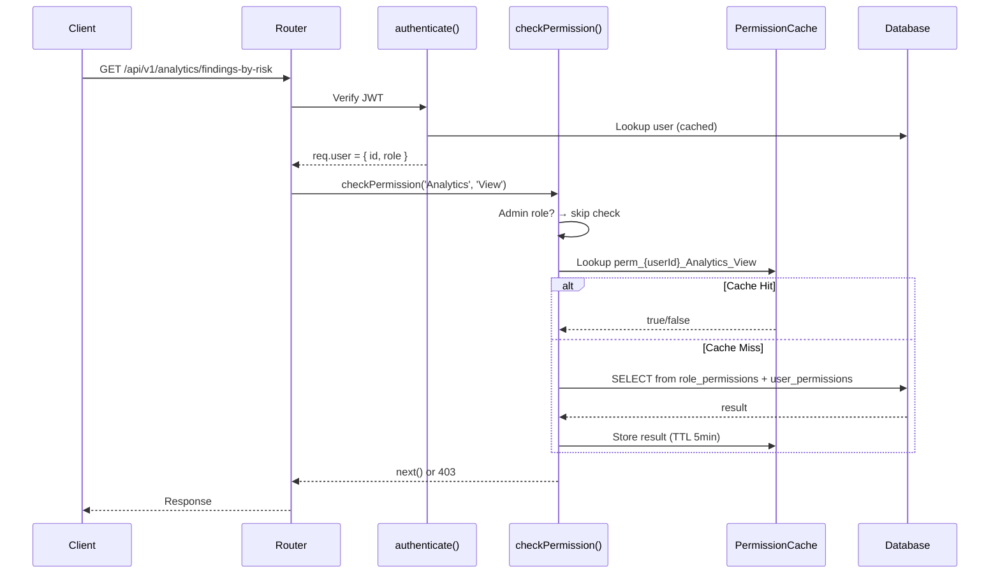
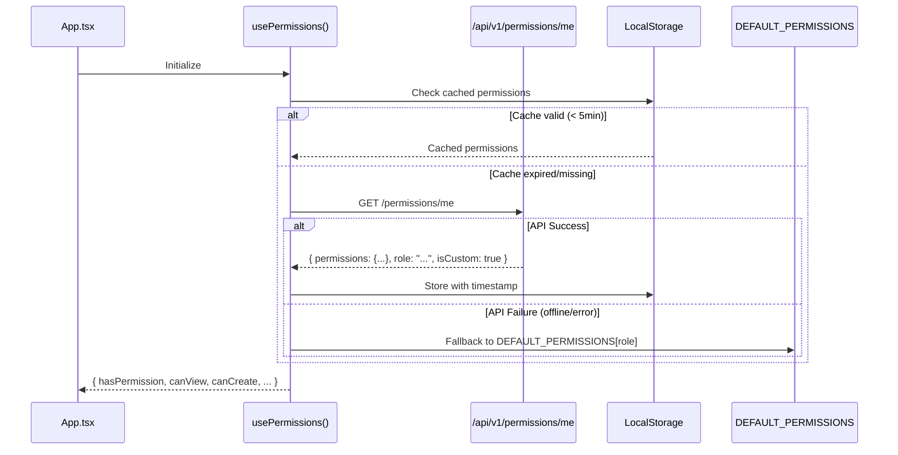
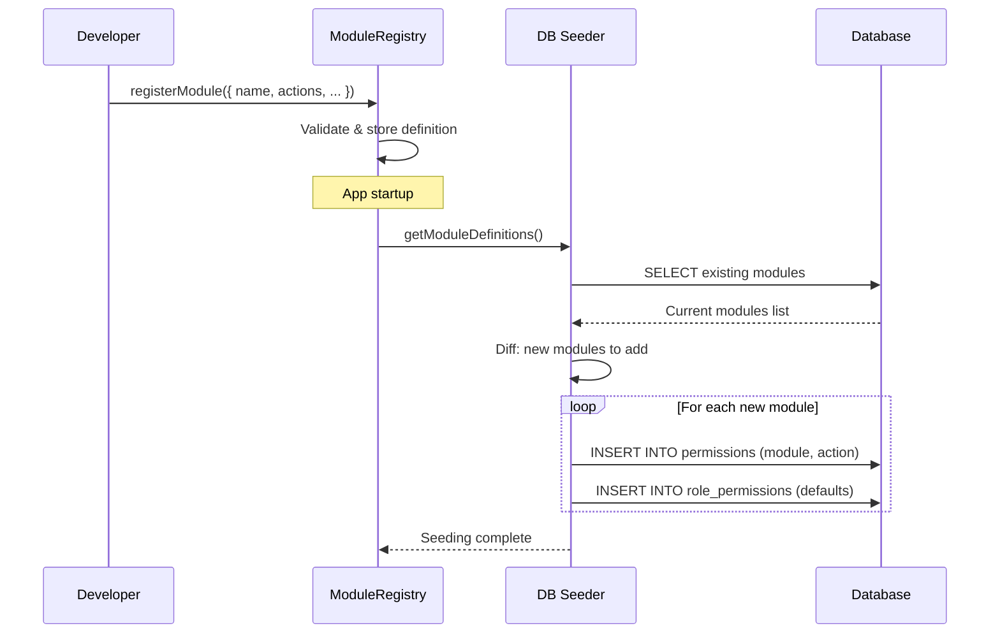

# Design Document: Permission System Overhaul

## Overview

The current permission system suffers from fragmentation: a static matrix (`DEFAULT_PERMISSIONS`) controls the frontend while the backend uses two competing mechanisms (`checkPermission()` for DB-based checks and `authorize()` for role-list checks). Module names are mismatched between frontend and backend, the frontend ignores DB-stored permissions entirely, and adding a new module requires editing 4-5 files manually.

This overhaul introduces a **Module Registry** as the single source of truth for all permission-related metadata. The registry auto-propagates module definitions to the DB, frontend API, middleware, and sidebar. All `authorize()` calls are replaced with `checkPermission()`, the frontend fetches permissions from the API (with static matrix as offline fallback), and custom roles become first-class citizens with full CRUD support.

The design eliminates `PERMISSION_MODULE_MAP` entirely by unifying module naming at the registry level, ensures file-level permissions are scoped per-module, and provides an auto-seeding mechanism so new modules are immediately available in the DB upon registration.

## Architecture

```mermaid
graph TD
    subgraph "Module Registry (Single Source of Truth)"
        MR[ModuleRegistry]
        MR --> MD[Module Definitions]
        MD --> |name, actions, defaultPerms| DB_SEED[DB Auto-Seeder]
        MD --> |sidebar config| FE_NAV[Frontend Navigation]
        MD --> |middleware config| BE_MW[Backend Middleware]
    end

    subgraph "Backend"
        DB[(PostgreSQL DB)]
        DB_SEED --> DB
        BE_MW --> CP[checkPermission Middleware]
        CP --> DB
        CP --> CACHE[Permission Cache]
    end

    subgraph "Frontend"
        API[/api/v1/permissions/me]
        FE_NAV --> SIDEBAR[Sidebar Component]
        API --> HOOK[usePermissions Hook]
        HOOK --> |DB permissions| PAGES[Page Components]
        HOOK --> |fallback| STATIC[Static Matrix]
    end

    subgraph "Admin Panel"
        ROLE_MGMT[Role Management UI]
        ROLE_MGMT --> ROLE_API[/api/v1/roles]
        ROLE_API --> DB
    end
```


## Sequence Diagrams

### Permission Check Flow (Backend)



### Frontend Permission Loading



### Module Registration & Auto-Seeding




## Components and Interfaces

### Component 1: ModuleRegistry

**Purpose**: Central registry that defines all permission modules, their actions, default role assignments, and UI metadata. Single file to edit when adding a new module.

**Interface**:
```typescript
interface ModuleDefinition {
  /** Unique module identifier - used in DB, middleware, and frontend */
  name: string;
  /** Human-readable label for UI */
  label: { en: string; ar: string };
  /** Which actions this module supports */
  actions: PermissionAction[];
  /** Default permissions per role (used for DB seeding & offline fallback) */
  defaults: Record<string, PermissionAction[]>;
  /** Sidebar/navigation configuration */
  navigation?: {
    icon: string;
    path: string;
    order: number;
    parent?: string;
  };
  /** File permission scope - files tagged with this module use these permissions */
  fileScope?: boolean;
}

interface ModuleRegistry {
  register(definition: ModuleDefinition): void;
  getModule(name: string): ModuleDefinition | undefined;
  getAllModules(): ModuleDefinition[];
  getModuleNames(): string[];
  getDefaultPermissions(role: string): Record<string, PermissionAction[]>;
  getNavigationConfig(): NavigationItem[];
}
```

**Responsibilities**:
- Store all module definitions in a single, declarative file
- Provide module metadata to all consumers (DB seeder, middleware, frontend)
- Validate module definitions at registration time
- Eliminate the need for PERMISSION_MODULE_MAP

### Component 2: PermissionService (Backend)

**Purpose**: Centralized service for all permission queries and mutations. Replaces scattered DB queries.

**Interface**:
```typescript
interface PermissionService {
  /** Check if user has specific permission (used by middleware) */
  hasPermission(userId: string, module: string, action: string): Promise<boolean>;
  /** Get all permissions for a user (used by /permissions/me endpoint) */
  getUserPermissions(userId: string): Promise<UserPermissionSet>;
  /** Get permissions for a role */
  getRolePermissions(roleId: string): Promise<RolePermissionSet>;
  /** Update role permissions (admin action) */
  updateRolePermissions(roleId: string, permissions: PermissionUpdate[]): Promise<void>;
  /** Override user-specific permissions */
  setUserPermissionOverride(userId: string, module: string, action: string, allowed: boolean): Promise<void>;
  /** Seed new modules into DB from registry */
  seedModules(modules: ModuleDefinition[]): Promise<SeedResult>;
  /** Invalidate cache for user or globally */
  invalidateCache(userId?: string): void;
}
```

**Responsibilities**:
- Execute permission queries against DB with caching
- Handle role_permissions + user_permissions union logic
- Manage cache invalidation on permission changes
- Seed new modules from registry on app startup


### Component 3: Unified checkPermission Middleware

**Purpose**: Single authorization middleware that replaces both `checkPermission()` and `authorize()`. All routes use this.

**Interface**:
```typescript
interface CheckPermissionOptions {
  /** Module name from registry */
  module: string;
  /** Required action */
  action: PermissionAction;
  /** Optional: allow if user has ANY of these permissions (OR logic) */
  anyOf?: Array<{ module: string; action: PermissionAction }>;
}

type CheckPermissionMiddleware = (
  module: string,
  action: PermissionAction
) => express.RequestHandler;
```

**Responsibilities**:
- Replace all `authorize(ADMIN_ROLES)`, `authorize(COMPLIANCE_ROLES)` calls
- Query PermissionService for DB-based permission check
- Admin bypass (Admin role always passes)
- Return 403 with descriptive error on denial

### Component 4: usePermissions Hook (Frontend - Refactored)

**Purpose**: Provides permission checks to React components, fetching from API with static fallback.

**Interface**:
```typescript
interface UsePermissionsReturn {
  hasPermission(module: string, action: PermissionAction): boolean;
  canView(module: string): boolean;
  canCreate(module: string): boolean;
  canEdit(module: string): boolean;
  canDelete(module: string): boolean;
  canApprove(module: string): boolean;
  isLoading: boolean;
  isCustomRole: boolean;
  permissions: UserPermissionSet | null;
  refetch(): Promise<void>;
}
```

**Responsibilities**:
- Fetch user permissions from `/api/v1/permissions/me` on mount
- Cache in localStorage with TTL (5 minutes)
- Fallback to `DEFAULT_PERMISSIONS` if API unavailable
- Expose loading state for skeleton UIs
- Refetch on role/permission change events (via WebSocket)

### Component 5: Permission Admin API

**Purpose**: CRUD endpoints for managing roles and permissions.

**Interface**:
```typescript
// Endpoints
// GET    /api/v1/permissions/me          → Current user's effective permissions
// GET    /api/v1/permissions/modules     → All registered modules with metadata
// GET    /api/v1/roles                   → List all roles (built-in + custom)
// POST   /api/v1/roles                   → Create custom role
// PUT    /api/v1/roles/:id               → Update role (name, description)
// DELETE /api/v1/roles/:id               → Delete custom role (if no users assigned)
// GET    /api/v1/roles/:id/permissions   → Get role's permission matrix
// PUT    /api/v1/roles/:id/permissions   → Update role's permission matrix
// GET    /api/v1/users/:id/permissions   → Get user-specific overrides
// PUT    /api/v1/users/:id/permissions   → Set user-specific overrides
```

**Responsibilities**:
- Expose module registry to admin UI
- CRUD for custom roles
- Permission matrix editing per role
- User-level permission overrides
- Audit logging for all permission changes


## Data Models

### ModuleDefinition

```typescript
interface ModuleDefinition {
  name: string;           // e.g., 'Analytics', 'Policies', 'AuditPlans'
  label: {
    en: string;           // e.g., 'Analytics'
    ar: string;           // e.g., 'التحليلات'
  };
  actions: PermissionAction[];  // e.g., ['View', 'Create', 'Edit', 'Delete']
  defaults: Record<string, PermissionAction[]>;  // role → actions
  navigation?: NavigationConfig;
  fileScope?: boolean;    // Whether files can be scoped to this module
}

type PermissionAction = 'View' | 'Create' | 'Edit' | 'Delete' | 'Approve';

interface NavigationConfig {
  icon: string;
  path: string;
  order: number;
  parent?: string;        // For nested navigation
}
```

**Validation Rules**:
- `name` must be unique, PascalCase, 1-50 chars
- `actions` must be non-empty subset of valid PermissionAction values
- `defaults` keys must reference valid role names
- `navigation.path` must start with `/`

### UserPermissionSet (API Response)

```typescript
interface UserPermissionSet {
  userId: string;
  role: string;
  roleId: string;
  isCustomRole: boolean;
  /** Effective permissions: role defaults + user overrides merged */
  permissions: Record<string, PermissionAction[]>;
  /** User-specific overrides (grants or denials beyond role) */
  overrides: Array<{
    module: string;
    action: PermissionAction;
    isAllowed: boolean;
  }>;
}
```

**Validation Rules**:
- `permissions` keys must be registered module names
- `overrides` cannot grant permissions to actions not supported by the module

### Role (DB Model)

```typescript
interface Role {
  id: string;             // UUID
  name: string;           // Unique, e.g., 'Compliance Officer'
  description?: string;
  isCustom: boolean;      // false for built-in 6 roles
  isSystem: boolean;      // true for Admin (cannot be deleted/modified)
  createdAt: Date;
  updatedAt: Date;
}
```

**Validation Rules**:
- Built-in roles (`isCustom = false`) cannot be deleted
- System role (Admin) cannot have permissions modified
- Custom role names must be unique and 2-100 chars
- A role cannot be deleted if users are still assigned to it

### PermissionRecord (DB Model)

```typescript
interface PermissionRecord {
  id: string;             // UUID
  module: string;         // From ModuleRegistry
  action: PermissionAction;
  description?: string;
}
// UNIQUE constraint on (module, action)
```


## Algorithmic Pseudocode

### Module Registry Initialization

```typescript
// src/permissions/registry.ts - THE single source of truth

import { ModuleDefinition, PermissionAction } from './types';

class ModuleRegistryImpl {
  private modules: Map<string, ModuleDefinition> = new Map();

  register(definition: ModuleDefinition): void {
    // PRECONDITION: definition.name is unique PascalCase string
    // PRECONDITION: definition.actions is non-empty
    if (this.modules.has(definition.name)) {
      throw new Error(`Module '${definition.name}' already registered`);
    }
    this.validateDefinition(definition);
    this.modules.set(definition.name, definition);
    // POSTCONDITION: module is retrievable by name
  }

  private validateDefinition(def: ModuleDefinition): void {
    if (!def.name || !/^[A-Z][a-zA-Z0-9]*$/.test(def.name)) {
      throw new Error(`Invalid module name: ${def.name}`);
    }
    if (!def.actions.length) {
      throw new Error(`Module ${def.name} must have at least one action`);
    }
    const validActions: PermissionAction[] = ['View', 'Create', 'Edit', 'Delete', 'Approve'];
    for (const action of def.actions) {
      if (!validActions.includes(action)) {
        throw new Error(`Invalid action '${action}' in module ${def.name}`);
      }
    }
  }

  getAllModules(): ModuleDefinition[] {
    return Array.from(this.modules.values());
  }

  getModule(name: string): ModuleDefinition | undefined {
    return this.modules.get(name);
  }

  getModuleNames(): string[] {
    return Array.from(this.modules.keys());
  }
}

export const ModuleRegistry = new ModuleRegistryImpl();
```

**Preconditions:**
- Module name is unique PascalCase identifier
- Actions array is non-empty and contains only valid PermissionAction values
- Default permissions reference only valid roles

**Postconditions:**
- Module is stored and retrievable by name
- All consumers (seeder, middleware, frontend) can access the definition
- No duplicate module names exist in registry

**Loop Invariants:** N/A (no loops in registration)


### DB Auto-Seeder Algorithm

```typescript
// src/permissions/seeder.ts

async function seedModulesFromRegistry(db: Database): Promise<SeedResult> {
  // PRECONDITION: ModuleRegistry has been populated
  // PRECONDITION: DB connection is active
  // POSTCONDITION: All registry modules exist in permissions table
  // POSTCONDITION: Default role_permissions are set for new modules

  const registeredModules = ModuleRegistry.getAllModules();
  const existingPermissions = await db.prepare(
    "SELECT module, action FROM permissions"
  ).all();

  const existingSet = new Set(
    existingPermissions.map((p: any) => `${p.module}:${p.action}`)
  );

  const added: string[] = [];
  const skipped: string[] = [];

  // LOOP INVARIANT: All processed modules either exist in DB or have been inserted
  for (const moduleDef of registeredModules) {
    for (const action of moduleDef.actions) {
      const key = `${moduleDef.name}:${action}`;

      if (existingSet.has(key)) {
        skipped.push(key);
        continue;
      }

      // Insert new permission
      const permId = await db.prepare(
        "INSERT INTO permissions (module, action, description) VALUES (?, ?, ?) RETURNING id"
      ).get(moduleDef.name, action, `${action} ${moduleDef.label.en}`);

      // Assign to roles based on defaults
      for (const [roleName, roleActions] of Object.entries(moduleDef.defaults)) {
        if (roleActions.includes(action as PermissionAction)) {
          const role = await db.prepare(
            "SELECT id FROM roles WHERE name = ?"
          ).get(roleName);

          if (role) {
            await db.prepare(
              "INSERT INTO role_permissions (role_id, permission_id) VALUES (?, ?) ON CONFLICT DO NOTHING"
            ).run(role.id, permId.id);
          }
        }
      }

      added.push(key);
    }
  }

  return { added, skipped, total: registeredModules.length };
}
```

**Preconditions:**
- ModuleRegistry is fully populated before seeding
- Database connection is active and permissions table exists
- Roles table is populated with at least the built-in roles

**Postconditions:**
- Every (module, action) pair from registry exists in permissions table
- Default role_permissions are created for new permissions only
- Existing permissions are never modified (idempotent)
- Returns count of added vs skipped for logging

**Loop Invariants:**
- After processing module M: all actions of M exist in DB
- existingSet accurately reflects DB state at start (no concurrent modifications assumed)


### Unified checkPermission Middleware

```typescript
// src/server/middleware/checkPermission.ts

export const createCheckPermission = (permissionService: PermissionService) => {
  return (module: string, action: PermissionAction): express.RequestHandler => {
    // PRECONDITION: module is a registered module name
    // PRECONDITION: action is a valid PermissionAction
    // PRECONDITION: req.user is populated by authenticate() middleware

    return async (req: any, res: any, next: any) => {
      const user = req.user;

      // Admin bypass - Admin always has full access
      if (user.role === 'Admin') {
        return next();
      }

      // Query effective permission (role + user overrides)
      const allowed = await permissionService.hasPermission(
        user.id,
        module,
        action
      );

      if (!allowed) {
        return res.status(403).json({
          error: `Forbidden: Missing permission '${action}' on module '${module}'`,
          code: 'PERMISSION_DENIED',
          module,
          action,
        });
      }

      next();
    };
  };
};
```

**Preconditions:**
- `authenticate()` middleware has run and populated `req.user`
- `module` exists in ModuleRegistry
- `action` is one of: View, Create, Edit, Delete, Approve

**Postconditions:**
- If user is Admin: always calls `next()`
- If user has permission in DB (role or user-level): calls `next()`
- If user lacks permission: returns 403 with structured error
- Permission result is cached for subsequent requests in same session

### Frontend Permission Fetching

```typescript
// src/hooks/usePermissions.ts (refactored)

const CACHE_KEY = 'user_permissions';
const CACHE_TTL = 5 * 60 * 1000; // 5 minutes

export function usePermissions(): UsePermissionsReturn {
  const { user } = useUser();
  const [permissions, setPermissions] = useState<UserPermissionSet | null>(null);
  const [isLoading, setIsLoading] = useState(true);

  const fetchPermissions = async () => {
    // PRECONDITION: user is authenticated
    // POSTCONDITION: permissions state is populated from API or fallback

    // Check localStorage cache first
    const cached = localStorage.getItem(CACHE_KEY);
    if (cached) {
      const { data, timestamp } = JSON.parse(cached);
      if (Date.now() - timestamp < CACHE_TTL) {
        setPermissions(data);
        setIsLoading(false);
        return;
      }
    }

    try {
      const response = await api.get('/permissions/me');
      const permData: UserPermissionSet = response.data;
      setPermissions(permData);
      localStorage.setItem(CACHE_KEY, JSON.stringify({
        data: permData,
        timestamp: Date.now(),
      }));
    } catch (error) {
      // Fallback to static matrix for offline/error scenarios
      console.warn('Failed to fetch permissions, using static fallback');
      const fallback = getStaticPermissions(user?.role);
      setPermissions(fallback);
    } finally {
      setIsLoading(false);
    }
  };

  const hasPermission = (module: string, action: PermissionAction): boolean => {
    if (!user) return false;
    if (user.role === 'Admin') return true;
    if (!permissions) return false;

    const modulePerms = permissions.permissions[module];
    return modulePerms?.includes(action) ?? false;
  };

  // ... canView, canCreate, canEdit, canDelete, canApprove helpers

  return { hasPermission, canView, canCreate, canEdit, canDelete, canApprove, isLoading, isCustomRole: permissions?.isCustomRole ?? false, permissions, refetch: fetchPermissions };
}
```

**Preconditions:**
- User is authenticated (user context available)
- API endpoint `/permissions/me` is accessible

**Postconditions:**
- `permissions` state is always populated (from API or fallback)
- `isLoading` transitions from true to false exactly once per fetch cycle
- Cache is updated on successful API response
- Fallback never throws - gracefully degrades to static matrix


## Key Functions with Formal Specifications

### Function: PermissionService.hasPermission()

```typescript
async hasPermission(userId: string, module: string, action: string): Promise<boolean>
```

**Preconditions:**
- `userId` is a valid UUID referencing an existing user
- `module` is a registered module name in ModuleRegistry
- `action` is one of: 'View', 'Create', 'Edit', 'Delete', 'Approve'

**Postconditions:**
- Returns `true` if user has the permission via role OR user-level override
- Returns `false` if user lacks permission AND has no granting override
- User-level `is_allowed = 1` overrides role denial
- User-level `is_allowed = 0` overrides role grant
- Result is cached with key `perm_{userId}_{module}_{action}`

**Loop Invariants:** N/A

### Function: PermissionService.seedModules()

```typescript
async seedModules(modules: ModuleDefinition[]): Promise<SeedResult>
```

**Preconditions:**
- `modules` array contains valid ModuleDefinition objects
- Database is connected and permissions/roles tables exist
- Built-in roles are already seeded in roles table

**Postconditions:**
- All (module, action) pairs exist in permissions table
- New permissions have default role_permissions assigned
- Existing permissions are unchanged (idempotent operation)
- `SeedResult.added` contains only newly created permission keys
- `SeedResult.skipped` contains already-existing permission keys

**Loop Invariants:**
- After processing index i: modules[0..i] are fully seeded in DB
- No duplicate (module, action) pairs exist in permissions table

### Function: ModuleRegistry.getDefaultPermissions()

```typescript
getDefaultPermissions(role: string): Record<string, PermissionAction[]>
```

**Preconditions:**
- `role` is a valid role name (built-in or custom)

**Postconditions:**
- Returns mapping of module name → allowed actions for the given role
- For built-in roles: returns the statically defined defaults
- For custom roles: returns empty object (custom roles start with no defaults)
- Never throws - returns empty object for unknown roles

**Loop Invariants:**
- For each module M in registry: result[M.name] is defined (possibly empty array)

### Function: invalidatePermissionCache()

```typescript
invalidateCache(userId?: string): void
```

**Preconditions:**
- If `userId` provided: it's a valid UUID string
- Cache instance is accessible

**Postconditions:**
- If `userId` provided: all cache entries containing that userId are removed
- If `userId` not provided: all permission cache entries (prefix `perm_`) are cleared
- Non-permission cache entries (user lookups) are unaffected
- Next permission check for affected users will query DB


## Example Usage

### Registering a New Module (Developer Workflow)

```typescript
// src/permissions/modules.ts - All module definitions in one file

import { ModuleRegistry } from './registry';
import { UserRole } from '../constants';

// Adding a new module = ONE entry here. That's it.
ModuleRegistry.register({
  name: 'Analytics',
  label: { en: 'Analytics', ar: 'التحليلات' },
  actions: ['View'],
  defaults: {
    [UserRole.ADMIN]: ['View'],
    [UserRole.MANAGER]: ['View'],
    [UserRole.INTERNAL_AUDITOR]: ['View'],
  },
  navigation: {
    icon: 'BarChart3',
    path: '/analytics',
    order: 2,
  },
});

ModuleRegistry.register({
  name: 'Policies',
  label: { en: 'Internal Policies', ar: 'السياسات الداخلية' },
  actions: ['View', 'Create', 'Edit', 'Delete'],
  defaults: {
    [UserRole.ADMIN]: ['View', 'Create', 'Edit', 'Delete'],
    [UserRole.MANAGER]: ['View'],
    [UserRole.COMPLIANCE_OFFICER]: ['View', 'Create', 'Edit'],
    [UserRole.INTERNAL_AUDITOR]: ['View'],
    [UserRole.RISK_OFFICER]: ['View'],
    [UserRole.VIEWER]: ['View'],
  },
  navigation: {
    icon: 'FileText',
    path: '/policies',
    order: 15,
  },
});

// ... all other modules registered similarly
```

### Using checkPermission in Routes (Replacing authorize)

```typescript
// BEFORE (policies.ts):
router.post('/policies', authenticate, authorize(COMPLIANCE_ROLES), handler);

// AFTER:
router.post('/policies', authenticate, checkPermission('Policies', 'Create'), handler);

// BEFORE (analytics.ts):
router.get('/findings-by-risk', authenticate, authorize(ADMIN_ROLES), handler);

// AFTER:
router.get('/findings-by-risk', authenticate, checkPermission('Analytics', 'View'), handler);
```

### Frontend Permission Check

```typescript
// In a component
function PoliciesPage() {
  const { canView, canCreate, canEdit, canDelete, isLoading } = usePermissions();

  if (isLoading) return <Skeleton />;
  if (!canView('Policies')) return <AccessDenied />;

  return (
    <div>
      <h1>Policies</h1>
      {canCreate('Policies') && <Button>Create Policy</Button>}
      {/* ... */}
    </div>
  );
}
```

### File-Level Permission Scoping

```typescript
// BEFORE (secureFile.ts): All files use 'Audit' module
checkPermission('Audit', 'View')

// AFTER: Files are tagged with their owning module
router.get('/files/:id', authenticate, async (req, res, next) => {
  const file = await FileService.getById(req.params.id);
  // File record stores which module it belongs to
  const moduleForFile = file.module; // e.g., 'RiskRegister', 'Policies', 'AuditPlans'
  return checkPermission(moduleForFile, 'View')(req, res, next);
});
```


## Correctness Properties

*A property is a characteristic or behavior that should hold true across all valid executions of a system-essentially, a formal statement about what the system should do. Properties serve as the bridge between human-readable specifications and machine-verifiable correctness guarantees.*

### Property 1: Registration Validation

*For any* module definition, registration SHALL succeed if and only if the module name is unique PascalCase (1-50 chars), the actions array is non-empty and contains only valid PermissionAction values (View, Create, Edit, Delete, Approve), and default permission role references are valid system roles.

**Validates: Requirements 1.2, 1.3, 1.4, 1.5, 1.7**

### Property 2: Registry Retrieval Consistency

*For any* set of registered modules, retrieving all modules SHALL return exactly the set of registered definitions, retrieving by name SHALL return the matching definition or undefined, and getModuleNames() SHALL return exactly the set of registered names.

**Validates: Requirements 1.6**

### Property 3: Seeding Idempotency

*For any* set of module definitions and any initial database state, running seedModules() N times (N ≥ 1) SHALL produce the same database state as running it once, and the sum of added + skipped in the result SHALL equal the total number of module-action pairs.

**Validates: Requirements 2.4, 2.5, 2.6**

### Property 4: Seeding Completeness

*For any* module definition in the registry, after seeding completes, the permissions table SHALL contain a record for every (module, action) pair, and the role_permissions table SHALL contain entries matching the module's defaults configuration for each new permission.

**Validates: Requirements 2.2, 2.3**

### Property 5: Admin Supremacy

*For any* module M and any action A, when the user has the Admin role, both the backend CheckPermission_Middleware and the frontend UsePermissions_Hook SHALL return true/allow without querying the database.

**Validates: Requirements 3.2, 4.5, 6.8**

### Property 6: Permission Resolution with Override Precedence

*For any* user U, module M, and action A: if a user-level override exists with is_allowed=true, hasPermission SHALL return true regardless of role permissions; if a user-level override exists with is_allowed=false, hasPermission SHALL return false regardless of role permissions; if no override exists, hasPermission SHALL return the role-level permission value.

**Validates: Requirements 4.2, 4.3, 4.4**

### Property 7: Permission Enforcement Correctness

*For any* non-Admin user and any module/action combination, the CheckPermission_Middleware SHALL allow the request if and only if the Permission_Service returns true for that user/module/action, and SHALL return HTTP 403 with structured error (code, module, action) otherwise.

**Validates: Requirements 3.3, 3.4, 13.1**

### Property 8: Cache Coherence

*For any* user with cached permission entries, calling invalidateCache(userId) SHALL remove all cache entries for that user, and calling invalidateCache() without arguments SHALL remove all entries with the `perm_` prefix. After invalidation, the next permission check SHALL query the database.

**Validates: Requirements 5.3, 5.4**

### Property 9: Cache Hit Behavior

*For any* permission check where a non-expired cached result exists, the Permission_Service SHALL return the cached result without querying the database.

**Validates: Requirements 5.2**

### Property 10: Cache Size Bound

*For any* sequence of permission cache insertions, the Permission_Cache SHALL never exceed 1000 entries, evicting least-recently-used entries when the limit is reached.

**Validates: Requirements 5.6**

### Property 11: Frontend Fallback Correctness

*For any* user role, when the permissions API is unavailable, the UsePermissions_Hook SHALL return permissions that exactly match the Static_Matrix (DEFAULT_PERMISSIONS) for that role.

**Validates: Requirements 6.5**

### Property 12: Frontend Helper Method Equivalence

*For any* module M, canView(M) SHALL equal hasPermission(M, 'View'), canCreate(M) SHALL equal hasPermission(M, 'Create'), canEdit(M) SHALL equal hasPermission(M, 'Edit'), canDelete(M) SHALL equal hasPermission(M, 'Delete'), and canApprove(M) SHALL equal hasPermission(M, 'Approve').

**Validates: Requirements 6.7**

### Property 13: Frontend Cache Validity

*For any* localStorage cache entry with a timestamp less than 5 minutes old, the UsePermissions_Hook SHALL use the cached permissions without making an API call.

**Validates: Requirements 6.2**

### Property 14: Custom Role Lifecycle Safety

*For any* custom role, deletion SHALL succeed only when zero users are assigned to that role; deletion of built-in roles SHALL always be rejected; and modification of built-in roles SHALL always be rejected.

**Validates: Requirements 7.5, 7.6, 7.7, 7.8**

### Property 15: Role Name Validation

*For any* role creation request, the name SHALL be accepted if and only if it is between 2-100 characters and does not conflict with any existing role name.

**Validates: Requirements 7.2, 7.3**

### Property 16: Permission Matrix Update with Cache Invalidation

*For any* permission matrix update on a custom role, the Permission_Admin_API SHALL persist the new matrix and invalidate the cache for all users assigned to that role.

**Validates: Requirements 8.2**

### Property 17: Effective Permissions API Consistency

*For any* authenticated user, the `/permissions/me` endpoint SHALL return permissions that match what hasPermission() would return for every registered module/action combination for that user.

**Validates: Requirements 8.5**

### Property 18: Override Validation

*For any* user override request, the Permission_Admin_API SHALL accept the override if and only if the specified action is in the target module's supported actions list, and SHALL invalidate the cache for the affected user upon success.

**Validates: Requirements 9.2, 9.3**

### Property 19: File-Level Permission Scoping

*For any* file access request, the permission check SHALL use the module stored in the file record's module field (not a hardcoded module), ensuring users can only access files belonging to modules they have View permission for.

**Validates: Requirements 10.2**

### Property 20: Bilingual Label Completeness

*For any* registered module, the definition SHALL include both `en` and `ar` label strings, and all API responses and navigation configurations SHALL include both language labels.

**Validates: Requirements 11.1, 11.2, 11.3**

### Property 21: Audit Log Completeness

*For any* permission mutation (role permission change, user override change, role creation/deletion), the system SHALL create an audit log entry containing the actor, target, old state, new state, and timestamp.

**Validates: Requirements 12.1, 12.2, 12.3**

## Error Handling

### Error Scenario 1: Permission Denied

**Condition**: User attempts action without required permission
**Response**: HTTP 403 with structured error:
```json
{
  "error": "Forbidden: Missing permission 'Create' on module 'Policies'",
  "code": "PERMISSION_DENIED",
  "module": "Policies",
  "action": "Create"
}
```
**Recovery**: Frontend shows access denied UI with option to request access

### Error Scenario 2: Module Not Found in Registry

**Condition**: `checkPermission()` called with unregistered module name
**Response**: Log error at startup (fail-fast during route registration), throw in development, 500 in production
**Recovery**: Developer must register the module in `modules.ts`

### Error Scenario 3: Permission API Unavailable (Frontend)

**Condition**: `/permissions/me` returns error or network timeout
**Response**: Fall back to `DEFAULT_PERMISSIONS[user.role]` from static matrix
**Recovery**: Retry on next navigation or after 30 seconds; show subtle indicator that permissions may be stale

### Error Scenario 4: Cache Inconsistency After Permission Change

**Condition**: Admin changes role permissions but cache still holds old values
**Response**: `invalidateCache()` is called immediately after any permission mutation
**Recovery**: WebSocket event `permission_changed` triggers frontend refetch; backend cache TTL ensures eventual consistency within 5 minutes maximum

### Error Scenario 5: Custom Role Deletion with Assigned Users

**Condition**: Admin attempts to delete a role that has users assigned
**Response**: HTTP 409 Conflict with list of affected users
**Recovery**: Admin must reassign users to another role before deletion


## Testing Strategy

### Unit Testing Approach

- **ModuleRegistry**: Test registration, validation, duplicate detection, retrieval
- **PermissionService.hasPermission()**: Test role-based, user-override, admin bypass, cache hit/miss
- **checkPermission middleware**: Test allow, deny, admin bypass, missing user
- **usePermissions hook**: Test API fetch, cache, fallback, loading states
- **Seeder**: Test new module insertion, idempotency, default assignment

Key test cases:
1. User with role permission can access module
2. User without role permission is denied
3. User-level override grants access despite role denial
4. User-level override denies access despite role grant
5. Admin always passes regardless of DB state
6. Custom role with no permissions denies everything
7. Cache invalidation causes fresh DB query

### Property-Based Testing Approach

**Property Test Library**: fast-check

Properties to test:
1. **Seeding idempotency**: `seed(modules) ; seed(modules)` produces same DB state as `seed(modules)` once
2. **Permission monotonicity for Admin**: For any module/action combination, Admin always returns true
3. **Override precedence**: User override always takes precedence over role permission
4. **Registry uniqueness**: Registering same module name twice always throws
5. **Cache coherence**: After invalidation, result matches fresh DB query

### Integration Testing Approach

- Test full request flow: authenticate → checkPermission → handler
- Test permission change propagation: admin changes permission → cache invalidated → next request uses new permission
- Test frontend-backend consistency: API response matches middleware behavior
- Test migration: existing `authorize()` routes work identically after conversion to `checkPermission()`

## Performance Considerations

1. **Permission Cache**: In-memory cache with 5-minute TTL reduces DB queries by ~95% for repeated permission checks. Cache key: `perm_{userId}_{module}_{action}`.

2. **Batch Permission Loading**: `/permissions/me` returns ALL permissions in one query (JOIN across role_permissions + user_permissions), avoiding N+1 queries on the frontend.

3. **Seeder Performance**: Runs once at startup. Uses `ON CONFLICT DO NOTHING` to avoid unnecessary writes. For 30 modules × 5 actions = 150 permission records, seeding completes in <100ms.

4. **Frontend Caching**: localStorage cache prevents API calls on every page navigation. 5-minute TTL balances freshness with performance.

5. **Cache Size Bound**: Maximum 1000 entries with LRU eviction (existing pattern preserved).

## Security Considerations

1. **No Client-Side Trust**: Frontend permission checks are UX-only. Backend `checkPermission()` is the security boundary. Even if frontend is bypassed, backend enforces permissions.

2. **Admin Role Protection**: Admin role cannot be modified or have permissions restricted via the API. This is hardcoded in the middleware bypass.

3. **Permission Change Audit**: All permission mutations (role changes, override changes) are logged to `permission_change_logs` with actor, target, old/new state, and timestamp.

4. **Custom Role Constraints**: Custom roles cannot be named identically to built-in roles. Custom roles start with zero permissions (principle of least privilege).

5. **Cache Invalidation on Sensitive Changes**: Role assignment changes, permission updates, and user status changes all trigger immediate cache invalidation.

6. **Rate Limiting**: Permission admin endpoints are rate-limited to prevent brute-force permission enumeration.

## Dependencies

- **Existing**: Express.js, jsonwebtoken, express-rate-limit, Zod (validation)
- **No new runtime dependencies** - the Module Registry is a pure TypeScript pattern
- **Testing**: fast-check (property-based testing), vitest (unit tests)
- **Frontend**: React Query or SWR could replace manual caching (optional enhancement)
