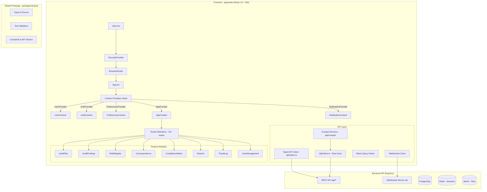
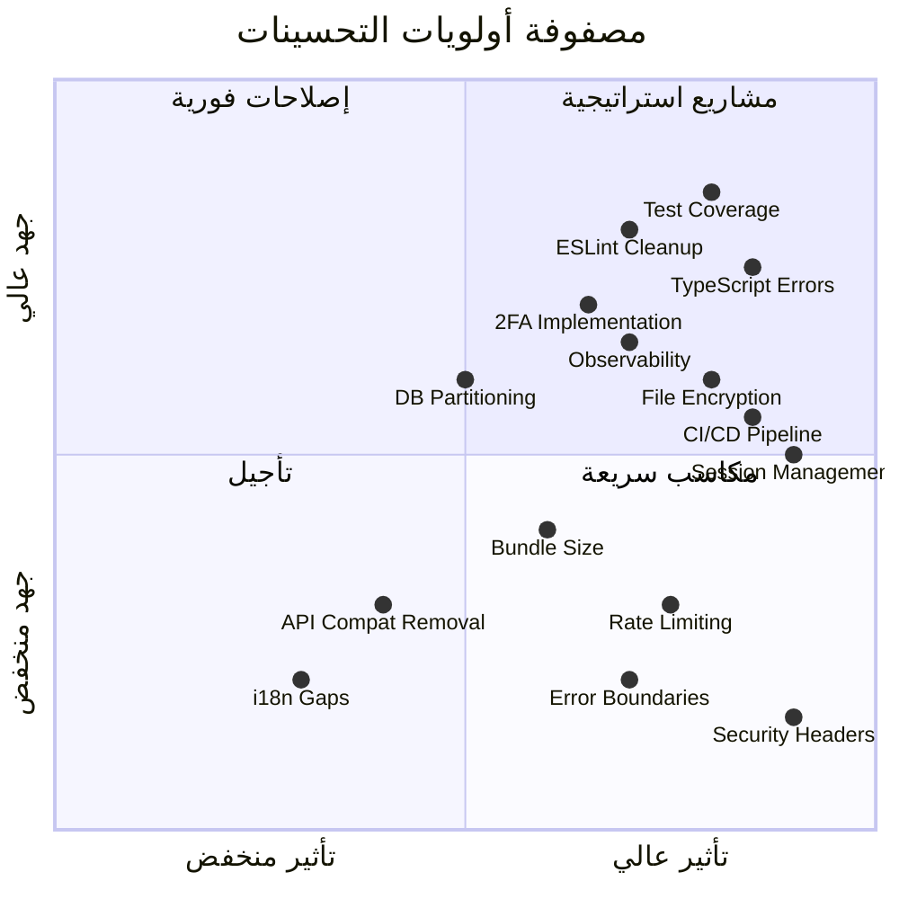
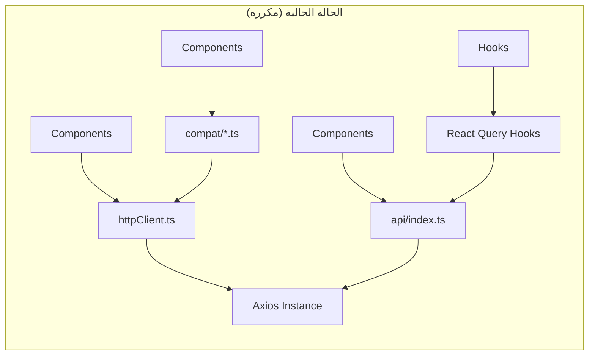
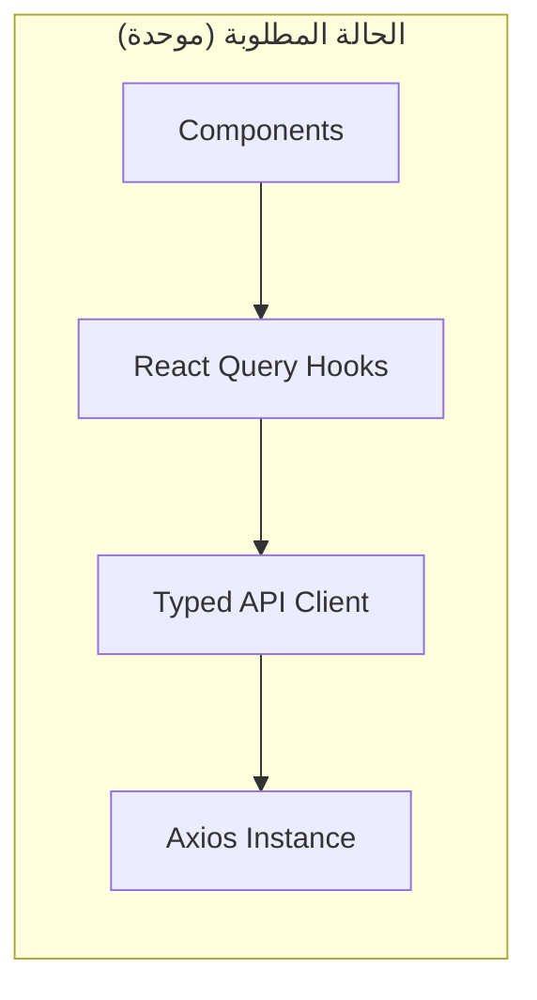
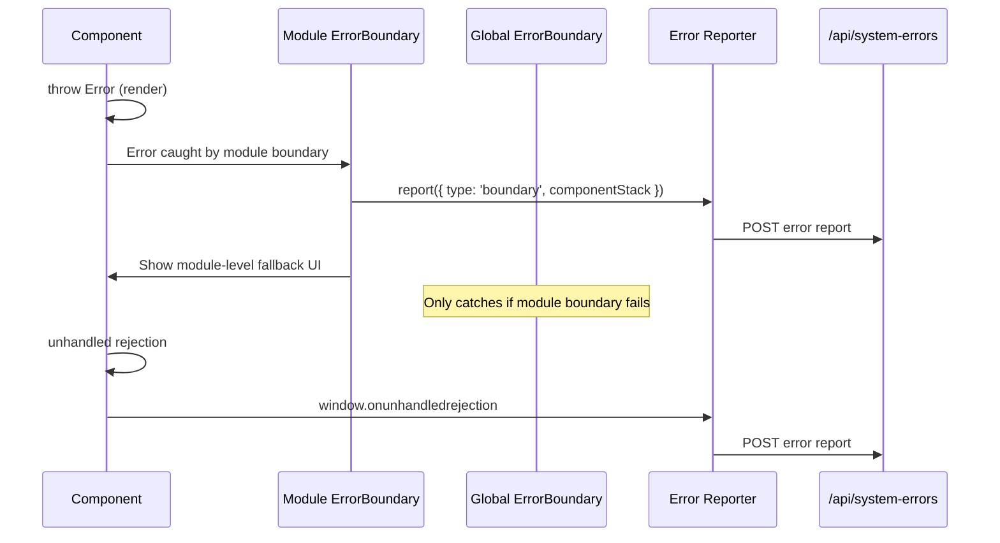

# وثيقة التصميم: تحليل جاهزية الإنتاج الشامل (Production Readiness Analysis)

## Overview

يقدم هذا التحليل تقييماً شاملاً ومحدثاً لجاهزية نظام الساقي (AL-SAQI) للنشر في بيئة الإنتاج. يغطي التقييم الحالة الراهنة للكود بعد مراجعة المواصفات الموجودة (`production-readiness-review`, `production-readiness-hardening`, `technical-debt-remediation`) وتحديد الفجوات المتبقية والمخاطر الجديدة.

نظام الساقي هو نظام إدارة التدقيق الداخلي مبني بـ React 19 + TypeScript + Vite كواجهة أمامية مستقلة (SPA) تتواصل مع API خلفي عبر REST و WebSocket. يعمل في بيئة air-gapped ويتعامل مع بيانات تدقيق حساسة في القطاع المصرفي.

**الحكم العام: التطبيق ليس جاهزاً للإنتاج بعد** — يوجد عدد من الثغرات الحرجة في الأمان والموثوقية والأداء تحتاج معالجة قبل النشر.

## Architecture



## مصفوفة الأولويات (Priority Matrix)



---

## القسم الأول: التقييم عالي المستوى (High-Level Assessment)

### 1. فجوات الأمان (Security Gaps)

#### 1.1 طبقات الأمان الموجودة ✅
- **SecurityProvider**: حماية DOM، مراقبة الشبكة، حماية التخزين المحلي
- **CSRF Token**: مُطبق في API Client مع auto-attachment
- **Zod Validation**: تحقق من جميع استجابات API
- **Error Boundary**: يلتقط أخطاء React ويمنع تعطل التطبيق بالكامل
- **JWT with Refresh**: تجديد تلقائي للرمز المميز
- **Correlation IDs**: تتبع الطلبات عبر النظام
- **API Version Mismatch Detection**: كشف عدم تطابق الإصدار

#### 1.2 فجوات أمنية حرجة 🔴

| الفجوة | الخطورة | الحالة |
|--------|---------|--------|
| عدم وجود Content Security Policy في Frontend | حرجة | غير مُطبق |
| `console.error` يكشف معلومات تقنية في الإنتاج | متوسطة | 40+ استخدام |
| `any` type في SecurityProvider callback | متوسطة | موجود |
| عدم وجود rate limiting على مستوى Frontend | متوسطة | غير مُطبق |
| عدم التحقق من حجم الملفات قبل الرفع client-side | متوسطة | غير مُطبق |
| Token مرئي في WebSocket URL query string | منخفضة | بالتصميم |
| عدم وجود Subresource Integrity (SRI) للمكتبات | منخفضة | غير مُطبق |

### 2. فجوات الأداء (Performance Gaps)

#### 2.1 ما تم تطبيقه ✅
- **Lazy Loading**: جميع الوحدات الرئيسية محملة بـ `lazy()`
- **React Query**: مع `staleTime: 5min` و `retry: 1`
- **Virtual List Hook**: `useVirtualList` للقوائم الطويلة
- **Prefetch Hook**: `usePrefetch` لتحميل مسبق
- **Debounce Hooks**: `useDebounce` و `useDebouncedCallback`

#### 2.2 فجوات أداء 🟡

| الفجوة | التأثير | الأولوية |
|--------|---------|---------|
| عدم وجود Service Worker أو تخزين مؤقت offline | متوسط | منخفضة |
| 40+ dependency بدون tree-shaking analysis | متوسط | متوسطة |
| `xlsx` مُحمّل من CDN خارجي (غير متوافق مع air-gap) | عالي | عالية |
| عدم وجود image optimization strategy | منخفض | منخفضة |
| React Query لا يستخدم `placeholderData` | منخفض | منخفضة |
| Context providers stack من 5 طبقات | منخفض | تم تحسينه |

### 3. فجوات الموثوقية (Reliability Gaps)

#### 3.1 ما تم تطبيقه ✅
- **Error Boundary** على مستوى التطبيق
- **Global Error Handlers**: `window.onerror` + `unhandledrejection`
- **Error Reporter**: يرسل الأخطاء إلى `/api/system-errors`
- **WebSocket Reconnection**: exponential backoff + HTTP polling fallback
- **API Retry Logic**: 3 محاولات مع exponential backoff للأخطاء 5xx

#### 3.2 فجوات موثوقية 🟡

| الفجوة | التأثير | الأولوية |
|--------|---------|---------|
| عدم وجود Error Boundaries على مستوى الوحدات الفردية | عالي | عالية |
| `fetchNotifications` في AppContext فارغ (no-op) | متوسط | متوسطة |
| عدم وجود health check للواجهة الأمامية | متوسط | متوسطة |
| لا يوجد retry logic للعمليات الكتابية (POST/PUT) | منخفض | منخفضة |
| عدم مراقبة WebSocket connection state في UI | متوسط | متوسطة |

### 4. فجوات المراقبة (Observability Gaps)

#### 4.1 ما تم تطبيقه ✅
- **Error Reporter**: تسجيل أخطاء الواجهة في الخلفية
- **Security Logger**: تسجيل أحداث أمنية
- **Correlation IDs**: ربط الطلبات بمعرفات فريدة
- **API Version Mismatch Notification**: إشعار المستخدم بعدم تطابق الإصدارات

#### 4.2 فجوات مراقبة 🟡

| الفجوة | التأثير | الأولوية |
|--------|---------|---------|
| عدم وجود Performance monitoring (Web Vitals) | متوسط | متوسطة |
| عدم وجود User session tracking (بدون analytics) | متوسط | منخفضة |
| لا يوجد مؤشر صحة للاتصال في واجهة المستخدم | متوسط | متوسطة |
| عدم وجود bundle size monitoring في CI | منخفض | منخفضة |

---

## القسم الثاني: جرد الديون التقنية (Technical Debt Inventory)

### الفئة أ: ديون معمارية (Architectural Debt)

#### A1: ازدواجية طبقة API (Dual API Layer)

**الوصف**: يوجد ثلاث طرق للتواصل مع الـ API:
1. `api/index.ts` — Typed Composed Client (الطريقة الجديدة)
2. `api/compat/*.ts` — 8 ملفات خدمة متوافقة (Legacy)
3. `api/httpClient.ts` — Raw Axios instance (للتوافق العكسي)

**التأثير**: صيانة مضاعفة، تناقض محتمل في سلوك معالجة الأخطاء، ارتباك المطورين الجدد.

**التوصية**: إزالة طبقة `compat` تدريجياً وترحيل جميع المكونات إلى Typed API أو React Query Hooks.





#### A2: Context Providers Stack Complexity

**الوصف**: 5 Context providers متداخلة مع تعليق تحذيري عن ترتيب مهم:
```
UserProvider → AuthProvider → PreferencesProvider → AppProvider → NotificationProvider
```

**التأثير**: 
- `AuthProvider` يعتمد على `useUser()` مما يخلق coupling عكسي
- `AppContext.fetchNotifications` هو no-op (دالة فارغة)
- `AppContext` لا يزال يحتوي على `setActiveTab` غير مستخدم

**التوصية**: تبسيط بدمج Auth + User في context واحد، وإزالة الكود الميت.

#### A3: Module Structure Inconsistency

**الوصف**: بعض الوحدات ملفات مفردة (`AuditPlan.tsx`) وبعضها مجلدات (`Correspondence/`, `Dashboard/`, `Reports/`).

**التأثير**: عدم اتساق في بنية المشروع، صعوبة في العثور على الكود.

**التوصية**: توحيد جميع الوحدات كمجلدات مع بنية ثابتة: `index.tsx`, `hooks/`, `components/`, `types.ts`.

### الفئة ب: ديون جودة الكود (Code Quality Debt)

#### B1: استخدام `console.error` المباشر (40+ موضع)

**المواقع الحرجة**:
- `modules/Reports/hooks/useReports.ts` — 10 استخدامات
- `modules/FraudLog/hooks/useFraudLog.ts` — 8 استخدامات
- `utils/pdfExport.ts` — 2 استخدام
- `api/httpClient.ts` — 1 استخدام
- `api/index.ts` — 1 استخدام

**التوصية**: استخدام `logger` utility الموجود حصرياً، والذي يفرّق بين بيئة التطوير والإنتاج.

#### B2: تبعية xlsx من CDN خارجي

```json
"xlsx": "https://cdn.sheetjs.com/xlsx-0.20.2/xlsx-0.20.2.tgz"
```

**التأثير**: 
- غير متوافق مع النشر air-gapped
- لا يوجد checksum verification
- يعتمد على توفر CDN وقت `npm install`

**التوصية**: تحويل إلى نسخة محلية أو استخدام بديل مثل `exceljs`.

#### B3: ملف `services/api.ts` الفارغ

```typescript
import api from '../api/httpClient';
export default api;
```

**التأثير**: ملف وسيط لا يضيف قيمة، يزيد الارتباك.

**التوصية**: حذف الملف وتحديث imports.

#### B4: DevDependencies مفقودة في apps/web

`package.json` للتطبيق الأمامي يحتوي فقط على `typescript` كـ devDependency. جميع أدوات التطوير (vitest, eslint, testing-library, etc.) في الجذر فقط.

**التأثير**: يعمل بسبب npm workspaces hoisting لكنه يخفي التبعيات الحقيقية.

### الفئة ج: ديون الاختبارات (Testing Debt)

#### C1: تغطية الاختبارات

**الاختبارات الموجودة**:
- `api/client.test.ts` — اختبارات API client
- `api/__tests__/client.property.test.ts` — Property-based tests
- `api/__tests__/validationRoundTrip.property.test.ts` — Validation tests
- `api/utils/error-parser.test.ts` — Error parsing
- `api/ws/websocket-client.test.ts` — WebSocket client
- `components/AuditPlanForm.test.tsx` — Form component
- `modules/SystemLogsManagement.test.tsx` — System logs
- `context/__tests__/` — Context tests
- `hooks/__tests__/` — Hook tests
- `locales/job-titles-i18n-*.test.ts` — i18n tests

**الفجوات**:
- لا توجد اختبارات لـ: Reports, FraudLog, Correspondence, RiskRegister, ComplianceMatrix
- لا يوجد integration testing للتنقل بين الصفحات
- لا يوجد visual regression testing
- لا يوجد accessibility testing تلقائي

#### C2: عدم وجود E2E Tests

**التأثير**: لا يمكن التحقق من تدفقات المستخدم الكاملة تلقائياً.

**التوصية**: إضافة Playwright tests لأهم التدفقات (تسجيل الدخول، إنشاء خطة تدقيق، إضافة ملاحظة).

---

## Components and Interfaces

### المكون 1: Unified Error Handling Strategy



#### تحسينات Error Boundary المطلوبة

```typescript
// التحسين: إضافة Error Boundary لكل وحدة رئيسية
// apps/web/src/components/ModuleErrorBoundary.tsx

interface ModuleErrorBoundaryProps {
  moduleName: string;
  fallback?: React.ReactNode;
  children: React.ReactNode;
  onError?: (error: Error, errorInfo: React.ErrorInfo) => void;
}

// الاستخدام في App.tsx
<Route path="/findings" element={
  <ModuleErrorBoundary moduleName="AuditFindings">
    <AuditFindings />
  </ModuleErrorBoundary>
} />
```

**الشروط المسبقة (Preconditions)**:
- `moduleName` مطابق لقيمة في `MODULES` enum
- `children` هو React component صالح

**الشروط اللاحقة (Postconditions)**:
- أي خطأ في الوحدة يُعرض fallback UI بدلاً من تعطل التطبيق بالكامل
- الخطأ يُرسل تلقائياً إلى `/api/system-errors`
- بقية الوحدات تبقى تعمل بشكل طبيعي

### المكون 2: API Layer Consolidation

#### خطة الترحيل من Compat إلى Typed API

```typescript
// المرحلة 1: تعريف deprecated على ملفات compat
// apps/web/src/api/compat/auditService.ts

/** @deprecated Use `api.auditPlans.*` or `api.findings.*` from '@/api' instead */
export const auditService = { ... };

// المرحلة 2: تحويل المكونات تدريجياً
// قبل:
import { auditService } from '../api/compat/auditService';
const data = await auditService.getPlans(params);

// بعد:
import { useAuditPlans } from '../api/hooks/useAuditPlans';
const { data, isLoading } = useAuditPlans(params);

// المرحلة 3: حذف ملفات compat بعد ترحيل جميع المكونات
```

**ثوابت الترحيل (Migration Invariants)**:
- لكل `compat` function يوجد مكافئ في Typed API أو React Query Hook
- سلوك معالجة الأخطاء يبقى متطابقاً بعد الترحيل
- لا يتأثر أي اختبار موجود بالحذف

### المكون 3: Performance Optimizations

#### 3.1 Bundle Analysis & Tree Shaking

```typescript
// vite.config.ts — تحسينات الأداء
export default defineConfig({
  build: {
    rollupOptions: {
      output: {
        manualChunks: {
          'vendor-react': ['react', 'react-dom', 'react-router-dom'],
          'vendor-query': ['@tanstack/react-query'],
          'vendor-ui': ['lucide-react', 'motion', 'recharts'],
          'vendor-pdf': ['jspdf', 'jspdf-autotable', 'react-pdf'],
          'vendor-excel': ['xlsx'],
          'vendor-editor': ['codemirror', '@codemirror/commands', '@codemirror/lang-html'],
          'vendor-i18n': ['i18next', 'react-i18next'],
          'vendor-forms': ['react-hook-form', '@hookform/resolvers', 'zod'],
        }
      }
    },
    // تفعيل source map في الإنتاج لمراقبة الأداء
    sourcemap: 'hidden',
  }
});
```

**الشروط المسبقة**:
- جميع imports تستخدم named imports لتمكين tree-shaking
- لا يوجد circular dependencies بين الـ chunks

**الشروط اللاحقة**:
- Initial bundle < 500KB gzipped
- كل chunk مستقل ويُحمّل حسب الحاجة
- Time to Interactive < 3 ثوانٍ على اتصال 3G

#### 3.2 Web Vitals Monitoring

```typescript
// apps/web/src/utils/performanceMonitor.ts

interface PerformanceMetric {
  name: 'FCP' | 'LCP' | 'CLS' | 'FID' | 'TTFB' | 'INP';
  value: number;
  rating: 'good' | 'needs-improvement' | 'poor';
  timestamp: string;
  route: string;
}

function reportWebVitals(): void {
  // استخدام web-vitals library أو Performance Observer API
  const observer = new PerformanceObserver((entryList) => {
    for (const entry of entryList.getEntries()) {
      // إرسال المقاييس إلى endpoint المراقبة
    }
  });
  
  observer.observe({ type: 'largest-contentful-paint', buffered: true });
  observer.observe({ type: 'first-input', buffered: true });
  observer.observe({ type: 'layout-shift', buffered: true });
}
```

### المكون 4: Security Headers & CSP

#### تحسينات Nginx Configuration

```nginx
# deploy/nginx/nginx.conf — الإضافات المطلوبة

# Content Security Policy for SPA
add_header Content-Security-Policy "
  default-src 'self';
  script-src 'self';
  style-src 'self' 'unsafe-inline';
  img-src 'self' data: blob:;
  font-src 'self';
  connect-src 'self' wss://$server_name;
  frame-ancestors 'none';
  base-uri 'self';
  form-action 'self';
  object-src 'none';
" always;

# Additional Security Headers
add_header X-Content-Type-Options "nosniff" always;
add_header X-Frame-Options "DENY" always;
add_header X-XSS-Protection "0" always;
add_header Referrer-Policy "strict-origin-when-cross-origin" always;
add_header Permissions-Policy "camera=(), microphone=(), geolocation=()" always;
add_header Cross-Origin-Opener-Policy "same-origin" always;
add_header Cross-Origin-Resource-Policy "same-origin" always;
```

**الشروط المسبقة**:
- التطبيق لا يستخدم inline scripts
- جميع الأصول مُقدمة من نفس الأصل (same-origin)

**الشروط اللاحقة**:
- أي محاولة حقن XSS تُحظر تلقائياً
- لا يمكن تضمين التطبيق في iframe خارجي
- جميع طلبات الشبكة مقيدة بـ same-origin + WebSocket

### المكون 5: Frontend Health Check & Connection Status

```typescript
// apps/web/src/hooks/useConnectionStatus.ts

type AppConnectionStatus = 'online' | 'degraded' | 'offline';

interface ConnectionStatusState {
  status: AppConnectionStatus;
  lastApiResponse: Date | null;
  wsConnected: boolean;
  latencyMs: number | null;
}

function useConnectionStatus(): ConnectionStatusState {
  // مراقبة:
  // 1. navigator.onLine
  // 2. WebSocket connection state
  // 3. آخر استجابة API ناجحة (timeout = 60 ثانية)
  // 4. Latency من خلال ping endpoint
}
```

```typescript
// apps/web/src/components/ConnectionIndicator.tsx

// مؤشر بصري صغير في الشريط العلوي
// أخضر = متصل | أصفر = degraded | أحمر = غير متصل
// يعرض tooltip مع التفاصيل عند التمرير
```

### المكون 6: i18n Completeness Check

```typescript
// scripts/check-i18n-completeness.ts
// أداة CLI للتحقق من اكتمال الترجمات

interface I18nReport {
  missingInArabic: string[];
  missingInEnglish: string[];
  unusedKeys: string[];
  duplicateKeys: string[];
}

// التشغيل: npx tsx scripts/check-i18n-completeness.ts
// يُدمج في CI pipeline
```

### المكون 7: xlsx Dependency Fix (Air-Gap Compatibility)

```typescript
// المشكلة: xlsx مُحمّل من CDN خارجي
// "xlsx": "https://cdn.sheetjs.com/xlsx-0.20.2/xlsx-0.20.2.tgz"

// الحل 1: تحميل الحزمة محلياً وتضمينها
// packages/vendor/xlsx-0.20.2.tgz → reference locally

// الحل 2 (مفضل): الانتقال إلى exceljs
// npm install exceljs
// الميزات: open-source بالكامل, MIT license, لا CDN dependency
```

---

## Data Models

### 4.1 Vite Configuration Hardening

```typescript
// apps/web/vite.config.ts — التحسينات المطلوبة

export default defineConfig({
  build: {
    // منع تسريب source maps في الإنتاج
    sourcemap: process.env.NODE_ENV === 'production' ? 'hidden' : true,
    
    // حد أقصى لحجم chunk
    chunkSizeWarningLimit: 500, // KB
    
    // تحسين minification
    minify: 'terser',
    terserOptions: {
      compress: {
        // إزالة console.log في الإنتاج
        drop_console: true,
        drop_debugger: true,
      }
    }
  },
  
  // التحقق من المتغيرات البيئية عند البناء
  plugins: [
    envValidatorPlugin(), // من production-readiness-review spec
  ]
});
```

### 4.2 TypeScript Strict Configuration

```jsonc
// apps/web/tsconfig.json — تشديد إضافي
{
  "compilerOptions": {
    "noUncheckedIndexedAccess": true,    // منع undefined silently
    "exactOptionalPropertyTypes": true,   // دقة في الخصائص الاختيارية
    "noPropertyAccessFromIndexSignature": true, // فرض bracket notation
    "verbatimModuleSyntax": true          // فرض type-only imports
  }
}
```

### 4.3 Docker Frontend Configuration

**تحسينات مطلوبة على Dockerfile الحالي**:

```dockerfile
# المشاكل في Dockerfile الحالي:
# 1. لا يُعيّن user non-root (أمان)
# 2. لا يحتوي على security headers في nginx config
# 3. Cache-Control immutable صحيح للأصول المُجزئة لكن ينقص gzip

# الإضافات المطلوبة:
FROM nginx:alpine AS runtime

# إضافة مستخدم غير root
RUN adduser -D -H -u 1001 -s /sbin/nologin appuser

# تفعيل gzip compression
# إضافة security headers
# تقليل المعلومات المكشوفة
RUN printf 'server_tokens off;\n' > /etc/nginx/conf.d/security.conf

USER appuser
```

---

## Correctness Properties

*A property is a characteristic or behavior that should hold true across all valid executions of a system — essentially, a formal statement about what the system should do. Properties serve as the bridge between human-readable specifications and machine-verifiable correctness guarantees.*

### Property 1: Module Error Isolation

*For any* error that occurs during render in a feature module (such as AuditFindings or Reports), the affected module SHALL display a fallback UI, all other modules SHALL remain functional, the error SHALL be reported to `/api/system-errors` with module name and component stack, and the user SHALL be able to navigate to other modules without a full page reload.

**Validates: Requirements 1.1, 1.2, 1.3, 1.4**

### Property 2: API Layer Consistency

*For any* API operation available via `compat/*.ts`, there SHALL exist an equivalent function in the Typed API Client that produces the same result (after Zod validation) when called with the same parameters, and produces a structurally equivalent error object for the same error conditions.

**Validates: Requirements 2.1, 2.3**

### Property 3: Connection Resilience

*For any* temporary network disconnection (≤ 30 seconds), the system SHALL preserve all user-entered form data, the WebSocket SHALL reconnect automatically using exponential backoff (1s to 30s max), missed notifications SHALL synchronize upon reconnection, and a visible status indicator SHALL update within 2 seconds of connection state changes.

**Validates: Requirements 3.1, 3.2, 3.3, 3.4, 3.5, 3.6**

### Property 4: Build Determinism

*For any* build execution (`npm run build`) from the same Git commit with the same lock file, the output SHALL produce identical bundle content hashes, SHALL complete without external network requests, and SHALL fail with a descriptive error if required environment variables are missing.

**Validates: Requirements 4.1, 4.2, 4.3**

### Property 5: Security Header Presence

*For any* HTTP response from the Production Server (Nginx), it SHALL include `Content-Security-Policy` (restricting default-src to self), `X-Content-Type-Options: nosniff`, `X-Frame-Options: DENY`, `Referrer-Policy: strict-origin-when-cross-origin`, `Permissions-Policy` (disabling camera, microphone, geolocation), `Cross-Origin-Opener-Policy: same-origin`, and `Strict-Transport-Security` (when HTTPS is enabled).

**Validates: Requirements 5.1, 5.2, 5.3, 5.4, 5.5, 5.6, 5.7**

### Property 6: Console-Free Production Build

*For any* production build output, it SHALL contain zero instances of `console.log`, `console.debug`, `console.error`, or `console.warn` statements. All runtime errors SHALL be routed exclusively through the Structured Logger without writing to the browser console, and no stack traces, file paths, or internal module names SHALL be exposed to the end user.

**Validates: Requirements 6.1, 6.2, 6.3, 6.4**

### Property 7: File Upload Validation

*For any* file selected for upload, if the file size exceeds the configured maximum limit OR the file MIME type is not in the allowed whitelist, the system SHALL reject the file before initiating any upload request and SHALL display a localized error message.

**Validates: Requirements 12.1, 12.2, 12.3**

### Property 8: Web Vitals Threshold Classification

*For any* collected Web Vitals metric value, the Web_Vitals_Monitor SHALL classify it as `good`, `needs-improvement`, or `poor` according to standard Web Vitals thresholds, and SHALL include the current route path and a valid timestamp with every metric data point.

**Validates: Requirements 7.2, 7.3**

---

## القسم السادس: ملخص التوصيات بترتيب الأولوية

### أولوية حرجة (يجب قبل الإنتاج) 🔴

1. **إصلاح أخطاء TypeScript** — المشروع لا يبني بنجاح مع strict mode
2. **إصلاح 40 اختبار فاشل** — يُشير إلى سلوك خاطئ في النظام
3. **إصلاح تبعية xlsx** — غير متوافقة مع air-gapped deployment
4. **إضافة Security Headers** — CSP + HSTS + X-Frame-Options
5. **CI/CD Pipeline** — فرض type-check + lint + test قبل merge

### أولوية عالية (أسابيع أولى بعد الإنتاج) 🟠

6. **Error Boundaries لكل وحدة** — منع تعطل التطبيق بالكامل
7. **استبدال console.error بـ logger** — منع تسريب معلومات تقنية
8. **Connection Status Indicator** — إبلاغ المستخدم بحالة الاتصال
9. **Bundle Size Optimization** — manual chunks + tree-shaking
10. **إزالة API compat layer** — تقليل الديون التقنية

### أولوية متوسطة (الربع التالي) 🟡

11. **E2E Testing** — Playwright لأهم التدفقات
12. **Web Vitals Monitoring** — LCP, FID, CLS tracking
13. **i18n Completeness Automation** — CI check للترجمات المفقودة
14. **Module Structure Standardization** — توحيد بنية المجلدات
15. **Context Simplification** — دمج Auth + User contexts

### أولوية منخفضة (تحسين مستمر) 🟢

16. **Service Worker** — offline capabilities
17. **Image Optimization** — responsive images
18. **Accessibility Audit** — WCAG 2.1 AA compliance testing
19. **OpenAPI Documentation Updates** — تحديث مع كل API change
20. **Visual Regression Testing** — snapshot testing للمكونات

---

## Error Handling

| السيناريو | المعالجة الحالية | المعالجة المطلوبة |
|-----------|-----------------|-----------------|
| خطأ في render وحدة | تعطل التطبيق بالكامل | Module-level fallback UI |
| فشل API call | Toast عام | Toast مع retry button + structured logging |
| فقدان اتصال شبكي | لا يوجد مؤشر | Connection indicator + form data preservation |
| WebSocket disconnect | Reconnect silent | Reconnect + UI indicator + notification sync |
| Missing translation key | `⚠️ [key]` displayed | Log warning + fallback to other language |
| Build fails in CI | Manual detection | Block merge + notification |
| Memory leak from unmounted components | Potential crash | AbortController cleanup in hooks |

---

## Testing Strategy

### Property-Based Testing (fast-check v4.8.0)

| الخاصية | ملف الاختبار | استراتيجية التوليد |
|---------|-------------|-------------------|
| API error parsing consistency | `error-parser.property.test.ts` | توليد HTTP errors عشوائية |
| WebSocket reconnect delay formula | `websocket-client.property.test.ts` | توليد attempt numbers |
| Permission matrix completeness | `permissions.property.test.ts` | توليد Role × Module pairs |
| Zod validation round-trip | `validationRoundTrip.property.test.ts` | موجود ✅ |
| i18n key presence | `i18n.property.test.ts` | جميع keys في لغة ↔ الأخرى |

### Integration Testing

- **Routing Tests**: التحقق من أن كل route يحمّل المكون الصحيح
- **Auth Flow Tests**: Login → Session → Logout → Redirect
- **Permission Gating**: Routes محمية ترفض الوصول غير المصرح

### E2E Testing (Playwright)

- **Critical Path 1**: Login → Dashboard → Create Audit Plan
- **Critical Path 2**: Login → Findings → Create Finding → Add Recommendation
- **Critical Path 3**: Login → Correspondence → Send Letter
- **Critical Path 4**: Login → Settings → Change Language → Verify RTL

---

## القسم التاسع: اعتبارات الأداء (Performance Considerations)

### Target Metrics

| المقياس | الهدف | الحالة الحالية (تقدير) |
|---------|-------|---------------------|
| First Contentful Paint (FCP) | < 1.5s | ~2s (lazy loading helps) |
| Largest Contentful Paint (LCP) | < 2.5s | ~3.5s (large bundles) |
| Time to Interactive (TTI) | < 3.5s | ~5s (5 context providers) |
| Cumulative Layout Shift (CLS) | < 0.1 | Unknown |
| Initial Bundle Size (gzipped) | < 500KB | ~800KB (estimated) |

### Optimization Strategy

1. **Code Splitting** — manual chunks لفصل vendor code
2. **Preloading** — `<link rel="modulepreload">` للوحدات الشائعة
3. **Font Subsetting** — تحميل Arabic font glyphs المستخدمة فقط (tahoma-base64.ts كبير)
4. **Image Lazy Loading** — لصور logos والأيقونات
5. **React Query Optimization** — `placeholderData` + `keepPreviousData`

---

## القسم العاشر: اعتبارات الأمان (Security Considerations)

### Threat Model Summary

| التهديد | الاحتمال | التأثير | المعالجة |
|---------|---------|--------|---------|
| XSS عبر حقن script | متوسط | عالي | CSP + DOMGuard (موجود) |
| CSRF | منخفض | عالي | Token-based (مُطبق) ✅ |
| Session Hijacking | متوسط | عالي | HttpOnly cookies + token refresh ✅ |
| Clickjacking | منخفض | متوسط | X-Frame-Options (مطلوب) |
| Information Disclosure | عالي | متوسط | console cleanup + source maps removal |
| Man-in-the-Middle | منخفض | عالي | TLS enforcement (مطلوب في Nginx) |
| Dependency Vulnerabilities | متوسط | متوسط | npm audit في CI (مطلوب) |

### Security Checklist Before Production

- [ ] Security headers configured in Nginx
- [ ] Source maps set to 'hidden' in production build
- [ ] All console.* statements removed or routed through logger
- [ ] npm audit shows 0 critical/high vulnerabilities
- [ ] CORS configured restrictively
- [ ] Rate limiting on API endpoints
- [ ] File upload size and type validation
- [ ] WebSocket authentication timeout reduced to 5s
- [ ] JWT secret strength validated at startup
- [ ] Database connection uses SSL in production

---

## التبعيات (Dependencies)

### التبعيات الحرجة ومخاطرها

| التبعية | الإصدار | المخاطرة | ملاحظات |
|---------|---------|---------|---------|
| react | ^19.2.7 | منخفضة | إصدار مستقر حديث |
| axios | ^1.13.6 | منخفضة | مُصان جيداً |
| zod | ^4.3.6 | منخفضة | Zod 4 جديد — مراقبة breaking changes |
| xlsx | CDN | **عالية** | غير متوافق مع air-gap |
| react-pdf | ^10.4.1 | متوسطة | حجم كبير، يحتاج worker |
| jspdf | ^2.5.2 | منخفضة | يحتاج Arabic font (موجود) |
| motion | ^12.40.0 | منخفضة | بديل خفيف لـ framer-motion |
| @tanstack/react-query | ^5.90.21 | منخفضة | أفضل ممارسة للحالة البعيدة |
| docx | ^9.6.1 | منخفضة | لإنشاء تقارير Word |
| recharts | ^3.8.1 | منخفضة | charts للـ Dashboard |

### التبعيات المفقودة المطلوبة

| التبعية | الغرض | الأولوية |
|---------|-------|---------|
| `web-vitals` | مراقبة أداء الواجهة | متوسطة |
| `@playwright/test` | E2E testing | عالية |
| `eslint-plugin-jsx-a11y` | فحص Accessibility | متوسطة |
| `lighthouse-ci` | أداء CI automation | منخفضة |
