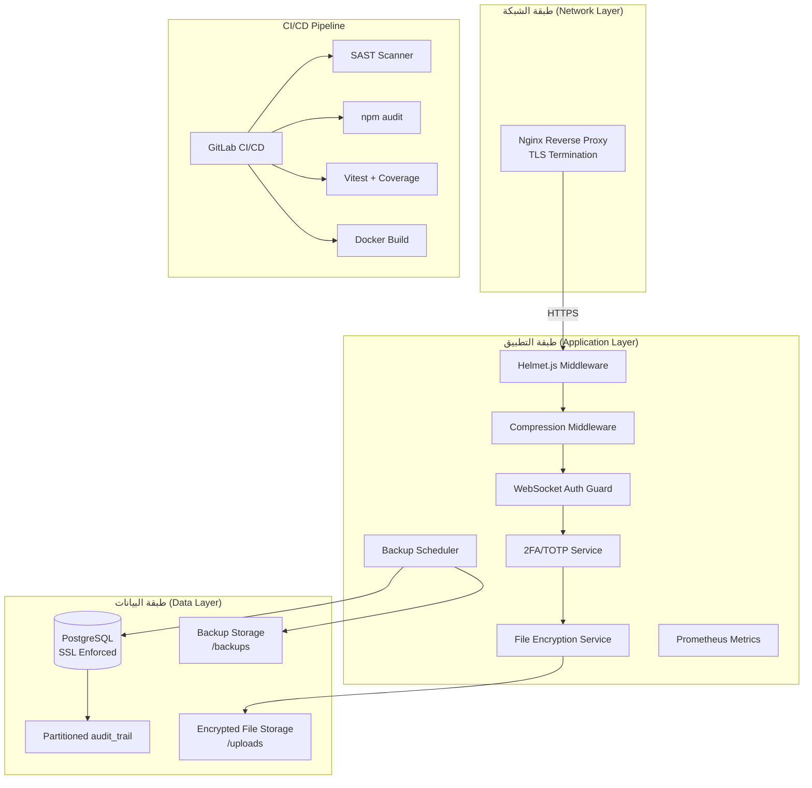
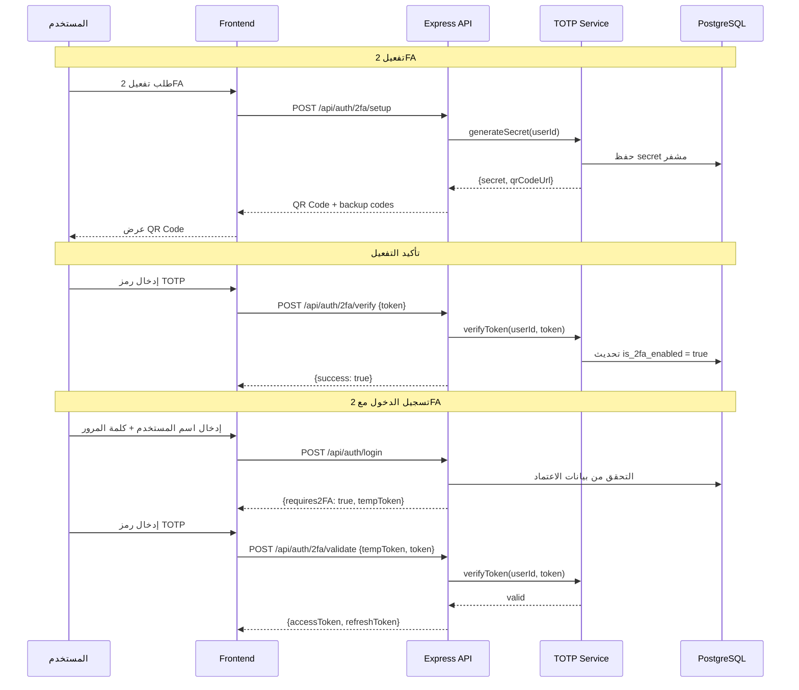
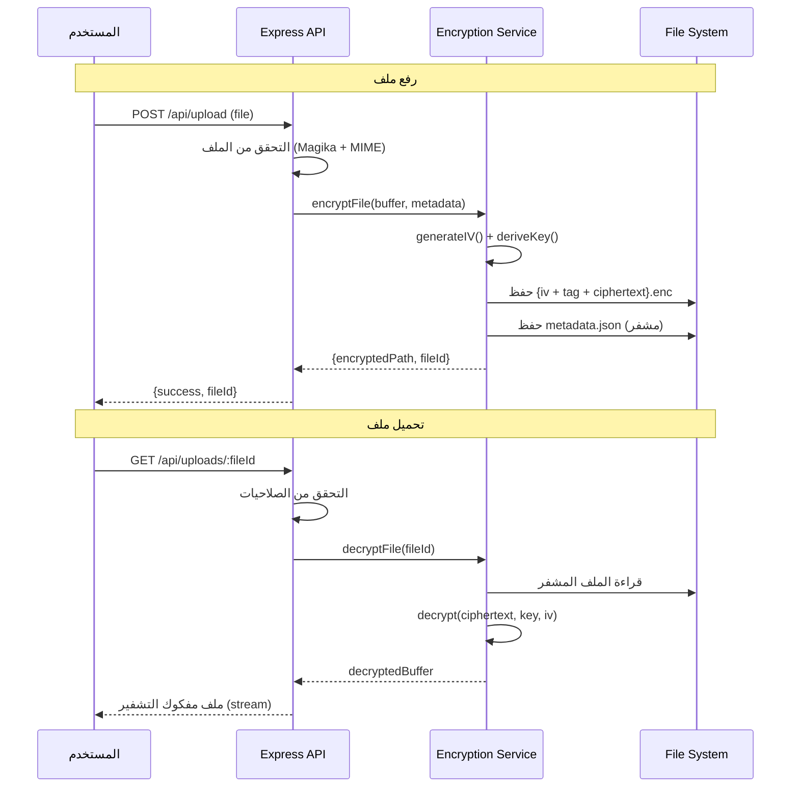

# وثيقة التصميم: تقوية جاهزية الإنتاج (Production Readiness Hardening)

## Overview

تهدف هذه الوثيقة إلى تصميم الحلول التقنية لسد الثغرات الحرجة التي تمنع نشر نظام الساقي (AL-SAQI) في بيئة الإنتاج. يغطي هذا التصميم: تقوية الأسرار (Secrets Hardening)، التشفير أثناء السكون (Encryption at Rest) للملفات المرفوعة، جدولة النسخ الاحتياطي، إصلاح مصادقة WebSocket، خط أنابيب CI/CD، فرض SSL لقاعدة البيانات، المصادقة الثنائية (2FA/TOTP)، استبدال رؤوس الأمان اليدوية بـ Helmet.js، ضغط الاستجابات (Compression)، تقسيم جدول audit_trail، نموذج إعداد Reverse Proxy، وتنظيف README.

يركز هذا التصميم على العناصر **غير المغطاة** في المواصفات الموجودة (`comprehensive-testing`, `dynamic-system-health`, `permission-matrix-fix`, `technical-debt-remediation`).

## Architecture



## مخططات التسلسل (Sequence Diagrams)

### تدفق المصادقة الثنائية (2FA/TOTP Flow)



### تدفق تشفير الملفات (File Encryption Flow)



## Components and Interfaces

### المكون 1: خدمة تقوية الأسرار (Secrets Hardening Service)

**الغرض**: التحقق من صحة وقوة جميع المتغيرات البيئية الحرجة عند بدء التشغيل في بيئة الإنتاج.

**الواجهة**:
```typescript
interface SecretValidationResult {
  isValid: boolean;
  errors: string[];
  warnings: string[];
}

interface SecretsValidator {
  validateProductionSecrets(): SecretValidationResult;
  validateSecretStrength(secret: string, minLength: number): boolean;
  validateSecretEntropy(secret: string, minBits: number): boolean;
}
```

**المسؤوليات**:
- التحقق من أن `JWT_SECRET` ليس القيمة الافتراضية وطوله ≥ 64 حرف
- التحقق من أن `VITE_STORAGE_SECRET` و `VITE_NETWORK_SECRET` محددان وقويان
- رفض بدء التشغيل في الإنتاج إذا كانت الأسرار ضعيفة
- تسجيل تحذيرات للمتغيرات الاختيارية غير المحددة

### المكون 2: خدمة تشفير الملفات (File Encryption Service)

**الغرض**: تشفير جميع الملفات المرفوعة (أدلة التدقيق، تقارير الاحتيال، إفصاحات تضارب المصالح) باستخدام AES-256-GCM.

**الواجهة**:
```typescript
interface EncryptionMetadata {
  fileId: string;
  originalName: string;
  mimeType: string;
  size: number;
  iv: string;        // base64
  authTag: string;   // base64
  encryptedAt: string;
  checksum: string;  // SHA-256 of original
}

interface FileEncryptionService {
  encryptFile(buffer: Buffer, metadata: Omit<EncryptionMetadata, 'iv' | 'authTag' | 'encryptedAt' | 'checksum'>): Promise<{ path: string; metadata: EncryptionMetadata }>;
  decryptFile(fileId: string): Promise<{ buffer: Buffer; metadata: EncryptionMetadata }>;
  rotateEncryptionKey(oldKey: Buffer, newKey: Buffer): Promise<void>;
  verifyIntegrity(fileId: string): Promise<boolean>;
}
```

**المسؤوليات**:
- تشفير الملفات باستخدام AES-256-GCM مع IV عشوائي لكل ملف
- اشتقاق مفتاح التشفير من `FILE_ENCRYPTION_KEY` عبر HKDF
- حفظ metadata مشفرة بجانب كل ملف
- دعم تدوير المفاتيح (Key Rotation)
- التحقق من سلامة الملفات عبر checksum

### المكون 3: مجدول النسخ الاحتياطي (Backup Scheduler)

**الغرض**: جدولة النسخ الاحتياطي التلقائي مع سياسة الاحتفاظ واختبار الاستعادة.

**الواجهة**:
```typescript
interface BackupConfig {
  schedule: string;          // cron expression
  retentionDays: number;     // عدد أيام الاحتفاظ
  maxBackups: number;        // الحد الأقصى للنسخ
  backupDir: string;         // مسار التخزين
  encryptBackups: boolean;   // تشفير النسخ
  notifyOnFailure: boolean;  // إشعار عند الفشل
}

interface BackupScheduler {
  start(config: BackupConfig): void;
  stop(): void;
  runNow(): Promise<BackupResult>;
  getHistory(): Promise<BackupRecord[]>;
  verifyBackup(backupId: string): Promise<VerificationResult>;
  restore(backupId: string, options: RestoreOptions): Promise<RestoreResult>;
}

interface BackupResult {
  id: string;
  timestamp: string;
  size: number;
  tables: string[];
  duration: number;
  status: 'success' | 'partial' | 'failed';
  errors?: string[];
}
```

**المسؤوليات**:
- تشغيل `pg_dump` يومياً عبر `node-cron`
- تطبيق سياسة الاحتفاظ (حذف النسخ الأقدم من N يوم)
- تشفير النسخ الاحتياطية اختيارياً
- تسجيل نتائج كل عملية نسخ في جدول `backup_history`
- إرسال إشعار للمسؤولين عند فشل النسخ الاحتياطي

### المكون 4: حارس مصادقة WebSocket (WebSocket Auth Guard)

**الغرض**: رفض اتصالات WebSocket فوراً بدون token صالح بدلاً من الانتظار 30 ثانية.

**الواجهة**:
```typescript
interface WebSocketAuthConfig {
  authTimeout: number;       // مهلة المصادقة (ms) - تُخفض من 30s إلى 5s
  requireAuthOnConnect: boolean;  // فرض token في URL أو header
  allowAnonymousBroadcast: boolean; // السماح بالبث للمجهولين
}

interface AuthenticatedWebSocket extends WebSocket {
  userId: string;
  username: string;
  authenticated: boolean;
  connectedAt: number;
}

function createAuthenticatedWSS(
  server: http.Server,
  config: WebSocketAuthConfig,
  verifyToken: (token: string) => Promise<TokenPayload | null>
): WebSocketServer;
```

**المسؤوليات**:
- استخراج token من query parameter `?token=` عند الاتصال
- التحقق من صحة JWT فوراً قبل قبول الاتصال
- رفض الاتصال بـ HTTP 401 إذا لم يوجد token أو كان غير صالح
- تقليل مهلة المصادقة من 30 ثانية إلى 5 ثوانٍ كحد أقصى

### المكون 5: خدمة المصادقة الثنائية (2FA/TOTP Service)

**الغرض**: إضافة طبقة مصادقة ثانية باستخدام TOTP (Time-based One-Time Password) للأدوار الحساسة.

**الواجهة**:
```typescript
interface TOTPSetupResult {
  secret: string;           // base32 encoded
  qrCodeDataUrl: string;    // data:image/png;base64,...
  backupCodes: string[];    // 10 رموز احتياطية
}

interface TOTPService {
  setup(userId: string): Promise<TOTPSetupResult>;
  verify(userId: string, token: string): Promise<boolean>;
  disable(userId: string, password: string): Promise<void>;
  useBackupCode(userId: string, code: string): Promise<boolean>;
  isEnabled(userId: string): Promise<boolean>;
  getRecoveryCodes(userId: string): Promise<string[]>;
}
```

**المسؤوليات**:
- توليد secret عشوائي (160-bit) وتخزينه مشفراً في قاعدة البيانات
- توليد QR Code متوافق مع Google Authenticator / Authy
- توليد 10 رموز احتياطية (backup codes) مشفرة
- التحقق من رمز TOTP مع نافذة زمنية ±1 (30 ثانية)
- فرض 2FA على أدوار: Admin, Audit Manager

### المكون 6: خط أنابيب CI/CD (GitLab CI/CD Pipeline)

**الغرض**: أتمتة الفحص الأمني، الاختبارات، والبناء عبر GitLab CI/CD.

**الواجهة** (`.gitlab-ci.yml`):
```typescript
interface CIPipelineStages {
  validate: {
    lint: 'eslint + prettier check';
    typecheck: 'tsc --noEmit';
    audit: 'npm audit --audit-level=moderate';
  };
  test: {
    unit: 'vitest --run --coverage';
    security: 'SAST scanning';
  };
  build: {
    docker: 'docker build + tag';
  };
  deploy: {
    staging: 'deploy to staging';
    production: 'manual deploy to production';
  };
}
```

**المسؤوليات**:
- تشغيل `npm audit` تلقائياً لكشف الثغرات في التبعيات
- تشغيل SAST (Static Application Security Testing)
- فرض حد أدنى لتغطية الاختبارات
- بناء Docker image وتوسيمها
- نشر تلقائي للـ staging ويدوي للإنتاج

### المكون 7: فرض SSL لقاعدة البيانات (DB SSL Enforcement)

**الغرض**: فرض اتصال مشفر بين التطبيق وقاعدة البيانات PostgreSQL.

**الواجهة**:
```typescript
interface DBSSLConfig {
  ssl: {
    rejectUnauthorized: boolean;  // true في الإنتاج
    ca?: string;                  // مسار شهادة CA
    cert?: string;                // شهادة العميل (اختياري)
    key?: string;                 // مفتاح العميل (اختياري)
  };
}

function createSSLConfig(env: NodeJS.ProcessEnv): DBSSLConfig | undefined;
```

**المسؤوليات**:
- تفعيل `rejectUnauthorized: true` في بيئة الإنتاج
- دعم شهادة CA مخصصة عبر `DB_SSL_CA_PATH`
- رفض بدء التشغيل إذا كان SSL غير مفعل في الإنتاج
- تسجيل تحذير في بيئة التطوير إذا كان SSL معطلاً

### المكون 8: Helmet.js Integration

**الغرض**: استبدال رؤوس الأمان اليدوية بـ Helmet.js لتغطية أشمل وصيانة أسهل.

**الواجهة**:
```typescript
import helmet from 'helmet';

interface HelmetConfig {
  contentSecurityPolicy: {
    directives: Record<string, string[]>;
  };
  strictTransportSecurity: {
    maxAge: number;
    includeSubDomains: boolean;
    preload: boolean;
  };
  referrerPolicy: { policy: string };
  frameguard: { action: 'deny' };
  permittedCrossDomainPolicies: boolean;
  crossOriginEmbedderPolicy: boolean;
}

function createHelmetMiddleware(env: string): ReturnType<typeof helmet>;
```

**المسؤوليات**:
- استبدال middleware رؤوس الأمان اليدوي بالكامل
- تكوين CSP مناسب لـ SPA (React)
- تفعيل HSTS في الإنتاج فقط
- إضافة رؤوس إضافية: `Cross-Origin-Opener-Policy`, `Cross-Origin-Resource-Policy`

### المكون 9: Compression Middleware

**الغرض**: ضغط استجابات HTTP باستخدام gzip/brotli لتقليل حجم النقل.

**الواجهة**:
```typescript
import compression from 'compression';

interface CompressionConfig {
  level: number;           // مستوى الضغط (6 افتراضي)
  threshold: number;       // الحد الأدنى للحجم (1KB)
  filter: (req: Request, res: Response) => boolean;
}

function createCompressionMiddleware(): ReturnType<typeof compression>;
```

**المسؤوليات**:
- ضغط جميع الاستجابات النصية (JSON, HTML, CSS, JS)
- استثناء الملفات المضغوطة مسبقاً (images, PDFs)
- دعم Brotli عبر Nginx (reverse proxy level)
- عدم ضغط الاستجابات الصغيرة (< 1KB)

### المكون 10: تقسيم جدول audit_trail (Partitioning)

**الغرض**: تقسيم جدول `audit_trail` حسب الشهر لمنع النمو غير المحدود وتحسين أداء الاستعلامات.

**الواجهة**:
```typescript
interface PartitionConfig {
  tableName: string;
  partitionColumn: string;    // 'timestamp'
  partitionInterval: 'month' | 'quarter';
  retentionMonths: number;    // عدد أشهر الاحتفاظ
  autoCreateFuture: number;   // عدد الأقسام المستقبلية
}

interface PartitionManager {
  initialize(): Promise<void>;
  createPartition(startDate: Date, endDate: Date): Promise<void>;
  dropOldPartitions(retentionMonths: number): Promise<string[]>;
  listPartitions(): Promise<PartitionInfo[]>;
  scheduleMaintenanceJob(): void;
}
```

**المسؤوليات**:
- تحويل `audit_trail` إلى جدول مقسم (Range Partitioning by timestamp)
- إنشاء أقسام شهرية تلقائياً عبر cron job
- حذف الأقسام الأقدم من فترة الاحتفاظ المحددة
- إنشاء 3 أقسام مستقبلية مسبقاً

### المكون 11: نموذج Reverse Proxy (Nginx)

**الغرض**: توفير نموذج إعداد Nginx مع TLS termination، rate limiting، وWebSocket proxying.

**الملف**: `deploy/nginx/nginx.conf`

**المسؤوليات**:
- TLS 1.2+ مع شهادات Let's Encrypt أو شهادات داخلية
- Proxy pass إلى Express على المنفذ 3000
- WebSocket upgrade support
- Brotli/gzip compression على مستوى Proxy
- Rate limiting إضافي
- Security headers على مستوى Proxy

## Data Models

### نموذج 1: إعدادات 2FA

```typescript
interface UserTOTPConfig {
  id: string;              // UUID
  user_id: string;         // FK → users.id
  secret_encrypted: string; // AES-256-GCM encrypted TOTP secret
  secret_iv: string;       // IV for decryption
  secret_tag: string;      // Auth tag
  is_enabled: boolean;     // هل 2FA مفعل
  enabled_at: string | null;
  backup_codes_hash: string; // JSON array of bcrypt hashes
  last_used_at: string | null;
  created_at: string;
}
```

**قواعد التحقق**:
- `secret_encrypted` يجب أن يكون non-empty عند `is_enabled = true`
- `backup_codes_hash` يحتوي على 10 رموز بالضبط عند الإنشاء
- لا يمكن تعطيل 2FA بدون إدخال كلمة المرور الحالية

### نموذج 2: سجل النسخ الاحتياطي

```typescript
interface BackupRecord {
  id: string;              // UUID
  started_at: string;      // timestamp
  completed_at: string | null;
  status: 'running' | 'success' | 'partial' | 'failed';
  type: 'scheduled' | 'manual';
  size_bytes: number;
  tables_count: number;
  file_path: string;
  error_message: string | null;
  verified: boolean;
  verified_at: string | null;
}
```

### نموذج 3: metadata الملفات المشفرة

```typescript
interface EncryptedFileRecord {
  id: string;              // UUID
  original_name: string;
  mime_type: string;
  original_size: number;
  encrypted_path: string;  // المسار النسبي للملف المشفر
  iv: string;              // base64
  auth_tag: string;        // base64
  checksum_sha256: string; // SHA-256 للملف الأصلي
  key_version: number;     // إصدار مفتاح التشفير
  encrypted_at: string;
  uploaded_by: string;     // FK → users.id
  module: string;          // audit | fraud | coi | correspondence
}
```

## الخوارزميات مع المواصفات الرسمية (Algorithmic Pseudocode with Formal Specifications)

### خوارزمية 1: التحقق من الأسرار عند بدء التشغيل

```typescript
function validateProductionSecrets(env: NodeJS.ProcessEnv): SecretValidationResult {
  const errors: string[] = [];
  const warnings: string[] = [];
  const WEAK_DEFAULTS = ['alsaqi-dev-secret-key-123', 'your-32-character-secret-key-here', 'your-network-hmac-secret-here'];

  // JWT_SECRET validation
  if (!env.JWT_SECRET || WEAK_DEFAULTS.includes(env.JWT_SECRET)) {
    errors.push('JWT_SECRET must be set to a strong random value');
  } else if (env.JWT_SECRET.length < 64) {
    errors.push('JWT_SECRET must be at least 64 characters');
  }

  // VITE_STORAGE_SECRET validation
  if (!env.VITE_STORAGE_SECRET || WEAK_DEFAULTS.includes(env.VITE_STORAGE_SECRET)) {
    errors.push('VITE_STORAGE_SECRET must be set to a strong random value');
  } else if (env.VITE_STORAGE_SECRET.length < 32) {
    errors.push('VITE_STORAGE_SECRET must be at least 32 characters');
  }

  // VITE_NETWORK_SECRET validation
  if (!env.VITE_NETWORK_SECRET || WEAK_DEFAULTS.includes(env.VITE_NETWORK_SECRET)) {
    errors.push('VITE_NETWORK_SECRET must be set to a strong random value');
  }

  // DATABASE_URL validation
  if (!env.DATABASE_URL) {
    errors.push('DATABASE_URL must be set in production');
  }

  // Optional but recommended
  if (!env.CORS_ORIGIN) {
    warnings.push('CORS_ORIGIN not set - CORS will be disabled');
  }
  if (!env.FILE_ENCRYPTION_KEY) {
    warnings.push('FILE_ENCRYPTION_KEY not set - file encryption disabled');
  }

  return { isValid: errors.length === 0, errors, warnings };
}
```

**الشروط المسبقة (Preconditions)**:
- `env` هو كائن `process.env` الفعلي
- يُستدعى فقط عندما `NODE_ENV === 'production'`

**الشروط اللاحقة (Postconditions)**:
- إذا `isValid === false` → يجب إيقاف التشغيل فوراً
- جميع الأسرار الضعيفة/الافتراضية مرفوضة
- لا يتم تسجيل قيم الأسرار في السجلات

### خوارزمية 2: تشفير الملفات

```typescript
async function encryptFile(
  buffer: Buffer,
  fileId: string,
  encryptionKey: Buffer  // 32 bytes derived via HKDF
): Promise<{ encryptedPath: string; metadata: EncryptionMetadata }> {
  // Generate unique IV per file
  const iv = crypto.randomBytes(12);
  
  // Compute checksum of original file
  const checksum = crypto.createHash('sha256').update(buffer).digest('hex');
  
  // Encrypt with AES-256-GCM
  const cipher = crypto.createCipheriv('aes-256-gcm', encryptionKey, iv);
  const encrypted = Buffer.concat([cipher.update(buffer), cipher.final()]);
  const authTag = cipher.getAuthTag();
  
  // Write encrypted file: [IV (12 bytes)][AuthTag (16 bytes)][Ciphertext]
  const encryptedPath = path.join(uploadDir, `${fileId}.enc`);
  const output = Buffer.concat([iv, authTag, encrypted]);
  await fs.promises.writeFile(encryptedPath, output, { mode: 0o600 });
  
  return {
    encryptedPath,
    metadata: {
      fileId,
      iv: iv.toString('base64'),
      authTag: authTag.toString('base64'),
      checksum,
      encryptedAt: new Date().toISOString(),
    }
  };
}
```

**الشروط المسبقة**:
- `buffer` غير فارغ وحجمه ≤ 30MB
- `encryptionKey` بطول 32 bytes بالضبط
- `fileId` هو UUID صالح

**الشروط اللاحقة**:
- الملف المشفر محفوظ بصلاحيات `0o600` (owner read/write فقط)
- `decrypt(encrypt(buffer)) === buffer` (خاصية الانعكاس)
- `checksum` يطابق SHA-256 للملف الأصلي

**ثوابت الحلقة (Loop Invariants)**: لا يوجد حلقات — عملية واحدة لكل ملف

### خوارزمية 3: مصادقة WebSocket الفورية

```typescript
function createAuthenticatedWSS(
  server: http.Server,
  jwtPublicKey: string,
  config: WebSocketAuthConfig
): WebSocketServer {
  const wss = new WebSocketServer({ noServer: true });

  server.on('upgrade', (request, socket, head) => {
    // Extract token from query string
    const url = new URL(request.url!, `http://${request.headers.host}`);
    const token = url.searchParams.get('token');

    if (!token) {
      socket.write('HTTP/1.1 401 Unauthorized\r\n\r\n');
      socket.destroy();
      return;
    }

    try {
      const decoded = jwt.verify(token, jwtPublicKey, { algorithms: ['RS256'] });
      
      wss.handleUpgrade(request, socket, head, (ws) => {
        (ws as AuthenticatedWebSocket).userId = (decoded as any).id;
        (ws as AuthenticatedWebSocket).username = (decoded as any).username;
        (ws as AuthenticatedWebSocket).authenticated = true;
        (ws as AuthenticatedWebSocket).connectedAt = Date.now();
        wss.emit('connection', ws, request);
      });
    } catch (err) {
      socket.write('HTTP/1.1 401 Unauthorized\r\n\r\n');
      socket.destroy();
    }
  });

  return wss;
}
```

**الشروط المسبقة**:
- `jwtPublicKey` هو مفتاح RSA عام صالح بصيغة PEM
- `server` هو HTTP server يعمل

**الشروط اللاحقة**:
- لا يوجد اتصال WebSocket بدون token صالح
- الاتصالات المرفوضة تُغلق فوراً (لا انتظار 30 ثانية)
- كل اتصال مقبول يحمل `userId` و `username`

### خوارزمية 4: التحقق من TOTP

```typescript
function verifyTOTP(secret: string, token: string, window: number = 1): boolean {
  const timeStep = 30; // seconds
  const currentTime = Math.floor(Date.now() / 1000);
  
  for (let i = -window; i <= window; i++) {
    const counter = Math.floor((currentTime + i * timeStep) / timeStep);
    const expectedToken = generateHOTP(secret, counter);
    
    if (crypto.timingSafeEqual(
      Buffer.from(expectedToken, 'utf8'),
      Buffer.from(token.padStart(6, '0'), 'utf8')
    )) {
      return true;
    }
  }
  
  return false;
}

function generateHOTP(secret: string, counter: number): string {
  const decodedSecret = Buffer.from(base32Decode(secret));
  const counterBuffer = Buffer.alloc(8);
  counterBuffer.writeBigUInt64BE(BigInt(counter));
  
  const hmac = crypto.createHmac('sha1', decodedSecret);
  hmac.update(counterBuffer);
  const hash = hmac.digest();
  
  const offset = hash[hash.length - 1] & 0x0f;
  const code = (hash.readUInt32BE(offset) & 0x7fffffff) % 1000000;
  
  return code.toString().padStart(6, '0');
}
```

**الشروط المسبقة**:
- `secret` هو سلسلة base32 صالحة بطول 32 حرف
- `token` هو سلسلة رقمية بطول 6 أرقام
- `window` ≥ 0

**الشروط اللاحقة**:
- يُرجع `true` فقط إذا كان الرمز صالحاً ضمن النافذة الزمنية
- المقارنة تستخدم `timingSafeEqual` لمنع هجمات التوقيت
- لا يتم تسجيل قيمة `secret` أو `token` في السجلات

**ثوابت الحلقة**:
- `i` يتراوح من `-window` إلى `+window`
- كل تكرار يفحص نافذة زمنية واحدة (30 ثانية)

### خوارزمية 5: تقسيم جدول audit_trail

```typescript
async function initializePartitioning(db: Database): Promise<void> {
  // Step 1: Create partitioned parent table
  await db.prepare(`
    CREATE TABLE IF NOT EXISTS audit_trail_partitioned (
      id UUID DEFAULT gen_random_uuid(),
      "user" TEXT NOT NULL,
      action TEXT NOT NULL,
      module TEXT NOT NULL,
      details TEXT,
      timestamp TIMESTAMP DEFAULT CURRENT_TIMESTAMP,
      PRIMARY KEY (id, timestamp)
    ) PARTITION BY RANGE (timestamp)
  `).run();

  // Step 2: Create partitions for current + 3 future months
  const now = new Date();
  for (let i = -1; i <= 3; i++) {
    const start = new Date(now.getFullYear(), now.getMonth() + i, 1);
    const end = new Date(now.getFullYear(), now.getMonth() + i + 1, 1);
    const partName = `audit_trail_y${start.getFullYear()}m${String(start.getMonth() + 1).padStart(2, '0')}`;
    
    await db.prepare(`
      CREATE TABLE IF NOT EXISTS ${partName}
      PARTITION OF audit_trail_partitioned
      FOR VALUES FROM ('${start.toISOString()}') TO ('${end.toISOString()}')
    `).run();
  }

  // Step 3: Migrate existing data
  await db.prepare(`
    INSERT INTO audit_trail_partitioned 
    SELECT * FROM audit_trail
    ON CONFLICT DO NOTHING
  `).run();

  // Step 4: Swap tables
  await db.prepare(`ALTER TABLE audit_trail RENAME TO audit_trail_old`).run();
  await db.prepare(`ALTER TABLE audit_trail_partitioned RENAME TO audit_trail`).run();
}

async function createMonthlyPartition(db: Database): Promise<void> {
  // Called by cron job on 1st of each month
  const futureDate = new Date();
  futureDate.setMonth(futureDate.getMonth() + 3);
  
  const start = new Date(futureDate.getFullYear(), futureDate.getMonth(), 1);
  const end = new Date(futureDate.getFullYear(), futureDate.getMonth() + 1, 1);
  const partName = `audit_trail_y${start.getFullYear()}m${String(start.getMonth() + 1).padStart(2, '0')}`;
  
  await db.prepare(`
    CREATE TABLE IF NOT EXISTS ${partName}
    PARTITION OF audit_trail
    FOR VALUES FROM ('${start.toISOString()}') TO ('${end.toISOString()}')
  `).run();
}
```

**الشروط المسبقة**:
- PostgreSQL 10+ (يدعم Declarative Partitioning)
- جدول `audit_trail` الأصلي موجود ويحتوي على عمود `timestamp`

**الشروط اللاحقة**:
- جميع البيانات الموجودة محفوظة في الأقسام المناسبة
- الاستعلامات على `audit_trail` تعمل بشفافية (لا تغيير في الكود)
- أقسام مستقبلية (3 أشهر) جاهزة مسبقاً

### خوارزمية 6: جدولة النسخ الاحتياطي

```typescript
function startBackupScheduler(config: BackupConfig): void {
  // Schedule: daily at 2:00 AM
  cron.schedule(config.schedule || '0 2 * * *', async () => {
    const record: BackupRecord = {
      id: crypto.randomUUID(),
      started_at: new Date().toISOString(),
      status: 'running',
      type: 'scheduled',
    };

    try {
      // For PostgreSQL: use pg_dump
      if (db.isExternal) {
        const dumpPath = path.join(config.backupDir, `backup_${record.id}.sql.gz`);
        await execAsync(
          `pg_dump "${process.env.DATABASE_URL}" | gzip > "${dumpPath}"`
        );
        record.file_path = dumpPath;
        record.size_bytes = (await fs.promises.stat(dumpPath)).size;
      } else {
        // For PGlite: use existing JSON backup
        const result = await createBackup();
        record.file_path = result || '';
      }

      record.status = 'success';
      record.completed_at = new Date().toISOString();
    } catch (error) {
      record.status = 'failed';
      record.error_message = (error as Error).message;
      // Notify admins
      await notifyAdminsBackupFailure(record);
    }

    // Save record to backup_history table
    await saveBackupRecord(record);
    
    // Apply retention policy
    await applyRetentionPolicy(config);
  });
}
```

**الشروط المسبقة**:
- `config.backupDir` موجود وقابل للكتابة
- `pg_dump` متوفر في PATH (لـ PostgreSQL)
- `config.schedule` هو تعبير cron صالح

**الشروط اللاحقة**:
- نسخة احتياطية جديدة تُنشأ يومياً
- النسخ الأقدم من `retentionDays` تُحذف تلقائياً
- سجل كل عملية محفوظ في `backup_history`

## أمثلة الاستخدام (Example Usage)

### مثال 1: بدء تشغيل الخادم مع التحقق من الأسرار

```typescript
// server.ts - startup validation
if (process.env.NODE_ENV === 'production') {
  const validation = validateProductionSecrets(process.env);
  
  if (!validation.isValid) {
    logger.error('FATAL: Production secrets validation failed:');
    validation.errors.forEach(e => logger.error(`  ✗ ${e}`));
    process.exit(1);
  }
  
  validation.warnings.forEach(w => logger.warn(`  ⚠ ${w}`));
}
```

### مثال 2: رفع ملف مشفر

```typescript
// في route handler
app.post('/api/upload', authenticate, async (req, res) => {
  const file = req.files?.document;
  const encrypted = await fileEncryptionService.encryptFile(
    file.data,
    { originalName: file.name, mimeType: file.mimetype, size: file.size }
  );
  
  await db.prepare(`
    INSERT INTO encrypted_files (id, original_name, encrypted_path, module, uploaded_by)
    VALUES (?, ?, ?, ?, ?)
  `).run(encrypted.metadata.fileId, file.name, encrypted.path, 'audit', req.user.id);
  
  res.json({ fileId: encrypted.metadata.fileId });
});
```

### مثال 3: تسجيل دخول مع 2FA

```typescript
// POST /api/auth/login - modified flow
const user = await authService.validateCredentials(username, password);

if (await totpService.isEnabled(user.id)) {
  // Issue temporary token (short-lived, cannot access API)
  const tempToken = jwt.sign(
    { id: user.id, type: '2fa_pending' },
    JWT_PRIVATE_KEY,
    { algorithm: 'RS256', expiresIn: '5m' }
  );
  return res.json({ requires2FA: true, tempToken });
}

// Normal login (no 2FA)
const tokens = await authService.issueTokens(user);
res.json(tokens);
```

### مثال 4: إعداد Nginx Reverse Proxy

```nginx
# deploy/nginx/nginx.conf
server {
    listen 443 ssl http2;
    server_name alsaqi.internal.company.com;

    ssl_certificate     /etc/nginx/ssl/alsaqi.crt;
    ssl_certificate_key /etc/nginx/ssl/alsaqi.key;
    ssl_protocols       TLSv1.2 TLSv1.3;
    ssl_ciphers         HIGH:!aNULL:!MD5;

    # Brotli compression
    brotli on;
    brotli_types text/plain application/json application/javascript text/css;

    location / {
        proxy_pass http://127.0.0.1:3000;
        proxy_set_header Host $host;
        proxy_set_header X-Real-IP $remote_addr;
        proxy_set_header X-Forwarded-For $proxy_add_x_forwarded_for;
        proxy_set_header X-Forwarded-Proto $scheme;
    }

    location /ws {
        proxy_pass http://127.0.0.1:3000;
        proxy_http_version 1.1;
        proxy_set_header Upgrade $http_upgrade;
        proxy_set_header Connection "upgrade";
    }
}
```

### مثال 5: GitLab CI/CD Pipeline

```yaml
# .gitlab-ci.yml
stages:
  - validate
  - test
  - build
  - deploy

lint:
  stage: validate
  script:
    - npm ci
    - npm run lint
    - npm run format:check
    - npm run typecheck

audit:
  stage: validate
  script:
    - npm audit --audit-level=moderate
  allow_failure: true

test:
  stage: test
  script:
    - npm ci
    - npm run test:coverage
  coverage: '/All files[^|]*\|[^|]*\s+([\d\.]+)/'
  artifacts:
    reports:
      coverage_report:
        coverage_format: cobertura
        path: coverage/cobertura-coverage.xml

build:
  stage: build
  script:
    - docker build -t alsaqi:$CI_COMMIT_SHA .
    - docker tag alsaqi:$CI_COMMIT_SHA alsaqi:latest
  only:
    - main
```

## Correctness Properties

### Property 1: انعكاسية التشفير (Encryption Roundtrip)

_لأي_ ملف `f` بحجم ≤ 30MB ومفتاح تشفير `k` بطول 32 bytes:
`decrypt(encrypt(f, k), k) === f`

يجب أن يكون فك التشفير معكوساً تماماً للتشفير — لا فقدان بيانات.

**Validates: Requirements 2.1, 2.4, 2.5**

### Property 2: رفض الأسرار الضعيفة (Reject Weak Secrets)

_لأي_ قيمة `s` حيث `s ∈ WEAK_DEFAULTS` أو `length(s) < minLength`:
`validateProductionSecrets({...env, JWT_SECRET: s}).isValid === false`

لا يجب أن يبدأ الخادم في الإنتاج بأسرار ضعيفة أو افتراضية.

**Validates: Requirements 1.1, 1.2, 1.3, 1.4**

### Property 3: رفض WebSocket بدون مصادقة (Reject Unauthenticated WebSocket)

_لأي_ طلب upgrade بدون token أو بـ token منتهي الصلاحية:
`connection.readyState === WebSocket.CLOSED` خلال < 100ms

لا يوجد اتصال WebSocket مفتوح بدون مصادقة صالحة.

**Validates: Requirements 4.1, 4.2, 4.3, 4.4**

### Property 4: صحة TOTP ضمن النافذة الزمنية (TOTP Window Validity)

_لأي_ secret `s` و timestamp `t`:
- `verifyTOTP(s, generateTOTP(s, t), window=1) === true` عندما `|now - t| ≤ 30s`
- `verifyTOTP(s, generateTOTP(s, t), window=1) === false` عندما `|now - t| > 60s`

**Validates: Requirements 5.6, 5.7**

### Property 5: سلامة النسخ الاحتياطي (Backup Integrity)

_لأي_ نسخة احتياطية ناجحة `b`:
- `verifyBackup(b.id).isValid === true`
- `restore(b.id)` يُنتج قاعدة بيانات مطابقة للحالة عند `b.timestamp`

**Validates: Requirements 3.4, 3.7**

### Property 6: شفافية التقسيم (Partition Transparency)

_لأي_ استعلام `q` على `audit_trail`:
- `result(q, partitioned_table) === result(q, original_table)`

التقسيم لا يغير نتائج الاستعلامات — شفافية كاملة.

**Validates: Requirements 10.5, 10.6**

### Property 7: فرض SSL في الإنتاج (Production SSL Enforcement)

_لأي_ بيئة إنتاج حيث `NODE_ENV === 'production'`:
- `dbConnection.ssl.rejectUnauthorized === true`
- إذا فشل اتصال SSL → الخادم لا يبدأ

**Validates: Requirements 7.1, 7.3**

## Error Handling

### سيناريو 1: فشل التحقق من الأسرار

**الشرط**: أسرار ضعيفة أو مفقودة في بيئة الإنتاج
**الاستجابة**: إيقاف التشغيل فوراً مع رسالة خطأ واضحة
**الاستعادة**: يجب على المسؤول تعيين أسرار قوية في `.env` أو متغيرات البيئة

### سيناريو 2: فشل تشفير الملف

**الشرط**: خطأ في عملية التشفير (ذاكرة غير كافية، مفتاح تالف)
**الاستجابة**: رفض عملية الرفع مع HTTP 500، تسجيل الخطأ
**الاستعادة**: لا يُحفظ ملف غير مشفر أبداً — إما مشفر أو مرفوض

### سيناريو 3: فشل النسخ الاحتياطي

**الشرط**: `pg_dump` يفشل أو مساحة القرص غير كافية
**الاستجابة**: تسجيل الخطأ، إرسال إشعار للمسؤولين، تحديث `backup_history`
**الاستعادة**: إعادة المحاولة في الجدولة التالية، تنبيه يدوي

### سيناريو 4: فشل اتصال SSL بقاعدة البيانات

**الشرط**: شهادة SSL منتهية أو غير صالحة
**الاستجابة**: رفض بدء التشغيل مع رسالة خطأ تحدد المشكلة
**الاستعادة**: تجديد الشهادة أو تحديث `DB_SSL_CA_PATH`

### سيناريو 5: فشل التحقق من TOTP

**الشرط**: رمز TOTP خاطئ أو منتهي الصلاحية
**الاستجابة**: HTTP 401 مع رسالة "Invalid verification code"
**الاستعادة**: المستخدم يمكنه إعادة المحاولة أو استخدام backup code

### سيناريو 6: فشل إنشاء قسم جديد

**الشرط**: cron job لإنشاء القسم الشهري يفشل
**الاستجابة**: تسجيل خطأ حرج، إشعار المسؤولين
**الاستعادة**: PostgreSQL يرفض INSERT إذا لم يوجد قسم مناسب — يجب إنشاء القسم يدوياً

## Testing Strategy

### اختبارات الوحدة (Unit Testing)

| المكون | الاختبارات |
|--------|-----------|
| SecretsValidator | التحقق من رفض الأسرار الضعيفة، قبول الأسرار القوية، حساب entropy |
| FileEncryptionService | تشفير/فك تشفير roundtrip، رفض مفاتيح غير صالحة، التحقق من checksum |
| TOTPService | توليد secret، التحقق من رمز صالح/منتهي، backup codes |
| WebSocket Auth | رفض بدون token، رفض token منتهي، قبول token صالح |
| BackupScheduler | تطبيق سياسة الاحتفاظ، تسجيل النتائج |
| PartitionManager | إنشاء أقسام، حذف أقسام قديمة |
| DB SSL Config | فرض SSL في الإنتاج، تجاهل في التطوير |

### اختبارات Property-Based (باستخدام fast-check)

**مكتبة الاختبار**: `fast-check` (موجودة في devDependencies)

```typescript
import fc from 'fast-check';

// Property 1: Encryption roundtrip
fc.assert(
  fc.property(
    fc.uint8Array({ minLength: 1, maxLength: 1024 * 1024 }),
    fc.uint8Array({ minLength: 32, maxLength: 32 }),
    (data, key) => {
      const buffer = Buffer.from(data);
      const keyBuffer = Buffer.from(key);
      const encrypted = encryptSync(buffer, keyBuffer);
      const decrypted = decryptSync(encrypted, keyBuffer);
      return buffer.equals(decrypted);
    }
  )
);

// Property 2: Secrets validation rejects all weak defaults
fc.assert(
  fc.property(
    fc.constantFrom(...WEAK_DEFAULTS),
    (weakSecret) => {
      const result = validateProductionSecrets({ 
        ...validEnv, 
        JWT_SECRET: weakSecret 
      });
      return result.isValid === false;
    }
  )
);

// Property 3: TOTP verification within window
fc.assert(
  fc.property(
    fc.integer({ min: 0, max: 1 }),  // window offset
    (offset) => {
      const secret = generateRandomSecret();
      const token = generateTOTP(secret, Date.now() + offset * 30000);
      return verifyTOTP(secret, token, 1) === true;
    }
  )
);
```

### اختبارات التكامل (Integration Testing)

| السيناريو | الوصف |
|-----------|-------|
| تسجيل دخول كامل مع 2FA | login → 2fa_pending → verify → tokens |
| رفع ملف مشفر + تحميله | upload → encrypt → download → decrypt → verify |
| WebSocket مع مصادقة | connect with token → receive messages |
| WebSocket بدون مصادقة | connect without token → immediate close |
| النسخ الاحتياطي + الاستعادة | backup → verify → restore → compare |
| CI/CD pipeline dry-run | lint → typecheck → test → build |

## اعتبارات الأداء (Performance Considerations)

| العنصر | التأثير | التخفيف |
|--------|---------|---------|
| تشفير الملفات | +10-20ms لكل ملف (30MB max) | Stream-based encryption للملفات الكبيرة |
| TOTP verification | +1-2ms لكل تسجيل دخول | Negligible — عملية واحدة |
| Compression middleware | +5-10ms CPU per response | تعويض بتقليل حجم النقل 60-80% |
| audit_trail partitioning | تحسين 10x لاستعلامات النطاق الزمني | Partition pruning تلقائي |
| Helmet.js | +0.1ms per request | Negligible |
| DB SSL | +2-5ms connection overhead | Connection pooling يخفف التأثير |
| Backup (pg_dump) | 30-120s حسب حجم DB | يعمل في 2:00 AM (off-peak) |

## اعتبارات الأمان (Security Considerations)

| التهديد | التخفيف |
|---------|---------|
| تسريب أسرار في الكود | التحقق عند بدء التشغيل + CI/CD secret scanning |
| وصول غير مصرح للملفات | تشفير AES-256-GCM + صلاحيات ملفات 0o600 |
| اعتراض اتصال DB | فرض SSL/TLS مع التحقق من الشهادة |
| سرقة كلمة المرور | 2FA/TOTP كطبقة ثانية |
| هجمات WebSocket | مصادقة فورية قبل قبول الاتصال |
| Man-in-the-Middle | TLS عبر Nginx reverse proxy |
| فقدان البيانات | نسخ احتياطي يومي مع سياسة احتفاظ |
| نمو غير محدود لـ DB | تقسيم audit_trail + حذف أقسام قديمة |
| تبعيات ضعيفة | `npm audit` في CI/CD |

## التبعيات (Dependencies)

### تبعيات جديدة مطلوبة

| الحزمة | الإصدار | الغرض |
|--------|---------|-------|
| `helmet` | ^8.0.0 | رؤوس أمان شاملة |
| `compression` | ^1.8.0 | ضغط HTTP responses |
| `otpauth` | ^9.3.0 | توليد والتحقق من TOTP (RFC 6238) |
| `qrcode` | ^1.5.0 | توليد QR Code لـ 2FA setup |

### تبعيات موجودة تُستخدم

| الحزمة | الغرض في هذا التصميم |
|--------|---------------------|
| `node-cron` | جدولة النسخ الاحتياطي + إنشاء أقسام |
| `crypto` (built-in) | تشفير الملفات، TOTP، التحقق من الأسرار |
| `ws` | WebSocket مع مصادقة محسنة |
| `winston` | تسجيل أحداث الأمان |
| `fast-check` | اختبارات Property-Based |
| `zod` | التحقق من صحة إعدادات 2FA |

### أدوات CI/CD

| الأداة | الغرض |
|--------|-------|
| GitLab CI/CD | خط أنابيب الأتمتة |
| Docker | بناء الحاوية |
| `npm audit` | فحص ثغرات التبعيات |
| ESLint Security Plugin | SAST أساسي |
