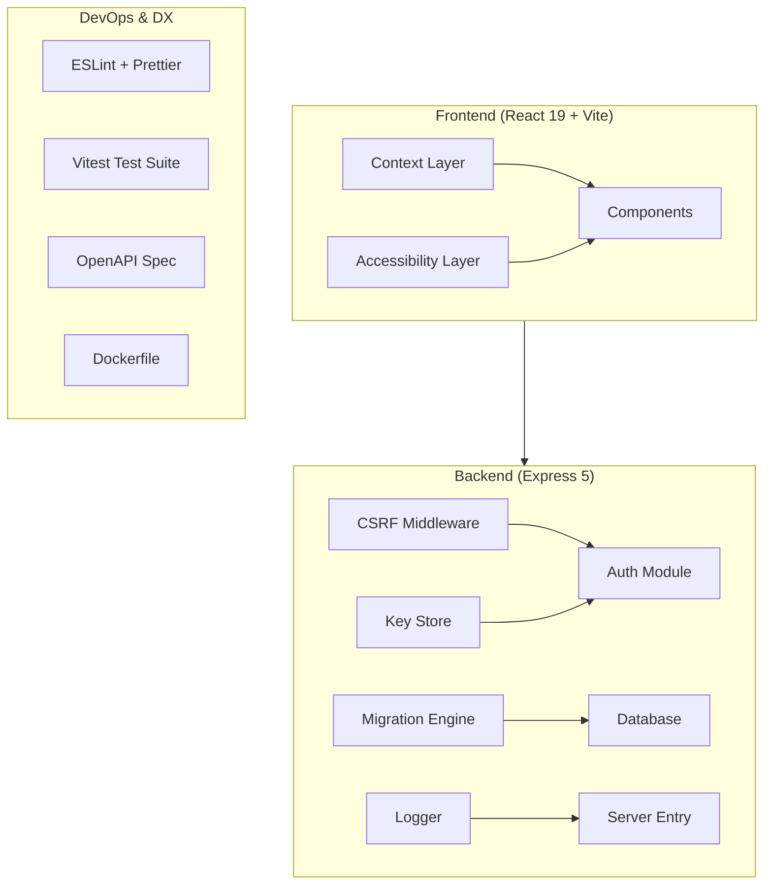

# Design Document: Technical Debt Remediation

## Overview

This design addresses 12 areas of technical debt in the AL-SAQI internal audit management system. The remediation spans security hardening (debug removal, CSRF, key persistence), data integrity (migration versioning, DROP TABLE elimination), developer experience (linting, testing, OpenAPI), performance (context re-renders), deployment (Docker), and accessibility.

The system is a monolithic full-stack TypeScript application (React 19 + Express 5) using PGlite for embedded PostgreSQL or an external PostgreSQL connection. It runs air-gapped, handling sensitive banking/payment audit data. All changes must maintain backward compatibility with existing data and preserve the air-gapped deployment model.

### Design Principles

1. **Non-destructive**: No data loss during remediation; migrations are additive
2. **Incremental**: Each requirement can be implemented and deployed independently
3. **Air-gap compatible**: No external network dependencies introduced
4. **Type-safe**: Leverage TypeScript 5.9 strict mode throughout

## Architecture

The remediation touches three architectural layers:



### Affected Modules

| Requirement | Primary Files | Layer |
|---|---|---|
| 1. Debug Removal | `server.ts` | Backend |
| 2. DROP TABLE | `src/server/db/migrations.ts` | Backend |
| 3. CSRF | New `src/server/middleware/csrf.ts` | Backend |
| 4. Role Unification | `src/constants.ts`, `src/permissions.ts` | Shared |
| 5. Migration Versioning | `src/server/db/migrations.ts`, new `src/server/db/migrationRunner.ts` | Backend |
| 6. Key Persistence | `server.ts` → new `src/server/utils/keyStore.ts` | Backend |
| 7. Linting | Root config files | DevOps |
| 8. Test Coverage | `src/**/*.test.ts` | DevOps |
| 9. Context Re-renders | `src/context/*.tsx` | Frontend |
| 10. OpenAPI | `docs/openapi.yaml` | DevOps |
| 11. Dockerfile | `Dockerfile`, `.dockerignore` | DevOps |
| 12. Accessibility | `src/components/`, `src/App.tsx` | Frontend |

## Components and Interfaces

### 1. Debug Removal

**Approach**: Delete the `agentDebugLog` function and all `#region agent log` blocks from `server.ts`. Remove the `debug-eece07.log` file. Replace any remaining `console.log`/`console.error` calls with the structured `logger` utility.

No new interfaces needed — this is purely subtractive.

### 2. Migration Safety

**Approach**: Replace all `DROP TABLE IF EXISTS` statements with `CREATE TABLE IF NOT EXISTS`. Use `ALTER TABLE ... ADD COLUMN IF NOT EXISTS` for schema evolution.

### 3. CSRF Middleware

```typescript
// src/server/middleware/csrf.ts
interface CsrfOptions {
  exemptPaths: string[];       // e.g., ['/api/auth/login', '/health']
  tokenHeader: string;         // 'x-csrf-token'
  cookieName: string;          // 'csrf-token'
  tokenByteLength: number;     // 32
}

function generateCsrfToken(): string;
function csrfMiddleware(options: CsrfOptions): RequestHandler;
function attachCsrfToken(res: Response, token: string): void;
```

**Flow**:
1. On successful login/refresh → `generateCsrfToken()` creates a 32-byte random hex string
2. Token is sent as a non-httpOnly cookie (`csrf-token`) and also in a response header (`x-csrf-token`)
3. On state-changing requests → middleware reads token from `x-csrf-token` header and compares against the cookie value using timing-safe comparison
4. Exempt paths bypass validation entirely

### 4. Role Registry Unification

```typescript
// src/constants.ts (updated)
export enum UserRole {
  ADMIN = 'Admin',
  INTERNAL_AUDITOR = 'Internal Auditor',
  COMPLIANCE_OFFICER = 'Compliance Officer',
  RISK_OFFICER = 'Risk Officer',
  MANAGER = 'Manager',
  VIEWER = 'Viewer',
}

// Remove 'Administrator' from all arrays
export const ADMIN_ROLES = [UserRole.ADMIN, UserRole.MANAGER] as const;
export const COMPLIANCE_ROLES = [UserRole.ADMIN, UserRole.MANAGER, UserRole.COMPLIANCE_OFFICER] as const;
export const STAFF_ROLES = [UserRole.ADMIN, UserRole.MANAGER, UserRole.INTERNAL_AUDITOR, UserRole.VIEWER] as const;
```

A data migration will update existing users with `role = 'Administrator'` to `role = 'Admin'`.

### 5. Migration Versioning System

```typescript
// src/server/db/migrationRunner.ts
interface Migration {
  version: string;          // e.g., '001', '002'
  name: string;             // Human-readable description
  type: 'schema' | 'seed'; // DDL or data
  up: () => Promise<void>;  // Forward migration
}

interface MigrationRecord {
  version: string;
  name: string;
  applied_at: string;       // ISO timestamp
}

class MigrationRunner {
  constructor(private db: DBWrapper);
  
  async initialize(): Promise<void>;           // Creates schema_migrations table
  async getApplied(): Promise<MigrationRecord[]>;
  async getPending(available: Migration[]): Promise<Migration[]>;
  async run(available: Migration[]): Promise<void>;
}
```

**Execution model**:
1. `initialize()` creates `schema_migrations` if not exists
2. `getApplied()` reads all recorded versions
3. `getPending()` filters available migrations by those not in applied set, sorted by version
4. `run()` executes each pending migration in a transaction; on success records version, on failure halts

### 6. Key Store Module

```typescript
// src/server/utils/keyStore.ts
interface KeyPair {
  privateKey: string;  // PEM format
  publicKey: string;   // PEM format
}

interface KeyStoreOptions {
  dataDir: string;           // From DATA_DIR env or './data'
  encryptionSecret: string;  // JWT_SECRET
}

class KeyStore {
  constructor(options: KeyStoreOptions);
  
  async load(): Promise<KeyPair | null>;
  async save(keys: KeyPair): Promise<void>;
  async getOrCreate(): Promise<KeyPair>;
}
```

**Key decisions**:
- Storage path: `${DATA_DIR}/keys/.rsa_keys.enc` (never `/tmp`)
- Encryption: AES-256-GCM with key derived from `SHA-256(JWT_SECRET + '_rsa_enc')`
- Fallback: `./data` directory relative to app root when `DATA_DIR` is unset

### 7. ESLint + Prettier Configuration

**Files created**:
- `eslint.config.mjs` — Flat config format for ESLint 9+
- `.prettierrc` — Prettier options
- `.prettierignore` — Exclude dist, node_modules, coverage

**Key rules**:
- `@typescript-eslint/recommended` with strict type checking
- `eslint-plugin-react` with React 19 JSX transform
- `eslint-plugin-react-hooks` for hook rules
- All pre-existing violations set to `warn` level initially

### 8. Test Coverage Strategy

**Test structure**:
```
src/
├── server/
│   ├── __tests__/
│   │   ├── auth.test.ts           # Auth flows
│   │   ├── permissions.test.ts    # Permission middleware
│   │   ├── migrations.test.ts     # Migration versioning
│   │   └── csrf.test.ts           # CSRF middleware
│   └── routes/__tests__/
│       ├── auth.integration.test.ts
│       ├── auditPlans.integration.test.ts
│       ├── findings.integration.test.ts
│       ├── recommendations.integration.test.ts
│       └── users.integration.test.ts
├── components/
│   ├── FindingCard.test.tsx
│   ├── AuditPlanForm.test.tsx
│   └── Layout.test.tsx
```

**Vitest configuration** additions:
- `coverage.provider: 'v8'`
- `coverage.reporter: ['text', 'lcov', 'html']`
- `coverage.thresholds: { 'src/server/': { lines: 40 } }`

### 9. Context Provider Optimization

**Current problem**: `AppContext` re-aggregates values from `AuthContext`, `UserContext`, and `PreferencesContext` into a single object, causing all consumers to re-render on any change.

**Solution**:
1. Remove the re-aggregation in `AppContext` — consumers should import from domain-specific contexts directly
2. Memoize all context values with `useMemo`
3. Memoize all callbacks with `useCallback`
4. Keep `AppContext` as a thin orchestration layer (login/logout coordination only) with a memoized value

```typescript
// AppContext.tsx (optimized)
const value = useMemo(() => ({
  login, logout, fetchNotifications
}), [login, logout, fetchNotifications]);
```

Components that need both auth and preferences import both hooks separately.

### 10. OpenAPI Specification

**Location**: `docs/openapi.yaml`
**Served at**: `GET /api/docs` (using `swagger-ui-express` or static YAML serving)

**Structure**:
- `info`: Title, version, description
- `servers`: `[{ url: '/api' }]`
- `paths`: All 28 route files documented
- `components/schemas`: User, AuditPlan, AuditProgram, Finding, Recommendation, RiskItem, Correspondence
- `components/securitySchemes`: Bearer token (RS256 JWT) + CSRF token

### 11. Dockerfile

```dockerfile
# Stage 1: Build
FROM node:20-alpine AS builder
WORKDIR /app
COPY package*.json ./
RUN npm ci
COPY . .
RUN npm run build

# Stage 2: Production
FROM node:20-alpine AS runtime
RUN addgroup -g 1001 -S appgroup && adduser -S appuser -u 1001 -G appgroup
WORKDIR /app
COPY --from=builder /app/dist ./dist
COPY --from=builder /app/package*.json ./
RUN npm ci --omit=dev && npm cache clean --force
VOLUME ["/app/data"]
ENV NODE_ENV=production
EXPOSE 3000
USER appuser
CMD ["node", "dist/server.js"]
```

**`.dockerignore`**: `node_modules`, `.git`, `src`, `*.md`, `*.log`, `*.map`, `**/*.test.*`

### 12. Accessibility Components

```typescript
// src/components/SkipToContent.tsx
export const SkipToContent: React.FC = () => (
  <a href="#main-content" className="skip-link">Skip to content</a>
);

// src/components/LiveRegion.tsx
interface LiveRegionProps {
  message: string;
  politeness?: 'polite' | 'assertive';
}
export const LiveRegion: React.FC<LiveRegionProps>;

// src/components/FocusTrap.tsx
interface FocusTrapProps {
  active: boolean;
  onEscape: () => void;
  children: ReactNode;
}
export const FocusTrap: React.FC<FocusTrapProps>;
```

**Integration points**:
- `SkipToContent` rendered as first child in `App.tsx`
- `LiveRegion` with `polite` for route changes, `assertive` for toasts
- `FocusTrap` wraps all `Modal` component instances
- `useEffect` in `PreferencesContext` already sets `dir` and `lang` on `<html>`

## Data Models

### schema_migrations Table

```sql
CREATE TABLE IF NOT EXISTS schema_migrations (
  version TEXT PRIMARY KEY,
  name TEXT NOT NULL,
  type TEXT NOT NULL DEFAULT 'schema',
  applied_at TIMESTAMP DEFAULT CURRENT_TIMESTAMP
);
```

### CSRF Token (In-Memory)

CSRF tokens are stateless — the token value is stored in a signed cookie and validated against the request header. No database storage needed.

### RSA Key Storage Format

```json
{
  "iv": "<base64 12-byte IV>",
  "tag": "<base64 16-byte auth tag>",
  "data": "<base64 AES-256-GCM encrypted JSON { privateKey, publicKey }>"
}
```

### Role Migration Data Transform

```sql
UPDATE users SET role = 'Admin' WHERE role = 'Administrator';
```

## Correctness Properties

*A property is a characteristic or behavior that should hold true across all valid executions of a system — essentially, a formal statement about what the system should do. Properties serve as the bridge between human-readable specifications and machine-verifiable correctness guarantees.*

### Property 1: Migration DDL uses IF NOT EXISTS

*For any* table creation statement in the migration definitions, the SQL must include `IF NOT EXISTS` to prevent errors on re-execution and ensure idempotent schema creation.

**Validates: Requirements 2.4**

### Property 2: Migration idempotence preserves data

*For any* valid data inserted into `app_settings`, `pdf_settings`, or `user_management_settings` tables, running the migration system again must leave that data unchanged.

**Validates: Requirements 2.6**

### Property 3: CSRF token generation on authentication events

*For any* successful authentication event (login or token refresh), the response must contain a new CSRF token that is cryptographically random with at least 32 bytes of entropy, and each generated token must be unique.

**Validates: Requirements 3.1, 3.6, 3.7**

### Property 4: CSRF validation on state-changing requests

*For any* state-changing HTTP request (POST, PUT, PATCH, DELETE) to a non-exempt endpoint, the request must be rejected with HTTP 403 if it lacks a valid CSRF token, and must succeed if a valid token is present.

**Validates: Requirements 3.2, 3.3**

### Property 5: Role arrays contain only canonical identifiers

*For any* role group array (`ADMIN_ROLES`, `COMPLIANCE_ROLES`, `STAFF_ROLES`), every element must be a value from the canonical `UserRole` enum and the array must contain no duplicate entries.

**Validates: Requirements 4.1, 4.5**

### Property 6: Migration versioning idempotence

*For any* set of migrations that have been previously applied, running the migration system again must execute zero migrations and leave the `schema_migrations` table unchanged.

**Validates: Requirements 5.2, 5.3**

### Property 7: Successful migration recording

*For any* migration that completes without error, the `schema_migrations` table must contain a record with that migration's version and a valid timestamp.

**Validates: Requirements 5.4**

### Property 8: Failed migration halts execution

*For any* migration that throws an error during execution, the `schema_migrations` table must not contain that version, and no subsequent migrations in the pending list must be executed.

**Validates: Requirements 5.5**

### Property 9: Migration sequential ordering

*For any* set of pending migrations presented in arbitrary order, the migration runner must execute them in strictly ascending version order.

**Validates: Requirements 5.6**

### Property 10: RSA key persistence round-trip

*For any* valid RSA key pair, persisting it via the KeyStore and then loading it must return an identical key pair (byte-for-byte PEM equality).

**Validates: Requirements 6.3**

### Property 11: RSA keys encrypted at rest

*For any* persisted key file on disk, the raw file content must not contain PEM markers (`-----BEGIN`), and decryption with the correct `JWT_SECRET`-derived key must yield valid RSA key material.

**Validates: Requirements 6.5**

### Property 12: Context cross-domain render isolation

*For any* preference state change (language, theme, layout), components consuming only authentication state must not re-render; and for any authentication state change, components consuming only preference state must not re-render.

**Validates: Requirements 9.4, 9.5**

### Property 13: OpenAPI specification completeness

*For any* route handler registered in the Express application, there must be a corresponding path and method entry in the OpenAPI specification document, including request/response schemas and security requirements.

**Validates: Requirements 10.2, 10.3**

### Property 14: Dynamic content accessibility announcements

*For any* form submission result (success or failure) or toast notification, the content must be announced via an appropriate `aria-live` region (`polite` for form results, `assertive` for toasts).

**Validates: Requirements 12.3, 12.4**

### Property 15: Modal keyboard navigation

*For any* modal dialog component, opening it must trap keyboard focus within the modal, and pressing Escape must close it and return focus to the trigger element.

**Validates: Requirements 12.6**

### Property 16: Language direction synchronization

*For any* language switch between LTR and RTL languages, the `<html>` element's `dir` and `lang` attributes must immediately reflect the new language direction.

**Validates: Requirements 12.7**

## Error Handling

### CSRF Middleware Errors

| Scenario | Response | Action |
|---|---|---|
| Missing CSRF token | 403 `{ error: "CSRF token missing" }` | Request rejected |
| Invalid CSRF token | 403 `{ error: "CSRF token invalid" }` | Request rejected |
| Token generation failure | 500 (logged) | Fall through to global error handler |

### Migration System Errors

| Scenario | Response | Action |
|---|---|---|
| Migration SQL fails | Halt all migrations | Transaction rolled back, error logged with version |
| schema_migrations table inaccessible | Server starts in degraded mode | Retry with exponential backoff (existing pattern) |
| Duplicate version detected | Startup warning | Skip duplicate, log warning |

### Key Store Errors

| Scenario | Response | Action |
|---|---|---|
| DATA_DIR not writable | Log error, attempt `./data` | Graceful fallback |
| Decryption fails (wrong JWT_SECRET) | Regenerate keys | Log warning, existing sessions invalidated |
| Key file corrupted | Regenerate keys | Log error, backup corrupted file |

### Context Layer Errors

| Scenario | Response | Action |
|---|---|---|
| Context used outside provider | Throw with descriptive message | Existing pattern maintained |
| API call fails in preference save | Swallow error, log warning | Local state still updates |

## Testing Strategy

### Property-Based Testing

The project already includes `fast-check` (v4.8.0) as a dev dependency. Property-based tests will use fast-check with Vitest.

**Configuration**:
- Minimum 100 iterations per property test
- Each test tagged with: `Feature: technical-debt-remediation, Property {N}: {title}`
- Tests located alongside unit tests in `__tests__/` directories

**Properties suitable for PBT** (from prework analysis):

| Property | Test File | Generator Strategy |
|---|---|---|
| 1: DDL IF NOT EXISTS | `migrations.property.test.ts` | Generate table names, verify SQL output |
| 2: Migration idempotence | `migrations.property.test.ts` | Generate settings data, run migrations twice |
| 3: CSRF generation | `csrf.property.test.ts` | Generate auth events, verify token properties |
| 4: CSRF validation | `csrf.property.test.ts` | Generate requests with/without tokens |
| 5: Role canonicality | `roles.property.test.ts` | Enumerate role arrays, verify enum membership |
| 6-9: Migration versioning | `migrationRunner.property.test.ts` | Generate migration lists, verify ordering/idempotence |
| 10-11: Key persistence | `keyStore.property.test.ts` | Generate key pairs, verify round-trip and encryption |
| 12: Context isolation | `context.property.test.tsx` | Generate state changes, count renders |

### Unit Testing

Unit tests cover specific examples and edge cases not addressed by property tests:

- **Auth flows**: Login success/failure, token refresh, logout, session invalidation
- **Permission middleware**: Role-based access, module-level permissions, denied access
- **CSRF exemptions**: Login and health endpoints bypass validation
- **Migration edge cases**: Empty migration list, single migration, already-applied migrations
- **Key Store defaults**: Missing DATA_DIR falls back to `./data`

### Integration Testing

- **API routes**: Supertest-based tests for auth, audit plans, findings, recommendations, users
- **Migration system**: Full lifecycle with PGlite in-memory instance
- **OpenAPI validation**: Parse spec and validate against running server routes
- **Docker build**: Multi-stage build produces correct image structure

### Coverage Target

- `src/server/`: ≥40% line coverage
- Critical paths (auth, migrations, CSRF): ≥80% line coverage
- Coverage reporter: v8 with text, lcov, and HTML output
