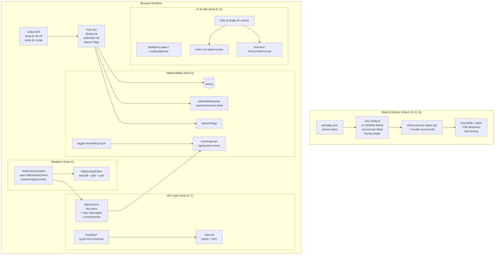

# Design Document

## Overview

This design addresses the 74 findings documented in `PRODUCTION_READINESS_REPORT.md` for the
Al-Saqi web frontend (`apps/web/`). The work is a **remediation effort** that mixes three kinds of
change: bug fixes (e.g. broken CSP reload button, leaked Gemini key), targeted improvements
(e.g. RTL logical properties, dynamic imports), and **missing infrastructure** that must be added
(Sentry, feature flags, nginx rate limiting, Web Vitals activation, log aggregation hook).

The scope is strictly the frontend package `apps/web/`. All backend, repo-level TypeScript build,
CI/CD pipeline, secrets, encryption, 2FA, and nginx-on-the-backend concerns are explicitly out of
scope (handled by the separate `production-readiness-hardening` spec).

The design groups the 18 requirements into seven cohesive work areas, each of which maps to a
discrete set of files and a clear verification strategy:

| # | Work Area | Requirements | Nature |
|---|-----------|-------------|--------|
| A | Build & dependency safety | 1 | Config / build |
| B | Frontend security hardening | 2 | Bug fix + config |
| C | Real-time resilience & audio | 3 | Refactor (reuse existing `WebSocketClient`) |
| D | Bundle optimization & dead code | 4, 9 | Lazy loading + deletion |
| E | Loading/UX consistency & error reporting | 5, 6 | Refactor |
| F | Type safety & tests | 8, 10 | Typing + test authoring |
| G | Observability & operability infrastructure | 7, 15, 16, 17, 18 | New features |
| H | RTL & Arabic correctness | 11, 12, 13, 14 | CSS logical props + Intl formatting |

A guiding principle throughout: **prefer wiring up well-engineered code that already exists but is
unused** over writing new code. The repository already contains a robust `WebSocketClient` (with
exponential backoff, jitter, and HTTP polling fallback), a `webVitalsMonitor`/`webVitalsReporter`
pair, a `StructuredLogger`, and a `SkeletonLoader` family — all currently dead or bypassed. Several
requirements are satisfied simply by connecting these.

### Research Findings

Key facts discovered by reading the current codebase that shape the design:

1. **Vite is already mostly hardened.** `vite.config.ts` already sets `build.sourcemap: 'hidden'`
   and `terserOptions.compress.drop_console: true`. Requirement 1 mainly needs the `define` block
   cleaned (SEC-003) and dependency pinning in `package.json`. The remaining gap is that the
   `'hidden'` sourcemap mode still emits `.map` files into `dist/`; Requirement 1.5 requires
   **no `.map` files** in `dist/`, so production sourcemap must become `false` (or `.map` files
   must be stripped post-build), unless they are uploaded-then-deleted for Sentry (Requirement 7.3).
2. **A build-time guard already exists.** `scripts/check-security-types.mjs` runs before `vite build`
   and fails on `as any`/`@ts-ignore` in security-critical files. This is the pattern to extend for
   the `GEMINI_API_KEY`-in-bundle check (Requirement 2.8).
3. **`NotificationContext` bypasses `WebSocketClient`.** It uses a raw `WebSocket` with a fixed 5s
   reconnect (PERF-001), creates a new `AudioContext` per sound (PERF-002), and has a stale-closure
   effect dependency bug (PERF-003). The fix is to adopt the existing `WebSocketClient` class and a
   shared/closed `AudioContext`.
4. **`httpClient.ts` raw axios instance lacks retry.** `client.ts` implements `requestWithRetry` only
   for the typed methods; the raw `http` instance exported by `httpClient.ts` (used by 22+ modules
   including `NotificationContext`) has no retry and logs via `console.error` (ERR-003, ERR-005).
   A response interceptor on the `http` instance is the minimal-blast-radius fix.
5. **i18n direction logic is duplicated** between `i18n.ts` (`languageChanged` handler) and
   `PreferencesContext.tsx` (RTL-002), and `index.html` ships `lang="en"` with no `dir` (RTL-001).
6. **Number formatting uses manual digit replacement** (`format.ts`, `formatService.ts`) which drops
   grouping separators (RTL-012/013); `Intl.NumberFormat` with `useGrouping: true` is the fix.
7. **Web Vitals and feature flags are absent/dead.** `webVitalsReporter` exists but
   `initWebVitalsReporter()` is never called in `main.tsx`; there is no feature flag system.
8. **Vitest already enforces a 70% line threshold** globally, but has no per-directory thresholds for
   `api/`, `context/`, `permissions/` (Requirement 10.4).

## Architecture

The frontend is a React 19 + Vite SPA served by nginx (in the Docker image). The remediation does
not change the high-level architecture; it hardens and completes existing layers. The diagram below
shows the affected layers and where each work area applies.



### Cross-cutting design decisions

- **Single source of truth for direction.** All `document.documentElement.dir`/`lang` writes are
  owned by `i18n.ts` (and a tiny inline bootstrap script in `index.html` for the pre-React frame).
  `PreferencesContext` stops setting direction. Rationale: eliminates the dual-path maintenance risk
  (RTL-002) and the flash-of-wrong-direction (RTL-001).
- **Retry at the interceptor, not per-call.** Rather than migrate 22+ modules off the raw axios
  instance, we add a response interceptor to the `http` instance in `httpClient.ts`. This satisfies
  ERR-003 with the smallest blast radius and keeps the typed client's `requestWithRetry` intact.
  Care is taken to avoid double-retry when modules use the typed client (the interceptor only lives on
  the raw `http` instance consumers; typed methods call `http` directly too, so the interceptor must
  be idempotent and bounded — see Error Handling).
- **Reuse over rewrite.** `WebSocketClient`, `webVitalsReporter`, `SkeletonLoader`, and
  `StructuredLogger` are connected rather than reimplemented.
- **Defense-in-depth for secrets.** Two layers protect the Gemini key: (1) remove it from the Vite
  `define` block entirely, and (2) extend the pre-build guard script to scan the emitted bundle and
  fail the build if any non-empty `GEMINI_API_KEY` value is found.
- **Feature flags are config-first with safe defaults.** A lightweight, dependency-free flag provider
  reads flags from build-time/runtime config and always falls back to a hardcoded safe default when a
  flag value is unavailable. This avoids adding a heavy SDK and respects the app's air-gap needs.

## Components and Interfaces

### Area A — Build & dependency safety (Req 1)

- **`apps/web/package.json`**
  - `@alsaqi/shared`: `"*"` → `"workspace:*"` (or explicit semver if workspaces protocol is
    unavailable in the install tool).
  - Pin exact versions (drop `^`) for `react`, `react-dom`, `react-router-dom`,
    `@tanstack/react-query`, `axios`, `zod`.
  - Pin `typescript` exactly (drop `~`).
  - CI already runs `npm ci` (lockfile-enforced) — Requirement 1.4 is satisfied by the existing
    `.github/workflows/ci.yml`; the design only needs to confirm/document it.
- **`apps/web/vite.config.ts`**: `build.sourcemap: 'hidden'` → `false` for production (so `dist/`
  contains no `.map`). If Sentry source map upload is enabled (Req 7.3), the Sentry Vite plugin will
  generate maps, upload them, and delete them from `dist/` via `sourcemaps.deleteFilesAfterUpload`,
  preserving Requirement 1.5.
- **Verification hook**: extend `check-security-types.mjs` (or add a sibling CI step) to assert no
  `.map` files exist in `dist/` after build.

### Area B — Frontend security hardening (Req 2)

- **`apps/web/src/api/client.ts`** (`showVersionMismatchNotification`): replace the
  `dialog.innerHTML` + inline `onclick` with programmatic DOM construction:
  ```ts
  const reloadBtn = document.createElement('button');
  reloadBtn.textContent = 'تحديث الصفحة';
  reloadBtn.style.cssText = /* existing button styles */;
  reloadBtn.addEventListener('click', () => window.location.reload());
  dialog.appendChild(reloadBtn);
  ```
  The heading/paragraph can remain set via `textContent` on created elements (no inline handlers).
- **`apps/web/Dockerfile`** (nginx `security-headers.conf` snippet): expand the CSP to:
  ```
  default-src 'self';
  script-src 'self';
  style-src 'self' 'unsafe-inline';
  img-src 'self' data:;
  font-src 'self';
  connect-src 'self' wss:;
  frame-ancestors 'none';
  report-uri /api/csp-report;
  ```
  `style-src` includes `'unsafe-inline'` (required by Tailwind's runtime-injected styles); `script-src`
  does **not** use `'unsafe-inline'` or `*`. Exactly one reporting directive (`report-uri`) is present.
- **`apps/web/vite.config.ts`**: delete `'process.env.GEMINI_API_KEY': JSON.stringify('')` from the
  `define` block.
- **Bundle secret guard** (`scripts/check-security-types.mjs` or new `scripts/check-bundle-secrets.mjs`):
  after build, scan `dist/**/*.js` for a `GEMINI_API_KEY` value; if a non-empty value is embedded,
  exit non-zero.

### Area C — Real-time resilience & audio (Req 3)

- **`apps/web/src/context/NotificationContext.tsx`** is refactored to use `createWebSocketClient`:
  - Replace the raw `WebSocket` + `reconnectTimeoutRef` + `connectWebSocket` with a
    `WebSocketClient` instance stored in a ref.
  - Map its callbacks: `onNotification` → prepend notification, bump unread count, toast, bell shake,
    play sound; `onStateChange` → optional connection indicator; `onReconnectionFailed` → optional UI.
  - `getToken` reads the short-lived ws-token (the existing `/auth/ws-token` flow remains; the client's
    `getToken` is wired to a value fetched and cached on connect).
  - The effect's dependencies are corrected; callbacks that should not retrigger the effect are stored
    in refs (fixing PERF-003 stale closures).
- **Shared `AudioContext`** (module-level singleton in `NotificationContext` or a small
  `utils/notificationSound.ts`):
  ```ts
  let sharedCtx: AudioContext | null = null;
  function getAudioContext() {
    if (!sharedCtx || sharedCtx.state === 'closed') {
      sharedCtx = new (window.AudioContext || (window as any).webkitAudioContext)();
    }
    return sharedCtx;
  }
  ```
  The oscillator/gain nodes are created per play; the context is reused (and resumed if suspended),
  satisfying "reuse a single shared `AudioContext`" (Req 3.3). The pure logic of choosing/creating
  the context is unit/property testable.

> Note: `WebSocketClient`'s constructor takes `wsUrl`, `getToken`, `httpBaseUrl`; the current
> NotificationContext fetches a per-connection token. The adapter resolves the token once per connect
> cycle and exposes it through `getToken`.

### Area D — Bundle optimization & dead code (Req 4, 9)

- **`RiskRegister.tsx`**: change `import ExcelJS from 'exceljs'` to a dynamic import at the point of use
  inside the import/export handlers: `const ExcelJS = (await import('exceljs')).default;`.
- **PDF lazy boundary**: in `AuditEvidence.tsx`, `AuditTasks.tsx`, and
  `Correspondence/OutgoingRegister.tsx`, replace the static `import PdfViewer` with
  `const PdfViewer = React.lazy(() => import('../components/PdfViewer'))` (path adjusted per module)
  and render inside `<Suspense fallback={<LoadingSpinner />}>` only when a PDF is selected.
- **Dead assets**: delete `apps/web/public/ALSAQI Logo S Left.png` and `ALSAQI Logo S Under.png`.
- **Logo**: serve an optimized format (add `logo.webp`, reference it) and add `decoding="async"` to the
  `` in `Logo.tsx`.
- **`PdfTemplateEditor.tsx`**: confirmed unreferenced → delete as dead code (Req 4.5).
- **Dead/duplicate types** (`apps/web/src/types.ts`): remove unused `LawBankItem`, `OrgPosition`, and
  the duplicate `FraudCase`; consumers use `@alsaqi/shared` or `FraudLog/types.ts`.

### Area E — Loading/UX consistency & error reporting (Req 5, 6)

- **`apps/web/src/components/LoadingSpinner.tsx`** is the single spinner; inline ad-hoc spinners in
  `Dashboard/index.tsx`, `ComplianceMatrixPage.tsx`, `SystemErrorLogs/index.tsx`, and
  `Notifications.tsx` are replaced with `<LoadingSpinner />`.
- **`SkeletonLoader`** variants (`TableSkeleton`, `CardSkeleton`, `StatsSkeleton`) are wired into the
  initial-load states of the data-fetching views (one variant per view, matched to layout). If, after
  review, skeletons are intentionally not adopted anywhere, the unused exports are removed (Req 5.5);
  the design's intent is to adopt them, so they will be referenced.
- **Loading/empty/error state machine** for each data view:

  ```mermaid
  stateDiagram-v2
      [*] --> Loading
      Loading --> Loaded: data resolved
      Loading --> Error: request failed
      Loaded --> [*]
      Error --> [*]
      note right of Loading: show exactly one Skeleton/Spinner
      note right of Loaded: replace within 300ms
      note right of Error: remove skeleton, show error message
  ```

- **`apps/web/src/api/httpClient.ts`**:
  - Add an axios **response interceptor** on `client.http` that retries on network errors and 5xx with
    bounded exponential backoff (reusing the same constants/logic as `client.ts`), then routes the
    final failure through `errorReporter.report()`.
  - Replace the `onError` `console.error` with `errorReporter.report({ module: 'api', severity, ... })`.
- **Console replacement sweep** (Req 6.3–6.5): replace error/warn/log used for failure reporting in
  `NotificationContext.tsx`, `httpClient.ts`, `client.ts`, `AuthContext.tsx`,
  `Reports/hooks/useReports.ts`, `Dashboard/index.tsx` with `errorReporter.report()`/`logger.error()`;
  remove redundant console calls in `globalErrorHandlers.ts`, `errorService.ts`; gate dev-only logs in
  `useConnectionStatus.ts`, `websocket-client.ts`, `webVitalsReporter.ts` behind `import.meta.env.DEV`.

### Area F — Type safety & tests (Req 8, 10)

- **Typed Zod schemas & shared types**: replace `z.record(z.string(), z.unknown())` and local
  interfaces in `api/modules/dashboard.ts` and `api/modules/user-management.ts` with typed schemas;
  import `DashboardStats`, `CentralBankInstruction`, `Role`, `Permission`, `UserSession`, `JobTitle`,
  `UserManagementSettings` from `@alsaqi/shared` (adding them to the shared package where missing).
- **Remove `as any`/`: any`** in the listed API and feature modules; type form state in
  `AuditPlanForm.tsx`, `FindingForm.tsx`, `RiskForm.tsx` using `z.infer<typeof schema>`; use typed
  `jsPDF`/`docx` APIs in `utils/pdfExport.ts`, `utils/docxExport.ts`.
- **Tests** (Req 10): add hook tests under `api/hooks/__tests__/` for `useAuth`, `useFindings`,
  `useAuditPlans`, `useTasks`, `useUsers`, `useNotifications`; cover the `httpClient.ts` backward-compat
  path (auth token attachment + 401 redirect); add `context/__tests__/UserContext.test.tsx`.
- **`apps/web/vitest.config.ts`**: add per-directory coverage thresholds for `api/`, `context/`,
  `permissions/` in addition to the existing global 70% line threshold, e.g.:
  ```ts
  coverage: {
    provider: 'v8',
    thresholds: {
      lines: 70,
      'src/api/**': { lines: 75, functions: 70 },
      'src/context/**': { lines: 75, functions: 70 },
      'src/permissions/**': { lines: 80, functions: 75 },
    },
  }
  ```

### Area G — Observability & operability infrastructure (Req 7, 15, 16, 17, 18)

- **Sentry (`@sentry/react` + `@sentry/vite-plugin`)**: initialize in `main.tsx` (DSN/env gated, only
  active in production), wrap the app with Sentry error boundary or rely on global handlers; configure
  the Vite plugin to upload source maps and delete them post-upload. `errorReporter` keeps posting to
  `/api/system-errors` (Req 7.4).
- **Feature flags (`apps/web/src/featureFlags/`)**: a `FeatureFlagProvider` + `useFeatureFlag(key)`
  hook backed by a config object (env/runtime JSON). `evaluate(key)` returns the configured value or a
  registered safe default when the value is missing/unretrievable. A `<FeatureGate flag="x">` component
  renders children only when enabled.
- **nginx rate limiting (`Dockerfile`)**: add `limit_req_zone $binary_remote_addr zone=api:10m rate=10r/s;`
  in the `http` block and `limit_req zone=api burst=20 nodelay;` in a `location /api/ { ... }` proxy block
  (the frontend deployment proxies `/api/`). Excess requests receive HTTP 429/503.
- **Web Vitals activation (`main.tsx`)**: call `webVitalsMonitor.init()` and `initWebVitalsReporter()`.
  The reporter already buffers (cap 50) and retries non-blockingly to `/api/metrics/web-vitals`.
- **Log pipeline hook (`utils/logger.ts`)**: add a configurable forwarding hook so that, in production,
  `error`-level (and optionally `warn`-level when enabled) structured entries are forwarded to the
  configured aggregation destination, with `/api/system-errors` retained as the fallback path.

### Area H — RTL & Arabic correctness (Req 11, 12, 13, 14)

- **`index.html`**: static `lang="ar" dir="rtl"`; add an inline `<head>` bootstrap script (before
  module scripts) that reads `localStorage.getItem('i18nextLng')` and sets `documentElement.dir`/`lang`
  synchronously.
- **`i18n.ts`**: remain the single owner of direction updates; document the Arabic-first decision
  (`fallbackLng: 'ar'`) or enable `LanguageDetector` for first-time visitors per the chosen behavior.
- **`PreferencesContext.tsx`**: remove its direction-setting `useEffect`.
- **CSS logical properties**: `ChangePasswordModal.tsx` `right-3` → `end-3`; `ComplianceMatrixPage.tsx`
  `-mr-16` → `-me-16`; `index.css` `slideInRight`/`slideInLeft` use `[dir="rtl"]` keyframes; `.skip-link`
  `left` → `inset-inline-start`.
- **Icon mirroring**: `rtl:rotate-180` on `ArrowRight` in `TopRisksList.tsx` and `RiskRegister.tsx` and
  `ChevronRight` in `RolePermissions.tsx`; `ComplianceMatrixPage.tsx` static `rotate-180` → `ltr:rotate-180`.
- **Number formatting**: `format.ts` and `formatService.ts` use `Intl.NumberFormat(locale, { useGrouping: true })`
  for the Arabic locale; `SystemLogsManagement.tsx` health percent uses
  `Intl.NumberFormat('ar-IQ', { style: 'percent', maximumFractionDigits: 1 })`.

## Data Models

Most remediation changes are behavioral/config; the data-model changes are the typed schemas and
shared-type imports that replace `unknown`/`any`.

### Typed API schemas (Area F)

```ts
// @alsaqi/shared (added) — illustrative shapes; exact fields match backend contract
export interface DashboardStats {
  totalFindings: number;
  openFindings: number;
  closedFindings: number;
  overdueTasks: number;
  byDepartment: Record<string, number>;
  bySeverity: Record<string, number>;
  // ...complete per backend response
}

export interface Role { id: string; name: string; permissions: string[]; }
export interface Permission { id: string; key: string; description: string; }
export interface UserSession { id: string; userId: string; createdAt: string; lastSeenAt: string; ip?: string; }
export interface JobTitle { id: string; name: string; }
export interface UserManagementSettings { passwordPolicy: { minLength: number; requireSymbols: boolean }; sessionTimeoutMinutes: number; }
```

```ts
// api/modules/dashboard.ts — typed schema replacing z.record(z.string(), z.unknown())
import type { DashboardStats } from '@alsaqi/shared';
const DashboardStatsSchema: z.ZodType<DashboardStats> = z.object({
  totalFindings: z.number(),
  openFindings: z.number(),
  closedFindings: z.number(),
  overdueTasks: z.number(),
  byDepartment: z.record(z.string(), z.number()),
  bySeverity: z.record(z.string(), z.number()),
});
```

Form modules derive their types from schemas: `type AuditPlanFormValues = z.infer<typeof auditPlanSchema>`.

### Feature flag model (Area G)

```ts
type FlagKey = string;
interface FeatureFlagConfig {
  flags: Record<FlagKey, boolean>;      // resolved values from config source
  defaults: Record<FlagKey, boolean>;   // safe defaults, always present
}
interface FeatureFlagApi {
  isEnabled(key: FlagKey): boolean;     // returns defaults[key] when flags[key] is undefined
}
```

### Connection state (Area C — already defined in `websocket-client.ts`)

```ts
type ConnectionState = 'connected' | 'degraded' | 'disconnected' | 'failed';
```

### Web Vitals metric (Area G — already defined in `webVitalsMonitor.ts`)

```ts
interface WebVitalMetric { name: 'LCP'|'FID'|'CLS'|'FCP'|'TTFB'; value: number; /* ... */ }
```

### Structured log entry (Area G — extended forwarding)

```ts
interface LogEntry { level: 'debug'|'info'|'warn'|'error'; message: string; timestamp: string; module: string; correlationId: string; /* ... */ }
interface LogForwardingConfig { destination?: string; forwardWarn: boolean; }
```

## Correctness Properties

*A property is a characteristic or behavior that should hold true across all valid executions of a
system — essentially, a formal statement about what the system should do. Properties serve as the
bridge between human-readable specifications and machine-verifiable correctness guarantees.*

Most of this remediation is configuration, CSS logical properties, icon mirroring, dead-code removal,
and wiring of existing modules — these are verified with example, smoke, and integration tests (see
Testing Strategy). A focused set of acceptance criteria, however, exercises **pure logic over a large
input space** and is well-suited to property-based testing. Those properties are below.

### Property 1: Reconnection backoff is bounded, capped, and jittered

*For any* reconnect attempt number `n` (1 ≤ n ≤ max attempts), the delay produced by
`WebSocketClient.calculateReconnectDelay(n)` is non-negative, never exceeds `MAX_RECONNECT_DELAY_MS * (1 + JITTER_FACTOR)`,
and its pre-jitter base is monotonically non-decreasing in `n` and clamped at `MAX_RECONNECT_DELAY_MS`;
and *for any* run, the client schedules no more than `MAX_RECONNECT_ATTEMPTS` reconnects before
entering the `failed` state.

**Validates: Requirements 3.2**

### Property 2: Notification sound reuses a single AudioContext

*For any* sequence of N successive notification-sound plays without an intervening close, at most one
live `AudioContext` is created (the shared instance is reused), or every created context is closed
after its sound completes.

**Validates: Requirements 3.3**

### Property 3: Retriable-error classification and bounded retry

*For any* HTTP error, `isRetriableError` returns true if and only if the error is a network error
(no response) or carries a status in the range 500–599; and *for any* sequence of retriable failures,
the raw-axios retry path attempts the request at most `MAX_RETRY_ATTEMPTS` times before invoking the
error reporter.

**Validates: Requirements 6.1**

### Property 4: Typed schema validation round-trips valid data and rejects malformed data

*For any* object that conforms to the dashboard / user-management contract, the corresponding typed
Zod schema parses it successfully and preserves its values; and *for any* object missing a required
field or carrying a wrongly-typed field, the schema rejects it (throws).

**Validates: Requirements 8.4**

### Property 5: Arabic number formatting matches Intl grouping output

*For any* finite number, `formatNumber` (in both `format.ts` and `formatService.ts`) in the Arabic
locale produces exactly the output of `Intl.NumberFormat(<arabic-locale>, { useGrouping: true })` for
that number, including Eastern Arabic digits and a grouping separator for magnitudes ≥ 1000.

**Validates: Requirements 14.1, 14.2**

### Property 6: Feature flag falls back to a safe default

*For any* feature-flag configuration and *any* flag key, `isEnabled(key)` returns the configured value
when present and the registered safe default whenever the configured value is missing or cannot be
retrieved.

**Validates: Requirements 15.3**

### Property 7: Web Vitals buffer is capped and retains the most recent metrics

*For any* sequence of captured metrics reported while the endpoint is failing, the retry buffer never
exceeds `MAX_BUFFER_SIZE` (50) entries and retains the most recent metrics up to that cap; and when the
endpoint later succeeds, all buffered metrics within capacity are sent.

**Validates: Requirements 17.3**

### Property 8: Log forwarding routes by level and warn-configuration

*For any* structured log entry produced in production and *any* `forwardWarn` configuration, the log
pipeline forwards the entry to the aggregation destination if and only if its level is `error`, or its
level is `warn` and `forwardWarn` is enabled; entries of other levels are not forwarded.

**Validates: Requirements 18.2, 18.3**

## Error Handling

### API retry and reporting (Area E)

- The raw `http` instance gains a **response interceptor** that, on a network error or 5xx, retries with
  bounded exponential backoff (`1s, 2s, 4s`, max 3 attempts), mirroring `client.ts`. To avoid
  **double-retry**, the interceptor tags a request config with a retry counter and never exceeds the
  bound; the typed client's `requestWithRetry` already operates at a higher level, so the combined worst
  case is still bounded and finite. The interceptor must treat 401 specially (delegated to the existing
  refresh flow) and must not retry 4xx other than handled cases.
- After exhausting retries, the failure is routed to `errorReporter.report({ module, severity, type, message })`
  rather than `console.error` (ERR-005). `errorReporter` already retries delivery to `/api/system-errors`
  with its own backoff and never throws to the caller.
- All `console.*` error/failure logging in the listed modules is replaced with `errorReporter.report()`
  or `logger.error()`; dev-only diagnostics are gated behind `import.meta.env.DEV`.

### Real-time connection failures (Area C)

- `WebSocketClient` already handles connection failure with backoff, a bounded attempt count, a `failed`
  terminal state, and an HTTP polling fallback. `NotificationContext` surfaces `onReconnectionFailed`
  to the UI (e.g., a "manual refresh" indicator) and continues to function via polling in `degraded`
  state. Token-fetch failures fall through to `disconnected` without crashing the provider.
- Audio playback is wrapped in try/catch; a failed/closed `AudioContext` is recreated lazily on next play.

### Loading and data-fetch failures (Area E)

- Each data view follows the Loading → Loaded/Error state machine: on failure the skeleton/spinner is
  removed and a localized error message is shown; partial data is never displayed during loading.

### Build-time guards (Area A, B)

- The pre-build security guard fails the build (non-zero exit) on `as any`/`@ts-ignore` in
  security-critical files and on a `GEMINI_API_KEY` value embedded in the emitted bundle. A `dist/`
  sourcemap check fails the build if `.map` files are present (when Sentry upload is not configured to
  delete them).

### Observability failures (Area G)

- `errorReporter`, `webVitalsReporter`, and the log-forwarding hook are all **fire-and-forget with
  buffering**: delivery failures are retained (bounded buffers) and retried without surfacing errors to
  the user or blocking the main thread. The log pipeline falls back to `/api/system-errors` when the
  aggregation destination is unavailable. Sentry initialization is guarded so a misconfigured/missing
  DSN never breaks app startup.

### CSP violations (Area B)

- The expanded CSP includes a `report-uri` so violations are reported in production rather than failing
  silently. `style-src 'unsafe-inline'` is permitted (Tailwind requirement); `script-src` stays strict.

## Testing Strategy

### Dual approach

- **Property-based tests** verify the universal pure-logic properties above across many generated
  inputs. The project already uses **fast-check** with Vitest (see existing
  `src/api/__tests__/*.property.test.ts`); new property tests use the same library.
- **Example / unit tests** verify concrete behaviors, wiring, edge cases, and error states.
- **Integration / e2e tests** (Playwright is already configured in `apps/web/e2e/`) verify deployed CSP
  behavior, nginx rate limiting, and Sentry/metric delivery against a running container.
- **Smoke / static checks** verify configuration (package.json pinning, vite config, CSP string,
  Dockerfile directives, dead-code removal, `tsc` clean, vitest thresholds) — many implemented as small
  assertions or build-script checks.

### Property test configuration

- Use **fast-check** (already a dev dependency pattern in the repo). Each property test runs a
  **minimum of 100 iterations**.
- Each property test is tagged with a comment referencing its design property, in the format:
  **`Feature: web-production-readiness-remediation, Property {number}: {property_text}`**.
- Each correctness property is implemented by a **single** property-based test:

  | Property | Target under test | Generators |
  |----------|-------------------|-----------|
  | 1 | `calculateReconnectDelay`, `applyJitter`, attempt bound in `websocket-client.ts` | random attempt counts 1..N |
  | 2 | shared `AudioContext` accessor in notification sound | random N play calls |
  | 3 | `isRetriableError` + retry bound in `client.ts`/`httpClient.ts` | random status codes + network flags |
  | 4 | `DashboardStatsSchema` / user-management schemas | generated valid + malformed objects |
  | 5 | `formatNumber` in `format.ts` and `formatService.ts` | random finite numbers, Arabic locale |
  | 6 | `featureFlags.isEnabled` | random configs with arbitrary missing keys |
  | 7 | `WebVitalsReporter` buffer (`retainInBuffer`/`sendMetrics`) | random metric sequences, failing fetch |
  | 8 | logger forwarding hook level routing | random entries + `forwardWarn` flag |

### Example / unit tests (selected)

- **Area B**: `showVersionMismatchNotification` builds the reload button with `createElement` +
  `addEventListener` and no inline `onclick`; clicking triggers `window.location.reload`.
- **Area C**: `NotificationContext` instantiates `WebSocketClient`; user-change re-establishes the
  connection with current callbacks (no stale closure).
- **Area E**: each data view renders one skeleton while loading, content within 300ms on success, and an
  error (no skeleton) on failure; listed files contain no inline spinner markup.
- **Area F**: hook tests for `useAuth`, `useFindings`, `useAuditPlans`, `useTasks`, `useUsers`,
  `useNotifications`; `httpClient` backward-compat (auth header attachment + 401 redirect);
  `UserContext` set/clear/value-stability.
- **Area G**: Sentry `init` invoked at startup (mocked); Web Vitals metric POSTed to
  `/api/metrics/web-vitals`; feature gate renders children only when enabled; log fallback to
  `/api/system-errors` when destination unavailable.
- **Area H**: inline `index.html` script sets `dir`/`lang` from `localStorage` before modules; Arabic
  health-percent renders Eastern Arabic numerals with a percent sign.

### Integration / e2e tests

- Deployed-CSP checks (reload button works, no `script-src`/`style-src` violations) via headers in the
  served container.
- nginx rate limiting returns 429/503 on burst beyond the configured rate on `/api/`.
- `dist/` build output contains no `.map` files; bundle contains no embedded `GEMINI_API_KEY`.

### Coverage enforcement

- `vitest.config.ts` keeps the global 70% line threshold and adds per-directory thresholds for `api/`,
  `context/`, and `permissions/`. `npm run test -- --coverage` (already wired into CI) fails the run when
  coverage falls below the configured thresholds.

### Unit-test balance

Unit tests focus on concrete examples, wiring, and error/edge states; property tests cover the universal
input space for the eight pure-logic properties. We deliberately avoid over-writing unit tests for
inputs already covered by property generators.
